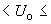
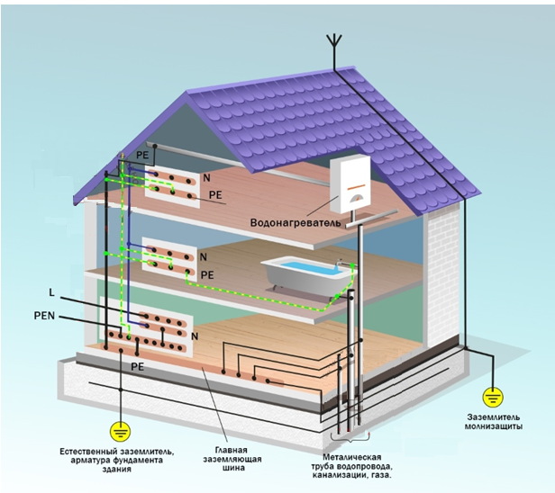
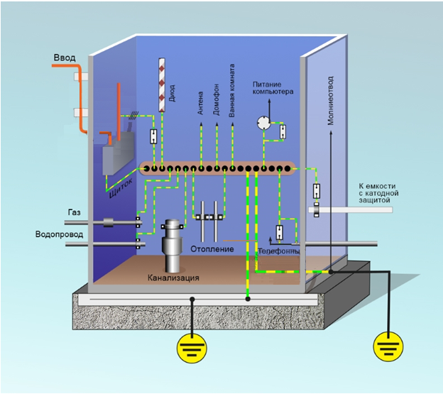
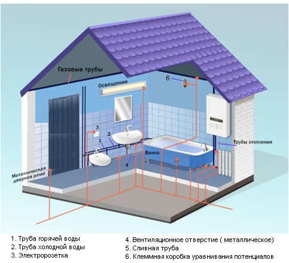

# Реферат по теме выпускной работы

<h2>Содержание</h2>

<ul class=content>
  <li class=ct1><a href="#p1">1. Требования к выполнению защиты от поражения электрическим током</a>
  <li class=ct1><a href="#p2">2. Общие правила</a>
  
  <li class=ct1><a href="#p3">3. Система уравнивания потенциалов</a>
  <li class=ct2><a href="#p31">3.1 Дополнительная система уравнивания потенциалов</a>
  <li class=ct2><a href="#p32">3.2 Ограничения при уравнивании потенциалов</a>
  
  <li class=ct1><a href="#p4">Выводы по системе уравнивания потенциалов</a>
  
  <li class=ct1><a href="#ref">Список источников</a>
</ul>

## 1. Требования к выполнению защиты от поражения электрическим током

Основным
нормативным документом по данному
вопросу является международный стандарт
МЭК 60364-4-41:2005
«Электроустановки
зданий». МЭК
60464 включает в себя основные принципы
и требования к обеспечению защиты от
поражения электрическим током, являющиеся
общими для электрических установок,
систем электроснабжения и электрического
оборудования в их взаимосвязи. 

В этом стандарте посредством установления
защитных мер реализовано основное
правило защиты от поражения электрическим
током: <b>опасные
токоведущие части должны быть недоступными,
а доступные проводящие части должны
быть безопасными в нормальных условиях
и при наличии повреждения</b>.

Стандарт МЭК применяется в разных странах в
чистом виде или адаптируется к местным
условиям, например, в РФ он положен в
основу ГОСТ Р50571.3-2009.
«ЭЛЕКТРОУСТАНОВКИ НИЗКОВОЛЬТНЫЕ
Часть 4-4. Требования
для обеспечения безопасности. Защита
от поражения электрическим током»
[1].

Данный стандарт устанавливает правила, в
соответствии с которыми токоведущие
части должны быть недоступны для
прикосновения, а открытые проводящие
части (корпуса) не должны представлять
опасность, как в нормальном режиме, так
и в случае замыкания на корпус.

## Общие правила

В редакции МЭК 60464 применена новая
терминология при классификации защитных
мер, согласно которой вместо понятия
«защита от прямого прикосновение»
применяется понятие <b>основная
защита,</b> а
вместо «косвенного прикосновения»<b> - «повреждение» или «замыкание на землю».
</b>

Электроустановки
должны быть спроектированы так, чтобы
обеспечить основную защиту человека в
нормальном режиме (защиту от прямого
прикосновения) и защиту в случае
повреждения (защиту от косвенного
прикосновения).

Для обеспечения безопасной эксплуатации
электроустановок должны быть предусмотрены
следующие защитные меры (одна или
несколько защитных мер в зависимости
от условий):
- автоматическое отключение питания;
- двойная или усиленная изоляция;
- электрическое разделение (для питания
  одного электроприемника);
- сверхнизкое напряжение (система
  безопасного сверхнизкого напряжения
- БСНН и система защитного сверхнизкого
  напряжения - ЗСНН).

В случае применения в одной и той же электроустановке
или ее частях различных защитных мер,
отказ одной из них не должен приводить
к ухудшению других защитных мер.

Защитная мера – автоматическое отключение
питания.

Автоматическое
отключение питания является дополнительной
защитой от поражения электрическим
током при повреждениях изоляции и
применяется в сочетании с другими
техническими мероприятиями. При этом
основная защита выполняется с помощью
основной изоляции токоведущих частей
(или посредством ограждений, оболочек
и т.п.), а защита при повреждении – с
помощью автоматического отключения,
например, устройством защитного
отключения (УЗО). При использовании УЗО
требуется выполнение мероприятий,
обеспечивающих уравнивание потенциалов,
т.е. снижения
разности потенциалов
между заземленными (зануленными) открытыми
металлическими частями или заземлителем
и поверхностью земли, пола. Для этого
необходимо вблизи поверхности земли
(пола), произвести укладку неизолированных
проводников, соединенных с заземленными
(зануленными) частями. В
каждом здании система защитного
уравнивания потенциалов должна соединять
между собой следующие проводящие части:
- заземляющий проводник;
- главную заземляющую шину (зажим);
- главный защитный проводник;
- металлические
  трубы снабжающих коммуникаций в здании,
  например, трубы газа, воды;
- металлические
  части строительных конструкций (если
  они доступны при нормальном использовании),
- металлические
  системы центрального отопления и
  вентиляции и кондиционирования воздуха.

Если указанные проводящие части берут начало
вне здания, они должны быть присоединены
к системе основного уравнивания
потенциалов как можно ближе к их точке
ввода в здание, при этом каждая
цепь должна иметь собственный (отдельный)
защитный проводник, присоединенный к
соответствующему заземляющему зажиму.

Дополнительная
защита должна быть предусмотрена на
случай выхода из строя основных средств
защиты от прямого прикосновения, т.е
повреждения изоляции. В частности, в
системах переменного тока дополнительная
защита посредством защитного устройства
дифференциального тока (УДТ) должна
быть предусмотрена для штепсельных
розеток, предназначенных для общего
применения, с номинальным током, не
превышающим 20 А, которые используют
обычные лица. Исключение может быть
сделано для штепсельных розеток,
предназначенных для:
* использования
	под наблюдением квалифицированного
	или инструктированного персонала,
	например, в некоторых коммерческих или
	производственных помещениях;
*	использовании
	специальной штепсельной розетки,
	предусмотренной для присоединения
	одного электроприемника;
* передвижного
	оборудования с номинальным переменным
	током, не превышающим 32 А, которое
	используют вне здания.

Одним из основных требований к УЗО является
быстродействие, поскольку опасность
для человека представляет не только
величина, но и продолжительность
воздействия тока на человека. Согласно [1]
максимальное время отключения, (см.
табл.1), следует применять для конечных
электрических цепей, расчетный ток в
которых не превышает 32 А.
 
Таблица 1 - Максимальное время отключения

<table width="624" cellpadding="5" cellspacing="0">
	<colgroup>
		<col width="72"/>
		<col width="41"/>
		<col width="4368"/>
	</colgroup>
	<colgroup>
		<col width="53"/>
		<col width="61"/>
		<col width="59"/>
		<col width="61"/>
		<col width="59"/>
		<col width="61"/>
		<col width="59"/>
	</colgroup>
	<tbody>
		<tr valign="top">
			<td width="72" style="border: none">

				 
				

			</td>
			<td width="41" style="border: none">

				 
				

			</td>
			<td colspan="2" width="63" style="border: none">

				 
				

			</td>
			<td width="61" style="border: none">

				 
				

			</td>
			<td width="59" style="border: none">

				 
				

			</td>
			<td width="61" style="border: none">

				 
				

			</td>
			<td width="59" style="border: none">

				 
				

			</td>
			<td width="61" style="border: none">

				 
				

			</td>
			<td width="59" style="border: none">

				 
				

			</td>
		</tr>
	</tbody>
	<tbody>
		<tr valign="top">
			<td width="72" style="border-top: 1px solid #000000; border-bottom: none; border-left: 1px solid #000000; border-right: 1px solid #000000 0.13cm">

				Тип
				заземлен. системы

			</td>
			<td colspan="3" width="114">

				50
				В
120
				В, с

			</td>
			<td colspan="2" width="130">

				120
				В
230
				В, с

			</td>
			<td colspan="2" width="129">

				230
				В
400
				В, с

			</td>
			<td colspan="2" width="129">

				
400
				В, с

			</td>
		</tr>
		<tr valign="top">
			<td width="72" style="border-top: none; border-bottom: 1px solid #000000; border-left: 1px solid #000000; border-right: 1px solid #000000 0.13cm">

				 
				

			</td>
			<td colspan="2" width="50">

				Перем.
				ток

			</td>
			<td width="53">

				Пост.-ток

			</td>
			<td width="61">

				Перем.
				ток

			</td>
			<td width="59">

				Пост.-ток

			</td>
			<td width="61">

				Перем.
				ток

			</td>
			<td width="59">

				Пост.

				
ток

			</td>
			<td width="61">

				Перем.
				ток

			</td>
			<td width="59">

				Пост.

				
ток

			</td>
Основным
нормативным документом по данному
вопросу является международный стандарт
МЭК 60364-4-41:2005
«Электроустановки
зданий». МЭК
60464 включает в себя основные принципы
и требования к обеспечению защиты от
поражения электрическим током, являющиеся
общими для электрических установок,
систем электроснабжения и электрического
оборудования в их взаимосвязи. 

В этом стандарте посредством установления
защитных мер реализовано основное
правило защиты от поражения электрическим
током: <b>опасные
токоведущие части должны быть недоступными,
а доступные проводящие части должны
быть безопасными в нормальных условиях
и при наличии повреждения</b>.

Стандарт
МЭК применяется в разных странах в
чистом виде или адаптируется к местным
условиям, например, в РФ он положен в
основу ГОСТ
Р50571.3-2009.
«ЭЛЕКТРОУСТАНОВКИ
НИЗКОВОЛЬТНЫЕ
Часть
4-4.
Требования
для обеспечения безопасности. Защита
от поражения электрическим током»
[1].

Данный
стандарт устанавливает правила, в
соответствии с которыми токоведущие
части должны быть недоступны для
прикосновения, а открытые проводящие
части (корпуса) не должны представлять
опасность, как в нормальном режиме, так
и в случае замыкания на корпус.

		</tr>
	</tbody>
	<tbody>
		<tr>
			<td width="72">

				TN*

			</td>
			<td colspan="2" width="50">

				0,8

			</td>
			<td width="53">

				***

			</td>
			<td width="61">

				0,4

			</td>
			<td width="59">

				5

			</td>
			<td width="61">

				0,2

			</td>
			<td width="59">

				0,4

			</td>
			<td width="61">

				0,1

			</td>
			<td width="59">

				0,1

			</td>
		</tr>
	</tbody>
	<tbody>
		<tr>
			<td width="72">

				ТТ**

			</td>
			<td colspan="2" width="50" valign="top">

				0,3

			</td>
			<td width="53" valign="top">

				***1

			</td>
			<td width="61" valign="top">

				0,2

			</td>
			<td width="59" valign="top">

				0,4

			</td>
			<td width="61" valign="top">

				0,07

			</td>
			<td width="59" valign="top">

				0,2

			</td>
			<td width="61" valign="top">

				0,04

			</td>
			<td width="59" valign="top">

				 
				

			</td>
		</tr>
	</tbody>
</table>

<i>U</i>0
– номинальное напряжение линейного
проводника переменного или постоянного
тока относительно земли

Примечания к таблице 1:
1. Система TN – система в которой нейтраль
  источника питания глухо заземлена, а
  открытые проводящие части электропроводки
  присоединены к глухозаземленной нейтрали
  источника посредством нулевых защитных
  проводников.
1. TT — нейтраль источника глухо заземлена,
  а открытые проводящие части электроустановки
  присоединены к заземлителю, электрически
  независимому от заземлителя нейтрали
  источника питания.
1. Отключение может потребоваться по причинам, не
  связанным с электрическим током.

Защитный аппарат должен автоматически отделить
поврежденный участок от его питания
таким образом, чтобы напряжение
прикосновения (повреждения), возникшее
в результате замыкания на корпус и
превышающее предельно допустимое
напряжение прикосновения (<i>U</i><i>L</i>),
не могло присутствовать в течение
времени, достаточного для создания
опасности для человека, прикасающегося
к проводящим частям, доступным для
одновременного прикосновения.

Предельно допустимые напряжения прикосновения
и токи для человека нормируются и
приведены
в ГОСТ 12.1.038-82 [2].
Согласно [2] предельно
допустимые значения напряжений
прикосновения и токов при аварийном
режиме бытовых электроустановок
напряжением до 1000 В и частотой 50 Гц не
должны превышать значений, указанных
в табл.2., табл. 3

<table style="text-align: center; margin: auto" cellspacing="0px" cellpadding="4px">
<caption>Таблица 2 - Предельно допустимое напряжение прикосновения</caption>
	<col width="281" />
	<col width="327" />
		<tr style="border-top: 1px solid #000000; border-bottom: 1px solid #000000">
			<td width="281" style="border: 1px solid #000">
				Продолжительность воздействия, с
			</td>
			<td width="327" style="border: 1px solid #000">
				Предельно
				допустимое значение напряжения
				прикосновения, В
			</td>
		</tr>
		<tr>
			<td style="border-left: 1px solid #000; border-right: 1px solid #000">До 0,1</td>
			<td style="border-right: 1px solid #000">500</td>
		</tr>
		<tr>
			<td style="border-left: 1px solid #000; border-right: 1px solid #000">0,2</td>
			<td style="border-right: 1px solid #000">400</td>
		</tr>
		<tr>
			<td style="border-left: 1px solid #000; border-right: 1px solid #000">0,5</td>
			<td style="border-right: 1px solid #000">200</td>
		</tr>
		<tr>
			<td style="border-left: 1px solid #000; border-right: 1px solid #000">0,7</td>
			<td style="border-right: 1px solid #000">130</td>
		</tr>
		<tr>
			<td style="border-left: 1px solid #000; border-right: 1px solid #000">1,0</td>
			<td style="border-right: 1px solid #000">100</td>
		</tr>
		<tr>
			<td style="border-left: 1px solid #000; border-right: 1px solid #000; border-bottom: 1px solid #000">Св. 1,0 до 5,0</td>
			<td style="border-right: 1px solid #000; border-bottom: 1px solid #000">65</td>
		</tr>
</table>

Таблица 3 - Допустимая продолжительность
воздействия на человека напряжений и
токов 

<table style="text-align: center; margin: auto" cellspacing="0px" cellpadding="4px">
	<col width="280" style="border-left: 1px solid #000000; border-right: 1px solid #000000"/>
	<col width="159" style="border-right: 1px solid #000000"/>
	<col width="158" style="border-right: 1px solid #000000"/>
	<tbody>
		<tr style="border-top: 1px solid #000000;">
			<td>Продолжительность	воздействия, с
			</td>
			<td colspan="2" style="border: 1px solid #000000">
				Нормируемая величина
			</td>
		</tr>
		<tr style="border-bottom: 1px solid #000000;">
			<td style="border-top: none;"></td>
			<td>B</td>
			<td>мА</td>
		</tr>
	</tbody>
	<tbody>
		<tr>
			<td>От 0,01 до 0,08</td>
			<td>220</td>
			<td>220</td>
		</tr>
		<tr>
			<td>0,1</td>
			<td>200</td>
			<td>200</td>
		</tr>
		<tr>
			<td>0,2</td>
			<td>100</td>
			<td>100</td>
		</tr>
		<tr>
			<td>0,3</td>
			<td>70</td>
			<td>70</td>
		</tr>
		<tr>
			<td>0,4</td>
			<td>55</td>
			<td>55</td>
		</tr>
		<tr>
			<td>0,5</td>
			<td>50</td>
			<td>50</td>
		</tr>
		<tr>
			<td>0,6</td>
			<td>40</td>
			<td>40</td>
		</tr>
		<tr>
			<td>0,7</td>
			<td>35</td>
			<td>35</td>
		</tr>
		<tr>
			<td>0,8</td>
			<td>30</td>
			<td>30</td>
		</tr>
		<tr>
			<td>0,9</td>
			<td>27</td>
			<td>27</td>
		</tr>
		<tr>
			<td>1,0</td>
			<td>25</td>
			<td>25</td>
		</tr>
		<tr style="border-bottom: 1px solid #000000;">
			<td>Св. 1,0</td>
			<td>12</td>
			<td>2</td>
		</tr>
	</tbody>
</table>

## 3. Система уравнивания потенциалов

Современные
многоквартирные дома оборудованы
различными инженерными системами и
многочисленными бытовыми приборами,
металлические элементы которых служат
проводниками электрического тока и
обладают своим потенциалом. При нормальной
эксплуатации потенциал близок к нулю
и не отличается от потенциала поверхности
и других окружающих предметов. При
аварии, например повреждении изоляции
или заносе потенциала по трубам, потенциал
проводящих частей может повышаться до
нескольких сотен вольт. При одновременном
прикосновении человека к двум предметам
с разными потенциалами, возникает
опасность поражения его электрическим
током.

Основные причины возникновения напряжения на
металлических токопроводящих частях:
*	поврежденная изоляция;
* статическое электричество;
* блуждающие
	токи систем заземления.

В случае протекания через заземляющее
устройство электрического тока, оно
так же оказывается под напряжением и
не гарантирует достаточный уровень
безопасности. Надежную защиту обеспечивает
система уравнивания потенциалов (СУП) [1],
организованная по принципу электрического
соединения всех доступных для прикосновения
токопроводящих частей здания с нулевым
защитным проводником <i>РЕ</i>.
В данном случае, потенциально опасные
металлические элементы будут иметь
одинаковый потенциал, что снижает
вероятность удара током, при одновременном
прикосновении к ним.

Нормирование системы уравнивания потенциалов

Согласно ПУЭ <a href="https://zandz.com/ru/pravila_zazemleniya/pue_razdel_17.html/">п.1.7.32
</a>[3],
под защитным уравниванием потенциалов
понимают электрическое соединение
проводящих частей для достижения
равенства их потенциалов, выполняемое
в целях электробезопасности. Систему
уравнивания потенциалов (СУП) используют
для устранения разности напряжений
всех проводящих элементов и конструкций
здания, а так же относящихся к нему
инженерных сетей и коммуникаций между
ними и заземляющим устройством, путем
объединения в единый контур с помощью
защитных проводников. Защитные проводники
могут находиться в составе линий
электроснабжения здания или прокладываться
отдельно. 

Требования к подключению защищаемых объектов к
СУП:
* каждый токопроводящий элемент должен
	подключаться отдельным проводом
	(радиальная схема);
* способ выполнения соединения: болтовые
	соединения, специальные зажимы, сварка;
	Запрещается выполнение соединений
	пайкой.
* места соединений должны быть защищены от
	механических повреждений и коррозии;
* доступность для осмотра и проведения испытаний.

В составе СУП отдельного здания различают
основную и дополнительную системы
уравнивания потенциалов. Правила по их
выполнению определены в следующих
нормативных документах [3,4,5,6].

Основная система уравнивания потенциалов.

Основная система уравнивания потенциалов (ОСУП)
объединяет все крупные токопроводящие
части здания, не имеющие в обычном
состоянии электрического потенциала,
в единый контур с главной заземляющей
шиной. (ГЗШ). Рассмотрим графический
пример выполнения ОСУП в электроустановке
жилого дома (рис. 1,2)[7]

Рисунок 1 - Основная система уравнивания потенциалов в жилом доме. 
Общий вид.

Согласно приведенной схеме ОСУП состоит из следующих элементов:
* контура заземления (на схеме показан как «естественный заземлитель»;
* главной	заземляющей шины;
* нулевых защитных проводников (РЕ);
* защитных проводников уравнивания потенциалов.

Перечень проводящих частей в электроустановках
до 1 кВ, подлежащих соединению в ОСУП,
определен в <a href="https://zandz.com/ru/pravila_zazemleniya/pue_razdel_17.html/">п.1.7.82 ПУЭ</a>.

ГЗШ можно установить внутри
вводно-распределительного устройства
или обособленно, но при соблюдении
следующих условий: расположение
неподалеку от защищаемого объекта,
обеспечение доступа для  обслуживания
и обязательной защиты от возможного
прикосновения.

</img>

Рисунок 2 - Система уравнивания потенциалов в жилом доме. 
Подключение отдельных элементов к вводному распределительному устройству

Внутри вводно-распределительного устройства
в качестве ГЗШ используют шину нулевого
защитного проводника РЕ, что обеспечивает
не только подключение защитного нуля
питающей входящей линии с нулевыми
проводниками распределительной сети
здания, но и выполняет функцию присоединения
отдельных проводящих частей и заземляющих
устройств. Отдельно расположенная шина
соединяет только входящие в ОСУП
токопроводящие конструкции и заземлители.
Площадь сечения такой ГЗШ должна быть
не менее площади сечения нулевого
защитного проводника питающей входящей
линии.

ГЗШ изготавливают из меди, возможно применение
стали. К ней подключают контур заземления
и нулевые защитные проводники (PEN или
PE в зависимости от выбранной системы
заземления). Металлические части и
конструкции здания, а так же относящиеся
к нему коммуникации и систему вентиляции
монтируют к ГЗШ по радиальной схеме,
выполняя соединения каждого токопроводящего
элемента отдельным проводником
уравнивания потенциалов, с возможностью
отключения любого из них. Токопроводящие
части коммуникаций, входящие в здание
извне, необходимо присоединять к ГЗШ
как можно ближе к точке их ввода. К
соединительным проводникам ОСУП
предъявляют повышенные требования,
главным из которых является их
непрерывность. Поэтому установка в этих
цепях любых коммутационных аппаратов
строго запрещена. Проводники имеют
жёлто-зеленую окраску. К ГЗШ защитные
проводники уравнивания потенциалов
закрепляют болтовыми соединениями, к
проводящим конструкциям крепят так же
или при помощи сварки, для труб коммуникаций
используют хомуты. Сечение проводников
уравнивания потенциалов должно быть
не менее: 6мм2-
для медных, 16 мм2–
для алюминиевых и 50 мм2–
для стальных [3].

### 3.1 Дополнительная система уравнивания потенциалов

В зонах повышенной опасности поражения
людей электрическим током, таких как,
ванная, сауна, кухня или душевая, следует
выполнять дополнительную систему
уравнивания потенциалов (ДСУП), для
обеспечения достаточного уровня
электробезопасности в случае возникновения
аварийной ситуации. Система дополнительного
уравнивания потенциалов соединяет
между собой все одновременно доступные
для прикосновения открытые и сторонние
проводящие части, нулевые и заземляющие
защитные проводники всего оборудования
(в зависимости от типа системы), включая
защитные проводники штепсельных розеток
(<a href="https://zandz.com/ru/pravila_zazemleniya/pue_razdel_17.html/">п.
1.7.83 ПУЭ</a>). На рис. 3
показана система дополнительного
уравнивания потенциалов на примере
ванной комнаты.

Рисунок 3 - Дополнительная система уравнивания
потенциалов для ванной комнаты

Как следует из рис.3, все потенциально опасные
проводящие конструкции подсоединяют
к шине в коробке уравнивания потенциалов
(КУП), что позволяет организовать ДСУП,
не протягивая защитные проводники от
каждого элемента к распределительному
щитку квартиры (дома). Шину ДСУП
изготавливают из меди сечением не менее
10 мм2,
подключая к ней шесть разъемов и более.
КУП соединяют с шиной заземления вводного
распределительного щитка с использованием
медного защитного PE-проводника сечением
6 мм2,
заземляя таким образом все металлические
части помещения. Обязательному подключению
к ДСУП подлежат и выходящие за пределы
помещений сторонние проводящие элементы.
В домах нового жилого фонда проводники
СУП прокладываются на этапе строительства,
совместно с монтажом электропроводки.
В случае их отсутствия, по каким-либо
причинам, для укладки проводников в
стяжке пола прорезают узкие канавки.
Проводники соединяют с заземляемыми
объектами болтовыми соединениями,
хомутами или привариванием контактных
лепестков, что обеспечивает наличие
прочной металлической связи между ними.
ДСУП выполняют с использованием
специально предусмотренных проводников
или применяют открытые и сторонние
токопроводящие элементы, соответствующие
требованиям <a href="https://zandz.com/ru/pravila_zazemleniya/pue_razdel_17_3.html/">п.1.7.122 ПУЭ</a> к защитным проводникам. При
условии отсутствия внешних механических
воздействий, требуемое сечение для
проводников принимается не менее 2,5мм2.
При возможном механическом воздействии
используют проводники сечением 4 мм2 и
более. Соединение двух открытых проводящих
элементов выполняют проводником сечением
не менее сечения меньшего из подключенных
к ним защитных проводников. Сечение
проводников ДСУП, соединяющих открытую
и стороннюю проводящие части, должно
быть не меньше половины сечения защитного
проводника, подключенного к открытой
проводящей части  (см.&nbsp;<a href="https://zandz.com/ru/pravila_zazemleniya/pue_razdel_17_3.html/">п.1.7.138 ПУЭ</a>).

### 3.1 Ограничения при уравнивании потенциалов

В домах с системой заземления TN-C, с
объединенным PEN-проводником, выполнять
дополнительное уравнивание потенциалов
категорически запрещено.
В противном случае, при обрыве нулевого
провода, возникает опасность поражения
электрическим током остальных жильцов,
не сделавших ДСУП. Как правило, это
ограничение касается многоэтажных
зданий старого жилого фонда.

Проблема решается при возможности перехода на
систему заземления TN-C-S: для чего на ГЗШ
в вводно-распределительном устройстве
здания PEN-проводник разделяют на PE и N
проводники, выполняют контур заземления
и соединяют его с главной заземляющей
шиной медным проводом. 

Существующая в настоящее время тенденция проводить
коммуникации (водопровод и канализацию)
пластиковыми трубами, не требует
объединение их в систему уравнивания
потенциалов. 

Замена уже имеющейся ДСУП металлических труб
на токонепроводящие пластиковые,
приводит к нарушению электрической
связи с заземляющей шиной всех остальных
металлических элементов помещения
(батарей, полотенцесушителей и пр.),
делая их потенциально опасными для
человека в случае одновременного
прикосновения.

## Выводы по системе уравнивания потенциалов

1. Современные
  нормы и правила строительства уделяют
  особое внимание электробезопасности,
  которая обеспечивается в том числе и
  созданием системы уравнивания потенциалов.
2. Уравнивание потенциалов обеспечивают
  путем организации электрического
  соединения всех доступных для прикосновения
  проводящих частей здания с главной
  заземляющей шиной при помощи нулевых
  защитных проводников (РЕ).
3. В зонах с повышенной опасностью поражения
  электрическим током совместно с основной
  создается дополнительная системой
  уравнивания потенциалов.
4. Выполнение дополнительной системы
  уравнивания потенциалов возможно только
  в схемах электроснабжения TN-S с раздельной
  прокладкой нулевого N и защитного РЕ
  проводников типа.
5. При наличии традиционной системы
  электроснабжения многоквартирных домов
  со схемой ТN-С
  применение дополнительной системы
  уравнивания потенциалов запрещается
  из-за опасности поражения электрическим
  током при обрыве нулевого провода
  остальных жильцов, не сделавших ДСУП.
6. При выполнении системы уравнивания
  потенциалов необходимо обеспечить
  надежную металлическую связь между
  всеми элементами, соединения производить
  по радиальной схеме с соблюдением
  требуемого сечения защитных проводников

<h2>Список источников</h2>
<ol>
  <li>Национальный стандарт российской федерации ГОСТ Р 50571.3-2009 (МЭК 60364-4-41:2005) «Электроустановки низковольтные Часть 4-41 Требования для обеспечения безопасности. Защита от поражения электрическим током» Москва Стандартинформ, 2012 – 26 с. URL: http://electrozamer.com/downloads/lib/gost-r-50571.3-2009.pdf (дата обращения: 22.10.2022).
  </li>
  <li>ГОСТ 12.1.038-82 Система стандартов безопасности труда (ССБТ). Электробезопасность. Предельно допустимые значения напряжений прикосновения и токов (переиздание июнь 2001 г.).
  </li>
  <li>ПУЭ Правила устройства электроустановок (ПУЭ 7-го издания).
  </li>
  <li>Стандарт МЭК 364-4-41; ГОСТ 13109-97 Электрическая энергия. Совместимость технических средств электромагнитная. Нормы качества электрической энергии в системах электроснабжения общего назначения.
  </li>
  <li>ГОСТ Р. 50571.1-93 Электроустановки зданий. Основные положения.
  </li>
  <li>ГОСТ Р. 50571.2-94 Электроустановки зданий. Основные характеристики.
  </li>
  <li>https://zandz.com/ru/biblioteka/sistema_uravnivaniya_potencialov.html
  </li>
</ol>
