# Реферат по теме выпускной работы

<h2>Содержание</h2>

<ul class=content>
  <li class=ct1><a href="#p1">1. Задача расчета электрической нагрузки</a>
  <li class=ct1><a href="#p2">2. Расчетная электрическая нагрузка по нагреву</a>
  
  <li class=ct1><a href="#p3">3. Вероятностная модель</a>
  
  <li class=ct1><a href="#ref">Список источников</a>
</ul>

## 1. Задача расчета электрической нагрузки

<i>Электрическая нагрузка</i> представляет
собой мощность, потребляемую
электроприемниками (ЭП) или передаваемую
по элементам системы электроснабжения
(СЭС) в определенный момент времени. Для
ЭП она обусловлена электроэнергией,
потребляемой из сети и преобразуемой
в другие виды энергии. Нагрузка линий
электропередачи, силовых трансформаторов
и других элементов электрической сети
СЭС вызвана передачей электроэнергии
от источников питания к ЭП. При этом
электрическая нагрузка в каждый момент
времени определяется мощностью некоторого
числа включенных в работу ЭП, присоединенных
к электрическим сетям разных напряжений [1, 2].

Естественное изменение электрических нагрузок во
времени обусловлено свойствами
технологических процессов, в обеспечении
которых участвует множество разнообразных
электроприемников с разными графиками
нагрузок. В системе электроснабжения
каждый электроприемник в определенный
момент времени потребляет некоторую
активную мощность, т. е. его электропотребление
является случайной функцией времени.
Суммарная нагрузка потребителя
электроэнергии в каждый момент времени
складывается из нагрузок электроприемников,
используемых на предприятии в
рассматриваемое время.

Нагрузка предприятия во времени изменяется и
представляет собой случайную функцию,
имеющую экстремумы в течение суток.
Поэтому анализ и определение электрических
нагрузок осуществляются методами,
использующими элементы математической
статистики и теории вероятностей [3].

Электрическая нагрузка электроприемника, потребителя
или элемента системы электроснабжения
может быть представлена в виде активной,
реактивной и полной мощности, а также
в виде тока. В зависимости от решаемой
задачи используется тот или иной вид
нагрузки. Расчетная нагрузка является
одним из основных показателей, учитываемых
при выборе электрооборудования и средств
компенсации реактивной мощности, при
определении условий присоединения
электроустановок потребителей к
энергосистеме, решении других проектных
и эксплуатационных задач электроснабжения.
Выбор всех элементов СЭС и определение
параметров режима работы электрических
сетей производятся на основе расчетных
электрических нагрузок. От величин
нагрузок зависят также применяемые
схемы, конструктивное исполнение сетей
и расположение сетевых объектов.

## 2. Расчетная электрическая нагрузка по нагреву

Нагрузка разогревает проводник, поэтому необходимо
выбирать сечение так, чтобы длительная
температура была меньше допускаемой и
срок службы больше допускаемого.

Максимальный перегрев – это длительная допустимая
температура 

, температура перегрева по отношению к
температуре окружающей среды.

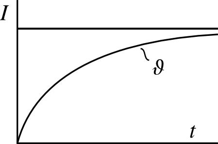

Рисунок 1 – Нагрев проводника постоянным током

Для выбора по допустимому току необходимо
фактический переменный график свести
к некоторому неизменному из условия
равенства максимальных температур:

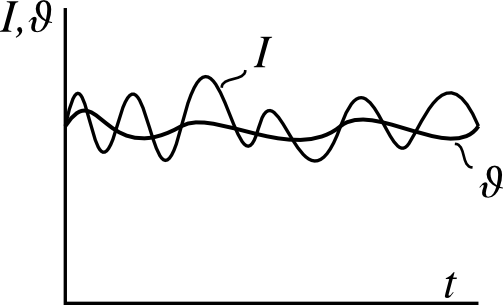

Рисунок 2 – Переменный график изменения тока и
температуры проводника

Расчетной нагрузкой по максимальной температуре
является такая неизменная по величине
нагрузка, которая дает тот же максимальный
перегрев, что и фактическая.

При невыполнении требовании могут происходить:
- необратимые изменения изоляции (горение);
- соединения (особенно болтовые) греются.

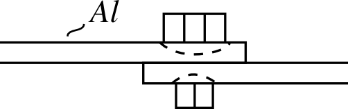

Рисунок 3 – Нагрев болтовых соединений проводника

Второй подход предполагает расчет по тепловому
износу. Тепловой износ изоляции
определяется средней температурой за
время службы θс
(пропорционален квадрату эффективного
значения тока). При расчетах реальный
график заменяется эквивалентным
неизменным, который вызывает тот же
тепловой износ, что и реальный график
(исходный). Принимается наибольшее
значение из двух имеющихся расчетных
значений.

## 3. Вероятностная модель

В системах электроснабжения процессы
изменения тока в общем случае являются
случайными. Случайный процесс описывается
случайной функцией времени <i>x</i><i>(</i><i>t</i><i>)</i>,
мгновенные значения которой в любые
моменты времени являются случайными
величинами. Случайной функцией <i>X</i><i>(</i><i>t</i><i>)</i>
называют функцию, которая в результате
опыта может принять тот или иной вид,
причем заранее неизвестно какой именно.
 Случайная величина <i>X</i><i>(</i><i>t</i><i>0</i><i>)</i>,
в которую обращается случайный процесс
при <i>t</i><i>=</i><i>t</i><i>0</i>,<i>
</i>
называется сечением случайного процесса,
соответствующим данному значению
аргумента <i>t</i>.

Конкретный вид, который принимает случайный процесс
в результате опыта, называется реализацией
случайного процесса. Реализацией
случайного процесса <i>X</i><i>(</i><i>t</i><i>)</i>
будем называть неслучайную функцию
<i>x</i><i>(</i><i>t</i><i>)</i>,
в которую превращается случайный процесс
<i>X</i><i>(</i><i>t</i><i>)</i>
в результате опыта [4].

В результате ряда опытов получают семейство
реализаций 

случайного процесса (Рис.5).

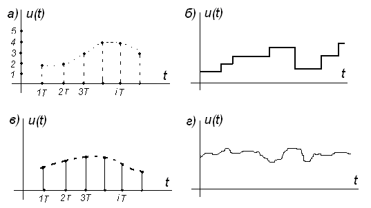

Рисунок 4 – Реализации случайных процессов

Реализации случайного процесса могут иметь как
непрерывную, так и дискретную структуру.
По своей структуре все случайные процессы
делят на четыре класса: процессы с
дискретными состояниями и с дискретным
временем (рис.4а); процессы с дискретными
состояниями и с непрерывным временем
(рис.4б); процессы с непрерывными
состояниями и  с дискретными временем
(рис.4в); процессы с непрерывными
состояниями и  с  непрерывным временем
(рис.4г).

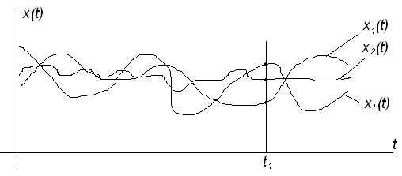

Рисунок 5 – Семейство реализаций случайного
процесса

В каждом сечении, например, в некоторый
фиксированный момент времени 
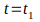
случайный процесс  представляет собой
обыкновенную случайную величину, которая
принимает значения 
.

Поэтому случайный процесс можно трактовать как
систему бесчисленного множества
случайных величин.

Рассматривая случайный процесс как систему уже трех
– четырех случайных величин возникают
трудности в аналитическом выражении
законов распределения случайного
процесса. Поэтому в ряде случаев
ограничиваются характеристиками
случайного процесса, аналогичными
числовым характеристикам случайных
величин.

<b>Характеристики
случайного процесса</b>
в отличие от числовых характеристик
случайных величин представляют собой
неслучайные функции. Среди них для
оценки случайного процесса широко
применяются функции математического
ожидания и дисперсии случайного процесса,
а также корреляционная функция случайного
процесса [5].

Математическим
ожиданием случайного процесса <i>X</i><i>(</i><i>t</i><i>)
</i>называется
неслучайная функция 
,
которая при каждом значении аргумента
t равна математическому ожиданию
соответствующего сечения случайного
процесса

.

Из определения математического ожидания
случайного процесса вытекает, что если
известна одномерная плотность вероятности
,
то

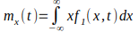
<i>.</i>
Случайный процесс <i>X</i><i>(</i><i>t</i><i>)
</i>всегда
можно представить как сумму элементарных
случайных функций

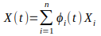,
где  - элементарная случайная функция.

Тогда

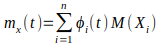
.

Если задано множество реализаций случайного
процесса <i>X</i><i>(</i><i>t</i><i>)</i>,
то для графического представления
математического ожидания 

проводят ряд сечений и в каждом из них
находят соответствующее математическое
ожидание (среднее значение), а затем
через эти точки проводят кривую (рис. 6).

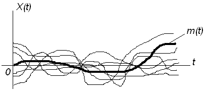

Рисунок 6 – График функции математического
ожидания 

Чем больше проведено сечений, тем точнее
будет построена кривая.

Математическое
ожидание 

случайного процесса есть некоторая
неслучайная функция, около которой
группируются реализации случайного
процесса.

Если реализации случайного процесса
представляют собой ток или напряжение,
то математическое ожидание трактуют
как среднее значение тока или напряжения.

Дисперсией
случайного процесса X(t)<b>
</b>называется
неслучайная функция 
,
которая при каждом значении аргумента
t равна дисперсии соответствующего
сечения случайного процесса.

.

Из определения дисперсии случайного
процесса вытекает, что если известна
одномерная плотность вероятности 
,
то

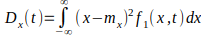
или     

Если случайный процесс представляется в
виде , то

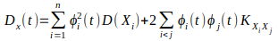.

Дисперсия
случайного процесса характеризует
разброс или рассеивание реализаций
относительно функции математического
ожидания.

Если реализации случайного процесса
представляют собой ток или напряжение,
то дисперсию 

трактуют как разность между мощностью
всего процесса и мощностью средней
составляющей тока или напряжения в
данном сечении, т.е.

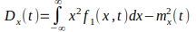.

В ряде случаев вместо дисперсии случайного
процесса используется среднее квадратичное
отклонение случайного процесса

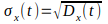
.

Математическое
ожидание и дисперсия случайного процесса
 позволяют выявить вид средней функции,
около которой группируются реализации
случайного процесса, и оценить их разброс
 относительно этой функции. Однако
внутренняя структура случайного
процесса, т.е. характер и степень
зависимости (связи) различных сечений
 процесса между собой, остается при этом
неизвестной (рис. 7).

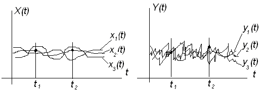

Рисунок
7 – Реализации случайных процессов <i>X</i><i>(</i><i>t</i><i>)
</i>и
<i>Y</i><i>(</i><i>t</i><i>)</i>

Для характеристики связи  сечений случайного
процесса вводится понятие смешанной
моментной функции второго порядка -
<b>корреляционной
функции</b>.

<b>Корреляционной
функцией </b>случайного
процесса <i>X</i><i>(</i><i>t</i><i>)</i>
называется неслучайная функция 
,
которая при каждой паре значений 
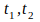
равна корреляционному моменту
соответствующих сечений случайного
процесса:

, где 
,
.

Связь (см. рис. 7) между сечениями 

случайного
процесса <i>X</i><i>(</i><i>t</i><i>)</i>
больше, чем между сечениями 

случайного
процесса <i>Y</i><i>(</i><i>t</i><i>)</i>,
т.е.

.

Из определения следует, что если задана
двумерная плотность вероятности 

случайного процесса <i>X</i><i>(</i><i>t</i><i>)</i>, то

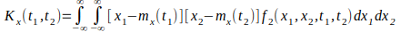,

или

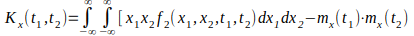.

Корреляционная
функция представляет собой совокупность
корреляционных моментов двух случайных
величин 
в моменты
,
причем оба момента рассматриваются в
любом сочетании всех текущих возможных
значений аргумента <i>t</i>
случайного процесса. Таким образом,
корреляционная функция характеризует
статистическую связь между мгновенными
значениями в различные моменты времени.

## Список источников
<ol>
  <li>Электрические нагрузки промышленных
предприятий / С.Д.&nbsp;Волобринский, Г.М.
Каялов, П.Н. Клейн, Б.С. Мешель. − Л. :
Энергия, 1971. − 264 с.
  </li>
  <li>Расчет электрических нагрузок промышленных
предприятий: 
учебно-методическое
пособие для студентов специальности
1-43 01 03 
«Электроснабжение (по отраслям)»
/ В. Н. Радкевич, В. Б. Козловская, И. В.
Колосова. - Минск: БНТУ, 2013. - 124 с.
  </li>
  <li>Вентцель, Е.С. Теория вероятностей / Е.С.
Вентцель. – М. : Кнорус, 2010.&nbsp;– 664&nbsp;с.
  </li>
  <li>Вентцель Е. С., Теория случайных процессов
и ее инженерные приложения / Е. С. Вентцель,
Л. А. Овчаров – М.: Академия, 2003.
  </li>
  <li>Пугачев В.С. Теория вероятностей и
математическая статистика: Учеб. пособие
для вузов. – М.: Издательство Ф-М
литературы, 2002.
  </li>
</ol>
