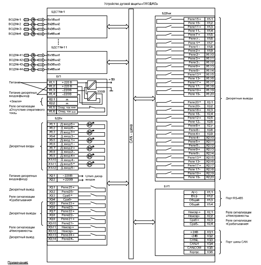
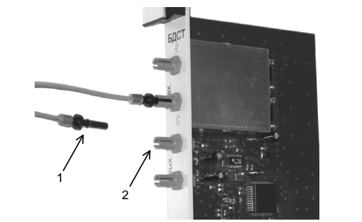
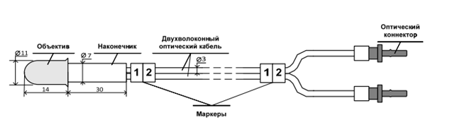
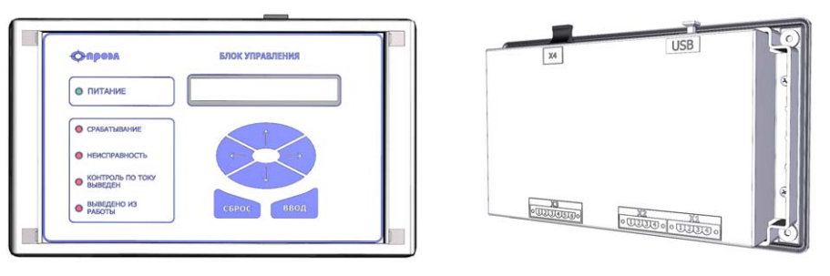

# Реферат по теме выпускной работы

<h2>Содержание</h2>

<ul class=content>
  <li class=ct1><a href="#intro">Введение</a>
  <li class=ct1><a href="#p1">1. Дуговая защита шинного отсека КРУ</a>
  <li class=ct2><a href="#p11">1.1 Принципы работы дуговой защиты</a>
  <li class=ct2><a href="#p12">1.2 Структура оптико-волоконной защиты типа ОВОД-М</a>
  <li class=ct2><a href="#p13">1.3 Оценка дуговой защиты ОВОД-М</a>
  <li class=ct2><a href="#p14">1.4 Технические особенности и эксплуатационные возможности дуговой защиты «ОВОД-МД»</a>
  
  <li class=ct1><a href="#conc">Выводы</a>
  <li class=ct1><a href="#ref">Список источников</a>
</ul>

## Введение

Сборные
шины распределительных устройств 6-10
кВ являются важным элементом в системе
электроснабжения предприятия. Несмотря
на серьезные усилия разработчиков и
производителей КРУ, на их шинах 6-10кВ
могут возникать междуфазные короткие
замыкания, в том числе дуговые.  

Ячейки комплектных распредустройств (КРУ)
широко используются при строительстве
подстанций различного типа.

Данные устройства, как правило, поставляются
в собранном виде. При этом они в
обязательном порядке комплектуются
оборудованием, которое потребуется в
процессе эксплуатации. Это позволяет
значительно сократить сроки проектных
работ и упростить их. Это ведет к
существенному удешевлению стоимости
проектирования.

Благодаря использованию крупных блоков заводского
производства данные электроустановки
отличаются надежностью и высоким уровнем
безопасности при использовании.

Монтаж КРУ также имеет свои преимущества. По
сравнению с установкой устройств,
собранных из компонентов, поставляемых
россыпью, комплектные РУ – более
компактное решение. Готовые комплектные
камеры устанавливаются в помещении в
кратчайшие сроки. Для их соединения
между собой и внешнего подсоединения
используются специальные проектные
схемы.

Применение КРУ имеет преимущества и при эксплуатации.
Поскольку все выкатные части у однотипных
камер одинаковые, при необходимости их
без проблем можно заменить. Такая
взаимозаменяемость дает возможность
при наличии запасного выкатного элемента
быстро проводить профилактику, ревизию,
регулировать и заменять вышедшие из
строя приборы (трансформаторы, разрядники,
выключатели) в любой из камер. В шкафах
с выключателями предусмотрены специальные
механические блокировки, которые
позволяют избежать проблем в виде
выкатывания тележки из рабочего положения
или ее вкатывания в шкаф.

## 1. Дуговая защита шинного отсека КРУ

### 1.1 Принципы работы дуговой защиты

Дуговая защита шин (ДуЗШ) или защита от дуговых
замыканий (ЗДЗ) применяется
для защиты сборных шин и элементов
ошиновки распределительных устройств
6-10 кВ, размещенных в закрытых отсеках
(КРУ или КРУН). Работа защиты основана,
в основном, на физическом принципе.
Может реагировать на два фактора: вспышка
света в отсеках распредустройства и на
механическое воздействие дуги. В связи
с этим может применяться только в КРУ,
где все токоведущие части размещены в
закрытых отсеках.

Известны следующие типы дуговых защит.

Дуговая <b>защита клапанного</b>
типа – реагирует на
повышение давления воздуха в ограниченном
отсеке ячейки КРУ. В качестве датчика,
реагирующего на повышение давления
воздуха, используются специальные
разгрузочные клапаны с путевыми
выключателями, смонтированные в КРУ.

Защита <b>с менбранным выключателем</b>
представляет
из себя систему из шлангов, вентилей
обратного давления и мембранного
выключателя. В каждый защищаемый отсек
ячейки подводится шланг. Объединение
шлангов производится через вентили
обратного давления. Объединённый участок
подключается к мембранному выключателю,
реагирующему на волны давления,
создаваемые электрической дугой <a href="#ref1">[3]</a>.

Защита <b>фототиристорного</b> типа
реагирует на световую
вспышку от электрической дуги реагируют.
В качестве датчика, реагирующего на
световую вспышку от электрической дуги,
используется фототиристор.

Защита <b>волоконно – оптического</b>
типа, как и предыдущая
ЗДЗ фототиристорного типа, реагирует
на световую вспышку от электрической
дуги. В качестве датчика, реагирующего
на световую вспышку от электрической
дуги, используется волоконно-оптический
датчик (ВОД). 

ВОД размещаются по одному в каждом отсеке
ячейки КРУ:
- в отсеке ввода;
- в отсеке выкатного элемента;
- в кабельном отсеке.

Оптико-волоконная
защита от дуговых замыканий является
более совершенной, т.к. реагирует на
повреждения не только в отсеке сборных
шин, но внутри КРУ в целом.

### 1.2 Структура оптико-волоконной защиты типа ОВОД-М

Структурная
схема защиты приведена на рис. 1 <a href="#ref1">[1]</a>.

Защита включает:
- Блок
	детектирования света и тестирования
	(БДСТ);
- Блок
	дискретных входов (БДВх);
- Блок
	дискретных выходов (БДВых);
- Блок
	выпрямления и контроля напряжения
	(БВКН);
- Блок
	питания (БП);
- Волоконно-оптический
	датчик (ВОД).

Рисунок 1 – Структурная схема оптиковолоконной
защита типы ОВОД

Датчики ВОД устанавливаются в различных ячейках
секции КРУ. Датчик ВОД представляет
собой приемник оптического излучения
на основе объектива (линзы специальной
формы и конструкции), обеспечивающего
угол захвата, близкий к 5 стерадианам.
Объектив соединен с двухволоконным
оптическим кабелем при помощи наконечника.
С другой стороны оптический кабель
оконцован оптическими вилками для
подключения к БДСТ(см. рис 2, 3) Датчики
фиксируют вспышку света от дугового
разряда и передают ее по волоконно-оптическому
кабелю к БДСТ. Датчик является
чувствительным к световому излучению
в ближнем инфракрасном диапазоне, что
позволяет сохранять его работоспособность
при осаждении на объектив ВОД пыли и
сажи.
ВОД имеют практически круговую диаграмму
направленности и фиксируют световую
вспышку при возникновении электрической
дуги практически в любой точке КРУ. 

</img>

Рисунок 2 – Пластиковый коннектор для подключения ВОД 
1 – вилка; 2 – розетка

</img>

Рисунок 3 – Внешний вид ВОД

По оптическому волокну информация с
датчиков ВОД передается в блок
детектирования света устройства. В этот
момент дуговая защита формирует сигнал
на отключение высокого напряжения в
цепи питания КРУ, что предотвращает
электрооборудование от разрушения.

В БДСТ световой сигнал от электрической
дуги, зарегистрированный с помощью
объектива ВОД и переданный в БДСТ по
оптическому кабелю, преобразуется в
электрический. Затем сигнал усиливается
и сравнивается с опорным напряжением.
Опорное напряжение выбрано таким
образом, чтобы устройство сработало
при мощности светового потока, вызываемого
электрической дугой с током короткого
замыкания приблизительно 200А. Данные о
регистрации электрической дуги передаются
по шине цифровой связи CAN блокам БДВых
и БДВх. Для подтверждения наличия тока
КЗ в алгоритм работы устройства могут
быть введены сигналы от шести дискретных
входов, расположенных в блоке БДВх. К
этим входам из схем РЗА КРУ подключаются
сигналы от пускового органа максимальной
токовой защиты (без выдержки времени)
или защиты минимального напряжения (ЗМН).

Каждый БДСТ периодически тестирует каждый ВОД
на предмет целостности объектива и
оптического кабеля, а также исправности
электронной схемы. Подтверждение
(блокирование) действия устройства на
отключение сигналами МТЗ или ЗМН может
быть снято изменением настройки в пункте
меню «Контроль по току». При этом сигналы
от дискретных входов внутри устройства
принимают активное состояние независимо
от наличия или отсутствия сигналов на
дискретных входах. 

В БДВх дополнительно расположены 7 выходных
реле, два из которых предназначены для
формирования дискретных сигналов
«Неисправность» и «Срабатывание», а
остальные пять могут выполнять функции
формирования дискретных сигналов
отключения или запрета действия схем
автоматического повтора включения
(АПВ) и автоматического включения резерва (АВР).

БУП предназначен для индикации текущего
состояния устройства и управления с
помощью клавиатуры режимами его работы
(см рис 4). Для этого пульт индикации и
управления оснащен 2-х строчным дисплеем,
позволяющим отображать 40 символов, и
клавиатурой из 6 кнопок. 

</img>

Рисунок
4 –Внешний вид БУП

Информация о состоянии устройства формируется
двумя источниками: светодиодами
оперативного контроля (отображается
информация, уведомляющая о срабатывании
устройства, его неисправности, состоянии
контроля по току, наличии выведенных
ВОД) и дисплеем (полная информация о
состоянии устройства, его блоков и
зарегистрированных событиях, доступ к
которой осуществляется через меню).
Доступ к осциллограммам, сохраненным
в памяти устройства, осуществляется с
помощью ПК, подключенного к порту «USB»
БУП. 

Управление индикацией, сброс индикации и выходных
сигналов, ввод или вывод ВОД, перевод в
режим тестирования, а также задание
настроек и параметров осуществляется
через пункты меню.

В случае отказа выключателя для отключения
вышестоящего выключателя в устройстве
имеется функция устройства резервирования
при отказе выключателя (УРОВ). Критерием
действия схемы УРОВ является длительность
сигнала от МТЗ или ЗМН. Измерение
длительности задержки начинается с
момента поступления сигнала от МТЗ или
ЗМН и только при наличии зафиксированного
ВОД светового потока от электрической
дуги. Установка длительности задержки
в действие УРОВ или выключение УРОВ
осуществляется через меню БУП.

### 1.3 Оценка дуговой защиты ОВОД-М

Основное
отличие дуговой защиты ОВОД-МД и
преимущество по сравнению с другими
дуговыми защитами:
1. В зоне действия электрической дуги
	находятся объектив волоконно-оптического
	датчика (ВОД) и волоконно-оптический
	кабель. Пассивные компоненты, которыми
	являются объектив датчика и
	волоконно-оптический кабель, обладают
	абсолютной невосприимчивостью к
	электромагнитным помехам.
2. Дуговая защита ОВОД-МД является защитой
	радиального типа. Защиты радиального
	типа позволяют наиболее быстро определять
	место повреждения и сделать более
	гибкой логику работы вместе с РЗА
	распредустройства.

### 1.4 Технические особенности и эксплуатационные возможности дуговой защиты «ОВОД-МД»

- определение	отсека (номера) шкафа или ячейки, в
	которых возникла электрическая дуга;
- благодаря	радиальному принципу построения
	устройства дуговой защиты и путем
	подтверждения наличия КЗ сигналами
	МТЗ (ЗМН) без выдержки времени
	обеспечивается высокая селективность;
- благодаря	радиальному принципу построения дуговой
	защиты обеспечивается гибкая логика
	работы устройства;
- радиальный принцип позволяет по заданию заказчика
	или проектной организации формировать
	логику работы дуговой защиты;
- в соответствии с заданной логикой работы
	дуговой защиты формируются выходные
	сигналы отключения;
- дуговая	защита ОВОД-МД позволяет формировать
	сигналы запрета АПВ и АВР;
- дуговая	защита обеспечивает возможно включение
	функции резервного отключения
	вышестоящего выключателя при отказе
	выключателя ввода напряжения по
	длительности сигнала от МТЗ или ЗМН;
- устройство дуговой защиты ОВОД-МД позволяет
	осуществлять автоматический контроль
	исправной работы ВОД, блоков детектирования
	света и электронных компонентов в цепях
	формирования сигналов отключения;
- дуговая защита «ОВОД-МД» обеспечивает защиту
	от ложных срабатываний при освещении
	лампой мощностью 60Вт с расстояния не
	ближе 15 см; от солнечных лучей; при
	выходе из строя электронных компонентов
	в цепи формирования сигналов отключения;
- дуговая
	защита ОВОД-МД позволяет осуществлять
	проверку функционирования датчиков
	ВОД и всего устройства дуговой защиты
	при проведении пуско-наладочных и
	регламентных работ;
- с	момента пропадания оперативного тока
	сохранение работоспособности дуговой
	защиты в течение 1 сек;
- появление	сажи и пыли на линзе датчика ВОД не
	влияет на работоспособность датчиков
	и в целом устройства дуговой защиты
	ОВОД-МД;
- сохранение	информации о текущем состоянии устройства
	дуговой защиты при пропадании оперативного
	тока и восстановление ее после подачи
	напряжения питания (время хранения не
	ограничено);
- включение/выключение
	любого количества датчиков ВОД;
- дуговая	защита ОВОД-МД обеспечивает формирование
	выходных сигналов сигнализации о
	неисправности, пропадании напряжения
	питания оперативного тока и срабатывании;
- устройство дуговой защиты имеет гальваническую
	развязку всех входов и выходов, включая
	питание, для реализации высокой
	помехозащищенности;
- дуговая	защита может быть установлена в любом
	месте помещения КРУ;
- при	установке устройства дуговой защиты
	ОВОД-МД минимум затрат при быстром и
	простом монтаже устройства без внесения
	изменений в конструкцию КРУ (КРУН).

## Выводы

Волоконно-оптические
защиты устранили недостатки фототиристорных
и фототранзисторных защит <a href="#ref1">[2]</a>:
- решена
	проблема с электромагнитной совместимостью;
- исключены
	ложные срабатывания из-за токов утечки
	при параллельном соединении фотоприемников;
- минимизировано
	количество отказов защиты за счет
	самодиагностики оптического тракта и
	датчика.

Кроме того, регистраторы позволили организовать
сигнализацию поврежденного элемента,
облегчающую поиск места возникновения
дуги персоналом, выполняющим расследование
и ликвидацию последствий замыкания.

По сравнению с МТЗ и ДЗТ оптико-волоконные
защиты имеют более высокое быстродействие.
Время отключения дугового замыкания с
помощью  оптико-волоконной защиты
складывается из времени:
- срабатывание
	регистратора (7-25 мс);
- срабатывания
	внешнего устройства пуска по току
	(15-25 мс);
- времени
	работы промежуточного реле отключения
	выключателя (15-20 мс);
- времени
	отключения выключателя (20-100 мс).

Итого время ликвидации горения дуги, с учетом
того, что пуск по току и срабатывание
регистратора выполняются параллельно,
у рассматриваемой защиты  50 – 145 мс.

<h2>Список источников</h2>
<ol>
  <li>УСТРОЙСТВО ДУГОВОЙ ЗАЩИТЫ МИКРОПРОЦЕССОРНОЕ «ОВОД-МД» Руководство по эксплуатации РИТЯ.468249.001 РЭ.
Режим доступа: <a href="https://electroenergetica.ru/images/doks/passport-OVOD-MD.pdf">https://electroenergetica.ru/images/doks/passport-OVOD-MD.pdf</a>
  </li>
  <li>Пять поколений дуговой защиты.
Режим доступа <a href="http://www.i-mt.net/blog/stati-po-rza/pyat-pokoleniy-dugovoy-zashchity">http://www.i-mt.net/blog/stati-po-rza/pyat-pokoleniy-dugovoy-zashchity</a>
  </li>
  <li>Источник Пневматический мембранный выключатель 8 AX 10 (Симменс) 
Режим доступа <a href="http://dororz.ru/cons_10_4_2_1.htm">http://dororz.ru/cons_10_4_2_1.htm</a>
  </li>
</ol>
