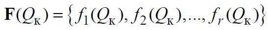
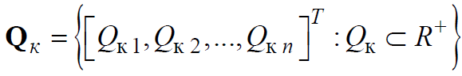
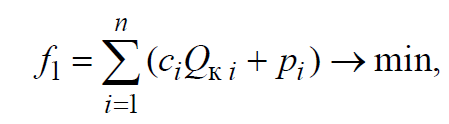
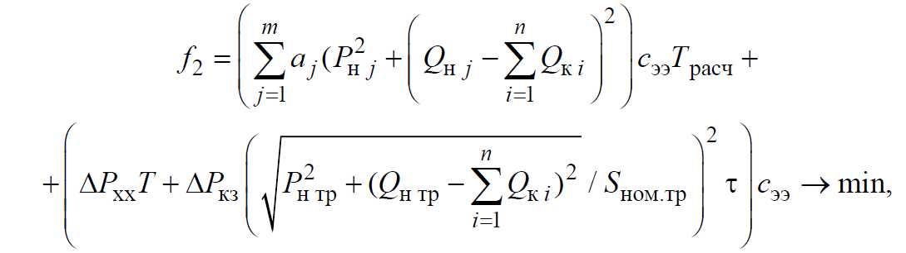
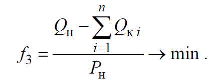
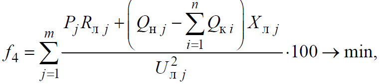
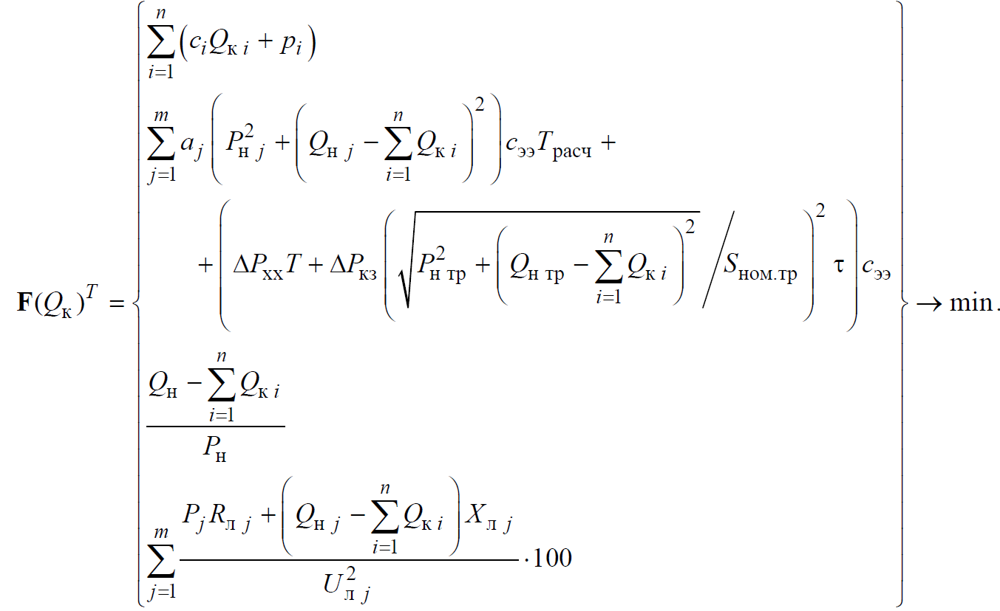

# Реферат по теме выпускной работы

## Содержание
<ul class=content>
  <li class=ct1><a href="#p1">1. Постановка задачи</a>
  <li class=ct1><a href="#p2">2. Формирование векторного критерия оптимизации</a>
  
  <li class=ct1><a href="#p3">3. Допущения</a>

  <li class=ct1><a href="#p4">Выводы</a>
</ul>

## 1. Постановка задачи

В условиях ужесточения требований к
эффективности, техническому уровню,
надежности и безопасности распределительных
электрических сетей, а также в отсутствие
достаточных средств на полную реконструкцию
оборудования систем электроснабжения
актуальной становится задача максимального
использования действующих линий
электропередачи и трансформаторов.
Решить эту задачу позволит переход к
энергосберегающим технологиям,
обеспечивающим уменьшение электропотребления
и снижение потерь электроэнергии, в том
числе за счет применения устройств
компенсации реактивной мощности (УКРМ).

Дополнительные и значительные преимущества дает
оптимальное размещение УКРМ. Выбор
оптимального варианта может осуществляться
как на стадии проектирования, так и на
стадии эксплуатации распределительных
электрических сетей (РЭС). При этом
должны учитываться как экономические,
так и технические требования, которые
зачастую носят противоречивый характер.

Актуальным является решение задачи размещения
УКРМ в разомкнутых распределительных
электрических сетях 0,4—6(10) кВ.

Для согласования технико-экономических
требований оптимизационная задача
может быть сведена к нахождению
подмножества решений, каждое из которых
не может быть улучшено ни по одному из
критериев без ухудшения по какому-нибудь
другому.

Получение математической модели принятия решений
заключается в определении вектора,
включающего совокупность частных
критериев, которые определяют ценность
решения поставленной задачи с точки
зрения разных требований:

<table class="numeq">
  <tr>
    <td></td>
    <td>(1)</td>
  </tr>
</table>

и множества

<table class="numeq">
  <tr>
    <td></td>
    <td>(2)</td>
  </tr>
</table>

представляющего набор устройств компенсации Qкi, который планируется установить в РЭС.

## 2. Формирование векторного критерия оптимизации

Для решения задачи оптимизации мощности и
выбора мест установки УКРМ в РЭС
сформирован следующий состав частных
целевых функций, который определяет
ценность решения с точки зрения разных
требований.

1. Стоимость установки УКРМ, которая
складывается из затрат на батареи
статических конденсаторов и расходов,
связанных с их установкой и подключением
(рассчитываются в рублях):

<table class="numeq">
  <tr>
    <td></td>
    <td>(3)</td>
  </tr>
</table>

где <i>Q</i>к<i>i</i> —
установленная мощность компенсации в <i>i</i>-м узле системы, ВАр;

<i>c</i><i>i</i> — удельная стоимость 1 кВАр УКРМ, зависящая от класса напряжения в узле подключения,
руб./кВАр;

<i>р</i><i>i</i> — расходы, связанные с установкой и
подключением УКРМ.

2. Стоимость потерь электрической энергии
на ее транспортировку (в линиях
электропередачи, трансформаторных
подстанциях) за расчетный период (в
рублях):

<table class="numeq">
  <tr>
    <td></td>
    <td>(4)</td>
  </tr>
</table>

где первое слагаемое — затраты, связанные
с потерями электрической энергии в
линиях электропередачи, руб.;

второе —
затраты, связанные с потерями электрической
энергии в трансформаторах напряжением
6(10)/0,4 кВ, руб. Здесь <i>j</i>
— номер линии электропередачи с
подключенной к ней нагрузкой, j = 1,...,<i>m</i>;  <i>а</i>j
 —
коэффициенты, зависящие от параметров
линии электропередачи (удельного
активного сопротивления <i>r</i>л0
и длины <i>l</i>л
) и уровня напряжения <i>U</i>л
, <i>а</i>
= <i>r</i>л0<i>l</i>л
/<i>U</i>л2
; <i>P</i>н.j,
<i>Q</i>н.j
— активная и реактивная нагрузка <i>j</i>-й
линии распределительной электрической
сети; <i>P</i>н
тр ,
<i>Q</i>н тр  —
активная и реактивная нагрузка
трансформатора;
<i>S</i>ном.тр
— номинальная мощность трансформатора;
Δ<i>P</i>хх —
активные потери холостого хода на
перемагничивание и создание вихревых
токов в стали трансформатора (потери в
стали);
Δ<i>P</i>кз
— активные потери короткого замыкания
на нагрев обмоток трансформатора (потери
в меди);
<i>Т</i>расч—
время, за которое рассчитываются потери
активной мощности в линии электропередачи;
<i>Т</i> — время работы трансформатора;
τ — время максимальных потерь; <i>c</i>ээ
— стоимость 1 кВт·ч электрической
энергии.

Кроме выполнения требования наибольшей
экономичности при выборе УКРМ необходимо
обеспечить соблюдение требований
нормативно-правовых документов в области
компенсации реактивной мощности, а
именно к значению коэффициента реактивной
мощности.

3. Значение коэффициента реактивной
мощности для потребителей, присоединенных
к электрическим сетям [3], в зависимости
от уровня напряжения в точке присоединения,
определяется из соотношения:

<table class="numeq">
  <tr>
    <td></td>
    <td>(5)</td>
  </tr>
</table>

При необходимости контроля <i>f</i>3
в нескольких узлах рассматриваемой РЭС
целевая функция записывается для каждого
узла.

1. Целевая функция, описывающая одну из
важнейших характеристик качества
электроэнергии — отклонение напряжения
в точках присоединения потребителей
[4] — может быть представлена в следующем
виде:

<table class="numeq">
  <tr>
    <td></td>
    <td>(6)</td>
  </tr>
</table>

где <i>R</i>лj и <i>Х</i>лj—
активное и реактивное сопротивление в линии электропередачи.

Таким
образом, необходимо стремиться к
уменьшению всех рассмотренных частных
критериев <i>f</i>r→min,
<i>r</i>
=1..4 .

Окончательно задача оптимизации мощности и выбора
мест установки УКРМ в РЭС напряжением
0,4—6(10) кВ может быть сформулирована
следующим образом: необходимо найти
множество парето-оптимальных решений
задачи векторной оптимизации, где вектор
целей <i><b>F</b></i>(<i>Q</i>к
) =  {<i>f</i>1(<i>Q</i>к),
<i>f</i>2(<i>Q</i>к
), <i>f</i>3(<i>Q</i>к
), <i>f</i>4(Qк)}
→ min :

Для нахождения решений могут быть использованы
весовой метод, метод рабочих характеристик,
метод главного критерия, метод
последовательных уступок, метод идеальной
точки. Согласно этим методам, исходная
многокритериальная задача оптимизации
сводится к некоторому множеству
однокритериальных (скалярных)
оптимизационных задач при разных типах
ограничений.

<table class="numeq">
  <tr>
    <td></td>
    <td>(7)</td>
  </tr>
</table>

## 3. Допущения

Решение задачи, сформулированной в общем виде,
представляет значительные трудности.
Поэтому желательно найти пути решения,
которые позволят его упростить, не внося
погрешности в получаемые результаты.

В качестве допущений при решении
рассматриваемой задачи примем, что:
- вырабатываемая
питающей системой (электрической сетью
более высокого уровня напряжения)
реактивная мощность является оптимальной
для РЭС;
- активные и реактивные нагрузки не зависят от
значений напряжения у потребителей;
- распределение активных мощностей не изменяется в
результате установки устройств
компенсации реактивной мощности;
- потери активной мощности на участке РЭС
рассчитываются по номинальному напряжению
на этом участке.

Принятие этих допущений позволяет упростить
решение задачи и применять в расчетах
параметры элементов системы электроснабжения
(трансформаторов, кабельных линий
электропередачи), а также значения
активных и реактивных нагрузок в узлах
сети.

## Выводы

Рассмотрены возможные варианты размещения устройств
компенсации реактивной мощности в
электрической сети преприятия, приведён
анализ стоимости таких устройств в
зависимости от мощности и места установки.
Полученные данные показали необходимость
оптимизационной постановки рассматриваемой
задачи и учёта, как экономических
возможностей, так и технических
требований.

Так, при стоимости УКРМ 1000 тыс. руб оптимальная
мощность <i>Q</i>к1,
<i>Q</i>к2,
<i>Q</i>к3.1
и
<i>Q</i>к3.2
составит
207/0/214/216 кВАр. Эти величины приведены с
учетом c учетом ограничения по значению
коэффициента реактивной мощности tgφ
для потребителей.

