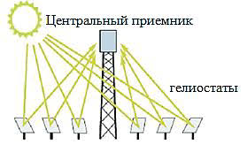
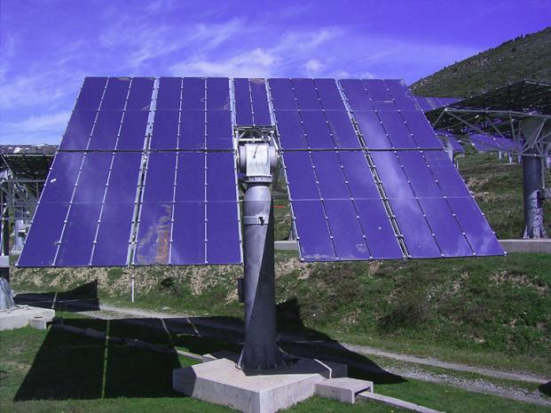
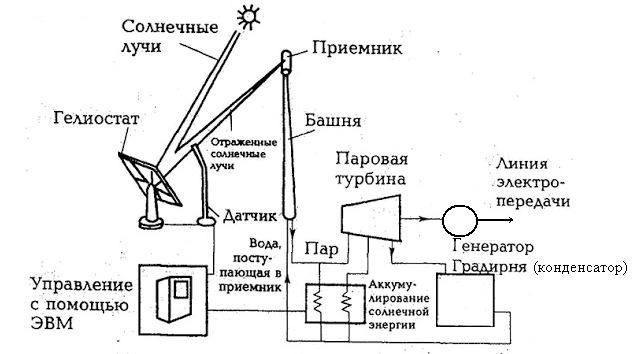
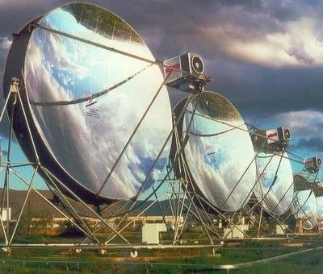
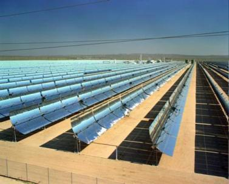
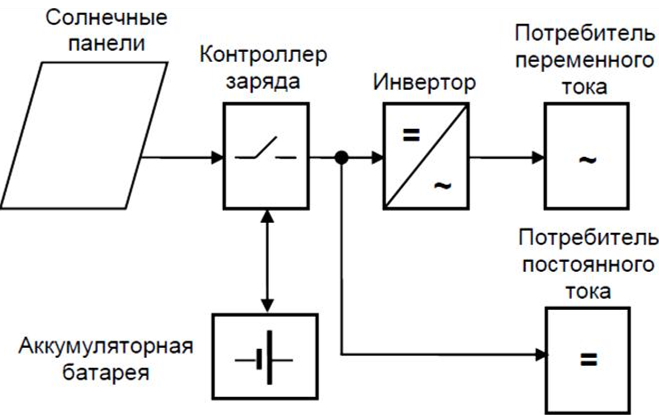
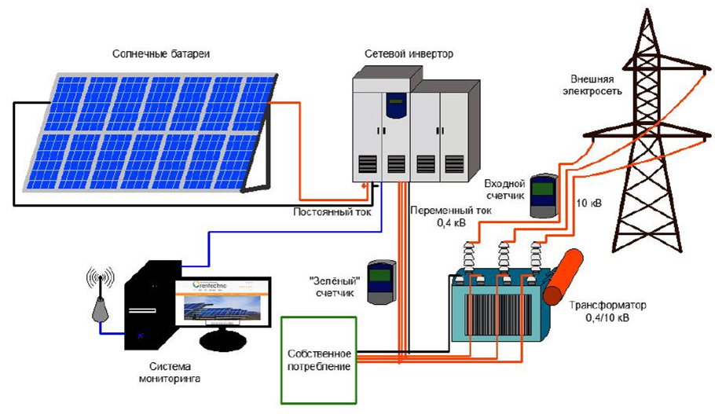
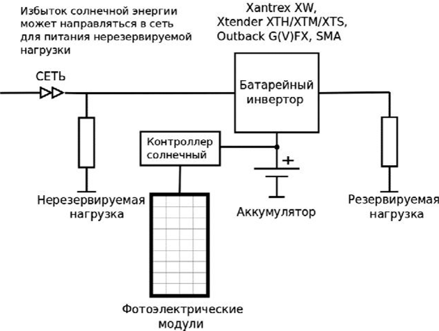
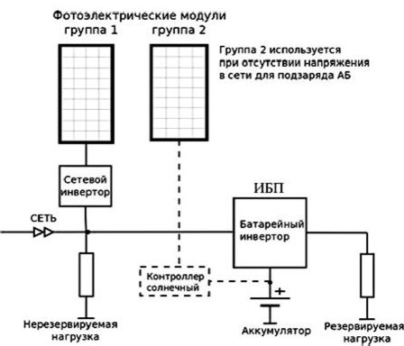
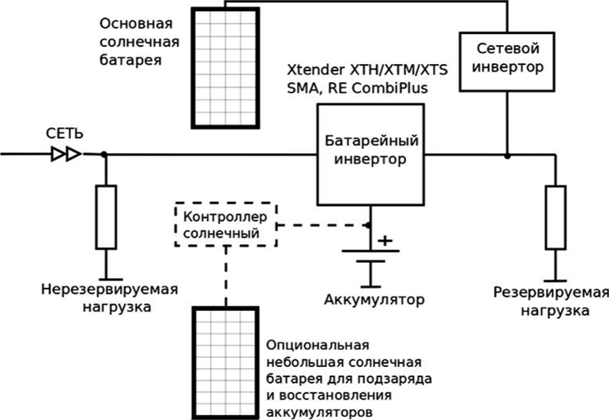

# Реферат по теме выпускной работы 

<h2>Содержание</h2> 

<ul class=content>
  <li class=ct1><a href="#p0">Введение. Солнечная энергия</a>
  <li class=ct1><a href="#p1">1. Солнечные электростанции, работающие с использованием термодинамического цикла</a>
  <li class=ct1><a href="#p2">2. Солнечные электростанции с прямым преобразованием солнечного излучения в электричество</a>
  
  <li class=ct1><a href="#conc">Выводы</a>
  
  <li class=ct1><a href="#ref">Список источников</a>
</ul> 

## Введение. Солнечная энергия 

В настоящее время солнечная энергия используется для получения низко- и среднетемпературных теплоносителей в основном для горячего водоснабжения, подогрева воды в бассейнах, отопления, в ряде случаев для получения технологического тепла. Кроме того, солнечная энергия используется для производства электроэнергии на электростанциях, работающих либо по термодинамическому циклу, либо с прямым преобразованием солнечной радиации в электроэнергию. 

Лучистая энергия Солнца, поступающая на Землю, представляет собой самый значительный источник энергии, которым располагает человечество. Поток солнечной энергии на земную поверхность эквивалентен условному топливу в количестве 1,2 · 1014 т. Солнце, как и другие звезды, является раскаленным газом. В его составе 82%&nbsp;водорода, 17% гелия, остальные элементы составляют около 1%. Внутри олнца существует область высокого авления, где температура достигает 5–20 млн. град. 

Земля находится от Солнца на расстоянии примерно 150 млн. км. Поток солнечной радиации, достигающей Земли, по разным оценкам, составляет (7,5–10)107 кВтч/год, или (0,85–1,2)1014 кВт, что значительно превышает ресурсы всех других возобновляемых источников энергии. 

Солнечное излучение на поверхность Земли зависит от многих факторов: широты и долготы местности, ее географических и климатических особенностей, состояния атмосферы, высоты Солнца над горизонтом и т. д. 

Поток солнечного излучения на Землю меняется, достигая максимума в 2200 кВт · ч/м2в год для северо-запада США, запада Южной Америки, части юга и севера Африки, Саудовской Аравии и центральной части Австралии. Россия находится в зоне, где поток солнечного излучения меняется в пределах от 800 до 1400 кВт ч/м2 в год. При этом продолжительность солнечного сияния в России находится в пределах от 1700 до 2000 ч/год и несколько более. Максимум указанных значений на Земле составляет более 3600 ч/год. За год на всю территорию России поступает солнечной энергии больше, чем энергии всех российских ресурсов нефти, газа, угля и урана. 

В мире сегодня солнечная энергетика развивается весьма интенсивно, занимая видное место в топливно-энергетическом комплексе ряда стран. 

Солнечное излучение, исходящее от источника высокой температуры (около 6000 °С), с термодинамической точки зрения является высококачественным первичным источником энергии, допускающим его преобразование в другие виды энергии (электроэнергия, тепло и др.) с высоким КПД. Однако существенными недостатками с технической точки зрения является нестабильность и относительная малая плотность солнечного потока: за пределами атмосферы 1,4 кВт/м2, на земной поверхности в ясный полдень около 1 кВт/м2. Эти свойства солнечного излучения затрудняют создание эффективных энергетических устройств, поскольку требуется большая площадь для приемников солнечного излучения и создание аккумуляторов энергии. В результате, стоимость солнечных установок оказывается высокой, что снижает их конкурентоспособность по отношению к традиционным энергоустановкам, использующим органическое топливо. 

## 1. Солнечные электростанции, работающие с использованием термодинамического цикла 

Солнечные электростанции (СЭС) с термодинамическим циклом преобразования используют концентрированное солнечное излучение для нагрева промежуточного теплоносителя или непосредственно рабочего тела теплосиловой установки. Концентраты солнечного излучения бывают: плоские, параболические и параболоцилиндрические
<a href="#ref1">[1]</a>.
 

Плоские концетраторы – гелиостаты использую на СЭС башенного типа с центральным приемником. Принцип действия у устройство таких СЭС поясняет рис. 1,2.  

</img>

а)

</img>                                                         

б)

Рисунок 1 СЭС башенного типа с центральным приемником  а) – принцип действия; б) – плоский гелиостат (треккер) с приводом системы ориентации
 

</img>

 Рисунок 2 – упрощенная технологическая схема СЭС башенного типа
 

Концентраторы солнечного излучения параболической и параболоцилиндрической формы показаны на рис. 3,4 

</img>

а)

</img>                                                         

б)

 Рисунок 3 - концентраторы солнечного излучения:
  а) зеркальный параболический; б) параболоцилиндрический
 

В фокусе концентраторов находится приемник тепла. С помощью концентраторов, показанных на рис.3, создают СЭС модульного типа. Более широкое применении находят параболоцилиндрические системы, т.к. для их работы используется более простая система регулирования только по одной координате (по углу возвышения солнца над горизонтом).  

Для уменьшения тепловых потерь и достижения высоких температур подогрева труба теплоприемника заключена в вакуумированную прозрачную оболочку. 

СЭС&nbsp;с параболоцилиндрическими концентраторами начали активно сооружать 1980-х—начале
1990-х гг. Например, в Калифорнии (США) было сооружено 9 СЭС этого типа с суммарной мощностью 354 МВт. Часть из них работает и до сих пор. В качестве теплоносителя, нагреваемого в концентраторе до температуры 380◦C, используется высокотемпературное минеральное масло, отдающее тепло водяному пару — рабочему телу паротурбинной установки. С целью снижения зависимости СЭС от погодных условий предусмотрено дополнительное сжигание природного газа (до 20% в год по теплу).   

Примерно в это же время в разных странах (в том числе в СССР) были сооружены СЭС башенного типа мощностью от 1 до 10 МВт. Наиболее известна СЭС Solar One мощностью 10 МВт, сооруженная в США и впоследствии реконструированная в Solar Two с той же мощностью. Solar Two проработала несколько лет и после проведения запланированного цикла исследований была остановлена из-за неконкурентоспособности. 

Особенностью этих СЭС является работа только за счет солнечной энергии, без использования обычных топлив. С этой целью схема СЭС включает тепловой аккумулятор, использующий расплавленную соль, и позволяющий несколько продлить работу СЭС за пределы светового дня.   

Зарубежный опыт создания СЭС показывает, что в перспективе такие станции станут конкурентоспособными с обычными источниками электроэнергии. 

Мощность СЭС с параболическими концентраторами лимитируется размерами параболоида. Наибольший параболоид, сооруженный в Австралии, имеет площадь апертуры в 400 м2, и с двигателем Стирлинга при КПД около
20% мог бы развивать мощность до 60 кВт. Все другие СЭС с параболоидами создавались как опытные на мощность 10–25 кВт. 

## 2. Солнечные электростанции с прямым преобразованием солнечного излучения в электричество 

Для прямого преобразования лучистой энергии Солнца используют фотоэлементы полупроводникового типа с запирающим слоем (фотоэлектрические преобразователи ФЭП) <a href="#ref1">[2]</a>. 

Солнечные фотоэлектрические станции (СЭС, ФЭС, PV farms или PV plants) - это один из видов электростанций, генерирующий электричество путем непосредственного преобразования энергии солнечного излучения в электроэнергию. 

Для надежного обеспечения потребителя электричеством с использованием солнечной энергии в состав ФЭС кроме фотоэлектрических панелей (ФП) входит ряд дополнительных элементов, перечень которых во многом зависит от типа и назначения солнечной электростанции. 

Различают два основных типа солнечных фотоэлектрических систем:
- автономные системы;
- системы, работающие параллельно с сетью. 

Автономная ФЭС, кроме солнечных панелей, как правило, содержит аккумуляторные батареи (АБ) и контроллер заряда/разряда. При необходимости электроснабжения потребителей, требующих стандартного напряжения 220/380В переменного тока, в состав ФЭС необходимо включить инвертор (рис. 4) 

>
</img>

 Рисунок 4. Структурная схема автономной СЭС
 

Параметры элементов ФЭС (тип и количество ФП, емкость АБ, мощность инвертора), а соответственно, и ее стоимость зависят от многих факторов: состава электрической нагрузки, среднесуточного электропотребления, характера работы ФЭС (сезонный или круглогодичный), среднемесячного прихода солнечной радиации и числа последовательных дней без солнца в месте установки фотоэлектрических модулей, системы ориентации солнечных панелей на солнце и некоторых других факторов. 

Так как ФЭП способны вырабатывать электроэнергию только в светлое время суток, величина их установленной мощности должна выбираться с расчетом на то, что запасенной за день энергии хватит на гарантированное обеспечение потребителей в течение суток. Это приводит к необходимости значительно увеличивать установленную мощность ФП и емкость аккумуляторов. 

Очевидным недостатком автономных ФЭС является потеря излишков энергии в режимах малых нагрузок. В большинстве стандартных автономных фотоэлектрических систем солнечная батарея просто отключается, когда аккумуляторы полностью заряжены. Можно использовать избытки энергии на балластных сопротивлениях для подогрева воды или воздуха, что позволяет несколько повысить эффективность полезного использования генерируемой энергии, однако проблема полностью не решается. 

Серьезным недостатком автономных ФЭС является необходимость использования аккумуляторных батарей, работающих в циклическом режиме. Число рабочих циклов распространенных кислотно-свинцовых аккумуляторов невелико (1500-2000), что требует их частой замены. Применение промышленных аккумуляторов с большим сроком службы, например никель-кадмиевых или литий-ионных, требует значительного увеличения финансовых вложений на построение энергетической системы. 

Кроме того, необходимо учитывать, что в аккумуляторах также имеют место потери энергии. В лучшем случае эффективность процессов заряда-разряда аккумуляторов составляет 90 %, и она ухудшается по мере их старения. 

Использование ФЭС при наличии сети позволяет избежать многих, если не всех, недостатков автономных систем. По сути, сеть является большим аккумулятором со 100%-м КПД, который может принять все излишки энергии. 

Структурная схема сетевой фотоэлектрической электростанции приведена на рис.5. Электрическая сеть может быть как децентрализованной, так и локальной, образованной дизельной электростанцией.
 

В состав сетевой фотоэлектрической системы, кроме солнечных батарей, также обычно входят:
- сетевые 	инверторы, преобразующие постоянный 	ток, генерируемый солнечными панелями, 	в переменный;
- контроллеры 	максимального отбора мощности с 	солнечных батарей;
- система 	мониторинга, позволяющая отслеживать 	параметры рабочего режима солнечной 	электростанции;
- централизованная 	сеть - линия электропередач, к которой 	подсоединена электростанция. 

</img>

 Рисунок 5 - Структурная схема сетевой фотоэлектрической электростанции
 

В свою очередь, сетевые ФЭС по способу построения подразделяются на два основных типа:
- без аккумуляторных батарей;
-	с аккумуляторными батареями. 

На практике наибольшее распространение получили фотоэлектрические системы без аккумуляторных батарей. Безаккумуляторные ФЭС очень надежны и практически не требуют обслуживания. Кроме того, они обладают максимальной эффективностью использования энергии генерированной солнечными батареями - от 90 до 98 %. В таких системах применяются специальные инверторы, ведомые сетью, которые используют сеть для формирования опорного напряжения для их запуска и синхронизации. 

Недостатком подобных систем является прекращение питания потребителей при отключении центральной сети. Так как сетевые инверторы вырабатывают напряжение, идентичное сетевому, то при его потере инвертор перестает работать. Причиной исчезновения напряжения в сети (и как следствие, прекращение генерации сетевых инверторов СЭС) может быть, например, обесточивание участка сети для обеспечения безопасности при проведении ремонтных работ. 

При ненадежной электрической сети применяют ФЭС с аккумуляторными батареями, которые являются гораздо более сложными, но позволяют создавать системы бесперебойного электроснабжения потребителей. 

Мощность инвертора в таких системах определяется по суммарной мощности нагрузки, которую нужно питать во время аварий в сети, а длительность аварий определяет емкость АБ и установленную мощность солнечной батареи. 

Для обеспечения максимально эффективной работы аккумуляторная фотоэлектрическая система, соединенная с сетью, требует использования специализированного автономного (батарейного) инвертора. 

Возможны 3 варианта построения таких систем:
1. Солнечные батареи заряжают АБ через контроллер заряда, а затем энергия через инвертор передается в нагрузку или сеть.
2. Солнечные батареи работают на сетевой фотоэлектрический инвертор, от которого питается нагрузка, излишки энергии идут на заряд аккумуляторов, и если АБ заряжены, то направляются в сеть.
3. Гибридная система, включающая элементы обоих вышеперечисленных типов. 

Структурная схема сетевой фотоэлектрической системы с контроллером заряда приведена на рис. 6. 

Данный вариант построения системы является наиболее простым и распространенным. В данной системе заряд аккумуляторов от солнечных батарей производится через контроллер заряда постоянного тока. 

При использовании стандартного источника бесперебойного питания (ИБП) при наличии сети заряд аккумуляторов происходит от сети, и солнечные батареи практически не используются. Для максимального использования энергии, вырабатываемой солнечными батареями, применяют контроллер с отслеживанием точки максимальной мощности (МРРТ) и специальный инвертор с функцией передачи электроэнергии в нагрузку или сеть при напряжении на АБ выше заданного. В этом случае, даже если АБ полностью заряжены, энергия от ФП направляется в нагрузку, тем самым уменьшая потребление от сети. 

Если нагрузка потребляет меньше энергии, чем вырабатывают солнечные батареи, такой инвертор может или направлять излишки в сеть, или уменьшать выработку солнечных батарей за счет повышения напряжения на аккумуляторах. 

</img>

 Рисунок 6 - Сетевая фотоэлектрическая система электроснабжения с контроллером заряда постоянного тока
 

Достоинствами таких систем является возможность использования энергии солнца, как при наличии сети, так и во время отключений; возможность восстановления работы при длительных перерывах в электроснабжении и глубоком разряде аккумуляторов путем заряда АБ от ФП. 

К недостаткам следует отнести двойное преобразование солнечного электричества, что приводит к дополнительным потерям в контроллере, инверторе, частично в аккумуляторах; циклический режим работы аккумуляторов при перерывах в централизованном электроснабжении, что приводит к их быстрому износу. 

При авариях в сети инвертор начинает преобразовывать энергию от аккумуляторов. Если солнечные батареи подключены через контроллер заряда к аккумуляторам, то инвертор использует солнечное электричество и, если его не хватает, энергию из аккумуляторов. Если солнечной энергии больше, чем нужно для потребителей, она идет на заряд аккумуляторов. 

Фотоэлектрическая система электроснабжения с сетевым инвертором на входе источника бесперебойного питания (ИБП) представлена на рис.7. 

 Рисунок 7 - Сетевая фотоэлектрическая система электроснабжения с сетевым инвертором на входе ИБП
 

Достоинствами данной схемы построения ФЭС является возможность применения сетевого и автономного инверторов с минимальным набором опций, широко представленных на рынке многочисленными производителями. Аккумуляторы все время находятся в заряженном состоянии, эксплуатируются в буферном режиме и используются только при отключениях сетевого электричества. 

ФЭС такого типа целесообразно использовать в системах электроснабжения, в которых основное потребление солнечного электричества имеет место днем, а отключения централизованного электроснабжения редкие и недолгие. 

В дневное время суток сетевой инвертор обеспечивает энергией всех потребителей, в том числе и резервируемых. Излишки энергии направляются в общую сеть только в тех случаях, если потребление меньше, чем генерируют солнечные батареи, при этом энергия солнца используется и на заряд АБ. Эффективность сетевых инверторов, как правило, составляет более 90 %, что обеспечивает хорошие энергетические показатели всей системы электроснабжения. Единственным недостатком является прекращение использования энергии солнца при авариях в сети. 

Мощность ИБП в таких системах выбирается по мощности резервируемой нагрузки и не зависит от мощности солнечных батарей. Мощность сетевого инвертора может быть как больше, так и меньше мощности ИБП. Для обеспечения восстановления системы при глубоком разряде аккумуляторов в схеме электростанции можно предусмотреть небольшую солнечную батарею, которая подключается к АБ через контроллер заряда (показан пунктиром). Если отключения кратковременные, то данные элементы можно не использовать. 

Наиболее универсальными являются фотоэлектрические системы с сетевым инвертором на выходе ИБП (рис.8). В данной схеме построения электростанции также используется высокоэффективный сетевой инвертор, но, в отличие от предыдущей схемы, при отсутствии напряжения сети солнечные батареи продолжают питать резервируемую нагрузку и заряжать аккумуляторы. 

В нормальном режиме, при наличии напряжения в сети, сетевой инвертор снабжает энергией резервируемую нагрузку, при этом КПД преобразования инвертора очень высокий - более 90-95 %. Если нагрузка потребляет меньше, чем вырабатывают солнечные батареи, излишки энергии идут на заряд аккумуляторов. Если нагрузка потребляет больше - то недостающая энергия берется из сети. После полного заряда аккумуляторов излишки энергии направляются в общую сеть и питают остальную нагрузку. 

При аварии в сети ИБП переключается на работу от аккумуляторов и обеспечивает одновременно опорное напряжение для сетевого инвертора. Поэтому энергия солнца продолжает использоваться и при авариях в сетях. Как и при наличии сети, излишки солнечного электричества направляются на заряд аккумуляторов. 

</img>

 Рисунок 8 &mdash; Сетевая фотоэлектрическая система электроснабжения с сетевым инвертором на выходе ИБП
 

Если напряжение в сети не пропало, но вышло за пределы допустимого, то инвертор отключается от такой сети и продолжает питать ответственную нагрузку качественным током - от СБ и от АБ. Нагрузка, подключенная до инвертора, питается тем напряжением, которое есть в сети. 

Достоинствами системы является эффективное использование аккумуляторных батарей (работа в буферном режиме), эффективное использование возобновляемой солнечной энергии, возможность восстановления при глубоком разряде аккумуляторов при использовании небольшой СБ, подключенной к АБ через контроллер заряда (показан пунктиром). 

К недостаткам следует отнести необходимость применения специальных гибридных автономных инверторов, которые могут заряжать АБ с выхода, а также направлять излишки солнечной энергии в сеть. Такой инвертор должен или давать сигнал на отключение сетевого инвертора, или повышать частоту на выходе для управления сетевым инвертором (большинство сетевых инверторов прекращают работу при выходе параметров частоты за заданные пределы). 

## Выводы 

Сравнительный анализ схем построения ФЭС показывает, что:
1. Применение сетевых инверторов и схем включения, показанных на рис. 7,8 в большинстве случаев повышает эффективность системы, особенно, если большая часть солнечной энергии потребляется в дневное время. Применение специальных ИБП с возможностью заряда АБ с выхода позволяет использовать сетевые фотоэлектрические инверторы даже во время перерывов в электроснабжении от централизованной сети.
2. Схемы построения фотоэлектрических систем достаточно разнообразны и требуют применения специализированного энергетического оборудования. При этом эффективность всей энергетической системы будет во многом определяться составом и характеристиками используемого энергетического оборудования. 

<h2>Список источников</h2>
<ol>
  <li>О. Соловьев. Солнечные электрические станции. Режим доступа: <a href="https://metallurgist.pro/solnechnye-fotoelektriche">https://metallurgist.pro/solnechnye-fotoelektriche</a>
  </li>
  <li>Структура и состав оборудования фотоэлектростанций. Режим доступа: <a href="https://ozlib.com/830023/tehnika/struktura_sostav_oborudovaniya_fotoelektrostantsiy">https://ozlib.com/830023/tehnika/struktura_sostav_oborudovaniya_fotoelektrostantsiy</a>
  </li>
</ol>
