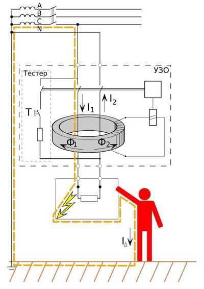

# Реферат по теме выпускной работы

<h2>Содержание</h2>

<ul class=content>
  <li class=ct1><a href="#intro">Введение</a>
  <li class=ct1><a href="#p1">1. Основные принципы защиты от поражения электрическим током</a>
  <li class=ct1><a href="#p2">2. Область применения устройств защитного отключения (УЗО)</a>
  <li class=ct2><a href="#p21">2.1 Применение УЗО для защиты людей от поражения электрическим током</a>
  <li class=ct2><a href="#p22">2.2 Применение УЗО для предотвращения возникновения пожара</a>
  <li class=ct1><a href="#p3">3. Принцип действия УЗО</a>
  <li class=ct1><a href="#ref">Список источников</a>
</ul>

## Введение

Все более широкое использование электроэнергии
во всех областях деятельности человека,
рост энерговооруженности труда,
увеличение количества электроприборов
в быту и на производстве, повлекли за
собой повышение опасности поражения
человека электрическим током. Электрический
ток не имеет каких-либо физических
признаков или свойств, по которым человек
мог бы его ощущать органами чувств, что
делает его  опасным для человека. 

Электротравматизм составляет значительную долю в общем
числе несчастных случаев.
Специалистам-электрикам и рядовым
пользователям известно большое количество
случаев гибели или тяжелого поражения
людей от удара электрическим током или
возгораний и пожаров, вызванных
неисправностями электрооборудования
и электропроводок.

В 1950-х годах было однозначно установлено,
что при воздействии электрического
тока на человека, наиболее уязвимым
органом является его сердце. Фибрилляция
(беспорядочные сокращения мышц) сердца
может возникать даже при малых значениях
тока. Также было установлено, что
результат воздействия электрического
тока на организм человека зависит не
только от значения тока, но и от
продолжительности его протекания, пути
тока через тело человека, а также, в
меньшей степени от частоты тока, формы
кривой, коэффициента пульсаций и других
факторов. 

Электрическое сопротивление тела человека зависит
от влажности кожи, размера поверхности
контакта, пути протекания тока по телу,
индивидуальных особенностей организма
и других факторов. Известно, что
сопротивление внутренних органов
человека не превышает 500-600 Ом. Сопротивление
кожи во влажном состоянии крайне мало
— 10-20 Ом. При определении условий
электробезопасности в электроустановке
за расчетное принято сопротивление
тела человека 800-1000 Ом. По причине
неопределенности реального значения
сопротивления тела человека для расчетной
оценки опасности электропоражения в
электроустановке принято использовать
в качестве критерия опасности ток через
тело человека, а не напряжение, приложенное
к нему.

## 1. Основные принципы защиты от поражения электрическим током

Все существующие защитные меры по принципу
их выполнения можно разделить на три
основные группы: 
1. Обеспечение недоступности для человека
  токоведущих частей электрооборудования.
2. Снижение возможного значения тока
  через тело человека до безопасного
  значения.
3. Ограничение времени воздействия
  электрического тока на организм человека.

Современная система электробезопасности должна
обеспечивать защиту человека от поражения
в двух наиболее вероятных и опасных
случаях: 
- при прямом прикосновении к токоведущим частям электрооборудования; 
- при косвенном прикосновении. 

Под косвенным прикосновением понимается
прикосновение человека к открытым
проводящим частям оборудования, на
которых в нормальном режиме (исправном
состоянии) электроустановки отсутствует
электрический потенциал, но при каких-либо
неисправностях, вызвавших нарушение
изоляции или ее пробой на корпус, на
этих частях возможно появление опасного
для жизни человека потенциала. 

Система электробезопасности включает в себя
ряд организационных и технических
мероприятий. Согласно ГОСТ Р 50571.3-93 п.
412 для защиты от прямого прикосновения
служат мероприятия, предотвращающие
прикосновение к токоведущим частям:
изоляция токоведущих частей, применение
ограждений и оболочек, установка
барьеров, размещение вне зоны досягаемости.

Дополнительная защита от электропоражения при прямом
прикосновении достигается путем
применения <b>устройств
защитного отключения</b>.

Устройство защитного отключения является превентивным
электрозащитным мероприятием и в
сочетании с современными системами
заземления (TN-S, TN-C-S) обеспечивает высокий
уровень электробезопасности при
эксплуатации электроустановок.

## 2. Область применения устройств защитного отключения (УЗО)

В последние годы внедрение Устройств
Защитного Отключения (далее УЗО)
ведется весьма интенсивно. УЗО оснащаются
в обязательном порядке все вновь
строящиеся и реконструируемые жилые
здания. Обязательно применение УЗО при
эксплуатации электроприборов и
электроинструментов в особо опасных
помещениях, не допускаются к эксплуатации
мобильные здания из металла или с
металлическим каркасом для уличной
торговли и бытового обслуживания
населения, не оснащенные УЗО, и т. д. 

УЗО применяется для комплектации
вводно-распределительных устройств
(ВРУ), распределительных щитов (РЩ),
групповых щитков (квартирных и этажных),
а также для защиты отдельных потребителей
электроэнергии.

Область применения УЗО достаточно широка – это
электроустановки:
- общественных зданий — детских
  дошкольных учреждений, школ,
  профессионально-технических, средних,
  специальных и высших учебных заведений,
  гостиниц, медицинских учреждений,
  больниц, санаториев, мотелей, библиотек,
  крытых и открытых спортивных и
  физкультурно-оздоровительных учреждений,
  бассейнов, саун, театров, клубов,
  кинотеатров, магазинов, предприятий
  общественного питания и бытового
  обслуживания, торговых павильонов,
  киосков и т.п.;
- жилых зданий — индивидуальных и
  многоквартирных, коттеджей, дач, садовых
  домиков, общежитий, бытовых помещений
  и т.п.;
- административных зданий, производственных
  помещений — мастерских, АЗС, автомоек,
  ангаров, гаражей, складских помещений
  и т.д.;
- промышленных предприятий — предприятий
  по производству и распределению
  электроэнергии, железнодорожных
  предприятий, горной, нефтедобывающей,
  сталеплавильной, химической промышленности,
  взрывоопасного производства и мн. др.

Применение УЗО целесообразно и оправдано по
социальным и экономическим причинам в
электроустановках всех возможных видов
и самого различного назначения.

Затраты на установку УЗО несоизмеримо меньше
возможного ущерба — гибели и травм
людей от поражения электрическим током,
возгораний, пожаров и их последствий,
произошедших из-за неисправностей
электропроводки и электрооборудования.
Если учесть, что стоимость одного УЗО
не превышает стоимости простого бытового
электроприбора, а возможный ущерб,
которого можно было бы избежать, если
бы УЗО было бы установлено, исчисляется
огромными суммами, то становится
совершенно очевидной и не требующей
дополнительных доказательств необходимость
скорейшего и самого широкого внедрения
УЗО нового поколения во всех
электроустановках.

Исключение составляют электроустановки, не
допускающие по технологическим причинам
перерыва в электроснабжении. В таких
установках для защиты людей от поражения
электрическим током должны применяться
другие электрозащитные меры — контроль
изоляции, разделительные трансформаторы
и др.

Органы Госэнергонадзора, Государственного
пожарного надзора и Энергосбыта
согласовывают проектную документацию,
осуществляют сертификацию электроустановок
жилых домов, приемку объектов в
эксплуатацию только при условии
обязательного использования УЗО.

Необходимость применения УЗО определяется проектной
организацией по условиям обеспечения
электро- и пожаробезопасности с учетом
требований заказчика и в соответствии
с действующими стандартами и нормативными
документами.

Применение УЗО нормируется нормативными документами
— в первую очередь новыми разделами
ПУЭ.

Ниже приведены нормативно-технические
документы, согласно требованиям которых,
должны быть выполнены электроустановки
зданий:
* ГОСТ Р 50807-95 «Устройства защитные, управляемые
  дифференциальным (остаточным) током.
  Общие требования и методы испытаний»;
* ГОСТ Р 51326.1-99 «Выключатели автоматические,
  управляемые дифференциальным током,
  бытового и аналогичного назначения без
  встроенной защиты от сверхтоков. Часть 1. Общие требования и методы испытаний»;
* ГОСТ Р 51327.1-99 «Выключатели автоматические,
  управляемые дифференциальным током,
  бытового и аналогичного назначения со
  встроенной защитой от сверхтоков. Часть 1. Общие требования и методы испытаний»;
* ГОСТ Р МЭК 61140-2000 «Защита от поражения
  электрическим током. Общие положения
  по безопасности, обеспечиваемой
  электрооборудованием и электроустановками
  в их взаимосвязи»;
* комплекс стандартов ГОСТ Р 50571.1 — ГОСТ Р 50571.23
  «Электроустановки зданий».

Основные цели применения УЗО:
* защита людей от поражения электрическим током;
* предотвращение возникновения пожара по причине
	появления тока утечки электропроводки.

### 2.1 Применение УЗО для защиты людей от поражения электрическим током

С каждым годом увеличивается количество
и разнообразие техники в квартирах и
домах. В таких условиях вероятность
поражения током или получения различных
травм возрастает в разы.

При использовании в личных целях таких
электрических приборов, как <a href="http://zametkielectrika.ru/podklyuchenie-stiralnoj-mashiny/">стиральная
машина</a>,
СВЧ-печь, <a href="http://zametkielectrika.ru/podklyuchenie-elektroplity/">электрическая
плита</a>,
водонагреватель, компьютер и другие,
есть вероятность поражения электрическим
током, т.к. перечисленные бытовые приборы
в первую очередь имеют металлический
корпус (проводит электрический ток) и
сложную внутреннюю схему.

Вследствие различных воздействий (механических,
тепловых и др.), а также по причине
длительного срока службы, изоляция
проводов этих бытовых приборов может
прийти в негодность. <em>Это
касается не только электрических
приборов, но и линий электропроводки.</em>

При нарушении изоляции проводника, есть
вероятность замыкания этого провода
на металлический корпус электрического
прибора. При этом на корпусе появляется
фаза или другими словами, потенциал,
равный напряжению сети. Но это возникнет
в том случае, если отсутствует
заземление корпуса. Последствия
прикосновения к корпусу могут быть
самые разные. В одном случае это «легкий
испуг», в другом — серьезные последствия,
вплоть до остановки сердца от
прохождения тока через тело человека.

<b>В чём необходимость монтажа УЗО?</b>

Рассмотрим этот вопрос на простом примере.
Предположим, в ванной комнате стоит
стиральная машина. Электрическая
квартирная проводка выполнена только
нулевым и фазным проводами, защитного
заземления нет, и УЗО не смонтировано.

Представляем ситуацию дальше.
Внутри машинки повредился
изоляционный слой, в результате чего
фаза стала соприкасаться с металлическим
корпусом. Появился какой-то потенциал,
то есть корпус стиральной машинки теперь
под напряжением. Если к ней подойдёт
человек и прикоснётся, то будет играть
роль проводника, по которому потечёт
электрический ток. Действие тока
продолжится до тех пор, пока человек не
отдёрнет руку от стиральной машинки,
потому что повреждённый участок никаким
устройством не отключится. К сожалению,
под воздействием тока мышцы человека
парализуются, и самому отдёрнуть руку
не всегда получится.

Здесь есть два варианта – либо человек теряет
сознание и подает, либо кто-то посторонний
оказывает ему помощь путём отключения
вводного автомата на помещение.

Если бы в рассмотренном примере в
распределительном щитке стояло УЗО,
оно отреагировало бы на появление тока
утечки, отключилось и обезопасило
человеческую жизнь. Именно по этой
причине в квартире, оснащённой большим
количеством мощной бытовой техники,
просто необходима установка УЗО.

Вся техника имеет незначительную утечку
тока. Но обычно ее уровень недостаточный,
чтобы причинить вред здоровью человека.
Все УЗО настроены на тот уровень утечки
тока, который представляет опасность
для людей или приведет к нарушению
работы электрических приборов.

Скорость автоматического отключения такова, что
ребенок, который засунул в розетку
гвоздь даже не испытает неприятных
ощущений – устройство автоматически
отключит питание во всем доме.
В отличие от автомата, защитное отключение
размыкает цепь сразу же, как только
напряжение попадает на корпус.

### 2.2 Применение УЗО для предотвращения возникновения пожара

При неправильном или некачественном монтаже
электропроводки, а также использование
электрических проводов или кабелей с
неисправной изоляцией применяют УЗО
для предотвращения возникновения пожара
в случае утечки тока.

Для этих целей применяют устройство защитного
отключения (УЗО) с уставкой срабатывания
300-500 мА. Такая уставка взята из
предварительного расчета тепловой
мощности.

При токе утечки равному 500 мА, тепловая
мощность, выделяемая на этом участке
цепи, составляет приблизительно 100 Вт.
Этой мощности достаточно для возгорания
материалов (дерево, пластик, бумага),
находящихся в месте неисправности.

## 3. Принцип действия УЗО

При установке УЗО к нему подключают два
проводника – рабочий ноль и фазу. Если
электрический прибор работает без
утечек, то сила тока в проводниках должна
быть одинаковой. В аварийных ситуациях,
когда возникает утечка тока, устройство
отключается. В результате электрический
прибор оказывается обесточен и прекращает
работу.

Основной рабочий элемент прибора – <b>встроенный
дифференциальный трансформатор</b>,
сравнивающий значение тока в проводнике
по направлению к нагрузке со значением,
возвращаемым в сеть – рисунок 1.

В нормальном состоянии эти значения равны
и суммарный магнитный поток через
магнитопровод трансформатора равен
нулю. 
При касании токоведущих частей цепи человеком
часть тока будет уходить через его тело
на землю и ток, возвращаемый в сеть по
нулевому проводнику, будет меньше
поступающего по фазному проводнику. В
результате этого суммарный магнитный
поток, уже не равный нулю, индуцирует
во вторичной обмотке трансформатора
дифференциальный ток, приводящий к
срабатыванию реле и отключению, таким
образом, основной контактной группы
УЗО. То же самое происходит при утечке
на землю в результате плохой изоляции
проводки.

</img>

Рисунок 1 – Принцип действия УЗО

Если с электросетью все в порядке, то токи
идентичны по величине, однако разнятся
по направлению. Как только появляется
утечка — к примеру, вы дотронулись до
незаизолированного на 100% провода —
часть тока уходит «на землю» по другому
контуру (в данном случае – посредством
тела человека). Как результат, ток,
вернувшийся в УЗО через нейтраль, будет
меньше вышедшего.

То же самое происходит, если в одном из
электрических приборов повредилась
изоляция. Тогда под напряжением
оказываются корпус или другая деталь.
Задевая их, человек создает еще один
контур «на землю». В этом случае часть
тока будет двигаться по нему, то есть,
баланс разрушится.

Конечно, если изоляция повреждена, то контур
ответвления может появиться и без
участия человеческого тела. В данной
ситуации прибор также отреагирует на
100% и убережет участок сети от печальных
последствий вроде перегрева и пожара.

Впрочем, не стоит считать УЗО универсальной
защитой от любых проблем с электричеством.
Отключение произойдёт только при наличии
утечки. УЗО не спасает от перенапряжения,
в т.ч. от импульсного, а также от низкого
напряжения, которое губительно для
электродвигателей — в холодильнике,
стиральной машинке и так далее.

Также УЗО не защищает от короткого замыкания.
Эту задачу выполняет автоматический
выключатель или дифференциальный
автомат.

Для того чтобы обычный потребитель смог
разобраться в многообразных моделях
устройств защитного отключения создана
<b>система
классификации</b>,
которая основана на таких характеристиках,
как:
* способ действия;
* номинальный рабочий ток УЗО;
* номинальный отключающий дифференциальный ток;
* номинальное напряжение;
* номинальный условный ток короткого замыкания;
* номинальная включающая и отключающая способность;
* номинальная дифференциальная включающая и отключающая способность;
* номинальный неотключающий дифференциальный ток;
* время отключения УЗО;
* тип УЗО;
* схема подключения.

<b>Способ действия</b>

Различают конструкции УЗО, которые имеют источник
вспомогательного питания, обеспечивающий
работу электронной схемы или те, что
обходятся без него <a href="http://electrik.info/main/sekrety/1414-kak-otlichit-elektronnoe-uzo-i-elektromehanicheskie.html">за
счет электромеханической конструкции</a>.

Работа УЗО на <i><b>электронных</b></i>
компонентах зависит от наличия напряжения
в сети. Для отключения <a href="http://electrik.info/main/sekrety/1275-tok-utechki-v-elektricheskih-setyah.html">возникшего
тока утечки</a> необходимо
питание логической схемы с встроенным
усилителем. По этой причине такие
устройства считаются менее надежными:
они, как правило, не смогут выполнить
свои защитные функции при обрыве нуля,
когда образовался случай прохождения
потенциала фазы через тело человека.

<i><b>Электромеханические</b></i>
УЗО срабатывают непосредственно от
тока утечки, используя не электрическую
энергию питающей сети, а потенциал
взведенной заранее механической пружины.
Поэтому они, при возникновении аналогичной
ситуации, выполняют свою защитную
функцию.

<b>Номинальный рабочий ток УЗО.</b>

После обозначения серии на корпусе устройства
можно увидеть&nbsp;<b>значение
номинального тока</b>.
Это максимальное значение тока, который
может проходить через УЗО длительное
время, не принося ему никакого вреда.
Это одна из самых важных характеристик
УЗО, которая обуславливается способностью
силовых контактов и внутренних проводников
устройства выдерживать нагрузки,
сохраняя при этом свои защитные функции
и работоспособность.

Шкала номинальных токов стандартная: 16 А, 25
А, 40 А, 63 А, 80 А 100 А, 125 А.

При выборе УЗО нужно помнить, что внутренней
защиты от сверхтоков в нем не предусмотрено,
УЗО защищает и реагирует только на ток
утечки. Поэтому последовательно с
устройством защитного отключения
обязательно должен устанавливаться
автоматический выключатель. Номинальный
ток автомата должен быть меньше или
равен номинальному току УЗО.

Но с учетом того что автоматические
выключатели способны длительно долго
пропускать через себя 13 % перегруза и
не отключаться, а при перегрузке от 13
до 45 % автомат отключится только в течении
1 часа РЕКОМЕНДУЕТСЯ выбирать номинальный
ток УЗО на ступень выше номинала автомата.
Например, если в цепи устанавливается
автоматический выключатель на 16 Ампер,
то УЗО берется на 25 А.

<b>Номинальный отключающий дифференциальный ток.</b>

<b>Номинальный
отключающий дифференциальный ток IΔn</b>&nbsp;—
это ток утечки, при котором УЗО должно
срабатывать при заданных условиях. 
Этот параметр также называют чувствительностью
УЗО или уставкой по току утечки.

Выбирается из следующего ряда:

<b>IΔn = 6, 10, 30, 100, 300, 500 мА.</b>

Это второй основной параметр УЗО, указывается
на передней панели в миллиамперах или
амперах:

IΔn = 0,006; 0,01; 0,03; 0,1; 0,3; 0,5 А.

С каким током утечки выбрать УЗО для дома?

Величина тока неотпускания когда человек не в
состоянии самостоятельно разжать руки
при поражении электрическим током
составляет 30 мА. Соответственно для
защиты человека УЗО должно выбираться
с дифференциальным током не более 30 мА.

УЗО с номиналом 10 мА применяют для защиты
в помещениях с повышенной влажностью,
такие как ванные, душевые, туалеты,
балконы и т.п. А также устанавливают на
линию для таких потребителей как
стиральная машина, бойлер, посудомоечная
машина, теплый пол и т.п.

УЗО с номиналом 100 мА, 300 мА и 500 мА применяют
в качестве противопожарных. Их задача
предотвратить возникновение пожара
при нарушении изоляции в электропроводке.
Такие устройства устанавливаются сразу
после вводного автомата. Применять УЗО
с таким дифференциальным током для
розеточной линии нельзя так, как для
человека ток в 100 мА является смертельным.

<b>Номинальное напряжение.</b>

Еще одна важная характеристика УЗО номинальное
напряжение. Для однофазных устройств
его значение равно 230 В, для трехфазных
400 В. Значения указаны для переменного
напряжения.

Почему это одна из важных характеристик? Дело
в том, что устройства защитного отключения
<i>электронного</i>
типа очень чувствительны к колебаниям
напряжения. Основным рабочим органом
таких устройств является электронная
плата, для питания которой берется
напряжение из сети.

<b>Номинальный
условный ток короткого замыкания Inc</b>

Одна из характеристик, по которой можно
определить качество устройства,
условный <i>номинальный
ток короткого замыкания УЗО</i>.
Обозначается как Inc и указывается на
лицевой панели.

О чем свидетельствует данный параметр?
В сети постоянно возникают повреждения,
которые приводят к появлению токов
короткого замыкания и перегрузки. Хотя
УЗО и устанавливают совместно с
автоматическими выключателями, это не
спасает от протекания через него
сверхтоков. Как бы быстро автомат не
отключал поврежденный участок, какой-то
промежуток времени через УЗО проходит
ток короткого замыкания (КЗ).

Параметр Inc показывает стойкость к токам КЗ, то
есть величину тока которую может
пропустить через себя УЗО не теряя своей
работоспособности.

Стандартные значения условного тока КЗ Inc следующие:
3000 А, 4500 А, 6000 А, 10000 А. Чем больше этот
параметр тем лучше.

<b>Номинальная
включающая и отключающая способность Im</b>

Данная характеристика имеет сходство с
предыдущим параметром, но в отличие от
тока короткого замыкания который
ликвидируется работой автоматического
выключателя, этот показатель коммутируется
самим УЗО.

Это такое значение действующего тока,
которое устройство защитного отключения
способно включить, пропускать через
себя в течение времени размыкания и
отключить, в то время как дифференциальный
ток заставляет УЗО сработать без
нарушений своей работоспособности.

Это показатель нагрузочной способности
контактной группы. НЕ НУЖНО ПУТАТЬ ток
отключения и включения (Im) с номинальным
током УЗО - это разные показатели!

В соответствии с нормативными
требованиями&nbsp;<u>ГОСТ
Р 51326.1-99 п. 5.3.8</u>,
минимальное значение тока отключения
и включения должно быть в 10 раз больше
номинального тока УЗО либо равным 500
Ампер (Im=10*In или 500 А).

У качественных брендов этот показатель
может быть равным 1000 А, 1500 А и даже 3000 А.

<b>Номинальная
дифференциальная включающая и отключающая
способность IΔm</b>

Данный параметр показывает способность УЗО
включить, пропускать через себя в течение
времени отключения и отключить без
нарушений своей работоспособности
дифференциальный ток короткого замыкания.

Для примера представим ситуацию, когда
произошло повреждение внутри какого-нибудь
электроприбора, фаза пробила на корпус
и возникла утечка. Причем утечка довольно
таки большая и равносильна току короткого
замыкания. Силовые контакты УЗО рассчитаны
на размыкание тока такой величины без
риска потери работоспособности. Это
касается и ситуации когда УЗО включают
на поврежденный участок при такой
утечке.

В соответствии с нормативными
требованиями <u>ГОСТ
Р 51326.1-99 п. 5.3.9</u>,
минимальное значение дифференциального
тока отключения и включения должно быть
в 10 раз больше номинального тока УЗО
либо равным 500 Ампер (IΔm=10*In или 500 А).

По сути, величина номинальной включающей
способности и дифференциальной включающей
способности <i>равны
между собой</i> Im = IΔm.

<b>Номинальный неотключающий дифференциальный ток IΔn0</b>

Это величина дифференциального тока, которая
при заданных условиях эксплуатации не
приводит к срабатыванию УЗО. Согласно
вышеупомянутого <u>ГОСТ
Р 51326.1-99, п.5.3.4.</u> значение
номинального неотключающего
дифференциального тока является
стандартным и равняется 0.5 от уставки
номинального тока утечки
(<u>IΔn0 = 0,5 IΔn</u>).

Характеризует данный параметр порог срабатывания
устройства. Например, если через УЗО
будет протекать ток утечки меньше чем
«неотключающий дифференциальный ток
IΔn0» то УЗО не будет срабатывать. УЗО
будет отключаться лишь в том случае,
когда через него будет проходить ток
утечки в диапазоне от <u>номинального
неотключающего диф. тока (IΔn0)</u> до
<u>номинального отключающего диф. тока (IΔn)</u>.

Естественно если утечка будет больше номинального
отключающего дифференциального тока
(IΔn) УЗО также будет срабатывать.

Из описанного выше можно сделать вывод,
если у Вас дома установлено УЗО с
дифференциальным током 10 мА то сработает
оно только тогда, когда утечка будет от
5 мА и выше. УЗО с номиналом 30 мА, сработает
при утечке от 15 мА и выше.

<b>Время отключения УЗО.</b>

Промежуток времени между моментом внезапного
возникновения тока утечки (отключающего
дифференциального тока), срабатывания
отключающего механизма, размыкания
контактов и гашения дуги между ними.
Время отключения часто называют временем
срабатывания УЗО.

Согласно <u>ГОСТ
Р 51326.1-99 п. 5.3.12</u> для
выключателей дифференциального тока
типа AC время отключения <b>не
должно быть больше 30 мс</b>
при номинальном отключающем дифференциальном
токе.

<b>Тип УЗО</b>

Каждое УЗО выпускается для обработки тока
определенной формы колебаний. С целью
обозначения этой характеристики прямо
на корпусе делаются буквенные надписи
и/или графические изображения типа
прибора <a href="#ref3">[3]</a>.

УЗО <b>типов А и АС</b>
реагирует как на медленное нарастание
дифференциального тока, так и на быстрое,
скачкообразное его изменение. Причем,
тип АС наиболее всего подходит для
использования в обычных бытовых условиях
потому, что он предназначен для защиты
потребителей, питающихся переменными
синусоидальными гармониками.

Приборы <b>типа А</b> используют
в тех схемах, где проводится регулировка
нагрузки за счет обрезания части
синусоиды, например, изменения скорости
вращения электродвигателей тиристорными
или симисторными преобразователями
напряжения.

Приборы <b>типа В</b>
эффективно работают там, где используется
электрооборудование, требующее применения
токов разной формы. Чаще всего их
устанавливают на промышленных
производствах и внутри лабораторий.

Следует отметить, что в последние годы резко
возросло количество электроприборов
с бестрансформаторным питанием.
Практически все персональные компьютеры,
телевизоры, видеомагнитофоны имеют
импульсные блоки питания, все последние
модели электроинструмента снабжены
тиристорными регуляторами без
разделительного трансформатора. Широко
применяются различные светильники с
тиристорными светорегуляторами.

Это означает, что вероятность возникновения
утечки пульсирующего постоянного тока,
а, соответственно, и поражения человека
значительно возросла, что и явилось
основанием для внедрения в широкую
практику УЗО типа А. В европейских
странах, в соответствии с требованиями
электротехнических норм, последние
несколько лет ведется повсеместная
замена УЗО типа АС на тип А.

<b>Схема подключения питания</b>

Практически все производители на лицевой панели
отображают <a href="https://electricvdome.ru/uzo/oboznachenie-uzo-na-sxeme.html" target="графическое и буквенное обозначение УЗО на схемах">схему
подключения с обозначением клемм</a> для
подключения проводов. Так нулевой
проводник должен подключаться на клемму
с обозначением нейтрали - «N». Клемма
для подключения фазного проводника
имеет обозначение «1» - «2» (может быть
без обозначений).

К УЗО электромеханического типа питание
может подаваться как на верхние клеммы,
так и на нижние. У качественных фирм
производителей для этих целей даже
предусмотрены специальные контакты
под гребенчатую шину на нижних клеммах.

Для <i>УЗО электронного типа</i> питание
подается ТОЛЬКО НА ВЕРХНИЕ КЛЕММЫ. Это
также должно прописываться и в инструкции
по эксплуатации.

<h2>Список источников</h2>
<ol>
  <li><a href="https://dip8.ru/articles/chto-takoe-uzo/">https://dip8.ru/articles/chto-takoe-uzo/</a>
  </li>
  <li><a href="https://odinelectric.ru/equipment/circuit-breaker/chto-takoe-uzo-naznachenie-markirivka-vidy">https://odinelectric.ru/equipment/circuit-breaker/chto-takoe-uzo-naznachenie-markirivka-vidy</a>
  </li>
  <li><a href="http://electrik.info/protection/1013-vidy-i-tipy-uzo.html">http://electrik.info/protection/1013-vidy-i-tipy-uzo.html</a>
  </li>
  <li><a href="https://electricvdome.ru/uzo/tehnicheskie-harakteristiki-uzo.html">https://electricvdome.ru/uzo/tehnicheskie-harakteristiki-uzo.html</a>
  </li>
  <li>Электроснабжение
	предприятий : учебное пособие / Б. Н.
	Абрамович, Ю. Л. Жуковский, Ю. А. Сычев,
	Д. А. Устинов ; под редакцией Я. Э.
	Шклярский. — Санкт-Петербург : Национальный
	минерально-сырьевой университет
	«Горный», 2015. — 297 c.
  </li>
  <li>Белоусов,
	А. В. Электроснабжение : учебное пособие
	/ А. В. Белоусов, А. В. Сапрыка. — Белгород
	: Белгородский государственный
	технологический университет им. В.Г.
	Шухова, ЭБС АСВ, 2016. — 155 c.
  </li>
  <li>Куксин,
	А. В. Электроснабжение промышленных
	предприятий : учебное пособие / А. В.
	Куксин. — Москва, Вологда : Инфра-Инженерия,
	2021. — 156 c.
  </li>
  <li>Стрельников,
	Н. А. Электроснабжение промышленных
	предприятий : учебное пособие / Н. А.
	Стрельников. — Новосибирск : Новосибирский
	государственный технический университет,
	2013. — 100 c.
  </li>
  <li>Проектирование
	электроснабжения жилого микрорайона
	города : учебное пособие / А. В. Сапрыка,
	А. В. Белоусов, А. Г. Тоушкин, А. А. Воловиков.
	— Белгород : Белгородский государственный
	технологический университет им. В.Г.
	Шухова, ЭБС АСВ, 2017. — 165 c.
  </li>
  <li>Проектирование
	и расчет систем электроснабжения
	объектов и электротехнических установок
	 : учебное пособие / Ю. Н. Дементьев, Н.
	В. Гусев, С. Н. Кладиев, С. М. Семенов. — 
	Томск : Томский политехнический
	университет, 2019. — 363 c.
  </li>
</ol>
