# Реферат по теме выпускной работы

## Содержание

<ul class=content>
  <li class=ct1><a href="#p0">Введение</a>
  <li class=ct1><a href="#p1">1. Математическая модель нагрева проводников в контактном соединении удлинителя</a>
  <li class=ct1><a href="#p2">2. Расчетно-экспериментальный метод определения температуры срабатывания датчиков термореле защиты удлинителя</a>
  
  <li class=ct1><a href="#p3">3. Описание схемы защиты</a>
  
  <li class=ct1><a href="#conc">Выводы</a>
  
  <li class=ct1><a href="#ref">Список источников</a>
</ul>

## Введение

Существенной
проблемой обеспечения пожарной
безопасности в низковольтных
электроустановках жилых и общественных
зданий являются отказы, связанные с
раскаленными соединениями и искрениями,
которые обычно возникают из-за перегрева
некачественных электрических соединений,
характеризующихся высоким электрическим
сопротивлением <a href="#ref1">[1]</a>.

Согласно
статистике в последние годы пожары в
зданиях, вызванные электрическими
факторами, составляют примерно от 30 до
50% от общего числа и их доля продолжает
расти <a href="#ref2">[2–3]</a>.

Плохой электрический контакт – это неисправность
в низковольтной электросети, которая
не обнаруживается обычными защитными
устройствами <a href="#ref4">[4]</a>. В то же время он может
вызвать точечный нагрев или серию
электрических дуг, а также монотонный
нагрев контактного соединения, которые
являются распространенными причинами
пожаров, вызванных повреждениями в
низковольтных электроустановках.

В этом случае возгорание может произойти из-за нагрева:
- изделия из материалов с низкой теплоемкостью
(постельное белье, шторы, покрывала,
подушки...), которые размещаются
непосредственно вблизи плохого контакта;
- пластмассовые детали элементов электроустановки;
- деревянные конструкции и предметы.

Пожар обычно вызывается сочетанием нескольких
причин. Множество пожаров вызвано
перегревом компонента, за которым
следует искрение и, наконец, воспламенение.
Например, проводник может перегреться
из-за перегрузки по току или плохого
электрического контакта. Перегрев может
со временем снизить диэлектрическую
прочность изоляции проводника, что
приведет к короткому замыканию, когда
проводник изгибается или проходит по
металлу.

Вероятность
возникновения пожара возрастает, если
помимо электрических имеются еще и
механические нарушения в электроустановке.
Эксперименты, проведенные в Норвегии
<a href="#ref5">[5]</a>, показали, что температура хорошего
соединения вилки с розеткой в точках
контакта стабилизируется на уровне
около 60 °C при номинальных токовых
нагрузках. Однако при воздействии на
штепсельное соединение слабых вибраций
при работе с номинальной токовой
нагрузкой температура в местах контакта
за короткое время поднималась до 400–450
°С, что вызывало плавление окружающего
изоляционного материала в непосредственной
близости от <q>вилки</q> и <q>гнезд</q> розеток
с последующим появлением регулярной
электрической дуги.

На основании представленного обзора можно
сделать вывод, что два вида отказа –
перегрев плохого электрического контакта
и регулярная электрическая дуга –
являются критическими с точки зрения
возникновения пожара, т.к. ни один
классический защитный компонент не
обнаруживает их.

Международный фонд
электробезопасности (ESFI) показывает,
что удлинительные шнуры являются
распространенной причиной возгораний.
Известен способ защиты удлинителя 220 В
от токов перегрузки с помощью термобиметалла
и от КЗ плавким предохранителем. Однако
такой способ не обеспечивает защиту от
возгораний при токах, меньших рабочего
допустимого <i>I</i>раб.д,
вызванных перегревом плохого электрического
контакта по причине искрения или
монотонного изменения его переходного
сопротивления <i>R</i>конт.

## 1. Математическая модель нагрева проводников в контактном соединении удлинителя

С целью определения
уставок температуры срабатывания
датчиков термореле необходимо провести
математическое моделирование и получить
обоснованное решение по определению
зависимости изменения температуры
нагрева проводника в месте контактного
соединения от времени.

Рассмотрим данную
задачу на примере 5-ти розеточного
удлинителя с номинальным током 10 А,
мощностью 2,2 кВт. Основные размеры
контактных пластин удлинителя в мм
(рис. 1) использованы при вычислении
коэффициента теплоотдачи.

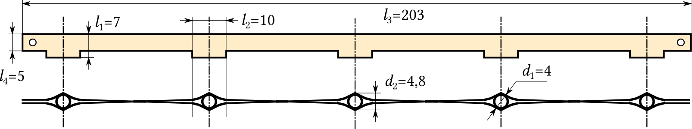

Рис. 1. Сборочный чертеж контактной пластины
удлинителя

Цель моделирования
– определение параметров допустимого
нагрева контактного соединения в
зависимости от его сопротивления, тока
нагрузки и размеров теплопроводящих
элементов удлинителя.

При прохождении
тока в проводнике часть выделенной
теплоты используется для повышения его
температуры в контактном соединении и
электроизоляции, а другая часть
рассеивается в атмосферу, повышая
температуру изоляции электропроводки
и корпусных деталей.

Стационарный режим
нагрева, при котором температура
проводника в месте контактного соединения
достигает постоянного значения,
обусловлен значением тока, переходного
сопротивления и условиями теплоотдачи.

За время τ, с, в проводнике выделяется
теплота:
<table class="numeq">
  <tr>
    <td>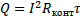</td>
    <td>(1)</td>
  </tr>
<table>

где <i>Q</i> – количество выделяемой теплоты в
проводнике, Дж; 
<i>I</i> – длительно допустимый ток, А; 
<i>R</i>конт – переходное сопротивление контактного
соединения, Ом.

Баланс выделяемой
теплоты <i>Q</i>
распределяется на нагревание проводника
и отдачу теплоты в окружающую среду с
поверхности контактного соединения:
<table class="numeq">
  <tr>
    <td>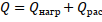</td>
    <td>(1)</td>
  </tr>
<table>

где <i>Q</i>нагр
– количество теплоты, затраченной на
нагревание проводника вместе контактного
соединения, Дж.
<table class="numeq">
  <tr>
    <td>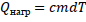</td>
    <td>(3)</td>
  </tr>
<table>

<i>c</i>
– теплоемкость материала проводника,
Дж/(кг·К); 
<i>m</i> – масса проводника, кг; 
<i>Q</i>рас
– количество теплоты, затрачиваемой в
контактном соединении на излучение с
поверхности проводника, конвекцию и
теплопроводность, Дж:
<table class="numeq">
  <tr>
    <td>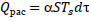</td>
    <td>(4)</td>
  </tr>
<table>

α – коэффициент
теплоотдачи с поверхности проводника,
Вт/(м2·К); 
<i>S</i> – площадь теплоотдающей поверхности
проводника, м2; 
<i>T</i>S – температура поверхности проводника, К.

В формуле (4) наиболее
сложно определяется коэффициент
теплоотдачи α
с поверхности проводника. Следует
отметить, что α зависит от большого
количества различных факторов: формы
и размеров тела, давления и скорости
движения окружающей среды, физических
свойств среды и др., но самое главное,
как показали дальнейшие эксперименты,
с увеличением тока нагрузки удлинителя
растет также и α,
причем этот рост имеет нелинейный
характер в зависимости от количества
выделяемой мощности <i>P</i>.

В определенных
условиях доля лучистого теплообмена
может составлять до 30% <a href="#ref9">[9]</a>.

По закону Ньютона
количество теплоты, отдаваемой единицей
поверхности тела в единицу времени,
пропорционально разности температур
поверхности проводника <i>T</i><i>S</i>
и окружающей среды <i>T</i>C:
<table class="numeq">
  <tr>
    <td>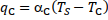, Вт/м2</td>
    <td>(5)</td>
  </tr>
<table>
где αC – конвективный
коэффициент теплоотдачи, Вт/(м2·К); 
<i>T</i>C – температура окружающей среды, К.

В работе <a href="#ref\1">[\1]</a> выводились
аналитические зависимости по определению
αC
в диапазоне
температур от 20 до 140 °С. Предполагалось,
что контактное соединение представлено
в виде горизонтального проводника
(цилиндра) длиной<i>
l</i>, м, и диаметром
<i>d</i>,
м. Получение аналитических зависимостей
основано на формулах для безразмерных
коэффициентов теплоотдачи.

Общими недостатками
такого подхода можно назвать:
- для расчета αC
необходимо
заранее знать температуру установившегося
перегрева проводника в контактном
соединении <i>Т</i>уст;
- отличие формы
контактных пластин от цилиндра.

Поэтому ставилась
задача сопоставить расчетный метод с
результатами эксперимента по определению
температуры нагрева контактных пластин
удлинителя и скорректировать коэффициент αC
 так, чтобы экспериментальные кривые
нагрева во времени совпадали с
теоретическими.

С учетом уравнений
(1),(3), (4) выражение (2) примет вид:
<table class="numeq">
  <tr>
    <td>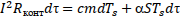</td>
    <td>(6)</td>
  </tr>
<table>

Переходя к диффуравнению с разделяющимися
переменными:
<table class="numeq">
  <tr>
    <td>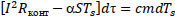</td>
    <td>(7)</td>
  </tr>
<table>

После интегрирования (7):
<table class="numeq">
  <tr>
    <td>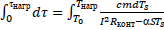</td>
    <td>(8)</td>
  </tr>
<table>

Установившая температура нагрева проводника в
контактном узле <i>T</i>устполучена
из (6) с учетом того, что в этом режиме
<i>cmdT</i>s = 0:
<table class="numeq">
  <tr>
    <td>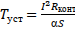</td>
    <td>(9)</td>
  </tr>
<table>

Первоначально,
учитывая сложность зависимости α =
α(<i>Т</i>s),
решение (6) получим при допущении α=const.
Интегрируя (8), находим зависимость
температуры нагревания проводника в
месте контактного соединения <i>T</i>нагр.
от времени:
<table class="numeq">
  <tr>
    <td>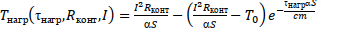</td>
    <td>(10)</td>
  </tr>
<table>
С учетом (9):
<table class="numeq">
  <tr>
    <td>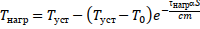</td>
    <td>(11)</td>
  </tr>
<table>

где <i>T</i>0–начальная
температура нагрева проводника в месте
контактного соединения, К; 
τнагр – время нагрева, с.

## 2. Расчетно-экспериментальный метод определения температуры срабатывания датчиков термореле защиты удлинителя

Коэффициент α
наиболее точно можно определить путем
экспериментального исследования нагрева
контактной пластины удлинителя, поместив
термопару <i>Pt</i>100
(рис. 4) вблизи точки локального нагрева
контактного соединения - места установки
вилки электроприемника.

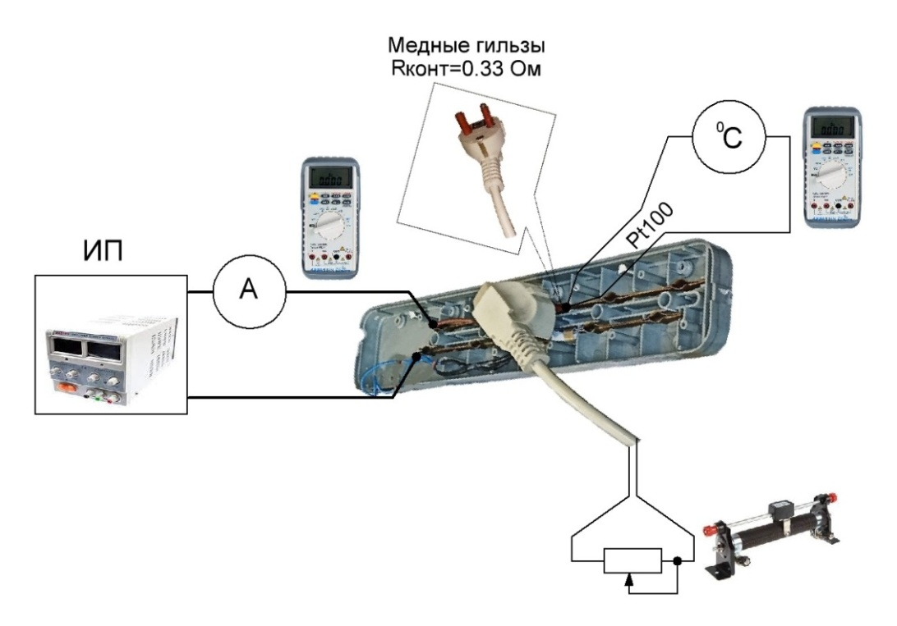

Рис. 1. Рабочее место для экспериментального
исследования нагрева контактной пластины удлинителя

Источник
питания постоянного тока (ИП) с
регулируемым уровнем напряжения
подключен к контактным пластинам
удлинителя через амперметр.  Требуемое
сопротивление <i>R</i>конт
контактного соединения вилка – пластины
обеспечено за счет медных гильз,
предварительно окисленных бытовым
аммиаком.
Вилка подключена к омической нагрузке
– реостату, обеспечивающей протекание
через контактное соединение заданной
силы тока. Критерием окончания эксперимента
принято значение скорости
возрастания температуры ≤ 0,1 0С/мин.

Рассмотрим особенности
расчета на примере токовой нагрузки
<i>I</i>нагр
= 3 А. Сопротивление контактного соединения
принимаем <i>R</i>конт
= 0,33 Ом, мощность, выделяемая в контактном
соединении <i>P</i>
= <i>I</i>2<i>R</i>конт
= 2,97 Вт, а <i>T</i>0
= 25,3 °С. Путем параметрического анализа
определены коэффициент α
= 11,57, Вт/(м2·К)
и зависимость <i>T</i>нагр(τнагр)
– рис. 5,  согласно (9) – <i>Т</i>уст
= 107,4 °С.

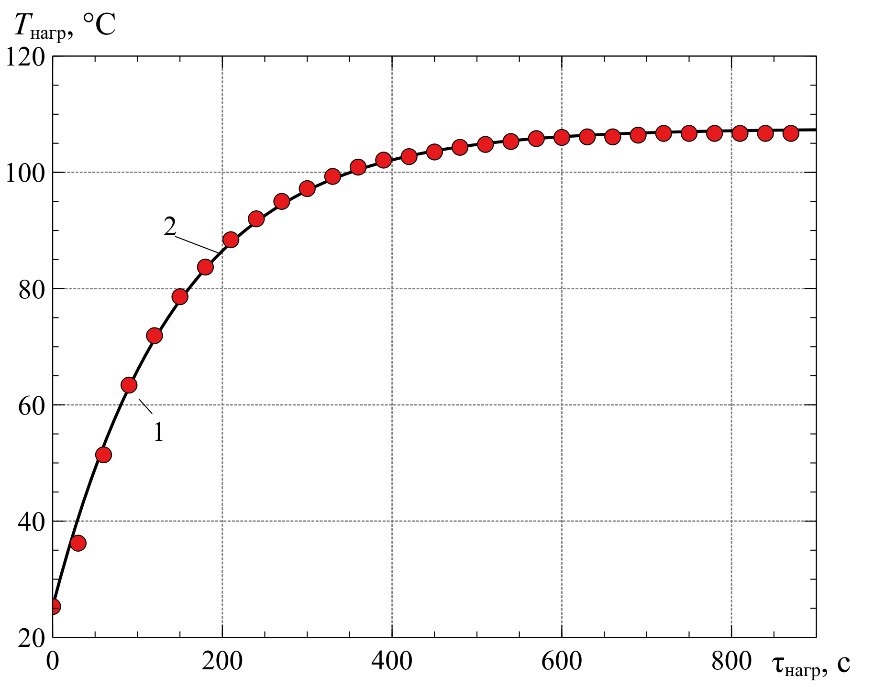

Рис. 5. Зависимость
температуры нагрева проводника в месте
контактного соединения от времени (1-
эксперимент, 2 - теория)

Аналогично,
при варьировании <i>I</i>нагр=
2..16 А, <i>R</i>конт
= 30..330 мОм определены значения <i>T</i>уст<i>
(</i><i>P</i><i>,
</i><i>R</i>конт<i>)</i>и
уравнение регрессии α(<i>P</i>)
– табл. 1, рис. 6.

<table dir="ltr" width="576" cellpadding="7" cellspacing="0" style="text-align: center">
  <caption>Таблица 1 – Расчетные
и экспериментальные данные</caption>
  <col width="41"/>
  <col width="43"/>
  <col width="33"/>
  <col width="194"/>
  <col width="75"/>
  <col width="104"/>
  <tr>
    <td rowspan="2" style="border: 1px solid #000000">
      <i>R</i>конт,
      мОм
    </td>
    <td rowspan="2" style="border: 1px solid #000000">
      <i>P</i>,
      Вт
    </td>
    <td rowspan="2" style="border: 1px solid #000000">
      <i>I</i>,
      А
    </td>
    <td rowspan="2" style="border: 1px solid #000000">
      α = 
Вт/
      (м2К)
    </td>
    <td colspan="2" width="193" style="border: 1px solid #000000">
      <i>T</i>уст,
        °C
    </td>
  </tr>
  <tr valign="top">
    <td style="border: 1px solid #000000">
      <i>теория</i>
    </td>
    <td style="border: 1px solid #000000">
      <i>эксперимент</i>
    </td>
  </tr>
  <tr valign="top">
    <td height="61" style="border: 1px solid #000000">
      330
    </td>
    <td style="border: 1px solid #000000">
      1,3 
      2,97 
      5,3 
      11,9 
      21,1
    </td>
    <td style="border: 1px solid #000000">
      2 
      3 
      4 
      6 
      8
    </td>
    <td style="border: 1px solid #000000">
      8,485 
      11,57 
      14,667 
      22,489 
      28,451
    </td>
    <td style="border: 1px solid #000000">
      64,8 
      106,7 
      152,3 
      221 
      319
    </td>
    <td style="border: 1px solid #000000">
      66,6 
      107,4 
      152,5 
      - 
      310,3
    </td>
  </tr>
  <tr valign="top">
    <td style="border: 1px solid #000000">
      100
    </td>
    <td style="border: 1px solid #000000">
      1,6 
      3,6 
      6,4 
      10 
      14,4 
      19,6
    </td>
    <td style="border: 1px solid #000000">
      4 
      6 
      8 
      10 
      12 
      14
    </td>
    <td style="border: 1px solid #000000">
      8,986 
      12,172 
      16,176 
      20,541 
      24.679 
      27,872
    </td>
    <td style="border: 1px solid #000000">
      74,55 
      123,85 
      165,6 
      203,85 
      244,3 
      294,46
    </td>
    <td style="border: 1px solid #000000">
      - 
      - 
      - 
      - 
      - 
      -
    </td>
  </tr>
  <tr valign="top">
    <td style="border: 1px solid #000000">
      30
    </td>
    <td style="border: 1px solid #000000">
      1,9 
      3 
      4,3 
      5,88 
      7,68
    </td>
    <td style="border: 1px solid #000000">
      8 
      10 
      12 
      14 
      16
    </td>
    <td style="border: 1px solid #000000">
      9,51 
      11,245 
      13,223 
      15,473 
      17,829
    </td>
    <td style="border: 1px solid #000000">
      84,5 
      111,71 
      136,8 
      159,12 
      180,37
    </td>
    <td style="border: 1px solid #000000">
      - 
      - 
      - 
      - 
      -
    </td>
  </tr>
</table>

Итоговым
результатом расчетов по данной методики
стала характеристика:

<i>T</i>уст<i>(</i><i>P</i>)=0,0421·<i>P</i>3
– 1,6795·<i>P</i>2
+29,949·<i>P</i>
+ 32,936 (12)

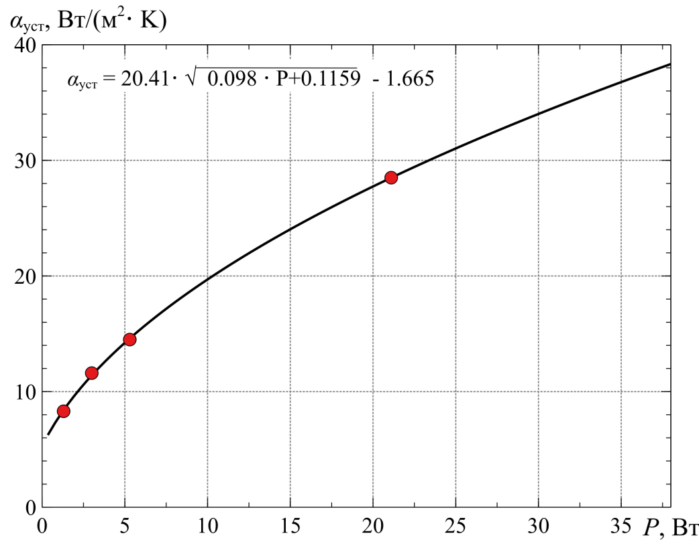

Рис. 6. Зависимость коэффициента теплоотдачи
от рассеиваемой мощности в контактном узле

Она позволяет
рассчитывать <i>Т</i>уст
при любых
сочетаниях <i>I</i>нагр
и <i>R</i>конт
для указанного типа удлинителей (рис.
7).

Согласно ГОСТ
Р51539-99<a href="#ref\1">[\1]</a> в нормальном режиме в удлинителях,
имеющих соединения между неподвижными
и подвижными частями, должно выполняться
<i>R</i>конт0,05
Ом. В проведенных нами экспериментах
<i>R</i>конт
не превышало 0,02 Ом, тогда при <i>I</i>нагр
= 10 А из (12) получим <i>T</i>уст
= 86,5 °С. Выбрано термореле ThermalFuseSeries с
температурой действия 95±5° С и температурой
возврата 70±10°С.

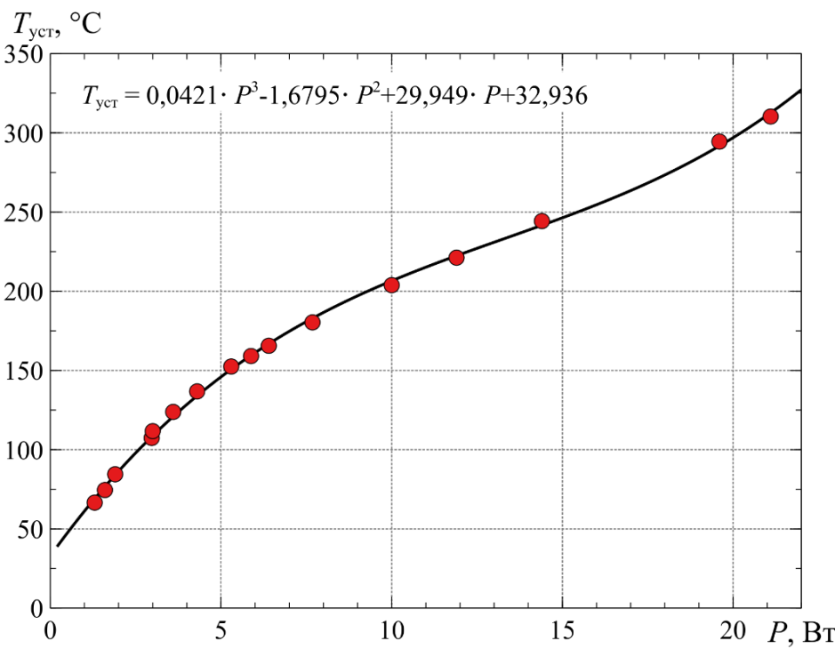

Рис. 7. Зависимость
установившейся температуры нагрева
проводника от рассеиваемой мощности в
контактном узле

## 3. Описание схемы защиты

Реализация
электрической
схемы защиты
удлинителя от перегрева контактного
соединения представлена на рис. 8.
Подключение удлинителя к электрической
цепи сетевого питания осуществляется
за счет вилки <i>ХТ</i>,
смонтированной в конце провода.

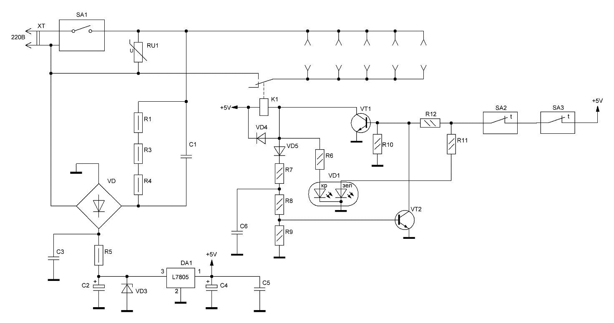

Рис. 8 –
Схема электрическая принципиальная удлинителя
с дополнительной защитой

Защитный выключатель
<i>SA</i>1
типа <i>ST</i>001
предназначен как для механического
снятия напряжения у потребителя, так и
отключения при превышении нагрузкой
силы тока 10А.

Защита от импульсных
перенапряжений сформирована на базе
варистора <i>RU</i>1
(на амплитудный уровень 470 В) и защитного
выключателя <i>SA</i>1
(защитное устройство варистора вместо
предохранителя). 

Для обеспечения
стабилизированного питания собственных
нужд элементов защиты, применен линейный
преобразователь напряжения <i>DA</i>1
с выходным напряжением постоянного
тока 5 В. Ограничение рассеиваемой
мощности на стабилизаторе в номинальных
режимах работы (не более 0,2 Вт) схемы
обеспечивает параметрический стабилизатор
на 8,2 В (<i>VD</i>3,
<i>R</i>5).

Для снижения
напряжения уровня сети и его выпрямления
за счет диодного моста <i>VD</i>
применен источник питания с гасящим
конденсатором <i>С</i>1
и разрядными резисторами <i>R</i>1,
<i>R</i>3,
<i>R</i>4
(на
конденсаторе может долго присутствовать
напряжение даже после отключения от
сети). Также
в схеме предусмотрен сглаживающий
конденсатор <i>С</i>2
и фильтрующие пульсации в цепи 5В
конденсаторы <i>С</i>4,
<i>С</i>5.

Для замера температуры
нагрева медных пластин розеток удлинителя
применены два термореле <i>SA</i>2,
<i>SA</i>3
с порогом срабатывания 95±5° С (каждое
реле устанавливается на свою медную
пластину). Узел контроля состояния
контактов <i>SA</i>2,
<i>SA</i>3
с исполнительным реле <i>К</i>1
и светодиодной индикацией <i>VD</i>1
состоит из <i>VT</i>1,
<i>VT</i>2,
<i>VD</i>5,
<i>R</i>7…<i>R</i>9,
<i>R</i>10,
<i>R</i>11.
В данной схеме реализована блокировка
подачи напряжения нагрузке при перегреве
одного из контролируемых контактных
соединений. Это предотвращает
самовосстановление схемы устройства,
 а также способствует выявлению и
устранению причин нарушения его
нормальной работы.

<i>RC</i>
цепочка <i>R</i>7,
<i>С</i>6
обеспечивает необходимую задержку
сигнала на подхват (снижает вероятность
ложных срабатываний при подаче питания
на удлинитель, сбросе защиты и т.д). 

Схема защиты работает
следующим образом. В момент включения
удлинителя кнопкой <i>SA</i>1
формируется напряжение собственных
нужд 5В, но при этом напряжение в розетках
отсутствует (реле <i>К</i>1
отключено). Если отсутствует превышение
температуры выше допустимого на обоих
термореле транзистор <i>VT</i>1
открывается и включает реле <i>К</i>1,
тем самым подает напряжение к нагрузке
через розетки удлинителя. Зеленый
светодиод светится, а красный – нет
(зашунтирован коллектором <i>VT</i>1).

Транзистор <i>VT</i>2
предназначен для формирования режима
«защелка» при срабатывании защиты. Пока
транзистор <i>VT</i>1
открыт, потенциал его коллектора притянут
к общей цепи (шунтирование красного
светодиода и базы <i>VT</i>2).

В случае превышения
температуры одного из термореле
(размыкание его контакта) зеленый
светодиод гаснет, транзистор <i>VT</i>1
закрывается (реле <i>К</i>1
отключается – нагрузка обесточивается),
красный светодиод загорается, транзистор
подхвата <i>VT</i>2
открывается и своим коллектором шунтирует
базу <i>VT</i>1,
принудительно закрывая его. В этом
случае, при восстановлении температуры
(сработавшее термореле включается)
загорается зеленый светодиод (поскольку
зеленый и красный в одном корпусе, то
при одновременном свечении двух цветов
получается желтый цвет) включение реле
<i>К</i>1
не происходит из-за подхвата <i>VT</i>2.

Сброс защиты
произойдет только отключением и повторным
включением кнопки <i>SA</i>1.

Особенности индикации защиты:
- зеленый – температура
в норме, сеть к нагрузке подана;
- желтый – температура
снизилась (в норме), в устройстве
необходимо сбросить защиту (пока не
будет светиться желтый - сбросить защиту
невозможно);
- красный – температура
поднялась выше допустимой, сеть к
нагрузке отключена.

## Выводы

1. В электроустановках
  жилых и общественных зданий низкого
  напряжения распространена причина
  пожаров, вызванная контактным нагревом.
  Удлинительные шнуры являются частой
  причиной возгораний, и в них предлагается
  использовать способ обнаружения
  «горячих» точек, предполагающий установку
  термодатчиков, которые внедряют в
  потенциально опасных местах (чаще всего
  на соединительных клеммах или зажимах).
2. Впервые предложены
  удобные для инженерных расчетов формулы
  для определения установившейся
  температуры нагрева контактных пластин
  удлинителя в зависимости от количества
  выделяемой мощности на примере типового
  5 розеточного удлинителя с номинальным
  током 10 А.
3. Путем разработанного
  расчетно-экспериментального метода
  определена температура срабатывания
  датчиков термореле защиты удлинителя
  от перегрева его контактных соединений
  (95±5° С) при различных сочетаниях <i>I</i>нагр
  и <i>R</i>конт
  для указанного в п. 2 типа удлинителя.
4. В схеме защиты
  реализована блокировка подачи напряжения
  нагрузке при перегреве одного из
  контролируемых контактных соединений.
  Это предотвращает самовосстановление
  схемы устройства, а также способствует
  выявлению и устранению причин нарушения
  его нормальной работы. Световая индикация
  позволяет определить все возможные
  режимы дополнительной защиты удлинителя,
  которая может располагаться в
  технологических полостях конструкции
  его корпуса.

## Список источников

<ol>
  <li>Бершадский, И. А.
Обоснование способа защиты электрической
сети напряжением 220 В от перегрузок с
учетом нестационарного нагрева
электропроводки [Электронный ресурс]
/ И. А. Бершадский, А. В. Згарбул,А. А. Кулиш
// Вестник Донецкого национального
технического университета. — 2019. —
2(16). — С. 71—79.
  </li>
  <li>European
statistics and potential fire safety measures, Final report, January
2009.
  </li>
  <li>Бершадский, И. А.
Анализ статистики пожаров по
электротехническим причинам и состояния
устройств защиты в сетях 0,4 кВ [Текст] /
И. А. Бершадский, А. В. Згарбул // Пожарная
безопасность. — 2017. — № 4. — С. 119—125.
  </li>
  <li>Hadziefendic,N.Thermal imaging of poor contacts and AFCI technique
for series arc breaking [Text] /N. Hadziefendic, M. Kostic, J.
Trifunovic // Proceedings of II Fire Safety Consulting. —  Belgrade
(in Serbian). — 2012. —  P. 25–42.
  </li>
  <li>SINTEF,
Fire in electrical installations, Norwegian Institute of Technology,
January 28, 2008.
  </li>
  <li><a href="https://www.researchgate.net/profile/Jj-Shea">J.J.
Shea</a>, US Patent No. 8,854,066 (3 Oct, 2014). Method and apparatus
for detecting a glowing contact in a power circuit - Режимдоступа
https://patents.google.com/patent/WO2013151626A1/en. - Загл. c
экрана.
  </li>
  <li>NedzadHadziefendic. The influence of poor electrical contacts on the
occurrence of initial fire and a method for their detection in
low-voltage electrical installations [Text] :Doctoral
Dissertation–Belgrade : UniversityofBelgrade,
schoolofelectricalengineering, 2019. – 237 c.
  </li>
  <li>Solyonyj,
S. Automatic System of Monitoring and Diagnostics of Sparking in
Contact [Text] / S. Solyonyj, O. Solenaya and Andrey Roznhin // MATEC
Web of Conferences&nbsp;77, 12003 . – 2016. –  P. 1–5.
  </li>
  <li>Зинченко, E.О.
Температура нагревания проводников в
контактных соединениях электроустановок[Текст]
/ Научный вестник НИИГД «Респиратор».–2017.
– № 3(54). – С. 36-47.
  </li>
  <li>Удлинители бытового
и аналогичного назначения на кабельных
катушках. Общие требования и методы
испытаний: ГОСТ 31223-2012 (IEC 61242:1995). Введ.
01.01.2014. Москва: Росстандарт, 2014. 52 с.
  </li>
</ol>
