# Реферат по теме выпускной работы

<h2>Содержание</h2>

<ul class=content>
  <li class=ct1><a href="#p1">1. Применение устройств защитного отключения в схемах электроснабжения 220/380 В</a>
  <li class=ct1><a href="#p2">2. Классификация УЗО</a>
  
  <li class=ct1><a href="#p3">3. Место установки и назначение УЗО</a>
  
  <li class=ct1><a href="#ref">Список источников</a>
</ul>

## 1. Применение устройств защитного отключения в схемах электроснабжения 220/380 В

Функционально УЗО можно определить как быстродействующий
защитный выключатель, реагирующий на
дифференциальный ток в проводниках,
подводящих электроэнергию к защищаемой
электроустановке.

Принцип действия УЗО дифференциального типа
основан на применении электромагнитного
векторного сумматора токов -
дифференциального трансформатора тока.
Основные
функциональные блоки УЗО представлены
на рисунке 1 <a href="#ref1">[1]</a>.

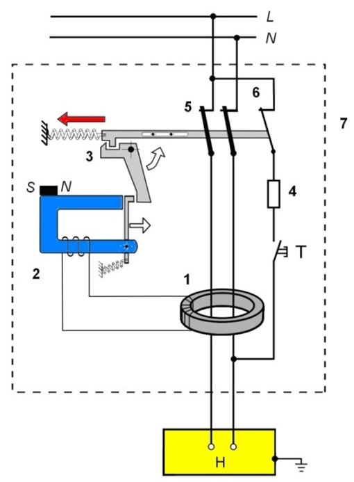

Рисунок 1 – Структурная схема УЗО: 
<i>1 – дифференциальный ТТ; 2 – пороговый
элемент; 3 – исполнительный механизм;
4 – тестовый резистор; 5 – силовые
контакты; 6 – защитный контакт цепи
тестирования.</i>

Сравнение текущих значений двух и более (в
четырехполюсных УЗО - 4-х) токов по
амплитуде и фазе наиболее эффективно,
т.е. с минимальной погрешностью,
осуществляется электромагнитным путем
- с помощью дифференциального трансформатора
тока (рис.2) <a href="#ref1">[1]</a>.

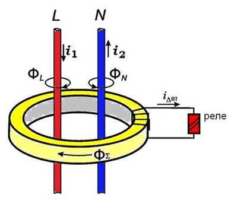

Рисунок 2 – Дифференциальный трансформатор тока.

Дифференциальный трансформатор тока
является важнейшим функциональным блоком УЗО.
В абсолютном большинстве УЗО, производимых
и эксплуатируемых в настоящее время во
всем мире, в качестве датчика
дифференциального тока используется
именно трансформатор тока.

В литературе по вопросам конструирования
и применения УЗО этот трансформатор
иногда называют трансформатором тока
нулевой последовательности - ТТНП, хотя
понятие «нулевая последовательность»
применимо только к трехфазным цепям и
используется при расчетах несимметричных
режимов многофазных цепей.

В нормальном режиме, когда нет тока
замыкания на землю, токи в фазном и
нулевом рабочем проводниках (проводах)
равны по значению, но противоположны
по знаку. Если обозначить ток, протекающий
по направлению к нагрузке как <i>i</i><i>1</i><i>,</i>
а ток от нагрузки <i>i</i><i>2</i>
(рис. 2),
то можно записать равенство: <i>i</i><i>1</i><i>=i</i><i>2</i><i>.</i>

Суммарный магнитный поток в сердечнике - ФƩ,
пропорциональный разности токов<i>
i</i><i>1</i>
и <i>i</i><i>2</i>,
в проводниках, являющихся первичными
обмотками трансформатора, наводит во
вторичной обмотке трансформатора тока
<i>ЭДС</i>,
под действием которой в цепи вторичной
обмотки протекает ток <i>i</i><i>Δ</i><i>вт</i>,
также пропорциональный разности
первичных токов. В нормальном режиме
ЭДС  равна нулю (с незначительной
погрешностью) и поэтому реле не
срабатывает.

Следует отметить, что к магнитному сердечнику
трансформатора тока электромеханического
УЗО предъявляются чрезвычайно высокие
требования по качеству - высокая
чувствительность, линейность характеристики
намагничивания, температурная и временная
стабильность и т. д.

По этой причине для изготовления сердечников
трансформаторов тока, применяемых при
производстве УЗО, используется специальное
высококачественное аморфное
(некристаллическое) железо.

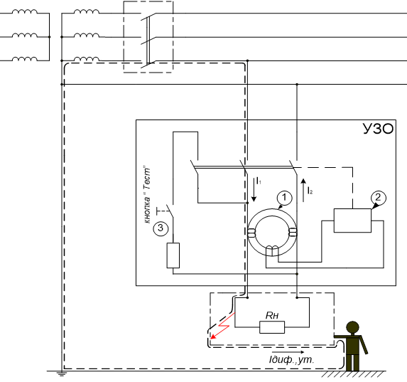

Рисунок 3 – Принцип появления тока утечки при
повреждении изоляции или касания
человеком токоведущих частей: 
1. дифференциальный трансформатор;
2. исполнительное реле; кнопка тестирования (опробования работоспособности)

В случае возникновения тока утечки <i>i</i><i>дифут</i>,
например при касании человеком токоведущих
частей, величина токов, текущих по
нулевому и по фазному рабочим проводникам,
становится неравной  (см.рис. 3 )

Это
приводит к нарушению баланса токов
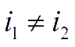,
т.к.
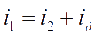
и появлению разностного (дифференциального)
тока в обмотке реле. При превышении
дифференциальным током заданного порога
реле срабатывает и разрывает своими
контактами силовую цепь. 

Для осуществления периодического контроля
работоспособности (исправности) УЗО
предусмотрена цепь тестирования. При
нажатии кнопки “Тест” искусственно
создается отключающий дифференциальный
ток, вызывающий срабатывание УЗО.

В соответствии с п. 1.7.42. ПУЭ установка УЗО
может быть рекомендована как временная
мера повышения безопасности до проведения
полной реконструкции системы
электроснабжения в соответствии с
современными требованиями <a href="#ref1">[2]</a>.

## 2. Классификация УЗО

На основании обзора технической литературы
в работе выполнена классификация
известных модификаций устройств УЗО,
результаты которой приведены в табл. 1.

Таблица 1 - Классификация устройств защитного
отключения

<table width="90%" cellpadding="7" cellspacing="0">
	<col width="20%"/>
	<col width="30%"/>
	<col width="30%"/>
	<tr>
		<td style="border: 1px solid #000000; padding: 0cm 0.19cm">

			Признак классификации

		</td>
		<td valign="top" style="border: 1px solid #000000; padding: 0cm 0.19cm">

			Типы УЗО, разновидность

		</td>
		<td valign="top" style="border: 1px solid #000000; padding: 0cm 0.19cm">

			примечание

		</td>
	</tr>
	<tr>
		<td style="border: 1px solid #000000; padding: 0cm 0.19cm">

			По способу монтажа

		</td>
		<td valign="top" style="border: 1px solid #000000; padding: 0cm 0.19cm">

			1.Стационарные
			-  
			

			

			 
			

			

			2. Переносные  -
			

		</td>
		<td valign="top" style="border: 1px solid #000000; padding: 0cm 0.19cm">

			для установки в <a href="https://ehto.ru/montazh-elektriki/elektroshhitok/kvartirnyj-shhitok-serdtse-elektriki-kvartiry" target="_blank">распределительные
			щиты</a>
			

			

			адаптеры для установки в розетки

		</td>
	</tr>
	<tr>
		<td style="border: 1px solid #000000; padding: 0cm 0.19cm">

			По зависимости от напряжения питания

		</td>
		<td valign="top" style="border: 1px solid #000000; padding: 0cm 0.19cm">

			1. F1 - функционально независимые от
			питания

			
2.
			D1 - функционально зависимые от питания

			
3.
			HF1 - функционально условно зависимые

		</td>
		<td valign="top" style="border: 1px solid #000000; padding: 0cm 0.19cm">

			 
			

		</td>
	</tr>
	<tr>
		<td style="border: 1px solid #000000; padding: 0cm 0.19cm">

			По конструкции механизма отключения

		</td>
		<td valign="top" style="border: 1px solid #000000; padding: 0cm 0.19cm">

			1. Прямое отключение

			

			 
			

			

			2. Непрямого отключения 
			

		</td>
		<td valign="top" style="border: 1px solid #000000; padding: 0cm 0.19cm">

			 
			

			

			 
			

			

			дополнено
			контактором или автоматическим
			выключателем

		</td>
	</tr>
	<tr>
		<td style="border: 1px solid #000000; padding: 0cm 0.19cm">

			По
			количеству полюсов

		</td>
		<td valign="top" style="border: 1px solid #000000; padding: 0cm 0.19cm">

			1.
			Двухполюсные  
			

			

			 
			

			

			 
			

			

			 
			

			

			2.
			Четырехполюсные 
			

		</td>
		<td valign="top" style="border: 1px solid #000000; padding: 0cm 0.19cm">

			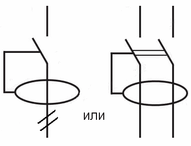

			

			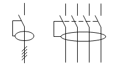

		</td>
	</tr>
	<tr>
		<td style="border: 1px solid #000000; padding: 0cm 0.19cm">

			По задержке времени отключения

		</td>
		<td valign="top" style="border: 1px solid #000000; padding: 0cm 0.19cm">

			1.Мгновенного действия 
			

			

			2. типа «G», с задержкой срабатывания

			

			3. типа «S», селективные с задержкой срабатывания  
			

		</td>
		<td valign="top" style="border: 1px solid #000000; padding: 0cm 0.19cm">

			без задержки 
			

			

			60-80 мс

			

			 
			

			

			200мс — 300 мс 
			

			

			используется как  вводное, противопожарное УЗО

		</td>
	</tr>
	<tr>
		<td style="border: 1px solid #000000; padding: 0cm 0.19cm">

			По наличию защиты от сверхтоков

		</td>
		<td valign="top" style="border: 1px solid #000000; padding: 0cm 0.19cm">

			1. Без защиты от сверхтоков  
			

			

			 
			

			

			2.С защитой от сверхтоков

		</td>
		<td valign="top" style="border: 1px solid #000000; padding: 0cm 0.19cm">

			«дифференциальное
			реле» (QD)

			

			УЗО+автомат,
			 «дифференциальный автомат»

			

			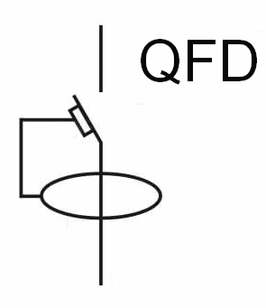

		</td>
	</tr>
	<tr>
		<td style="border: 1px solid #000000; padding: 0cm 0.19cm">

			По
			параметрам

		</td>
		<td valign="top" style="border: 1px solid #000000; padding: 0cm 0.19cm">

			Номинальный ток, А

			
16,
			20, 25, 32, 40, 63, 80, 100

			
Номинальный
			отключающий дифференциальный ток
			(мА)

			
10,
			30, 100, 300, 500 
			

		</td>
		<td valign="top" style="border: 1px solid #000000; padding: 0cm 0.19cm">

			 
			

			
 
			

			
уставка
			УЗО 
			

		</td>
	</tr>
	<tr>
		<td style="border: 1px solid #000000; padding: 0cm 0.19cm">

			По
			току применения

		</td>
		<td valign="top" style="border: 1px solid #000000; padding: 0cm 0.19cm">

			 
			

			
Тип
			АС — чувствительно к переменному
			синусоидальному току

			
Тип
			A — чувствительно к переменному и
			пульсирующему постоянному току

			
Тип
			В — чувствительно к переменному и
			пульсирующему постоянному и сглаженному
			постоянному току

		</td>
		<td valign="top" style="border: 1px solid #000000; padding: 0cm 0.19cm">

			Обозначение

			

			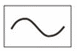

			

			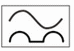

			

			 
			

			
 
			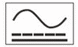

		</td>
	</tr>
</table>

## 3. Место установки и назначение УЗО

На рис. 4 показана функциональная схема с
использованием УЗО типа «дифференциальное
реле», предназначенного для защиты
группы потребителей, обозначенных как
«нагрузка». Устройства в таком исполнении
выпускаются различными производителями
и широко представлены на рынке. Для
защиты от сверхтоков необходимо
предусмотреть отдельный защитный
аппарат, например автоматический
выключатель. В схеме2 используется УЗО
типа «дифференциальный автомат»,
совмещающий функции защиты от токов КЗ
и токов утечки.

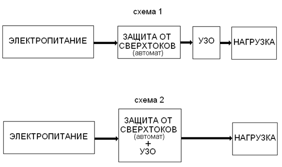
</img>

Рисунок 4 - структурные схемы включения группового
УЗО с защитой от сверхтоков и без защиты

Достоинство <i>Схемы 1</i>:
возможность просто идентифицировать
причину отключения питания нагрузки.
При появлении токов утечки срабатывает
УЗО, при других повреждениях защитный
автомат. К недостаткам Схемы 1многие
специалисты монтажных организаций
относят повышение стоимости комплектующих,
по сравнению со <i>Схемой 2.</i>
В обеих вариантах схемы устройство
используется как аппарат групповой
защиты. По этой причине отсутствует
селективность их действия - при повреждении
одного из элементов, отключается вся
нагрузка, что усложняется поиск места
повреждения и снижает надежность
электроснабжения. Групповое УЗО может
иметь только одну уставку срабатывания
по величине дифференциального тока.
При использовании УЗО с токами 10, 30 мА
– реализуется схема защиты человека
от прикосновения к неизолированным
токоведущим частям, а при токах 100, 300 мА
– противопожарная защита.

С целью устранения этого недостатка и
расширения функциональных возможностей
защиты предлагается схема 3, приведенная
на рис. 5.

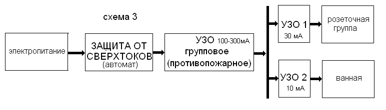

Рисунок 5 – функциональная схема защиты с групповым
вводным автоматом, групповой 
противопожарной и индивидуальной 
защитой отдельных групп потребителей

В данной схеме использованы УЗО с различными
уставками: для групповой противопожарной
защиты – 100-300 мА, для розеточной группы
– 30 мА, а для помещения с повышенной
опасностью (ванная) – 10 мА. Групповое
исполнение противопожарной защиты
широко используется на практике и может
быть принято как типовое решение на
сегодняшний день. Однако использование
группового защитного автомата сохраняет
все недостатки предыдущей схемы.

Наиболее совершенный, но и более дорогой вариант
схемы монтажа УЗО показан на рис 6.
(<i>схема
4)</i>

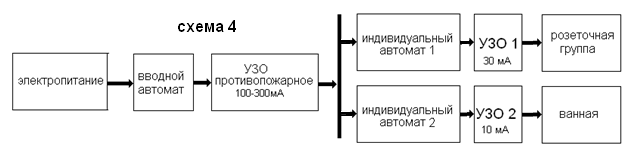

Рисунок 6 – схема с индивидуальными защитными
аппаратами для отдельных групп
потребителей

В <i>схеме 4</i> используется принцип индивидуальной
защиты групп потребителей. При повреждениях
в одном из элементов отключается только
эта группа, а питание остальной нагрузки
сохраняется. Количество групп потребителей
зависит от конкретных условий и может
быть увеличено (например, освещение,
разбивка по комнатам и т.д.). Номинальный
ток индивидуальных автоматов выбирается
исходя из рабочих токов нагрузки
отдельной группы, поэтому он оказывается
ниже, чем у группового вводного автомата.
По этой причине чувствительность
индивидуального автомата к токам КЗ по
сравнению с чувствительностью группового
вводного автомата оказывается выше.
Схема 4 отличается гибкостью, но является
и самой дорогой. Особенность схемы:
групповой вводной автомат, как правило,
многополюсный, а индивидуальные автоматы
однополюсные. 

Согласно требованиям  ПУЭ (п 1.7.145. ПУЭ):

«Не допускается включать коммутационные
аппараты в цепи PE- и PEN-проводников, за
исключением случаев питания
электроприемников с помощью штепсельных
соединителей. Допускается также
одновременное отключение всех проводников
на вводе в электроустановки индивидуальных
жилых, дачных и садовых домов и аналогичных
им объектов, питающихся по однофазным
ответвлениям от ВЛ. При этом разделение
PEN-проводника на PE- и N-проводники должно
быть выполнено до вводного
защитно-коммутационного аппарата».

Типовые схемы монтажа групповых и индивидуальных
автоматов приведены на рис.7.

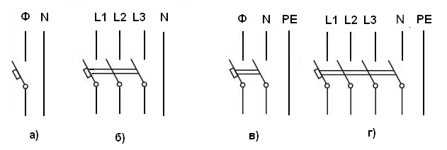

Рисунок 7 – схемы включения группового вводного
автомата 
а) однофазная схема, сеть TN-C;
б) трехфазная схема сеть TN-C;
в) однофазная схема, сеть TN-S;
г) трехфазная схема, сеть TN-S

Принцип действия УЗО требует, чтобы нулевой
проводник обязательно подключался к
этому устройству. В зависимости от
количества используемых фаз и
типоисполнения УЗО возможны следующие
схемы его включения (см. рис. 8)

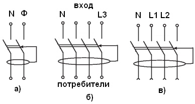

Рисунок 8 - схемы включения УЗО: а) однофазный
потребитель , аппарат 2х полюсный; б) –
однофазный потребитель, аппарат 4х
полюсный; в) трехфазный потребитель,
аппарат 4х полюсный.

Исходя из указанного выше требования п. 1.7.145
ПУЭ следует, что в сети с совмещенным
рабочим и защитным нулем (сеть TN-C)
использование УЗО типа «дифференциальный
автомат» в качестве вводного коммутационного
устройства запрещено. 

В многоквартирных жилых домах УЗО
рекомендуется устанавливать в групповых,
в том числе квартирных щитках, допускается
их установка в этажных распределительных
щитках, в индивидуальных домах - во ВРУ
и этажных распредщитках. В коттеджах
при использовании радиальных схем 
электроснабжения со значительным
количеством отходящих групп рекомендуется
установка общего на вводе и отдельного
УЗО на каждую группу (потребитель) при
условии соответствующего выбора
параметров УЗО, обеспечивающих
селективность их действия. В этом случае
на концевых участках сети устанавливаются
УЗО мгновенного действия, а вводе УЗО
с выдержкой времени. 

В особо опасных помещениях, для ответственных
и конечных потребителей дополнительно
применяются УЗО, встроенные в розеточные
блоки. Для переносных электроприборов
и электроинструмента рекомендуется
использовать УЗО-розетки и УЗО-вилки,
входящие в комплект электроприборов,
или в виде шнура-удлинителя.

<h2>Список источников</h2>
<ol>
  <li>Штепан Франтишек «Устройства защитного отключения, управляемые дифференциальным током» Прага, 2000, 90 с; с ил.
  </li>
  <li>Национальный стандарт российской федерации ГОСТ Р 50571.3-2009 (МЭК 60364-4-41:2005) «Электроустановки низковольтные Часть 4-41 Требования для обеспечения безопасности. Защита от поражения электрическим током» Москва Стандартинформ, 2012 – 26 с. URL: http://electrozamer.com/downloads/lib/gost-r-50571.3-2009.pdf (дата обращения: 22.09.2022)
  </li>
  <li>ABB «RCDs: the best way to guarantee eletrical safety at home» Copyright 2012 ABB, 2CSC420003B0201 - 09/2012 – 32 р. URL: https://www.voltimum.com.tr/sites/www.voltimum.com.tr/files/experts-area/answer-attachments/2csc420003b0201_rcd_pocket_guide.pdf (дата обращения: 22.05.2022]
  </li>
  <li>ГОСТ 12.1.038-82 Система стандартов безопасности труда (ССБТ). Электробезопасность. Предельно допустимые значения напряжений прикосновения и токов (переиздание июнь 2001 г.)
  </li>
  <li>Монаков В. К. «УЗО. Теория и практика.» - М.: ЗАО «Энергосервис», 2007. – 368 с.
  </li>
  <li>Ильинов С.С., Степанюк А.Н. Исследование устройств защитного отключения // Научное сообщество студентов XXI столетия. Технические науки: сб. ст. по мат. XXVIII междунар. студ. науч.-практ. конф. № 1(27). URL: http://sibac.info/archive/technic/1(27).pdf (дата обращения: 05.19.2022).]
  </li>
  <li>Ролан Кальвас «Устройства защитного отключения по дифференциальному току нулевой последовательности в сетях низкого напряжения» Техническая коллекция Schneider Electric Выпуск №5, октябрь 2006. – 32 с.
  </li>
  <li>Жак Шонек «Защитное отключение на дифференциальном токе в сетях низкого напряжения» Техническая коллекция Schneider Electric Выпуск №25, март 2008. – 36 с.]
  </li>
  <li>Стандарт МЭК 364-4-41; ГОСТ 13109-97 Электрическая энергия. Совместимость технических средств электромагнитная. Нормы качества электрической энергии в системах электроснабжения общего назначения.
  </li>
  <li>ГОСТ Р. 50571.1-93 Электроустановки зданий. Основные положения.
  </li>
  <li>ГОСТ Р. 50571.2-94 Электроустановки зданий. Основные характеристики.
  </li>
  <li>ПУЭ  Правила устройства электроустановок (ПУЭ 7-го издания).
  https://zandz.com/ru/biblioteka/sistema_uravnivaniya_potencialov.html
  </li>
</ol>
