# Реферат по теме выпускной работы

<h2>Содержание</h2>

<ul class=content>
  <li class=ct1><a href="#p0">Введение</a>

  <li class=ct1><a href="#p1">1. Логико-вероятностный метод для оценки
электробезопасности</a>
  
  <li class=ct1><a href="#p2">2. Методы оценки электробезопасности при
использовании</a>

  <li class=ct1><a href="#p3">3. Применение Марковских случайных процессов для описания процессов поражения человека электрическим током</a>

  <li class=ct1><a href="#p4">Заключение</a>

  <li class=ct1><a href="#ref">Список источников</a>
</ul>

## Введение

Важнейшая проблема современной энергетики – создание безопасных электроустановок, при этом наиболее сложная ее часть – обеспечение безопасности промышленного электрооборудования.

Под безопасностью понимается свойства объекта не допускать ситуаций опасных для людей и окружающей среды.

Случайное явление, такое как поражение человека электрическим током, взятое как одно конкретное событие предвидеть невозможно. Однако, при массовых случайных событиях обычно возникают четкие закономерности, которые можно использовать как для оценки существующего положения, так и для прогнозирования изучаемого явления.

Количественная оценка эффективности действия средств электробезопасности может быть дана по вероятности или интенсивности поражения человека электрическим током.

Поврежденное состояние электрооборудования или кабеля, при котором в окружающей среде возникает опасный электрический источник, будем называть опасным состоянием электрооборудования, а прикосновение к нему человека – опасным состоянием среды. Под опасным состоянием средств защиты будем понимать такие их состояния, когда при случайном повреждении на защищаемом элементе происходит отказ в их срабатывании.

<b>Цель работы</b>.
Изучение и совершенствование метода расчета и прогнозирования электробезопасности оборудования, разработка алгоритма расчета вероятности поражения человека электрическим током током в распределительных сетях с изолированной нейтралью.

<b>Идея работы</b>.
Заключается в выявлении и использовании закономерностей поведения электрооборудования, средств защиты и человека в течение времени и обоснование норм надежности средств защиты, при которых вероятность поражения человека электрическим током будет соответствовать нормируемому уровню.

<b>Задачи исследования</b>:
- провести статистический анализ интервалов времени между смежными случаями поражения людей электрическим током от различных видов электрооборудования, установленного в подземных выработках угольных шахт и  определить степень риска поражения человека электрическим током от каждого вида;
- разработать математическую модель, которая позволит прогнозировать вероятность поражения человека электрическим током при эксплуатации электрооборудования;
- разработать структурную схему  замещения возможных случаев поражения человека электрическим током от различных видов электрооборудования.

<b>Актуальность</b>. Горное производство отличается особой сложностью и многообразием имеющихся потенциальных опасностей. Деятельность по обеспечению безопасных и здоровых условий труда на горном предприятии чрезвычайно сложна и неразрывно связана с выполнением производственных процессов.

В мире от электрических травм ежегодно погибают 25 тыс. чел., в том числе на производстве – 15 тыс. чел., т.е. почти 60%.

Прогнозирование таких опасных явлений, как случаи поражения человека электрическим током и разработка организационных и технических мероприятий по их снижению является одним из приоритетных направлений в развитии угольной промышленности. Это предопределило постановку задач: разработать математическую модель, которая позволит прогнозировать вероятность поражения человека электрическим током при эксплуатации электрооборудования, отличающуюся от других тем, что кроме частоты появления событий учитывается и их длительность, и разработать структурную схему замещения возможных случаев поражения человека электротоком.

Одним из действенных способов защиты людей от поражения электрическим током является система защитного отключения при возникновении опасных ситуаций: случайных прикосновений к токоведущим частям, однофазных замыканий на корпус (ОЗ) вследствие нарушения изоляции или замыканий двух различных фаз на разные корпуса.

Задача защитного отключения существенно отличается от задачи других видов релейной защиты (снижение ущерба при повреждении электроустановок, в частности при коротких замыканиях). В этих условиях надежность срабатывания защитного отключения при возникновении опасных ситуаций имеет превалирующее значение над надежностью несрабатывания при отсутствии таких ситуаций. Это привело к необходимости решения четвертой задачи, а именно, установления зависимости интенсивности поражения человека электрическим током от частоты появления замыканий на заземляющую сеть и длительности их существований, надежности средств защиты и сроков их профилактики.

## 1. Логико-вероятностный метод для оценки электробезопасности

Впервые в Макеевском научно-исследовательском институте по безопасности работ в горной промышленности (МакНИИ) были построены структурные логические схемы опасных ситуаций, которые объясняют причины, приводящие к поражению человека электрическим током. Используя понятия случайного события, теорему умножения и сложения вероятностей получены формулы, с помощью которых были определены вероятности поражения человека электрическим током при эксплуатации электрооборудования на участке угольных шахт. 

Поражение человека электрическим током от:

а) бронированого кабеля

,

где 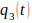 – соприкосновение человека с жилой кабеля;
    
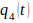 – отказ защитного отключения;

 – нахождение электрооборудования под напряжением;

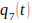 – однофазное замыкание фазы на землю;

 – обрыв заземления (наружного или внутреннего);

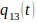 – повреждение изоляции токоведущей жилы кабеля до оголения;

б) гибкого кабеля

,

где 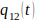 – нарушение защитной оболочки кабеля до изоляции жил;

в) коммутационных аппаратов во взрывоопасной оболочке с опасными цепями без нормально искрящих контактов 

где  – прохождение нагрузки через аппаратуру управления;

 – наличие однофазных парных замыканий на землю;

 – отказ защиты от коротких замыканий;

г) коммутационных аппаратов во взрывобезопасной оболочке с опасно искрящими контактами

,

где 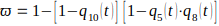;

 – прикосновение человека к токоведущим частям;

д) электродвигателей

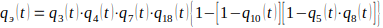.

Формулы позволяют качественно оценить уровень электробезопасности электрооборудования, применяемого на участках угольных шахт.

Достоинством модели является создание блочных вероятностных схем и математических моделей поражений человека электрическим током при различных режимах: изолированной нейтрали с защитным отключением (ИНЗО) при однофазных замыканиях на землю (ОЗЗ); изолированной нейтрали без защитного отключения (ИН).

## 2. Методы оценки электробезопасности при использовании понятия

В соответствии с [9,10] основным показателем, характеризующим уровень электробезопасности, является вероятность электропоражения человека
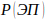
за время
.

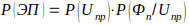,

где  – вероятность попадания человека под напряжение прикосновения
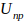;
      
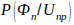 – условная вероятность такого физического состояния человека, при  котором напряжение
 при данной длительности воздействия 
 является поражающим.

Основным недостатком модели является, прежде всего, сложность определения условной вероятности 
,
особенно при случайном распределении длительности воздействия 
.
Данная модель не может быть использована при оценке уровня электробезопасности, так как 

из имеющихся статистических данных определить практически невозможно.

В математических моделях при оценке эффективности УЗО также используются условные вероятности, что затрудняет их практическое применение по описанным выше причинам.

Согласно  вероятность одного электропоражения человека во множестве 

электроустановок, оснащенных устройствами защитного отключения (УЗО), за время  определяется по выражению

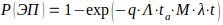,

где  – вероятность поражения при прикосновении человека к потенциально опасным частям электроустановок, определяемая как отношение числа смертельных случаев к числу всех прикосновений в 
 электроустановках;

 - интенсивность потока прикосновений к одной электроустановке;

 - среднее время эксплуатации всех электроустановок с отказавшими УЗО;
     
 - интенсивность отказов УЗО.

Математическая модель (1.23) является упрощенной, не учитывает время нахождения УЗО  в отказавшем состоянии, частоту проверок, длительность прикосновения человека к электроустановке, что не дает возможности оценить, как эти факторы влияют на вероятность поражения человека электрическим током.

## 3. Применение Марковских случайных процессов для описания процессов поражения человека электрическим током

Используя Марковские случайные процессы, была предложена математическая модель «источник - среда», с помощью которой было показано, что такие разные по своему характеру явления, как взрыв, пожар, случай поражения человека электрическим током происходят по одной логической схеме и имеют общие математические модели. Получена формула для определения 
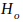 – числа аварий в единицу времени, где учитываются опасное и безопасное состояние источника и окружающей среды.

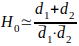,

где ,  - средний интервал времени нахождения элемента в безопасном и опасном состояниях соответственно
( = 1;2).

Формула  справедлива, когда 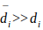.

Предлагается формула, которая позволяет выбирать такие сроки профилактики средств защиты
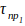
от утечек тока на землю, при которых обеспечивается нормируемый уровень интенсивности поражения человека электрическим током - Н.

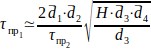,

где 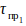 – интервал времени между проверками защитного отключения;

 – интервал времени между проверками защитного заземления;
  
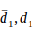 - средний интервал времени между повреждениями защитного отключения и среднее время нахождения защитного отключения в отказавшем состоянии;
    
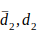 - средний интервал времени между повреждениями  защитного заземления и среднее время нахождения его в необнаруженном отказавшем состоянии;

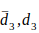 - средний интервал времени между 
прикосновениями человека к корпусу коммутационного аппарата без индивидуальных средств защиты и средняя длительность прикосновения рук человека к металлическому корпусу;

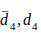 - средний интервал времени между 
появлениями замыкания на землю в коммутационном аппарате и средняя длительность его существования.

Формула
(1.31) справедлива при условиях: 
;
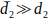;
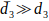;
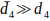;
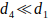;
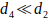;
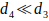.

В работе представлена структурная схема поражения человека электрическим током (рис.1), которая характеризуется переходом системы из безопасного состояния 

в состояние поражения 
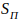.

В работе  описана система, состоящая из трех элементов, и получена система линейных дифференциальных уравнений. Из нее можно найти вероятности нахождения системы в каждом из возможных состояний 
,
где 
.

Рис. 1 Схема к процессу поражения человека электрическим током:

 – нахождение электрооборудования под напряжением;

 – состояние изоляции системы электроснабжения;

 – состояние устройства защитного отключения;

 – прикосновение человека к токоведущим частям;

 – прикосновение человека к корпусу электрооборудования;

 – состояние защитного заземления;

 – однофазное замыкание на землю;

 – уровень сопротивления тела человека.

## Заключение

- Использование логико-вероятностных методов для оценки электробезопасности электрооборудования, эксплуатирующегося на участках угольных шахт, позволяет качественно определить уровень электробезопасности. Оценка электробезопасности по таким  моделям сильно занижает истинный уровень электробезопасности за счет того, что эти модели не учитывают  время  нахождения элементов, входящих в систему, в необнаруженном отказавшем состоянии. Это значит, что в математических моделях учитывается только вероятность появления события, но не учитывается длительность существования самого события.
- Использование Марковских процессов для моделирования случаев  поражения людей электрическим током, на наш взгляд, позволит описать все  возможные случаи поражения людей электрическим током при эксплуатации электрооборудования и получить недостающие для анализа систем характеристики, кроме тех, которые получены в [17,18,19], т.е: вероятность нахождения систем в каждом из возможных состояний
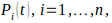
где  - число элементов, одновременное нахождение которых в опасном состоянии приводит к поражению человека электрическим током; среднее время и дисперсию времени нахождения системы в каждом из возможных состояний  
 и 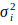;
функцию распределения интервалов времени до первого поражения человека электрическим током при  условии, если
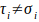.
- Разработанные математические модели на основе Марковских случайных процессов позволят создать универсальную методику, которая позволит адекватно оценивать уровень электробезопасности объектов при любых соотношениях опасных и безопасных состояний элементов, а также учитывать их обслуживание (либо без учета обслуживания, когда ).

## Список источников
<ol>
  <li>С.В.Белов.Безопасность
	жизнедеятельности и защита окружающей
	среды. М.:Юрайт, 2011. 680 с.
  </li>
  <li>Манойлов В.Е. 
	Основы  электробезопасности.  – Л.:
	Энергоатомиздат, 1991. – 480 с.
  </li>
  <li>Щуцкий В.И., Бурлаков
	А.А. Моделирование опасности поражения
	электрическим током и критерий выбора
	режима нейтрали в дражных низковольтных
	 электрических  сетях //  Изв.  вузов.  –
	 Горный  журнал.  – 1978. -  №11.  – С. 114-121.
  </li>
  <li>Эндренн Дж.
	Моделирование при расчетах надежности
	в электроэнергетических системах: 
	Пер. с англ. под. ред. Ю.Н. Руденко. – М.:
	Энергоатомиздат, 1983. – 336 с.
  </li>
  <li>Ковалев А.П. О
	проблемах оценки безопасности
	электротехнических объектов //
	Электричество. – 1991. - №8. – С. 50-55.
  </li>
  <li>Щуцкий В.И., Бурлаков
	А.А. О вероятностной оценке уровня
	электробезопасности // Электричество.
	– 1982. - №2. – С. 16-20.
  </li>
  <li>Безопасность
	жизнедеятельности. Учебное пособие.
	Калининград: КГТУ, 1998 – 232 с.
  </li>
</ol>
