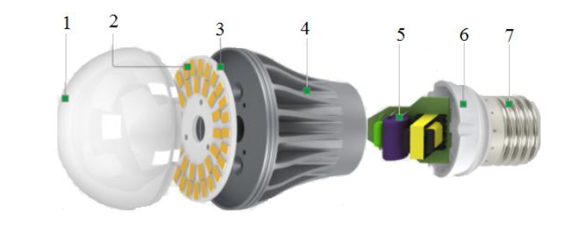
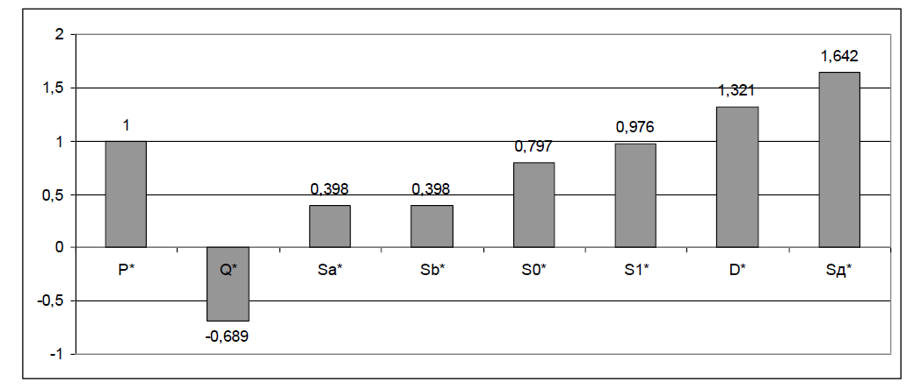

# Реферат по теме выпускной работы

<h2>Содержание</h2>

<ul class=content>
  <li class=ct1><a href="#p0">Введение</a>
  <li class=ct1><a href="#p1">1. Актуальность темы</a>
  
  <li class=ct1><a href="#ref">Список источников</a>
</ul>

## Введение

Широкое внедрение светодиодных ламп (СДЛ) обусловлено их достоинствами: малая мощность, большой световой поток, большой срок службы, отсутствие пульсаций освещенности, нечувствительность к колебаниям напряжения в сети, безынерционное зажигание. Однако это приводит к несинусоидальности токов. Кроме того, нагрузка электрической сети 380/220&#xA0;В часто бывает несимметричной. При этом возникают суммарные потери активной мощности 
, которые ухудшают возможности электроснабжения, а также вызывают дополнительный нагрев проводников, ведущий к увеличению теплового износа их изоляции. Поэтому разработка физически обоснованного метода расчета потерь мощности имеет практическую и научную актуальность. Практическая актуальность обусловлена потребностью в оценке технико-экономической эффективности СДЛ, а научная – необходимостью разработки метода определения баланса мощностей в сетях с СДЛ.

При симметричной нагрузке с тремя равными сопротивлениями фаз 
 потребляемая активная мощность:

выражается через действующие значения тока 
 и напряжения 
, которое обычно считается неизменным. Традиционная трактовка понятий активной 
, реактивной 
 и полной мощности 
 относится именно к симметричной нагрузке фаз. В этом случае квадраты мощностей суммируются:

Суммарные потери мощности от фазных токов 
 в одинаковых сопротивлениях 
 определяются по формуле:

Ток  в нулевом проводе при любом его сопротивлении 
 равен нулю.

При несимметричной нагрузке 
 будет протекать ток в 
 в нулевом проводе с сопротивлением 
. Несинусоидальная составляющая нагрузка представляется в виде суммы гармоник порядка 
. Активная и реактивная мощности относятся к первой гармонике. Квадраты действующих значений токов суммируются.

Понятие «действительной полной мощности» 

 вводится при условии равенства фазных напряжений:

В этом случае

Если разложить несимметричную систему фазных на прямую 
, обратную 
, и нулевую 

 последовательности, а несинусоидальную составляющую (индекс «») представить суммой гармоник, то получим

Вторые слагаемое является квадратом «мощности искажений» 
. Обозначив через 
 и 

 полные мощности обратной и нулевой последовательностей, запишем предыдущее выражение в компактном виде:
 

Отношение

Каждому слагаемому в выражении 
 соответствует составляющая потерь активной мощности: 
, 
, 
, 
, 
 и 
. Их сумма даёт составляющую 
, которую примем базовой величиной 
 системы относительных единиц (символ «*»).

Выводы. В четырехпроводных сетях 380/220&#xA0;В с несимметричной и несинусоидальной нагрузкой мощности необходимо использовать понятие действительной полной мощности. Баланс потерь мощностей позволяет выполнять технико-экономическое обоснование целесообразности уменьшения потерь мощности.

Рисунок 1 ‒ Конструкция светодиодной лампы
 (1 ‒ матовый рассеиватель; 2 ‒ чипы светодиодов; 3 ‒ алюминиевая печатная плата на теплопроводимой пасте; 4 ‒ радиатор; 5 ‒ драйвер; 6 ‒ полимерное основание цокольной части; 7 ‒ цоколь.)

Рисунок 2 − Баланс мощностей для СДЛ

## Список источников
<ol>
  <li>
  </li>
</ol>
