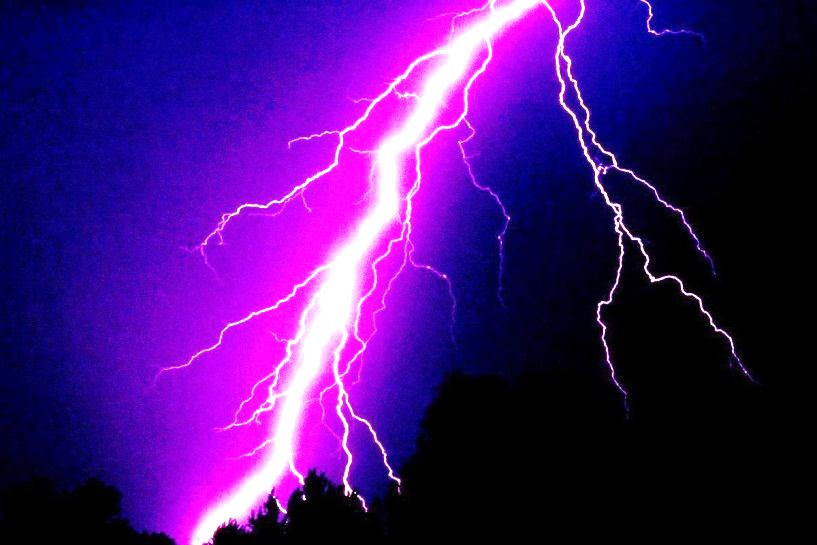
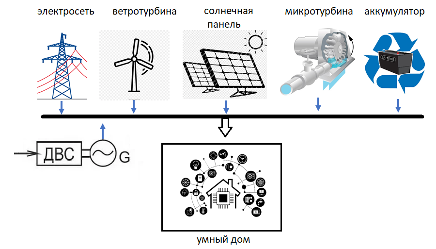

# Реферат по теме выпускной работы

<h2>Содержание</h2>

<ul class=content>
  <li class=ct1><a href="#p1">1. Актуальность темы</a>
  <li class=ct1><a href="#p2">2. Возобновляемые источники энергии</a>
  <li class=ct1><a href="#p3">3. Концепция интеллектуального дома</a>
  <li class=ct1><a href="#p4">4. Структура электроснабжения Умного дома</a>
  <li class=ct1><a href="#ref">Список источников</a>
</ul>

## 1. Актуальность темы

Последние десятилетия характеризуются бурным развитием техники,
экономики и общества, в котором происходят кардинальные изменения
(развитие высоких технологий, рост численности населения, глобальное
изменение климата и т. д.). Эти факторы влияют, в том числе, и на
энергетику, предъявляя к ней все новые и новые требования.

К числу наиболее существенных изменений в развитии энергетической
отрасли, ученые и исследователи относят следующие [[1]](#ref1):
- рост дефицита первичных источников для производства электрической энергии;
- повышение со стороны потребителей требований к надежности и качеству электроснабжения;
- повышение стоимости электрической энергии во всем мире;
- ужесточение требований экологической и промышленной безопасности функционирования энергетических объектов;
- необходимость снижение общесистемных затрат.

Перечисленные изменения требуют разработки новой концепции
инновационного развития электроэнергетики. Эта концепция, с одной
стороны, должна отвечать современным взглядам, целям и ценностям
социального и общественного развития и формироваться, опираясь на
ожидаемые потребности людей и общества в целом. А с другой - максимально
учитывать основные тенденции и направления научно-технического прогресса
во всех отраслях, сферах жизни и деятельности общества [[2]](#ref2).

На сегодняшний день электрические сети России в основном базируются на
конструктивных решениях середины 20 века. Это одна из основных причин
сложности расширения сетевой инфраструктуры, которое необходимо для
удовлетворения постоянно растущих энергетических потребностей. В
следующем десятилетии ожидается, что спрос на электроэнергию вырастет на
19%, а существующая сетевая инфраструктура может увеличить свою
производительность лишь на 6% [[1]](#ref1). По этим причинам отключения и
перебои электроснабжения становятся проблемой для большинства
электрических сетей.

Непрерывный рост стоимости энергетических ресурсов, основой которых
являются углеводороды - нефть, газ, каменный уголь и др., а также
растущая сложность их добычи являются сдерживающими факторами для
развития традиционной энергетической инфраструктуры. Кроме того,
переработка углеводородных топливных ресурсов оказывает негативное
влияние на окружающую среду. Поэтому становится актуальным применение
источников возобновляемой энергии, как в крупных электрических сетях,
так и в малых [[3]](#ref3).

## 2. Возобновляемые источники энергии

Возобновляемая энергетика базируется на использовании энергии солнца,
ветра, воды и других экологически чистых ресурсах. В будущем она сможет
составить конкуренцию традиционной энергетике. Согласно прогнозам
Европейского совета по возобновляемой энергетике, доля возобновляемых
источников энергии (ВИЭ) в мировом производстве первичной энергии
составит в 2030 гг. - 34,7%, в 2040 гг. - 47,7%
[[4]](#ref4). Основной недостаток ВИЭ - нестабильный
график генерации, который зависит от географического положения, времени
года, времени суток, погодных условий и других факторов [[5]](#ref5). Поэтому
при использовании ВИЭ востребованы специальные, так называемые,
«интеллектуальные» системы, способные оптимально использовать различные
распределенные источники энергии.

Одним из видов интеллектуальной энергетической системы является система
микрогрид. Это низковольтная интеллектуальная распределительная сеть,
содержащая различные распределенные источники энергии, накопители
энергии, управляемые нагрузки и другие элементы.

Указанные особенности делают актуальным создание единой методики
разработки и исследования электроснабжения зданий, с помощью
распределенных источников энергии со значительной долей генерации от
ВИЭ.

## 3. Концепция интеллектуального дома

Термин «интеллектуальный дом» (ИД) в последнее время стал очень
популярным. При этом разные компании часто трактуют его по-своему.
Существует ряд определений, суть которых можно кратко сформулировать как
здание, которое обеспечивает продуктивную и экономически эффективную за
счет оптимизации четырех элементов: структуры, систем жизнеобеспечения,
обслуживания, управления и их взаимосвязей.

Существует более общее и всеобъемлющее определение этого понятия -
совокупность функций интегрированной инфраструктуры.

Требования к инженерным системам ИД можно условно разделить на две
группы: требования, со стороны персонала, обслуживающего инженерные
системы здания и требования пользователей инженерных систем - владельцев
и арендаторов помещений. Первая группа определяет инженерную
инфраструктуру здания, вторая - структуру систем управления комфортом и
интерфейсы общих инженерных систем здания.

Системы интеллектуального дома делятся на инженерную инфраструктуру,
технологические системы и системы безопасности.

Инженерная инфраструктура интеллектуального дома включает системы
жизнеобеспечения персонала и технологическую платформу, на базе которой
функционируют другие системы. К инженерной инфраструктуре относятся (см
рис. 1): система электроснабжения, система теплоснабжения, система
кондиционирования и вентиляции, система водоснабжения и канализации.

К технологической инфраструктуре относятся : информационная сеть здания,
система коммуникации и связи. К системе безопасности относится: охранная
сигнализация, пожарная сигнализация, система оповещения

Важное место среди инженерных структур интеллектуального здания отводится
системе часофикации, которая должна обеспечивать единые показания
времени на всех таймерах, подключенных к системе.

Рисунок 1 – Структура инженерной инфраструктуры умного дома

Целью работы является поиск путей совершенствования системы
электроснабжения за счет применения источников питания на базе ВИЭ.
Система электроснабжения, включает следующие подсистемы: общего
электроснабжения; гарантированного электроснабжения; бесперебойного
электроснабжения; систему освещения.

К системе электроснабжения предъявляется много требований, одним из
основных является бесперебойность питания. В «традиционной»
электроэнергетической системе вопрос бесперебойности решается за счет
использования принципа «двух независимых источников», которое, как
показал опыт эксплуатации имеет ряд недостатков. Определение
«независимого» источника, которое дано в Правилах устройства
электроустановок имеет один существенный недостаток – оно допускает
возможность кратковременной потери питания на время срабатывания
устройств автоматического повторного включения (АПВ) на поврежденном
источнике или автоматического включения резервного источник (АВР) при
неуспешном АПВ. Во- первых, эта технология изначально допускает наличие
бестоковой паузы на время работы АПВ-АВР, во-вторых, она опирается на
ряд допущений, которые могут и не сработать. Так, успешность АПВ зависит
от вероятности того, что повреждение, например короткое замыкание на
линии электроснабжения, будет самоликвидирующимся после снятия
напряжения. По статистике успешное АПВ происходит на кабельных ЛЭП
примерно в половине случаев. АВР будет успешным, если на резервный
источник гарантировано находится в рабочем состоянии. Один из способов
повысить бесперебойность электроснабжение отдельных потребителей,
например офисного интеллектуального здания, является комбинированное
использование системы централизованного и автономного электроснабжения.
Этот способ не нов и находит применение уже давно для электроснабжения
особо ответственных объектов. В качестве дополнительного источника
обычно используется дизель-генератор. Система получается достаточно
дорогой.

В последние годы получает распространение инновационная концепция
построения систем электроснабжения, получившая название микрогрид. Она
также предполагает совместную работу коммунальной сети и автономных
источников, но в качестве последних используются различные устройства,
основанные на получении электроэнергии по технологии ВИЭ.

Этому способствуют следующие факторы: бурное развитие техники
преобразования энергии солнца, ветра, биогаза и др. возобновляемых
источников первичной энергии, доступность по стоимости автономных
солнечных, ветровых и т.п электростанций и создание современных,
программируемых, цифровых устройств контроля, управления и защиты этих
объектов. Важной особенностью современных автономных систем получения
электроэнергии на базе ВИЭ является возможность их синхронной работы с
сетью. Преимущества такого технического решения для потребителя –
возможность продавать излишки электроэнергии в сеть, а для энергосистемы
– построение системы с распределенной генерацией.

Известно, что по пути от генератора современной крупной тепловой,
атомной или гидроэлектростанции к конечному потребителю 380/220В
электроэнергии претерпевает 8-10 ступеней трансформации. Это неизбежно
сопровождается технологическими потерями мощности. При наличии
распределенной генерации количество циклов трансформации сокращается, и
электроэнергия может потребляться практически на месте ее получения. Это
сокращает потери на транспортировку электроэнергии. При определенной
концентрации ВИЭ, некоторые участки коммунальной сети получают свойство
быть практически обеспеченными местной электроэнергией в определенные
часы суток, например в солнечный день.

Такие фрагменты большой энергосистемы, содержащие распределенную
генерацию, получили название Microgrid – что означает микросеть или
микроэнергосистема. Microgrid является составной часть более глобальной
концепция инновационного развития электроэнергетики - Smart Grid [[2]](#ref2).

Общественный эффект микрогрид, как и расширение применения ВИЭ,
заключается в экономии ископаемых топливно-энергетических ресурсов, а
также сокращении вредных выбросов в окружающую среду в процессе их
переработки при производстве электроэнергии.

## 4. Структура электроснабжения Умного дома

Источники распределенной генерации, согласно концепции Smart Grid [[2]](#ref2), могут содержат в себе различные
технологии, таких как ветряные турбины, фотоэлементы (солнечные панели),
микротурбины, дизельные или бензогенераторы, накопители электроэнергии
(аккумуляторы). Основным ( базовым) источником питания остается
электрическая сеть. Мощность источников распределенной генерации может
составлять от нескольких киловатт до единиц мегаватт.

Пример структурной схемы электроснабжения умного дома с помощью
концепции микрогрид приведен на рис. 2

Рисунок 1 – Структура инженерной инфраструктуры умного дома

Рисунок 2 – Структура источников электроснабжения Умного Дома в системе
Microgrid

Увеличение степени автономности в распределенной системе генерации
предлагается осуществлять с помощью агентно-ориентированного подхода
технологии. Под агентом понимают физический или виртуальный объект,
действующий в системе. В нашем случаи агентами могут считаться как
перечисленные выше источники распределенной генерации, так и системы их
управления. В целом система управления Микрогрид представляет собой
мультиагентный комплекс со своим центральным контроллером.

Рассмотрим возможность применения агентного принципа управления в
системе Микрогрид. У каждого агента есть определенный уровень автономии,
что дает возможность принятия решения без центрального контроллера или
координатора. С этой целью, они запрограммированы на работу с помощью
набора вариантов. Например, контроллер заряда аккумуляторной батареи
будет осуществлять аккумулирование и заряжать батарею, если у батареи
низкая степень зарядки; есть профицит дешевой энергии от ВИЭ, стоимость
электроэнергии в электросети в этот временной интервал суток низкая
низкие цена за кВт\*ч. Таким образом, система мультиагента решает, когда
начать заряжать аккумулятор на основе его собственных правил и целей, а
не внешней командой.

Автономия каждого агента зависит от доступных ему ресурсов и которые он
в данный момент может использовать. Этими ресурсами могут быть: топливо
для двигателя внутреннего сгорания (на схеме рис.2 это ДВС), ветер
достаточный для работы ветрогенератора или солнечный свет для
фотоэлектрического преобразователя. Мультиагентная система должна быть
достаточно гибкой с элементами обратной связи. Например, ветрогенератор
изменяя выработку энергии, может изменить параметры других агентов,
изменить уровень напряжения на шинах системы питания и тем самым
воздействовать на работу источника «электрическая сеть». С более
глубокой точки зрения здесь речь может идти не только о экономических
показателях при оплате за потребленную электроэнергию, но о безопасности
системы электроснабжения в целом, влияя на уровень токов короткого
замыкания и устойчивость системы в случае короткого замыкания.

## Список источников
<ol>
  <li>Стычинский З.A.,  Воропай Н.И. 
Возобновляемые источники энергии: теоретические основы, технологии,
технические характеристики, экономика. – Иркутск 2010, – с. 209.
  </li>
  <li>Кобец Б. Б.,  Волкова И. О. Инновационное развитие электроэнергетики
на базе концепции Smart Grid. – М.: ИАЦ Энергия, 2010. – 208 с.
  </li>
  <li>Колот М.А.,  Левшов А.В.,  Коротков А.В.  Алгоритм управления
источниками и потребителями электроэнергии интеллектуального здания.
Электромеханические и энергетические системы, методы моделирования и
оптимизации. Сборник научных трудов XI Международной научно–технической
конференции молодых ученых и специалистов в Кременчуге 10–11 апреля 2014
г. – Кременчуг: КрНУ, 2014. – с. 57–58.
  </li>
  <li>Сайт компании House control. Раздел «Умный
дом» Электроснабжение интеллектуального здания. Режим доступа: http://www.housecontrol.ru/
  </li>
  <li>15 лучших систем умный дом 2023: рейтинг
лучших. Электронный ресурс. Режим доступа: https://www.kp.ru/expert/dom/luchshie-sistemy-umnyj-dom/?ysclid=lq0ltwk0s6673142789
  </li>
</ol>
