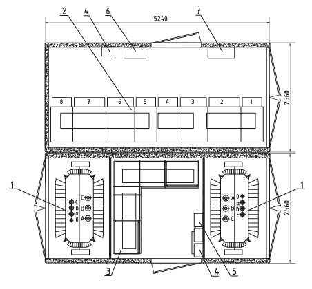

# Проектирование системы электроснабжения микрорайона города с использованием блочно-модульных трансформаторных подстанций

<h2>Содержание</h2>

<ul class=content>
  <li class=ct1><a href="#p0">Введение</a>
  <li class=ct1><a href="#p1">1. Обзор учебной и технической литературы по вопросам проектирования электроснабжения городских микрорайонов</a>
  <li class=ct1><a href="#p2">2. Постановка задачи</a>
  <li class=ct1><a href="#p3">3. Комплектно-модульные подстанции (КМП)</a>
  <li class=ct1><a href="#p4">Заключение</a>
  <li class=ct1><a href="#ref">Список источников</a>
</ul>

## Введение

### Актуальность

В условиях растущей урбанизации и увеличения потребления электроэнергии
в городских микрорайонах, обеспечение надежного и эффективного
электроснабжения становится критически важной задачей. Эффективное
проектирование системы электроснабжения с учетом особенностей
электропотребления, категорийности потребителей и внедрения современного
оборудования, такого как комплектно-модульные подстанции (КМП), имеет
прямое влияние на качество жизни горожан и функционирование городской
инфраструктуры. В свете новых требований (увеличение доли
электротранспорта, электроотопления, роста числа электроприборов в быту)
существующие схемы электроснабжения могут быть недостаточно эффективными
и нуждаются в оптимизации и модернизации. Следовательно, разработка
методики проектирования современной системы электроснабжения с учетом
всех вышеперечисленных факторов является актуальной задачей.

### Цель исследования

Разработка методических рекомендаций по проектированию системы
электроснабжения городского микрорайона, обеспечивающей надежное,
эффективное и экономичное электроснабжение с учетом современных
требований и перспектив развития электропотребления.

### Задачи исследования

1.  Проанализировать существующие нормативные документы, стандарты и
    методики в области проектирования систем электроснабжения городских
    микрорайонов.
2.  Идентифицировать факторы, влияющие на структуру и параметры системы
    электроснабжения микрорайона (плотность населения, типы
    потребителей, перспективы развития).
3.  Определить категории надежности электроснабжения и конкретизировать
    перечень электроприемников, относящихся к разным категориям, с
    учетом специфики микрорайона.
4.  Оценить эффективность применения комплектно-модульных подстанций
    (КМП) и других современных технологий для распределения
    электроэнергии в микрорайоне.
5.  Разработать рекомендации по выбору оптимальной конфигурации системы
    электроснабжения, учитывающей требования надежности, эффективности и
    экономичности.
6.  Предложить алгоритм расчета нагрузок и выбора оборудования для
    системы электроснабжения микрорайона с учетом перспектив развития
    электропотребления.
7.  Разработать методику и пример расчета экономической эффективности
    предложенных проектных решений.

## 1. Обзор учебной и технической литературы по вопросам проектирования электроснабжения городских микрорайонов

### Общие вопросы электроснабжения

Наиболее значимыми учебниками по вопросам электроснабжения являются
следующие издания.

"Электроснабжение промышленных предприятий и городов". Ополева Г.Н. [[1]](#ref1).
Это классический учебник, охватывающий широкий спектр вопросов,
связанных с электроснабжением, включая городские сети. В нем рассмотрены
принципы построения городских сетей, расчеты нагрузок, выбор
оборудования и вопросы надежности.

"Электрические системы. Электрические сети" под.ред. В.А. Веникова*.* [[2]](#ref2).
Учебник, в котором рассмотрены фундаментальные вопросы о
принципах построения и расчета электрических сетей различного
напряжения. Важен для понимания общих концепций.

«Системы электроснабжения» автора А. М. Ершов [[3]](#ref3). Хотя это издание
называется конспектом лекций, но состоит из 4-х частей и охватывает
базовые понятия, принципы и компоненты, лежащие в основе
электроснабжения, а также более частные вопросы проектирования и
эксплуатации.

### Специализированные учебники и учебные пособия по городскому электроснабжению

В большинстве у разных авторов и издательства имеют схожие названия
"Проектирование электроснабжения жилых и общественных зданий", например, [[4,5]](#ref4).
Эти учебные пособия содержат конкретные примеры расчетов и
проектирования систем электроснабжения жилых домов, офисов, школ и
других зданий, характерных для городских микрорайонов. В работе [[6]](#ref6)
даны разъяснения по выполнению конкретных задач при проектировании
систем электроснабжения населенных пунктов

### Нормативная литература и справочники:

ПУЭ (Правила устройства электроустановок) [[7]](#ref7). Определяют основные
требования к проектированию, монтажу и эксплуатации электроустановок.
Это нормативный документ, в котором изложены требования к
проектированию, монтажу, наладке, ремонту и эксплуатации
электроустановок. Содержит систематизированные правила, обеспечивающие
безопасность и надежность электроснабжения, а также защиту от поражения
электрическим током. В настоящее время актуально 7-е издание .

### ГОСТы и CНиПы, относящиеся к электроснабжению

Национальный стандарт (стандарт организации ПАО «Россети» «Комплектные
трансформаторные подстанции 6–20/0,4 кВ. Общие технические
требования» [[8]](#ref8). Документ, в котором изложены требования к КТП, которые
используются в электрических сетях «Россети».

Инструкция по проектированию городских электрических сетей
РД-34.20.185-94 [[9]](#ref9) – основной документ проектировщика. Охватывает
вопросы проектирования как вновь сооружаемых, так и реконструируемых
электрических сетей городов (районов и микрорайонов) и посёлков
городского типа до и выше 1 кВ.

### Дополнительная литература:

В статье [[10]](#ref10) рассмотрены вопросы рационального энергоснабжения жилого
микрорайона на примере города Владивостока. Представлен анализ объектов
электроснабжения микрорайона, два проекта схем электроснабжения, сделан
выбор варианта схемы по результатам оценки технико-экономических
показателей. Также проведена оценка экономии ежегодных издержек при
реализации выбранного проекта.

Статья [[11]](#ref11) посвящена вопросам автоматизации проектирования жилого
микрорайона, а именно компьютерному расчету электрических нагрузок.
Разработка преследует цель уменьшить время и стоимость проектирования
систем городского электроснабжения, а также исключить ошибок при выборе
и обработке необходимых справочных данных.

## 2. Постановка задачи

### Исходные данные и планирование

Проектирование системы электроснабжения микрорайона – сложный процесс,
включающий сбор исходных данных, расчёты нагрузок, разработку схем и
оформление документации, регламентируемый нормативными документами.

На начальном этапе учитываются генеральные планы развития города,
проекты планировки и межевания территорий, зоны застройки, плотность
населения и основные направления развития. Оценивается состояние
существующих сетей, схемы распределения, нагрузки, перечень и состояние
оборудования, точки подключения дополнительных мощностей. Прогнозируются
перспективы развития, нагрузки от промышленных предприятий,
инфраструктуры, транспорта и жилых районов. Технические условия на
присоединение, выдаваемые сетевыми организациями, определяют параметры
подключения.

### Расчет нагрузок и категории надежности

Важным этапом являются расчеты нагрузок с учетом категорийности
потребителей по надёжности питания (согласно ПУЭ и Приложению 2
Инструкции [[9]](#ref9)). К 1 категории относятся электроприемники, от
бесперебойной работы которых зависит жизнь людей (медицинские
учреждения - операционные, реанимации и т.п.), безопасность (пожарная,
охранная сигнализации, эвакуационное освещение, больничные лифты),
безаварийное функционирование систем отопления (котельные),
водоснабжения и водоотведения (насосные станции при определенной
численности жителей), зданий (лифты, системы дымоудаления и т.п. в домах
высотой от 17 этажей). Кроме этого, к 1 категории относятся
электроприемники общественных зданий (гостиницы, дома отдыха – при
определённом количестве мест), противопожарные системы учебных заведений
(при численности учащихся свыше 1000 человек), объектов культуры и
торговли (театры, магазины с торговой площадью более 2000 м2, рестораны
и т.п.), тяговые подстанции городского электротранспорта, вычислительные
центры, решающие народно-хозяйственные задачи.

Для электроснабжения потребителей 1 категории надежности, согласно ПУЭ,
требуется применение двухтрансформаторных подстанций.

## 3. Комплектно-модульные подстанции (КМП)

КМП играют ключевую роль в системе электроснабжения микрорайонов,
обеспечивая надежное и эффективное распределение электроэнергии. Они
обладают компактностью, быстрой установкой и легкостью обслуживания, что
оптимизирует процессы электроснабжения и снижает затраты. Внедрение КМП
способствует улучшению качества и надежности электроснабжения.

**Историческая справка. Эволюция комплектных трансформаторных подстанций
(КТП):**

Анализ развития КТП показывает тенденции к уменьшению занимаемой площади
и совершенствованию технологий электрооборудования [[12]](#ref12). От кирпичных
зданий до КТП 60-х с железобетонными элементами и монтажом оборудования
на месте, КТП 70-80х (бетонные или металлические киоски с полностью
смонтированным оборудованием) до развития элегазового оборудования в
80-х (компактность, надежность, снижение затрат и времени обслуживания).
Пионером в разработке элегазовых моноблоков для вводных высоковольтных
устройств КТП была французская компания Schneider Electric.
Разработанные Schneider Electric компактные распределительные устройства
с элегазовой изоляцией серии RM6 выпускаются на ряде предприятий в
России, например, на заводе в г. Коммунар, Ленинградской обл. [[13]](#ref13).
Помимо элегазовых решений в КТП используются традиционные коммутационные
аппараты с воздушной изоляцией, например КСО "Аврора" [[14]](#ref14). Приведен
пример компоновки блочно-модульной малогабаритной подстанции, включающей
силовой трансформатор, РУ 6(10)кВ (на базе КСО "Аврора"), РУ 0,4кВ, щиты
охранной сигнализации, учёта и бесперебойного питания.

В качестве примера рассмотрим вариант компановки блочно-модульной
комплектной малогабаритной трансформаторной подстанции.

1 — силовой трансформатор (до 1600кВА); 2 — РУ6 (10)кВ на базе КСО
«Аврора»; 3 — РУ0,4кВ НКУ «Freecon»; 4 — щит охранной сигнализации; 5 —
щит учета; 6 — щит учета собственных нужд; 7 — щит источника
бесперебойного питания

Рисунок 1 – План расположения оборудования блочной комплектной
двухтрансформаторной подстанции 2БКТПБ <a href="#ref15">[15]</a>

Данная подстанция наружной установки предназначена для приема
электрической энергии трехфазного переменного тока частотой 50 Гц,
номинальным напряжением 6 (10) кВ, преобразования и распределения его
напряжением 0,4кВ. Она содержит все компоненты, которые необходимо было
бы учесть при проектирования системы электроснабжения городского
микрорайона: категорийность электроприемников (выпускаются также и
однотрансформаторные КТП, для питания потребителей 3 категории); уровень
напряжения прилегающих сетей — 6(10)–0,4кВ, имеет небольшие габариты.
На стороне РУ высшего напряжения ТП комплектуется ячейками и моноблоками
с элегазовой изоляцией, например RM6 или с воздушной изоляцией, например
КСО-6(10) «Аврора». На стороне низшего напряжения устанавливают
низковольтные комплектные устройствами «Freecon» производства ОАО
«НИПОМ». Для защиты отходящих линий они оборудуются автоматическими
выключателями или предохранителями. В КТП использую масляные герметичные
или сухие силовые трансформаторами. Также в составе КТП имеется щитовое
оборудование собственных нужд, щит учета электроэнергии. Высокий уровень
автоматизации БКТПБ, позволяет безаварийно эксплуатировать подстанцию в
необслуживаемом режиме.

Варианты использования комплектно-модульных трансформаторных подстанций
(КМП) для электроснабжения городских микрорайонов можно классифицировать
по нескольким критериям:

### 2.1 Классификация КМП

**1. По типу решаемых задач.**

*Новое строительство:*

- Электроснабжение новых жилых комплексов: КМП используются для
  обеспечения электроэнергией вновь построенных многоквартирных домов,
  коттеджных поселков и прилегающей инфраструктуры (уличное освещение,
  магазины, школы, детские сады и т.д.).
- Электроснабжение объектов социальной инфраструктуры: КМП
  устанавливаются для энергоснабжения новых медицинских учреждений,
  спортивных комплексов, торговых центров и других социальных объектов.

*Реконструкция и модернизация существующих сетей:*

- Замена устаревших ТП: КМП устанавливаются вместо устаревших
  традиционных трансформаторных подстанций, требующих капитального
  ремонта или не отвечающих современным требованиям по надежности и
  безопасности.
- Увеличение мощности электроснабжения: КМП используются для увеличения
  пропускной способности существующих сетей электроснабжения при
  подключении новых потребителей или увеличении потребляемой мощности
  существующих.
- Повышение надежности электроснабжения: КМП устанавливаются в качестве
  резервных источников электроснабжения для потребителей 1 категории, а
  также для секционирования сети и повышения ее устойчивости к авариям.
- Оптимизация схемы электроснабжения: КМП позволяют создать более
  гибкую и адаптивную систему электроснабжения, обеспечивающую
  оптимальное распределение электроэнергии между потребителями.

**2. По типу используемого оборудования**

*КМП с коммутационными аппаратами с элегазовой изоляцией (SF6):*

- Преимущества: Компактность, высокая надежность, минимальные требования
  к обслуживанию.
- Применение: В районах с высокой плотностью застройки, где требуется
  минимизировать занимаемую площадь, а также для электроснабжения
  ответственных потребителей, требующих повышенной надежности.

*КМП с коммутационными аппаратами с воздушной или твердой изоляцией:*

- Преимущества: Более низкая стоимость, простота эксплуатации и
  обслуживания.
- Применение: В районах с менее строгими требованиями к габаритам и
  надежности, а также для электроснабжения менее ответственных
  потребителей.

*КМП с трансформаторами различных типов (масляные, сухие, с литой
изоляцией):*

Выбор типа трансформатора зависит от требований к пожарной
безопасности, уровня шума и других факторов.

### 2.2 Выводы. Анализ преимуществ применения КМП в городских микрорайонах

1)  Компактность: КМП занимают значительно меньше места, чем
    традиционные ТП, что особенно важно в условиях плотной городской
    застройки.
2)  Быстрый монтаж: КМП поставляются в виде готовых блоков, что
    значительно сокращает время и стоимость монтажных работ.
3)  Надежность: Современные КМП оснащаются надежным оборудованием и
    системами защиты, что обеспечивает стабильное и качественное
    электроснабжение.
4)  Безопасность: КМП соответствуют высоким требованиям по
    электробезопасности и пожарной безопасности.
5)  Эстетичный внешний вид: КМП могут быть выполнены в различных
    вариантах дизайна, что позволяет гармонично вписать их в городскую
    среду.

### Заключение

КМП являются эффективным и современным решением для электроснабжения
городских микрорайонов, обеспечивающим надежное, качественное и
экономичное электроснабжение потребителей. При выборе типа КМП
необходимо учитывать конкретные требования к электроснабжению, категорию
потребителей, особенности городской среды и другие факторы.

## Список источников
<ol>
  <li>Электроснабжение промышленных предприятий и городов. Ополева Г.Н.
  Издательский Дом ФОРУМ.2022. — 416с.
  </li>
  <li>Электрические системы. Электрические сети. Под ред. Веникова В.А. М.Высшая школа 1998. 2-е изд., перераб. и доп. — 510с
  </li>
  <li>Системы электроснабжения. Часть 1: Основы электроснабжения: курс
  лекций / А. М. Ершов. — Челябинск: Издательский центр ЮУрГУ, 2017. — 245
  с.
  </li>
  <li>Сапрыка А. В., Белоусов А. В., Тоушкин А. Г., Воловиков А. А.
  Проектирование электроснабжения жилого микрорайона города: учебное
  пособие. Белгород: Изд-во БГТУ, 2017. Режим доступа:
  <a href=https://www.homework.ru/finished-works/490959/"">homework.ru</a>
  </li>
  <li> Федотов А. И., Наумов О. В., Чернова Н. В. Проектирование городских
 электрических сетей: учебное пособие. Казань: Казан. гос. энерг. ун-т. — 2015. Режим доступа:
 <a href="https://lib.kgeu.ru/irbis64r_15/scan-new/4891.pdf">lib.kgeu.ru</a>
  </li>
  <li>Лещинская Т. Б., Семичевский П. И., Белов С. И. Электроснабжение
  населённого пункта: методические рекомендации по курсовому и дипломному
  проектированию. М.: ФГБОУ ВПО МГАУ, 2010.
  </li>
  <li>Электротехнический интернет портал Elec.ru Раздел Инструкции и
  правила. Правила устройства электроустановок (ПУЭ-7) Режим доступа: <a href="https://www.elec.ru/library/direction/pue.html?ysclid=micti2594339479147">ПУЭ
  7. Правила устройства электроустановок (7-е издание, актуально 2024) \|
  Библиотека - Элек.ру</a>
  </li>
  <li>Стандарт организации ПАО «Россети» «Комплектные трансформаторные
  подстанции 6–20/0,4 кВ. Общие технические требования»
  </li>
  <li>Инструкция по проектированию городских электрических сетей.
  Утверждена: Министерством топлива и энергетики Российской Федерации
  07.07.94, Российским акционерным обществом энергетики и электрификации
  "ЕЭС России" 31.05.94. Инструкция введена в действие с 01.01.95 г.
  взамен Инструкции по проектированию городских и поселковых электрических
  сетей, ВСН 97-83. Разработчики: Гипрокоммунэнерго (Лордкипанидзе В.Д.),
  РАО "ЕЭС России" (Акимкин А.Ф., Антипов К.М.), Энергосетьпроект
  (Файбисович Д.Л.). Внесены Изменения и Дополнения, утвержденные Приказом
  Минтопэнерго РФ от 29.06.99 № 213. Режим доступа: <a href="https://energeteek.ru/images/users_images/ntd/ntd_215/%D0%A0%D0%94_34.20.185-94_%D0%98%D0%BD%D1%81%D1%82%D1%80%D1%83%D0%BA%D1%86%D0%B8%D1%8F_%D0%BF%D0%BE_%D0%BF%D1%80%D0%BE%D0%B5%D0%BA%D1%82%D0%B8%D1%80%D0%BE%D0%B2%D0%B0%D0%BD%D0%B8%D1%8E_%D0%B3%D0%BE%D1%80%D0%BE%D0%B4%D1%81%D0%BA%D0%B8%D1%85_%D1%8D%D0%BB%D0%B5%D0%BA%D1%82%D1%80%D0%B8%D1%87%D0%B5%D1%81%D0%BA%D0%B8%D1%85_%D1%81%D0%B5%D1%82%D0%B5%D0%B9.pdf">РД 34.20.185-94 Инструкция по проектированию городских электрических
  сетей - Энергетик, НТД -
  скачать</a>
  </li>
  <li>Рациональное электроснабжение жилого микрорайона, авторы:
  Л. В. Кучеренко, М. С. Литвиненко. Научная статья по специальности
  «Электротехника, электронная техника, информационные технологии»,
  опубликована в журнале Sciences of Europe, 2018. Режим доступа: <a href="https://cyberleninka.ru/article/n/ratsionalnoe-elektrosnabzhenie-zhilogo-mikrorayona">cyberleninka.ru</a>
  </li>
  <li>Обработка информации в системе автоматизированного
  проектирования электроснабжения жилого микрорайона для определения
  электрических нагрузок, авторы А.Н. Шеметова, Е.А. Ильиной и Ю.Н.
  Кондрашовой, статья в журнале «Математическое и программное обеспечение
  систем в промышленной и социальной сферах» (2021), Режим доступа: <a href="https://ssi.magtu.ru/ru/arkhiv/37-2-2021-g/260-29.html">ssi.magtu.ru</a>
  </li>
  <li>Сайт Энергетика и промышленность России, раздел Энергетика статья
  Мировая эволюция комплектных трансформаторных подстанций 6-10/0,4 кВ
  Режим доступа: <a href="eprussia.ru›epr/52/2250.htm](https://www.eprussia.ru/epr/52/2250.htm"eprussia.ru›epr/52/2250.htm](https://www.eprussia.ru/epr/52/2250.htm</a>
  </li>
  <li>Википедия статья Schneider Electric
  </li>
  <li>Электротехнический интернет портал Elec.ru Раздел Передача,
  распределение и накопление электроэнергии. Статья КСО 6(10) «Аврора»
  </li>
  <li>Электротехнический интернет портал Elec.ru Раздел Передача,
  распределение и накопление электроэнергии. Буклет БЛОЧНО-МОДУЛЬНЫЕ
  ПОДСТАНЦИИ ОАО «НИПОМ». Режим доступа: <a href="https://www.elec.ru/viewer?url=/files/2012/06/26/Blochno-modulnye-podstantsii.pdf">Блочно-модульные подстанции \|
  Просмотр документа Blochno-modulnye-podstantsii.pdf -
  Элек.ру</a> 
  </li>
</ol>
