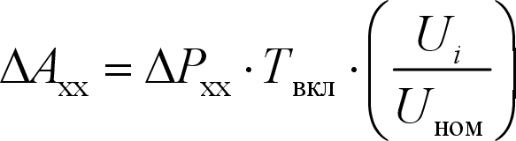
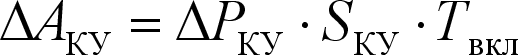
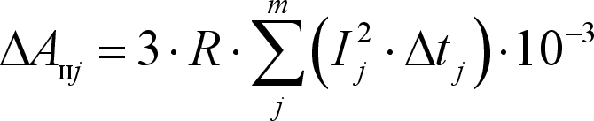
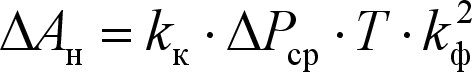
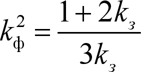
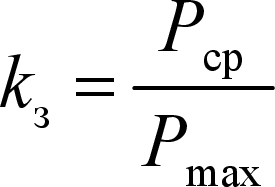
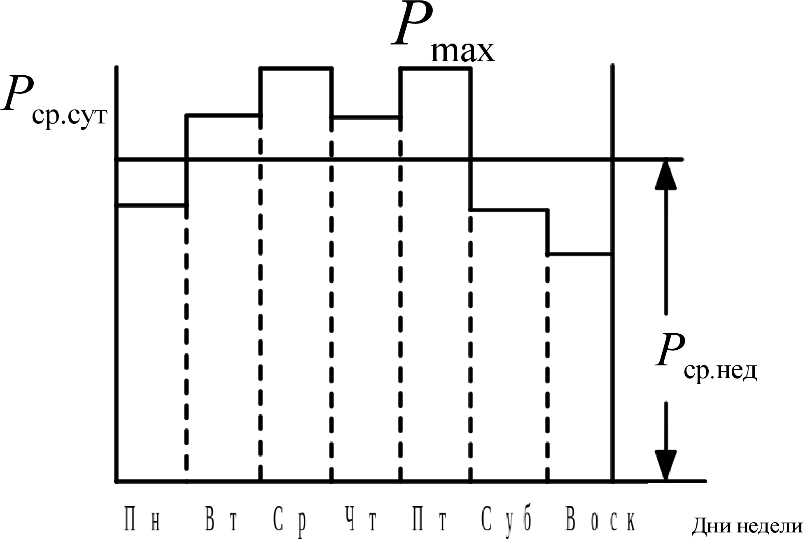

# Способы повышения энергоэффективности промышленных предприятий

<h2>Содержание</h2>

<ul class=content>
  <li class=ct1><a href="#p0">Введение</a>
  <li class=ct1><a href="#p1">1. Классификация энергосберегающих мероприятий</a>
  <li class=ct1><a href="#p2">2. Расчет потерь и выбор энергосберегающих мероприятий в системе электроснабжения</a>
  <li class=ct1><a href="#p3">3. Методы расчета нагрузочных потерь электроэнергии</a>
  <li class=ct1><a href="#p4">4. Выбор энергосберегающих мероприятий в системе электроснабжения</a>
  <li class=ct1><a href="#ref">Список источников</a>
</ul>

## Введение

Понятие энергоэффективности отражает рациональное использование
энергетических ресурсов. Другими словами – использование меньшего
количества энергии для обеспечения технологического процесса
предприятия.

В зависимости от условий работы предприятия можно выделить следующие
способы повышения энергоэффективности промышленных предприятий [[1]](#ref1):
- внедрение системы энергоменеджмента;
- сокращение затрат энергии на освещение;
- оптимизация работы производственного оборудования;
- снижение затрат на отопление;
- экономия на водоснабжении;
- улучшение газоснабжения.

Основной целью применения способов повышения энергоэффективности
является снижение производственных затрат. Увеличение эффективности
использования энергоресурсов ведет к уменьшению финансовых затрат за
счет снижения платы за энергоресурсы и, как следствие, получение
дополнительной прибыли за счет уменьшения платы за энергоресурсы.

Комплекс мероприятий по повышению энергетической эффективности можно
разделить на следующие этапы:

1. Энергоаудит – получение полных и достоверных сведений об
  энергопотреблении предприятия. В ходе проведения обследования особое
  внимание должно уделяться режимам работы оборудования, и исследованию
  технологий.
2. Разработка индивидуальной программы энергосбережения –экономически
  обоснованный комплекс организационно-технических мероприятий, в
  результате внедрения которого будет обеспечена экономия энергоресурсов.
3. Внедрение разработанного комплекса мероприятий.
4. Мониторинг результатов внедрения мероприятий по повышению
  энергоэффективности для представления достигнутых на практике
  показателях экономии и степени их соответствия проектным параметрам.

Стандарт [[2]](#ref2) устанавливает основные требования к построению, изложению
и содержанию энергетического паспорта промышленного потребителя
топливно-энергетических ресурсов (ТЭР) с целью определения фактического
баланса потребления ТЭР, оценки показателей энергетической эффективности
и формирования мероприятий по энергосбережению.

Согласно [[2]](#ref2) объектами энергетического обследования являются:
- производственное оборудование, машины, установки, агрегаты,
  потребляющие ТЭР, преобразующие энергию из одного вида в другой для
  производства продукции, выполнения работ (услуг);
- технологические процессы, связанные с преобразованием и потреблением
  топлива, энергии и энергоносителей;
- процессы, связанные с расходованием ТЭР на вспомогательные нужды
  (освещение, отопление, вентиляцию).

Паспорт потребителя ТЭР должен включать:
- перечень зафиксированных при обследовании потребителя фактов
  непроизводительных расходов ТЭР с указанием их величины в стоимостном и
  натуральном выражении;
- предлагаемые направления повышения эффективности использования ТЭР с
  оценкой экономии последних в стоимостном и натуральном выражении с
  указанием затрат, сроков внедрения и окупаемости;
- количественную оценку снижения уровня непроизводительных расходов ТЭР
  за счет внедрения энергосберегающих мероприятий: беззатратных и
  низкозатратных; среднезатратных; высокозатратных.

Непроизводительный расход топливно-энергетических ресурсов – это
потребление ТЭР, обусловленное несоблюдением или нарушением требований,
установленных государственными стандартами, иными нормативными актами,
нормативными и методическими документами [[3]](#ref3).

## 1. Классификация энергосберегающих мероприятий

По затратам все энергосберегающие мероприятия делятся на беззатратные,
низкозатратные и высокозатратные. К низко- и беззатратным мероприятиями
относятся снижение количества оборудования и контроль качества
электроэнергии. К среднезатратным мероприятия можно отнести увеличение
коэффициента загрузки, а к высокозатратным — оснащение системы
электроснабжения информационно-измерительными системами технического
учета электроэнергии.

**Низкозатратные мероприятия.**

1. Подключение экономически более выгодного тарифа на оплату
  электроэнергии.
2. Разработка для каждого подразделения предприятия научно обоснованных
  норм потребления электроэнергии, контроль за соблюдение данных норм.
  Для того чтобы получить объективные данные о потреблении энергии,
  необходимо установить счетчики на электроэнергию в каждом
  подразделении предприятия. Нормы потребления электричества
  устанавливаются путем анализа полученных статистических данных и
  основных нормирующих факторов.
3. Уменьшение потерь электрической энергии путем обеспечения
  равномерного разделения однофазной нагрузки по трем фазам
  электрической сети.
4. Определение правильности установленных категорий надежности каждого
  подразделения предприятия. Категория надежности согласно правилам
  устройства электрооборудования определяется при проектировании.
  Определение категории надежности можно провести с помощью анализа
  таких основных факторов, как стратегическая роль предприятия,
  величина ущерба от возможных перерывов в подаче электроэнергии. В
  случае если при определении правильности установленной категории
  надежности выяснится, что категории необходимо повысить, то
  составляется заявление в электрические сети, в котором указываются
  причины, по которым необходимо изменить категорию.
5. Оптимизация режимов потребления электроэнергии. Эти мероприятия
  необходимы для того, чтобы определить возможности уменьшения
  заявленной мощности для предприятия, которое платит за электричество
  по ночному и дневному режимам, и уменьшить плату за потребляемую
  электроэнергию. Заявленную мощность можно снизить путем перенесения
  части выполняемых работ на другое (например, ночное) время суток,
  чтобы выровнять график нагрузки.
6. Регулярное техническое обслуживание электроустановок.
7. Мероприятия в освещении помещений и территории предприятия:
  регулярная чистка осветительных приборов, покраска внутренних стен
  помещений в светлые тона, для освещения в темное время суток
  использовать фотореле, размещение осветительных приборов по секциям
  и группам.

**Среднезатратные мероприятия.**

1. Мероприятия в освещении: установка приборов, регулирующих
  освещенность, замена осветительных приборов, которые оснащаются
  лампами накаливания, на светильники, использующие люминесцентные
   лампы.
2. Мероприятия в электроснабжении, направленные на снижение потерь
  энергии (расчет, подбор и монтаж конденсаторных батарей). В
  настоящее время потребление реактивной мощности не нормируется
  практически нигде, расход реактивной энергии стоит уменьшать, потому
  что она входит в состав формулы для расчета потерь активной энергии
  (расчет потерь при оплате выставленных счетов за электроэнергию
  осуществляется и включается в счет, когда счетчики у потребителя
  находятся не на границе балансовой принадлежности). Оптимизация
  схемы электроснабжения поможет снизить затраты на оплату энергии.
  Установка счетчиков регистрации расхода электроэнергии с почасовым
  учетом потребленного электричества поможет при помощи анализа
  нагрузок предприятия выбрать и перейти на более выгодный тариф.
3. Оценка ресурсов энергосбережения предприятия.
4. Мероприятия в электроприводе: автоматизация работы как отдельных,
  так и групп агрегатов.

**Высокозатратные мероприятия.**

1. Мероприятия в освещении: замена осветительных приборов с лампами
  накаливания на светодиодные светильники.
2. Мероприятия в электроснабжении: установка нового современного
  коммутационного оборудования взамен устаревшего, усовершенствование
  подстанций, монтаж новых электросетей, создание АСКУЭ
  (автоматизированной системы коммерческого учета электроэнергии) на
  предприятии.
3. Мероприятия в технологическом процессе: внесение изменений в
  технологический процесс, которые помогут уменьшить энергозатраты и
  потери электроэнергии.
4. Мероприятия в электроприводе: установка частотно-регулируемых
  электроприводов переменного тока взамен приборов постоянного тока.

Пути энергосбережения различны, но общее в них то, что в любых
мероприятиях должна быть экономическая целесообразность.

Самыми распространенными энергосберегающими мероприятиями в системе
электроснабжения промышленных предприятий являются:
- установка выключателей нагрузки перед силовыми трансформаторами;
- установка регуляторов температуры на системы электроотопления;
- замена высоковольтного масляного оборудования на вакуумное;
- замена устаревшего оборудования;
- поддержание номинального уровня напряжения;
- равномерное распределение нагрузок по фазам;
- рспользование системы мониторинга потребления электрической энергии;
- улучшение коэффициента мощности.
- увеличение коэффициента загрузки электрооборудования.

## 2. Расчет потерь и выбор энергосберегающих мероприятий в системе электроснабжения

Порядок и методы расчета технологических потерь электроэнергии в системе электроснабжения.

**Технологические** потери электрической энергии — это потери
электрической энергии при её передаче по системе электроснабжения,
состоящие из ***технических*** ***потерь в оборудовании и линиях передачи***,
а также ***потерь, которые обусловлены максимально допустимыми погрешностями системы учета*** – рис.1.

Рисунок 1 – Структура технологических потерь электроэнергии

Технические потери электроэнергии в электрических сетях, возникающие при
ее передаче, состоят из потерь, не зависящих от величины передаваемой
мощности (нагрузки) – условно-постоянных потерь, и потерь, объем которых
зависит от величины передаваемой мощности (нагрузки) – нагрузочных
(переменных) потерь [[7]](#ref7).

Потери, обусловленные допустимыми погрешностями системы учета,
определяются в соответствии с методикой их определения. Расход
электроэнергии на собственные нужды определяется в соответствии с
приборами учета.

Технологические потери электроэнергии при ее передаче по электрическим
сетям рассчитываются раздельно по составляющим: условно-постоянные,
нагрузочные и потери, обусловленные допустимыми погрешностями системы
учета.

Определение технологических потерь электроэнергии в электрических сетях
в целом и по уровням напряжения осуществляется в следующем порядке:
1. Определяется на каждом уровне напряжения сети отпуск электроэнергии
  в сеть (с учетом приема электроэнергии из сети смежного напряжения).
2. Определяются условно-постоянные потери электроэнергии в целом и по
  уровням напряжения.
3. Определяются нагрузочные потери электроэнергии в целом и по уровням напряжения.
4. Определяются потери электроэнергии, обусловленные допустимыми
  погрешностями системы учета электроэнергии, в целом и по уровням напряжения.

Расчет условно-постоянных потерь электроэнергии (не зависящих от тока
(мощности) нагрузки)

Условно-постоянные потери электроэнергии включают:
1. Потери на холостой ход силовых трансформаторов (автотрансформаторов).
2. Потери на корону в воздушных линиях (ВЛ) 220 кВ и выше.
3. Потери в синхронных компенсаторах, батареях статических
конденсаторов, статических тиристорных компенсаторах (СТК), шунтирующих реакторах (ШР).
4. Потери в соединительных проводах и сборных шинах распределительных
устройств подстанций (СППС).
5. Потери в системе учета электроэнергии: трансформаторах тока (ТТ),
трансформаторах напряжения (ТН), счетчиках и соединительных проводах.
6. Потери в вентильных разрядниках, ограничителях перенапряжений.
7. Потери в устройствах присоединений высокочастотной связи (ВЧ связи).
8. Потери в изоляции кабелей; 9. Потери от токов утечки по изоляторам ВЛ.
10. Расход электроэнергии на собственные нужды (СН) подстанций (ПС).
11. Расход электроэнергии на плавку гололеда.

Потери электроэнергии холостого хода в силовом трансформаторе
определяются на основе приведенных в паспортных данных оборудования
потерь мощности холостого хода (ХХ) △*Р*ХХ по формуле:

<table class="numeq">
  <tr>
    <td></td>
    <td>(1)</td>
  </tr>
<table>

где *Т*вкл. - число часов работы трансформатора в *i*-том
режиме, ч;

*Ui* - напряжение на высшей стороне трансформатора
(автотрансформатора) в *i*-том режиме, кВ;

*U*ном - номинальное напряжение высшей обмотки
трансформатора, кВ.

Потери электроэнергии в статических компенсирующих устройствах -
батареях статических конденсаторов (БСК) и статических тиристорных
компенсаторах (СТК) определяются по формуле:

<table class="numeq">
  <tr>
    <td></td>
    <td>(2)</td>
  </tr>
<table>

где △*Р*КУ - удельные потери мощности в соответствии с
паспортными данными КУ, кВт/квар;

*S*КУ - мощность КУ (для СТК принимается по емкостной
составляющей), квар.

При отсутствии паспортных данных оборудования значение △*Р*КУ
принимается равным:
- для БСК - 0,003 кВт/квар;
- для СТК - 0,006 кВт/квар.

Потери электроэнергии в вентильных разрядниках, ограничителях
перенапряжений, устройствах присоединения ВЧ связи, измерительных
трансформаторах напряжения, электрических счетчиках 0,22-0,66 кВ
принимаются в соответствии с данными заводов-изготовителей оборудования.

При отсутствии данных завода-изготовителя расчетные потери принимаются в
соответствии с таблицей 1.

Таблица 1 – Потери электроэнергии в вентильных разрядниках (РВ),
ограничителях перенапряжений (ОПН), измерительных трансформаторах тока
(ТТ) и напряжения (ТН) и устройствах присоединения ВЧ связи (УПВЧ)

<table class="disstable">
<thead>
  <tr>
    <th>Класс напряжения, кВ</th>
    <th colspan=5>Потери электроэнергии, кВт·ч</th>
    <tr>
      <th></th><th>РВ</th><th>ОПН</th><th>ТТ</th><th>ТН</th><th>УПВЧ</th>
    </tr>
  </tr></thead>
  <tbody>
    <tr>
      <td>6</td><td>0,009</td><td>0,001</td><td>0,08</td><td>1,54</td><td>0,01</td>
    </tr>
    <tr>
      <td>10</td><td>0,021</td><td>0,001</td><td>0,1</td><td>1,9</td><td>0,01</td></tr>
      <tr><td>15</td><td>0,033</td><td>0,002</td><td>0,15</td><td>2,35</td><td>0,01</td></tr>
      <tr><td>20</td><td>0,047</td><td>0,004</td><td>0,2</td><td>2,7</td><td>0,02</td></tr>
      <tr><td>35</td><td>0,091</td><td>0,013</td><td>0,4</td><td>3,6</td><td>0,02</td></tr>
      <tr><td>110</td><td>0,6</td><td>0,22</td><td>1,1</td><td>11</td><td>0,22</td></tr>
      <tr><td>154</td><td>1,05</td><td>0,4</td><td>1,5</td><td>11,8</td><td>0,3</td></tr>
      <tr><td>220</td><td>1,59</td><td>0,74</td><td>2,2</td><td>13,1</td><td>0,43</td></tr>
      <tr><td>330</td><td>3,32</td><td>1,8</td><td>3,3</td><td>18,4</td><td>2,12</td></tr>
      <tr><td>500</td><td>4,93</td><td>3,94</td><td>5</td><td>28,9</td><td>3,24</td></tr>
      <tr><td>750</td><td>4,31</td><td>8,54</td><td>7,5</td><td>58,8</td><td>4,93</td></tr>
</tbody>
</table>

Примечания:
1. Потери электроэнергии в УПВЧ даны на одну фазу, для остального оборудования - на три фазы.
2. Потери в трех однофазных ТН принимаются равными потерям в одном трехфазном ТН.
3. Потери электроэнергии в ТТ напряжением 0,4 кВ принимаются равными 0,05 тыс. кВт⋅ч/год.
4. Значения потерь, приведенные в таблице, соответствуют году с числом
дней 365. При расчете потерь в високосном году применяется коэффициент *k* = 366/365.
1. Потери электроэнергии в ТТ и ТН включают потери в счетчиках,
входящих в состав измерительных комплексов.

Потери электроэнергии в электрических счетчиках прямого включения 0,22 -
0,66 кВ принимаются в соответствии со следующими данными, кВт.ч в год на
один счетчик:
- однофазный, индукционный - 18,4;
- трехфазный, индукционный - 92,0;
- однофазный, электронный - 21,9;
- трехфазный, электронный - 73,6.

Потери электроэнергии на корону определяются на основе справочных данных
об удельных потерях мощности и о продолжительностях видов погоды в
течение расчетного периода.

## 3. Методы расчета нагрузочных потерь электроэнергии

Нагрузочные потери электроэнергии в каждом элементе электрических сетей
могут быть рассчитаны одним из двух методов в зависимости от
информационной обеспеченности (методы представлены в порядке понижения
точности получаемых результатов расчета):
1. Оперативных расчетов.
2. Средних нагрузок.

Метод оперативных расчетов.

Нагрузочные потери электроэнергии в ВЛ, КЛ, шинопроводе или
двухобмоточном трансформаторе за базовый период определяются по формуле,
кВт·ч:

<table class="numeq">
  <tr>
    <td></td>
    <td>(3)</td>
  </tr>
<table>

где *R* – активное сопротивление ВЛ, КЛ, шинопровода или двухобмоточного
трансформатора, Ом;

*Ij* – токовая загрузка ВЛ, КЛ, шинопровода или
двухобмоточного трансформатора, принимаемая на интервале времени
△*tj* неизменной, А;

*Pj* , *Qj* – значения активной и реактивной
мощности ВЛ, КЛ, шинопровода или двухобмоточного трансформатора,
принимаемые на интервале времени △*tj* неизменными, МВт,
Мвар, соответственно;

*Uj* – значение напряжения на ВЛ, КЛ, шинопровода или
двухобмоточного трансформатора, принятое на интервале △*tj*
неизменным, кВ;

△*tj* – интервал времени, в течение которого нагрузка
элемента сети с сопротивлением R принимается неизменной;

*m* – количество интервалов времени △*tj* в базовом периоде.

Метод средних нагрузок.

Нагрузочные потери электроэнергии в ВЛ, КЛ, шинопроводе или
двухобмоточном трансформаторе за базовый период определяются по формуле:

<table class="numeq">
  <tr>
    <td></td>
    <td>(4)</td>
  </tr>
<table>

где △*Р*ср – потери мощности в ВЛ, КЛ, шинопроводе или
двухобмоточном трансформаторе при средних за базовый период нагрузках,
кВт;

*k*ф – коэффициент формы графика за базовый период, о.е.;

*k*к – коэффициент, учитывающий различие конфигураций
графиков активной и реактивной нагрузки (принимается равным 0,99), о.е.;

*Т* – число часов в базовом периоде, ч.

Коэффициент формы графика определяется по формуле, о.е:

<table class="numeq">
  <tr>
    <td></td>
    <td>(5)</td>
  </tr>
<table>

где *k*з – коэффициент заполнения графика определяется по
формуле как отношение средней нагрузки к максимальной за расчетный
период (рис.2 – расчетный период – неделя):

<table class="numeq">
  <tr>
    <td></td>
    <td>(6)</td>
  </tr>
<table>

Рисунок 2 – График недельного потребления мощности

При отсутствии данных о коэффициенте заполнения графика нагрузки
допускается принять его = 0,5.

Методы расчета нагрузочных потерь электроэнергии в электрической сети в
целом.

Нагрузочные потери электроэнергии в электрической сети в целом за *Т*
часов (Д дней) могут быть рассчитаны одним из пяти методов в зависимости
от объема имеющейся информации о схемах и нагрузках сетей (методы
расположены в порядке снижения точности расчета):
1. Оперативных расчетов.
2. Расчетных суток.
3. Средних нагрузок.
4. Числа часов наибольших потерь мощности.
5. Оценки потерь по обобщенной информации о схемах и нагрузках сети.

Потери мощности в сети при использовании методов 1-4 рассчитываются на
основе заданной схемы сети и нагрузок ее элементов, определенных с
помощью измерений или с помощью расчета нагрузок элементов электрической
сети в соответствии с законами электротехники.

Потери электроэнергии по методам 2-4 могут рассчитываться за каждый
месяц расчетного периода с учетом схемы сети, соответствующей данному
месяцу.

Допускается рассчитывать потери за расчетные интервалы, включающие в
себя несколько месяцев, схемы сетей в которых могут рассматриваться как
неизменные. Потери электроэнергии за базовый период определяют как сумму
потерь, рассчитанных для входящих в базовый период расчетных интервалов.

## 4. Выбор энергосберегающих мероприятий в системе электроснабжения

Энергосбережение — это реализация организационных, правовых,
производственных, научных, экономических мер, которые направлены на
эффективное использование энергетических ресурсов [[8]](#ref8).

Выбор энергосберегающих мероприятий для системы электроснабжения зависит
от ряда факторов, к которым относятся требования техники безопасности на
объекте, схема электроснабжения, особенности работы системы
электроснабжения и ее составляющих, условия эксплуатации, экологические
требования, максимально допустимые материальные затраты внедрения
энергосберегающих мероприятий, экономические требования, а также уровень
эффективности и целесообразность внедрения того или иного мероприятия.

Согласно ПРАВИЛ 30402-2014 [[4]](#ref4) (правила определения перечня
мероприятий по энергосбережению и повышению энергетической
эффективности) типовыми мероприятиями по энергосбережению и повышению
энергетической эффективности в электрических сетях, на подстанциях и для
наружного освещения являются:
1. Проведение комплекса работ по техническому перевооружению и
  реконструкции электросетевых объектов энергосистемы, установка
  компенсаторов реактивной мощности, осуществление глубоких высоковольтных
  вводов, исключение ЛЭП 35 и 220 кВ.
2. Реконструкция сетей с минимизацией удельных затрат на единицу
  расстояния (км/МВт).
3. Организация системы управления графиками нагрузки потребителей в целях
  снижения пиковой нагрузки на сети.
4. Замена электроотопления автономных подстанций, распредустройств на
  ночное тепловое аккумулирование.
5. Снижение потерь за счет ликвидации низковольтных (0,4 кВ) сетей с
  установкой ТП непосредственно в зданиях.
6. Организация технологического учета электроэнергии, передаваемой в
схеме энергоснабжения.
7. Компенсация реактивной мощности у потребителей (0,4 кВ).
8. Реконструкция подстанций, замена устаревших трансформаторов с
максимальными потерями.
9. Снижение потерь электроэнергии и совершенствование системы
коммерческого и технического учета электроэнергии в электрических сетях
и у потребителей.
10. Разработка проектов освещения кварталов, пространственно
  распределенного освещения, исходя из требований энергосбережения.
11. Разработка конструкций для защиты осветительных приборов и указателей от снега.
12. Внедрение современных энергосберегающих ламп.
13. Замена указателей на светодиодные, и с питанием от солнечных батарей.
14. Массовое использование светильников на солнечных батареях (в условиях
повышенных затрат на прокладку кабелей).
15. Внедрение светоотражающей окраски и разработка нормативно-технической
документации с требованиями к ней.

## Список источников
<ol>
  <li>Энергосбережение за рубежом [Электронный ресурс]. URL: <a href="http://oplib.ru/energetika/view/1270736_mirovoy_opyt_energosberezheniya">http://oplib.ru/energetika/view/1270736_mirovoy_opyt_energosberezheniya</a>
  </li>
  <li>Энергосбережение. - Изд. офиц. ; введен впервые. - Москва : ИПК Издательство стандартов, 2004. - 148 с.
  </li>
  <li>ГОСТ Р 51387-99: Энергосбережение. Нормативно-методическое обеспечение. Основные положения.
  </li>
  <li>Правила определения перечня мероприятий по энергосбережению и повышению энергетической эффективности, Москва, 2014. [Электронный ресурс]. URL: <a href="https://sro150.ru/attachments/article/standart/30402-2014-pravila-opredeleniya-perechnya-meropriyatiy-po-energosberezheniyu-i-povysheniyu-energeticheskoy-effektivnosti.pdf">https://sro150.ru/attachments/article/standart/30402-2014-pravila-opredeleniya-perechnya-meropriyatiy-po-energosberezheniyu-i-povysheniyu-energeticheskoy-effektivnosti.pdf</a>
  </li>
  <li>Климова Г. Н. Энергосбережение на промышленных предприятиях : учебное пособие. Томск : ТПУ, 2007. 160 с.
  </li>
  <li>Кобелев Н.С. Энергосберегающие технологии в инженерных системах промышленных и общественных зданий. – Курск: КурскГТУ, 2008. – 135 с.
  </li>
  <li>Баранов, А. В., Зарандия, Ж. А. Энергосбережение и энергоэффективность [Электронный ресурс]:учебноепособие. - Тамбов: Тамбовский государственный технический университет, ЭБС АСВ, 2017. - 96 с. – Режим доступа: <a href="ttps://www.iprbookshop.ru/85987.html">https://www.iprbookshop.ru/85987.html</a>
  </li>
  <li>Митрофанов, С. В., Кильметьева, О. И. Энергосбережение в энергетике [Электронный ресурс]:учебноепособие. - Оренбург: Оренбургский государственный университет, ЭБС АСВ, 2015. - 127 с. – Режим доступа: <a href="https://www.iprbookshop.ru/61431.html">https://www.iprbookshop.ru/61431.html</a>

  </li>
</ol>

