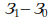

# Реферат по теме выпускной работы

<h2>Содержание</h2>

<ul class=content>
  <li class=ct1><a href="#intro">Введение</a>
  <li class=ct1><a href="#p1">1. Мероприятия по снижению потерь электрической энергии</a>
  <li class=ct2><a href="#p11">1.1. Модернизация и реконструкция действующих СЭС предприятий, распределительных схем питания цеховых трансформаторных подстанций (ТП) и электроустановок</a>
  <li class=ct2><a href="#p12">1.2. Выравнивание неравномерных суточных графиков электрических нагрузок</a>
  <li class=ct2><a href="#p13">1.3. Энергоэффективная эксплуатация трансформаторов цеховых подстанций</a>
  <li class=ct2><a href="#p14">1.4. Установка компенсирующих устройств</a>
  <li class=ct2><a href="#p15">1.5. Выбор рационального напряжения</a>
  <li class=ct2><a href="#p16">1.6. Экономия электроэнергии в электрических сетях</a>
  <li class=ct2><a href="#p17">1.7. Стандартизация, сертификация и измерение электрической энергии</a>
  <li class=ct2><a href="#p18">1.8. Внедрение АСКУЭ</a>
  <li class=ct2><a href="#p19">1.9. Замена ламп освещения на энергосберегающие</a>
  <li class=ct2><a href="#p110">1.10. Частотно–регулируемый электропривод</a>
  <li class=ct1><a href="#conc">Выводы</a>
  
  <li class=ct1><a href="#ref">Список источников</a>
</ul>

## Введение

На сегодняшний
день энергосбережение является одной
из наиболее актуальных задач стратегии
развития государственной экономики,
что отражено в Законе Российской
Федерации «Об энергосбережении». Кроме
того, в соответствии с постановлением
Правительства Российской Федерации №
1087 «О неотложных мерах по энергосбережению»,
становятся приоритетными регулярные
обследования предприятий, направленные
на разработку и реализацию программы
энергосбережения. Также требования к
качеству и надежности энергоснабжения
постоянно ужесточаются.

Экономия электроэнергии означает, прежде всего,
снижение потерь электрической энергии
во всех частях системы электроснабжения
и в самих электроприемниках, то есть
технические потери. Основными способами
снижения потерь энергии в системах
электроснабжения являются:
1. Рациональное
построение системы энергоснабжения,
при ее проектировании и реконструкции,
в том числе с использованием рационального:
общего количества трансформаций;
напряжения; мощности и количества
трансформаторов на трансформаторных
подстанциях; расположение подстанций;
схемы электроснабжения; компенсация
реактивной мощности и т. д.
2. Снижение потерь
электроэнергии в существующих системах
электроснабжения, в том числе: регулирование
напряжения; управление питанием;
ограничение холостого хода трансформаторов
и потребителей электроэнергии;
модернизация существующего и использование
нового, более экономичного и надежного
технологического и электрического
оборудования; улучшение качества
электроэнергии; применение экономически
обоснованного режима работы силовых
трансформаторов; замена, где это возможно
АД на СД,; автоматическое управление
освещением в течение суток; использование
рациональных методов регулирования
режимов работы насосных и вентиляционных
установок и т.д .;
3. Нормирование
потребления электроэнергии, разработка
научно обоснованных стандартов удельного
потребления электроэнергии на единицу
продукции; нормирование потребления
электроэнергии предполагает наличие
систем учета и контроля потребления
электроэнергии на предприятиях;
4. Организационные
и технические мероприятия, которые
разрабатываются конкретно на каждом
предприятии с учетом его специфики.

Известно, что при
передаче электроэнергии от источника
к приемнику теряется 10-15% электроэнергии,
выделяемой из шин подстанции.

Некоторые способы
экономии энергии обсуждаются более
подробно ниже.

## 1. Мероприятия по снижению потерь электрической энергии
	
Снижение потерь
электрической энергии – целевой
показатель энергосбережения и повышения
энергетической эффективности
соответсвующих программ.<a href="#ref1">[1]</a>

<i>Энергетическая
эффективность</i><i><b> </b></i>– это совокупность
характеристик, которые отражают отношение
полезного эффекта от использования
энергетических ресурсов к затратам
энергетических ресурсов, произведенным
в целях получения такого эффекта.
Основным критерием оценки эффективности
функционирования и развития СЭС
предприятий, в том числе мероприятий
по снижению потерь электрической энергии
является надежное и экономичное снабжение
потребителей ЭЭ требуемого качества <a href="#ref2">[2]</a>.

<i>Класс энергетической
эффективности</i><i><b> </b></i><b>– </b>характеристика
продукции, отражающая ее энергетическую
эффективность.

Рассмотрим методы,
которые наиболее практичны и экономически
рациональны для повышения эффективности
СЭС промышленных предприятий.

### 1.1. Модернизация и реконструкция действующих СЭС предприятий, распределительных схем питания цеховых трансформаторных подстанций (ТП) и электроустановок

Это осуществляется путем замены устаревшего
электрооборудования на новое с повышением
КПД и степени надежности, внедрения
энергосберегающих технологий. Такой
метод является самым распространенным.

### 1.2. Выравнивание неравномерных суточных графиков электрических нагрузок

Этот метод позволяет существенно уменьшить
пиковый максимум нагрузки, что способствует
снижению потерь и экономии электрической
энергии в сети, так как на производстве
могут использовать одновременно
сталеплавильные печи различного рода,
прокатные станы, сварочные установки
и т.д. Если предприятие работает в две
смены (утренняя и вечерняя), то можно
ввести третью – ночную, за счет которой
разгрузить «пик» осветительной нагрузки
второй смены, тем самым заполнив ночной
провал суточного графика потребления.
Введение интервала между рабочими
сменами в период резко выраженного
максимума нагрузки энергосистемы также
решает проблему энергосбережения.

Для обеспечения стабильной работы
промышленного предприятия необходимо
проектировать графики ограничения
потребления мощности электроэнергии
при перерывах электропотребления на
основании данных об удельных ущербах,
комплексных схем технологического
процесса и системы электроснабжения <a href="#ref2">[2]</a>.

Недостатки
этого метода приводят к нарушению
нормальных производственных режимов
работы предприятий и ухудшению условий
труда рабочих.

### 1.3. Энергоэффективная эксплуатация трансформаторов цеховых подстанций

Потери в трансформаторах бывают двух типов –
потери в обмотках и потери в сердечнике.
Потери в обмотках непосредственно имеют
связь с сопротивлением медных обмоток
и выделением тепла, величина этих потерь
пропорциональна квадрату тока и
составляет 1 – 3 % номинальной мощности
при 100 % загрузки трансформатора.

Суммарные потери
ЭЭ в трансформаторе:

.

;

Где <i>Т</i><i>вкл</i>
– время включения трансформатора в
году, час.

где ,
 - соответственно время максимальных
потерь активной и реактивной мощностей.

Из формул видно,
что даже при холостом ходе трансформатора,
при отключенной нагрузке, трансформатор
несет потери электроэнергии.

Обычно на предприятиях
в свободные от работы смены или выходные
дни ведутся ремонтные работы, испытания
оборудования и т. д. Для производства
таких работ также требуется электроэнергия,
но в значительно меньшем количестве,
чем в рабочие дни. Включение всех цеховых
трансформаторов вызывает большие
нерациональные потери за счет потерь
холостого хода трансформаторов. Для
устранения таких потерь рекомендуется
проектировать новые схемы электроснабжения,
предусматривая резервные связи
(перемычки) на стороне низшего напряжения
цеховых трансформаторов. При этом
целесообразно питать установки для
ремонтных работ, ночного, охранного и
дежурного освещения по всей территории
предприятия и т. п., включая в работу
только один-два трансформатора в разных
точках сети.

В условиях
действующих промышленных предприятий
при отсутствии запроектированной схемы
такого питания можно путем незначительной
реконструкции сети обеспечить
целесообразный режим работы силовых
трансформаторов. Ограничение холостых
ходов имеет большое значение также для
таких установок, как сварочные н
электропечные.

Следует отметить,
что работа трансформаторов в режиме
холостого хода или близком к нему
вызывает излишние потери не только в
самом трансформаторе, но и во всей
системе питания из-за низкого коэффициента
мощности при холостом ходе трансформатора.

На трансформаторных подстанциях имеется
избыток установленных мощностей,
вследствие чего среднее значение
загрузки относительно низкое. Этот
избыток мощностей необходим для
обеспечения надежной и бесперебойной
работы трансформаторов в аварийной
ситуации, при выходе из строя одного из
них. Методы оптимизации применимы ко
всем ТП, согласно оценкам оптимизация
загрузки возможна в 25 % случаев.

В реальных условиях среднее значение
коэффициента загрузки всегда меньше
100 %, а максимальный КПД трансформатора,
независимо от мощности, достигается
при его загрузке в среднем на уровне 45
– 75 % от номинальной загрузки. Такой
метод позволяет определить оптимальные
варианты повышения эффективности для
трансформаторной подстанции:

* если общая нагрузка ниже 40 – 50 % номинальной мощности
	ТП, то в качестве меры энергосбережения
	логично повысить энергоэффективность
	подстанции за счет
	отключения
	одного
	или нескольких трансформаторов,
	доведя
	значение коэффициента загрузки
	оставшегося или оставшихся в работе
	трансформаторов до оптимальной величины;
* если общая нагрузка превышает 75 %
	номинальной мощности ТП, то для достижения
	максимального КПД трансформаторов
	необходимо установить дополнительные
	мощности;
* если трансформаторы исчерпали свой
	ресурс в ходе
	эксплуатации и необходима модернизация
	устаревших ТП, целесообразно их заменить
	на трансформаторы с пониженным уровнем
	потерь, что позволяет снизить потери 
	на  20  – 60 % <a href="#ref10">[10]</a>.

### 1.4. Установка компенсирующих устройств

Нагрузка на
предприятиях обычно
бывает активная и реактивная.
Реактивная мощность нагрузки промышленного
потребителя электроэнергии, как правило,
имеет индуктивный характер (асинхронные
двигатели, трансформаторы и т- п.), т.е.
ток нагрузки отстает по фазе от напряжения,
что приводит к повышению передаваемой
реактивной мощности в сети.

Рациональная
(оптимальная) компенсация реактивной
мощности в промышленных электрических
сетях включает в себя широкий круг
вопросов, направленных на повышение
эффективности электроустановок,
повышение качества потребляемой энергии,
включает в себя методы выбора и расчета
компенсирующих устройств на основе
условий для выполнения задач энергосистемы.
Важными и еще не полностью решенными
являются вопросы определения места
установки компенсирующих устройств
(КК) и выбора их типа, рациональной и
безопасной эксплуатации и защиты.
Разрабатываются вопросы автоматического
регулирования реактивной мощности в
промышленных электрических сетях, а
также создается целенаправленный
научный подход к разработке и решению
с минимальной погрешностью адекватной
математической модели системы рациональной
компенсации реактивной мощности.

Выбор рациональной
компенсации реактивной мощности приводит
к снижению потерь мощности из-за ее
перетоков, обеспечению надлежащего
качества потребляемой электроэнергии
за счет регулирования и стабилизации
уровня напряжения в электрических сетях
и достижению высоких технико-экономических
показателей эффективности. электроустановок.

Передача значительного
количества реактивной мощности по
линиям и через трансформаторы системы
электроснабжения бесполезна по следующим
основным причинам:
<ol>
<li>Появляются
дополнительные потери активной
мощности во всех составляющих системы
электроснабжения.

,

где ,
 - соответственно составляющие потерь
активной мощности от передачи активной
и реактивной нагрузки потребителя.

<li>Возникают дополнительные потери реактивной мощности.

,

где ,
 - соответственно составляющие потерь
реактивной мощности от передачи активной
и реактивной нагрузки потребителя.

Относительный
рост потерь активной мощности при
передаче реактивной 

<li>Возникают
дополнительные потери
напряжения, которые особенно
существенные в сетях, питающих системы
электроснабжения промышленных
предприятий.

<li>Загрузка реактивной
мощностью линий электропередач и
трансформаторов снижает пропускную
способность.

<li>Загрузка реактивной
мощностью трансформаторов уменьшает
их коэффициент полезного действия.

<li>Недопотребление
полезной мощности генераторов
электростанций и повышение удельного
расхода топлива.
</ol>

В связи с этим
проблема компенсации реактивных нагрузок
является неотъемлемым звеном целого
ряда вопросов оптимизации, строительство
и эксплуатации электроэнергетических
систем.

Рациональная
компенсация реактивных нагрузок в
заводских распределительных сетях
непрерывно связана с решением общей
проблемы компенсации реактивных нагрузок
и регулированием напряжения в
энергосистемах.

Кроме того, для
стимулирования установки компенсирующего
устройства (КП) на предприятиях, введена
оплата за потребленную реактивную
энергию.

Таким образом,
техническая задача компенсации реактивной
мощности превращается в экономический.

### 1.5. Выбор рационального напряжения

В настоящее время
общая установленная мощность низковольтных
электрических приемников отдельных
предприятий достигает 60-80 МВт. Потеря
электроэнергии в сетях и на преобразующих
установках составляет 20% от потребляемой
электроэнергии. В этом случае необходимо
выбрать оптимальный уровень напряжения.
Одним из способов снижения потерь
энергии является перевод внешних и
внутренних электрических сетей
предприятий на высокое напряжение. В
этом случае потери энергии уменьшаются
пропорционально квадрату отношения
напряжений до и после передачи.

Выбор рационального
напряжения является сложной задачей.
Напряжение определяет возможность
использования элементов системы
электроснабжения: сетей, трансформаторов,
реакторов, электрических устройств. С
одной стороны, увеличение напряжения
приводит к снижению потерь энергии при
передаче по промышленным сетям, а с
другой - требует увеличения количества
изоляторов, установки более мощных опор
и т.д.

Уровень напряжения
каждой ступени системы электроснабжения
(СЭС) следует выбирать на основании
технико-экономического обоснования.

Выбор напряжения
распределительных сетей ограничен
тремя значениями - 6, 10, 20 кВ. Более того,
использование напряжения 6 кВ, очевидно,
нерационально для вновь построенных
предприятий в связи с увеличением потерь
электроэнергии. Использование напряжения
20 кВ значительно снижает потери
электроэнергии в сетях промышленных
предприятий.

Чтобы снизить
потери мощности в цеховых сетях, следует
использовать напряжение не менее 0,38
кВ. Напряжение 0,66 кВ имеет несколько
преимуществ по сравнению с напряжением
0,38 кВ:
- при строительстве
сетей используется меньшее колличество
цветного металла, что приводит к меньшей
потери энергии;
- электродвигатели
средней мощности до 600-700 кВт, выполненные
для напряжения 0,66 кВ. имеют лучшие
технико-экономические показатели, чем
двигатели той же мощности на напряжении
6, 10 кВ;

Несмотря на
целесообразность использования на
промышленных предприятиях напряжение
0,66 кВ в сочетании с напряжением 10 кВ,
введение этих напряжений затрудняется
отсутствием достаточного ассортимента
электрооборудования, приборов,
комплектного оборудования 0,66 кВ и
электродвигателей 10 кВ и 0,66 кВ.

### 1.6. Экономия электроэнергии в электрических сетях

Потери электроэнергии
в сетях электроснабжения за время 

(ч) в общем виде могут быть рассчитаны по
выражению, кВт*ч

, (1)

где  - удельное сопротивление проводника
линии электропередачи, Ом/км;

 - ток в момент времени 

на расстоянии 

от начала линии;

 - длина линии, км.

Для определения
потерь энергии по формуле (1) необходимо
знать закон изменения во времени
протекающего по линии тока. В общем
случае это случайный процесс. Известны
три основных расчетных метода определения
потерь электроэнергии в сетях: графического
интегрирования, вычисления
среднеквадратичного (эффективного)
тока, определения времени потерь. 

Квадрат эффективного
тока пропорционален  потерям электроэнергии.
Он определяет средний нагрев проводника.
Эффективный ток

.

Если ток нагрузки
– случайный процесс, то, как известно,
эффективное значение можно выразить
через среднее значение 
 и дисперсию 

.

Метод расчета
потерь электроэнергии в электрических
сетях, изложен в  рекомендации Р 50-072-98
«Энергосбережение. Методика расчета
технологических потерь электроэнергии
в сетях электроснабжения напряжением
от 0,38 до 110 кВ включительно». В этом
документе приведены характерные 
суточные графики нагрузок трансформаторных
подстанций 110-35.10 кВ и 10.0,4 кВ, питающих
коммунально-бытовые, сельскохозяйственные,
производственные установки потребителей
в виде зависимости среднего значения
и   дисперсии активной и реактивной
нагрузки от времени суток (почасовые
графики нагрузки).

Потери электроэнергии
в линиях с симметричной нагрузкой
рекомендуется вычислять по формулам.

, кВт*ч

, кВт

,

где  - промежуток времени, в течении которого
нагрузка постоянна, ч;

 - длина линии, км;

 - среднегеометрическое расстояние между
проводами, м;

 - диаметр провода, м.

#### Основные методы энергосбережения в электрических сетях

<u>1.Перевод
электрических сетей на повышенное
напряжение.</u>

Экономия электроэнергии<b> </b>в сети при переводе
ее на более высокое напряжение
определяется, кВт*ч

,

где ,
 - эффективные значения токов при
напряжениях 
 и , (
), А;

,
 - удельное активное сопротивление
провода, Ом/км;

 - длина линии, км.

При проведении
мероприятия без замены проводов 

<u>2. Включение под нагрузку резервной линии.</u>

Так как потери электроэнергии в сетях
пропорциональны активному сопротивлению
проводов, то параллельное включение
двух одинаковых по длине и сечению линий
приводит к сокращению потерь в 2 раза.

Экономия электроэнергии <i>при проведении
реконструкции сети</i> (замена проводов,
изменение длины ЛЭП без изменения
напряжения), кВт*ч

,

где ,
 - удельное активное сопротивление
провода до и после реконструкции сети,
Ом/км;

,
 - длина линии до и после реконструкции
сети, км.

<u>3. Правильный
выбор сечений с учетом экономических
условий.</u>

Вспомним, что такое
экономическая плотность тока.

Рисунок 1

Приведенные затраты на сооружение ЛЭП слагаются из трех 
составляющих. 

– не зависящая от сечения (затраты на
сооружение и эксплуатацию опор,
изоляторов), 

 - пропорциональная
сечению проводника, равная приведенным
затратам на провода и издержкам на их 
амортизацию;

 - обратно
пропорциональная сечению проводника
величина, равная стоимости годовых
потерь электроэнергии в линии.

Кривая приведенных затрат пологая. Поскольку
в СССР основное внимание уделялось
экономии цветного металла, экономическое
сечение выбрано  меньше, чем то, что
соответствует минимуму приведенных
затрат. Это привело к к завышению 

и, как следствие этого,— к увеличению
потерь в линиях. (,

может достигать 50% 
).

Для неизолированных
алюминиевых проводов экономическая
плотность тока равна 1,1—1,3 А/мм2,
тогда как в зарубежной практике
ниже — около 0,6—0,8 А/мм2, что приводит
к выбору больших сечений при тех же
условиях, а следовательно, и к меньшим
потерям электроэнергии в сетях вследствие
их меньшего нагрева. 

Значение
экономического сечения зависит от
соотношения стоимостей электроэнергии
и проводниковых материалов. Поэтому
рекомендуемые в ПУЭ значения 

могут не соответствовать сложившимся
экономическим условиям. В большинстве
случаев сечение, выбранное по критерию
ежегодных приведенных затрат, оказывается
на 2— 3 ступени выше по шкале сечений.
чем сечение, рассчитанное по экономической
плотности тока.

Надежность и безаварийность работы электрической
сети, в немалой степени зависит от
качества контактных соединений (КС).
Для повышение надежности работы КС
необходимы снижение и стабилизация
переходного электрического сопротивления,
что обеспечивает уменьшение потерь
электроэнергии в токопроводах,
шинопроводах и т. д.

### 1.7. Стандартизация, сертификация и измерение электрической энергии

При проведении работ по энергосбережению
прежде всего следует определить качество
электроэнергии (далее - КЭ). Это может
быть осуществлено с помощью таких
процедур, как стандартизация, измерение
и сертификация. Юридической основой
указанных процедур являются Законы РФ:
«О стандартизации»; «Об обеспечении
единства измерений»; «О сертификации
продукции и услуг». 

В РФ действует межгосударственный стандарт
ГОСТ 13109-97 «Нормы качества электрической
энергии в системах электроснабжения
общего назначения». Указанный стандарт
соответствует международным стандартам
МЭК861, МЭК1000-3-2, МЭК1000-3-3,МЭК1000-4-1 и
публикациям МЭК 1000-2-1, МЭК1000-2-2 в части
уровней электромагнитной совместимости
в системах электроснабжения и методов
измерения электромагнитных полей. В
нем установлены показатели и нормы
качества электроэнергии в электрических
сетях систем электроснабжения общего
назначения переменного трехфазного и
однофазного тока частотой 50 Гц в точках,
к которым присоединяются электрические
сети, находящиеся в собственности
различных потребителей электроэнергии
(точки общего присоединения).

Показателями
КЭ являются:
* установившееся отклонение напряжения
(Vy);
* размах изменения напряжения
(Vt);
* доза фликера (Pt);
* коэффициент искажения синусоидальности кривой напряжения
(Kv);
* коэффициент n-ой гармонической составляющей напряжения
(Kv(n));
* коэффициент несимметрии напряжений по обратной последовательности (K2v);
* коэффициент несимметрии напряжений по нулевой последовательности (Kov);
* отклонение частоты (f);
* длительность провала напряжения (tn);<
* импульсное напряжение (Vимп.);
* коэффициент временного перенапряжения (Kпер.v).

Из них наиболее
употребимы в практических расчетах
первые шесть.

На показатели КЭ
установлены стандартом два вида норм:
нормально
допустимые; предельно допустимые.

Увеличение напряжения (Vy) на 10% приводит к
возрастанию светового потока, а
следовательно, и освещенности рабочей
поверхно- сти до 40 %. При этом срок службы
светильников сокращается почти в 3 раза.

Снижение напряжения
на 10 % приводит к уменьшению светового
потока до 40%. При этом срок службы
электроосветительных приборов
увеличивается почти в два раза.

Отклонение напряжения оказывает заметное влияние,
как на значение вращающего момента,
так и на скольжение асинхронных электро-
двигателей. При снижении напряжения до
10% значение момента вра- щения
электродвигателей уменьшается почти
на 20%. При повышении напряжения существенно
увеличивается потребление реактивной
мощ- ности, что приводит к снижению cos
и дополнительному насыщению магнитной
системы электродвигателя. Из анализа
статистических дан- ных следует, что
при снижении напряжения на 10 % срок
службы элек- тродвигателей сокращается
почти в два раза.

Уменьшение частоты
напряжения питания (f) приводит к
пропор- циональному понижению скорости
вращения всех электрических машин, что
вызывает снижение производительности
соединенных с ними при- водных механизмов.
Существует ряд технологических процессов,
в ко- торых качество выпускаемой продукции
существенно зависит от ста- бильности
значения частоты напряжения питания
электродвигателей.

Несимметрия напряжения обратной последовательности
(K2v) приводит к появлению токов
обратной последовательности в обмотках
электродвигателей, под действием которых
образуются тормозные вра- щающие моменты.

Несимметрия
напряжения нулевой последовательности
(Kov) спо- собствует появлению токов
нулевой последовательности, что приводит
 к дополнительному нагреву активных
частей электрооборудования. Кроме
этого, токи нулевой последовательности,
протекая через заземлитель,
приводят к высушиванию грунта и увеличению
сопротивления заземляющего
устройства. Это может привести к сбоям
в работе релейной защиты.  

Несинусоидальность
напряжения питания (Kv и Kv(n))
приводит в целом к тем же негативным
явлениям, что и несимметрия. Однако
из-за повышенной частоты высших
гармонических составляющих возникают
больший нагрев и увеличенные диэлектрические
потери в конденсато- рах. Под действием
несинусоидального напряжения могут
появиться условия для возникновения
резонансных зон.

Энергоснабжающая
организация и потребители должны
периоди- чески контролировать качество
электрической энергии. Контроль отклонений
частоты производится энергоснабжающей
организацией постоянно. Контроль
отклонений напряжения следует производить,
как правило, ежеквартально, а при
незначительном сезонном изменении
нагрузок ЦП - два раза в год.

### 1.8. Внедрение АСКУЭ

Автоматизированная система учёта электроэнергии — это
технологическое решение, которое
обеспечивает:
* дистанционный сбор данных с интеллектуальных приборов учёта;
* передачу полученной информации в личный кабинет оператора;
* обработку переданных данных с последующей выгрузкой в информационные системы— 1С, ГИС ЖКХ и другие.

Система автоматизированного контроля за отпуском
и потреблением электроэнергии обеспечивает
достоверный учёт, который одновременно
выгоден ресурсоснабжающим организациям,
хозяйствующим субъектам, собственникам
жилья и государству. Совершенствование
технологий обмена данными позволило
существенно упростить коммерческий
учёт энергоресурсов, снизить стоимость
его внедрения.

### 1.9. Замена ламп освещения на энергосберегающие

Сегодня существует
четыре основных видов ламп освещения:
1. Традиционная
	лампа накаливания — в настоящее время
	одна из самых распространенных ламп.
	Состоящая из цоколя, стеклянной колбы
	и вольфрамовой нити. Нить накаливается
	и излучает свет. Именно на нагрев
	тратится 80% мощности данной лампы, и
	только 20% - на освещение. 
2. Галогенная лампа
	– конструктивно похожа на лампу
	накаливания, свечение так же происходит
	из-за накала вольфрамовой нити, однако
	сама нить помещена в колбу с галогеновым
	газом, что позволяет существенно
	повысить светоотдачу и делать лампы
	небольшого размера. Из-за этой особенности
	лампы такого типа нашли широкое
	применение в автомобилях, а так же в
	небольших светильниках.
3. Люминесцентная
	лампа (энергосберегающая), - это
	газоразрядный источник света, в котором
	электрический разряд в парах ртути
	создает ультрафиолетовое излучение,
	которое преобразовывается в видимый
	свет с помощью люминофора. Лампы такого
	типа начали активно использоваться с
	2010 года, преимущественно в офисах, в
	виде трубчатых ламп. Энергоэффективность
	этих ламп примерно в 5 раз выше, чем у
	ламп накаливания.
4. Светодиодная
	лампа - с точки зрения эволюции источников
	света, наиболее современный и
	энергоэффективный тип ламп. Из названия
	видно, что в качестве источника света
	используются светодиоды. Конструктивно
	такие лампы сложнее, из-за чего цена на
	них в разы выше, чем на лампы накаливания.
	Однако окупаемость данного вида ламп
	не более двух лет, за счет того, что
	95-98% мощности тратится на свет и только
	2-5% на нагрев и менее значимые транзитные
	потери.  Сравнение по основным
	характеристикам было сведено в таблицу

<table cellpadding="2" cellspacing="0" style="margin: auto">
	<caption>Таблица 1 – Сравнения энергоэффективности разных типов ламп</caption>
	<col width="121"/>
	<col width="110"/>
	<col width="100"/>
	<col width="149"/>
	<col/>
	<tr>
		<td style="border: 1px solid #000000">Параметр сравнения</td>
		<td style="border: 1px solid #000000">Лампа накаливания</td>
		<td style="border: 1px solid #000000">Галогенная лампа</td>
		<td style="border: 1px solid #000000">Люминисцентная лампа</td>
		<td style="border: 1px solid #000000">Светодиодная лампа</td>
	</tr>
	<tr>
		<td valign="top" style="border: 1px solid #000000">Потребляемая мощность, Вт</td>
		<td style="border: 1px solid #000000">75</td>
		<td style="border: 1px solid #000000">45</td>
		<td style="border: 1px solid #000000">15</td>
		<td style="border: 1px solid #000000">10</td>
	</tr>
	<tr>
		<td valign="top" style="border: 1px solid #000000">Нагрев</td>
		<td style="border: 1px solid #000000">сильный</td>
		<td style="border: 1px solid #000000">сильный</td>
		<td style="border: 1px solid #000000">средний</td>
		<td style="border: 1px solid #000000">низкий</td>
	</tr>
	<tr>
		<td valign="top" style="border: 1px solid #000000">Срок службы,
			часов, усреднено</td>
		<td style="border: 1px solid #000000">1000</td>
		<td style="border: 1px solid #000000">2-2,5 тысячи</td>
		<td style="border: 1px solid #000000">7-10 тысяч</td>
		<td style="border: 1px solid #000000">30-50 тысяч</td>
	</tr>
</table>

Как видно, при
одинаковой светоотдаче потребление
ламп отличается в разы, так как меньше
затраты на нагрев. Плюсом в плане
энергоэффективности является
продолжительный срок службы светодиодных
ламп.

### 1.10. Частотно–регулируемый электропривод

На предприятиях,
ввиду своих преимуществ, большинство
электродвигателей представляют собой
асинхронные электродвигатели с
короткозамкнутым ротором. Регулировать
скорость вращения ротором можно
традиционными способами, такими как
дросселирование с использовнаием
заслонок или клапанов, применение муфт
для регулировки момента, дискретное
регулирование Вкл/Выкл.

Недостатком таких
способов регулирования производительности
является отсутствие прямого эффекта
экономии энергии. Энергопотребление
уменьшается, однако не настолько
эффективно, как применение
частотно-регулируемого электропривода.

Рисунок 2 – Сравнение
потребляемой мощности между двумя
способами регулирования производительности
электродвигателя

Как видно из графика
ниже, основная производительность
системы – 70%. Если снизить скорость
вращения двигателя, это приведет к
значительной экономии энергии.

Рисунок 3 – Обобщенный рабочий цикл систем нагрева,
вентиляции, кондиционирования

В целом, применение
частотно-регулируемого асинхронного
электропривода в насосных и вентиляторных
установках дает следующие преимущества:
* экономия электроэнергии до 60%; 
* экономия транспортируемого продукта за счет снижения непроизводительных расходов до 25%; 
* снижение аварийности сети и снижение аварийности электрооборудования за счет устранения ударных пусковых токов; 
* снижение уровня шума, создаваемого технологическим оборудованием; 
* удобство автоматизации;
* удобство и простота внедрения.

<h2>Выводы</h2>

С ростом потребления
электроэнергии из-за электрификации
производства, повышаются затраты на
электроэнергию, однако новые системы
энергосбережения помогут сократить
расходы при минимальном сроке окупаемости.

<h2>Список источников</h2>
<ol>
  <li>Лыкин, А. В.
	Энергосбережение и повышение
	энергетической эффективности в
	электрических сетях: учебное пособие
	/ А. В. Лыкин. —  Новосибирск : Новосибирский
	государственный технический университет,
	2013. — 115 c. — ISBN 978-5-7782-2202-1. — Текст :
	электронный // Цифровой образовательный
	ресурс IPR SMART : [сайт]. — URL:
	https://www.iprbookshop.ru/45212.html (дата обращения:
	19.11.2022). — Режим доступа: для авторизир.
	пользователей
  </li>
  <li>Железко Ю. С.,
	Артербев А. В., Савченко О. В. Расчет, анализ и нормирование потерь электроэнергии в электрических сетях. Руководство для практических расчетов. Изд. ЭНАС, 2008. – 280 с.
  </li>
  <li>Энергосбережение
	на промышленных предприятиях: Учебное
	пособие / Под ред. проф. М.И. Яворского.
	– Томск: Изд. ТПУ, 2000. – 134 с.
  </li>
  <li>Аратюнян А.В.
	Основы энергосбережения. - М.: ОАО
	«Энергосбережение», 2007.- 600 с.
  </li>
  <li>Сравнение видов
	освещения [Электронный ресурс] — Режим
	доступа:<a href="http://svetlix.ru/articles/lamps_comparison">
	http://svetlix.ru/
  </li>
  <li>Стрельников, Н.
	А. Энергосбережение: учебное пособие
	/ Н. А. Стрельников. —  Новосибирск :
	Новосибирский государственный
	технический университет, 2019. — 72 c. —
	ISBN 978-5-7782-3884-8. — Текст : электронный //
	Цифровой образовательный ресурс IPR
	SMART : [сайт]. — URL: https://www.iprbookshop.ru/98770.html
	(дата обращения: 19.11.2022). — Режим доступа:
	для авторизир. пользователей
  </li>
</ol>
