# Реферат по теме выпускной работы

<h2>Содержание</h2>

<ul class=content>
  <li class=ct1><a href="#p0">Введение</a>
  <li class=ct1><a href="#p1">1. Понятие надежности элементов системы электроснабжения как комплексного свойства</a>
  <li class=ct1><a href="#p2">2. Расчет надежности последовательно соединенных элементов схемы замещения</a>
  <li class=ct1><a href="#p3">3. Расчет надежности восстанавливаемого элемента системы электроснабжения</a>
  <li class=ct1><a href="#p4">Выводы</a>
  
  <li class=ct1><a href="#ref">Список источников</a>
</ul>

## Введение

В современных мощных  электроэнергетических
системах неотъемлемыми и важными
элементами являются  электрооборудование
и  аппараты управления высокой
конструктивной сложности, способные
выполнять сложные задачи. В процессе
функционирования систем стало расти
число отказов составляющего их
оборудования. Не вызывает сомнений, что
качество, эффективность, безопасность,
живучесть, управляемость, устойчивость
системы в целом возможны только при
стабильной работе образующих ее
элементов. Каждое из приведенных свойств
имеет смысл при наличии изначального
свойства любого оборудования —
надежности. Поэтому изучение закономерностей
отказов электрооборудования систем
электроснабжения – актуальная задача
для инженеров.

## 1. Понятие надежности элементов системы электроснабжения как комплексного свойства

Надежность — свойство объекта сохранять во времени
в установленных пределах значения всех
параметров, характеризующих способность
выполнять требуемые функции в заданных
режимах и условиях применения, технического
обслуживания, ремонтов, хранения и
транспортировки. [1] При этом необходимо
обратить внимание на непрерывность
выполнения объектом заданных функций.
То есть невозможно оценить надежности
объекта, например, во время проведения
на нем планово-предупредительных работ,
ремонтов, замены оборудования,
освидетельствований и других мероприятий,
связанных с остановкой объекта, так как
в это время объект не выполняет своих
функций. Во-вторых, в определение
надежности включено понятие «установленные
пределы». Сложная система при отказе
отдельных элементов или подсистем
сохраняет свою работоспособность и
может обеспечивать своих потребителей
электроэнергией, но в меньшем количестве.
В-третьих, надежность объекта целесообразно
определять за определенные промежутки
времени.

В зависимости от условий решаемой задачи
один и тот же объект может именоваться
системой или элементом. Электрический
аппарат в целом при анализе его надежности
является сложной системой, элементами
которой можно назвать устройства,
обеспечивающие селективность отключения,
перегрузки, короткого замыкания и др.
Но если производится анализ надежности
системы электроснабжения, включающей
группу электрических аппаратов, то в
этом случае электрический аппарат
является элементом системы. В свою
очередь, система электроснабжения может
явиться элементом более крупной
электроэнергетической системы данного
района страны
[2].

Надежность
как сложное свойство в зависимости от
назначения объекта и условий его
применения состоит из сочетаний следующих
свойств [3]:
- безотказность;
- ремонтопригодность;
- долговечность;
- устойчивоспособность;
- сохраняемость;
- безопасность.

Для объектов, работающих непрерывно, таких,
например, как энергоблок электрической
станции, из этих свойств наиболее важны
три первые. Свойства, составляющие
надежность, могут характеризовать и
другие особенности объекта. Так,
безопасность ЭЭС в значительной степени
обусловлена безотказностью
электрооборудования, хотя имеет и
самостоятельное значение.

Безотказность — это свойство объектов сохранять
работоспособное состояние в течение
некоторого времени или некоторой
наработки. Обычно она рассматривается
применительно к режиму эксплуатации
объекта, и перерывы в его работе (плановые
и внеплановые) не учитываются [1].

Безотказность характеризуется техническим состоянием
объекта: исправностью, неисправностью,
работоспособностью, неработоспособностью,
дефектом, повреждением и отказом. Каждое
из этих состояний обладает совокупностью
значений параметров, описывающих
состояние объекта, и качественных
признаков. Номенклатура этих параметров
и признаков, а также пределы допустимых
их изменений устанавливаются нормативной
документацией на объект.

Состояние объекта, обусловливающее способность
выполнять заданные функции, которые
соответствуют нормативно-технической
и конструкторской документации, есть
его работоспособность.

Исправное состояние объекта предполагает
соответствие всем требованиям
нормативно-технической и конструкторской
документации. В противоположность
этому, неисправное состояние объекта
означает несоответствие хотя бы одному
из требований нормативно-технической
и конструкторской документации. Если
значения хотя бы одного параметра,
характеризующего способность элемента,
к примеру электрического аппарата,
выполнять заданные функции, не
соответствуют требованиям
нормативно-технической и конструкторской
документации, то такое состояние
определяется как неработоспособное. А
событие, заключающееся в нарушении
работоспособного состояния объекта,
называется отказом. Событие, состоящее
в нарушении исправного состояния
объекта, но сохраняющего его
работоспособность, носит название
повреждения (дефекта).

Границы между исправным и неисправным,
работоспособным и неработоспособным
состояниями обычно условны и представляют
собой, в основном, совокупность
определенных значений параметров
объектов. Эти значения одновременно
являются границами соответствующих
допусков. Работоспособность и
неработоспособность могут быть как
полными, так и частичными. Если объект
полностью работоспособен, то в определенных
условиях эксплуатации возможно достижение
максимальной эффективности его
применения. Эффективность применения
в тех же условиях частично работоспособного
объекта меньше максимально возможной,
но значения ее показателей находятся
в пределах, установленных для такого
функционирования, которое считается
нормальным для данного объекта. 

Работоспособность
должна рассматриваться применительно
к определенным внешним условиям
эксплуатации объекта. Элемент,
работоспособный в одних условиях, может,
оставаясь исправным, оказаться
неработоспособным в других.

Переход объектов из одного состояния в другое
обычно происходит вследствие повреждения
или отказа. Общая схема состояний и
событий приведена на рис. 1, где
<i>1</i> — повреждение; <i>2</i> — отказ; <i>3</i> — переход объекта в предельное состояние;
<i>4</i> — восстановление; <i>5</i> — ремонт.

Рис. 1 -  Схема постоянных состояний и событий
объектов:

Работоспособный
объект в отличие от исправного должен
удовлетворять лишь тем требованиям
нормативно-технической и конструкторской
документации, выполнение которых
обеспечивает его применение по назначению.
Очевидно, что работоспособный элемент
может быть неисправным или, например,
не удовлетворяющим эстетическим
требованиям, если ухудшение внешнего
вида не препятствует его применению по
назначению.

Переход элемента из исправного в неисправное
состояние происходит вследствие
дефектов. Термин «дефект» применяют, в
основном, на этапах изготовления и
ремонта, когда требуется учитывать
отдельно каждое конкретное несоответствие
объекта требованиям, установленным
нормативной документацией. Термин
«неисправность» используется, когда
требуется учитывать изменения технического
состояния элементов независимо от числа
обнаруженных дефектов. Находясь в
неисправном состоянии, объект имеет
один или несколько определенных дефектов.
В этом плане возможно представление
состояний в виде, показанном на рис. 2

Рис. 2 – Состояния и события объекта.

Ремонтопригодность — свойство объекта, заключающееся в
приспособленности к предупреждению и
обнаружению причин отказов, повреждений
и восстановлению работоспособного
состояния путем проведения технического
обслуживания и ремонтов. Ремонтопригодность
представляет собой совокупность
технологичности при техническом
обслуживании и ремонтной технологичности
объектов. Свойство ремонтопригодности
полностью определяется его конструкцией,
т.е. предусматривается и обеспечивается
при разработке, изготовлении и монтаже
объектов с учетом будущего целесообразного
уровня их восстановления, который
определяется соотношением ремонтопригодности
и внешних условий для выполнения ремонта,
в том числе устанавливаемых для этого
пределов соответствующих затрат. Отсюда
происходит относительность деления
объектов на восстанавливаемые и
невосстанавливаемые применительно к
определенным внешним условиям (точнее,
на подлежащие и не подлежащие
восстановлению). Один и тот же элемент
в зависимости от окружающих условий и
этапов эксплуатации может считаться
восстанавливаемым или невосстанавливаемым.
Например, доступность для выполнения
ремонта встроенных электрических
аппаратов во время работы подсистемы
ЭЭС ограничена, эти элементы при работе
ЭЭС можно отнести к невосстанавливаемым.
Если электрический аппарат доступен
для ремонта, то его относят к
восстанавливаемым.

Таким образом, деление объектов на
восстанавливаемые и невосстанавливаемые
зависит от рассматриваемой ситуации и
в значительной степени условно. Необходимо
и безусловное деление этих же элементов
на вообще доступные для ремонта и не
подлежащие ему применительно ко всему
времени их существования, т. е. на
ремонтируемые и неремонтируемые. Деление
по обоим признакам для многих объектов
совпадает: ремонтируемый элемент может
быть восстанавливаемым на протяжении
всего срока службы, а неремонтируемый
остается невосстанавливаемым в течение
всего времени существования. Однако
имеются ремонтируемые объекты, которые
в определенных ситуациях в случае
возникновения отказа в течение данного
интервала времени не подлежат
восстановлению. С другой стороны, есть
неремонтируемые элементы,
самовосстанавливающие работоспособность
в случае возникновения некоторых отказов
— в частности, при наличии резервных
элементов и соответствующих автоматических
устройств, осуществляющих в таких
случаях переход на использование резерва
(например, элементы систем управления
и защиты).

Следовательно, при формулировании и решении задач
обеспечения, прогнозирования и оценивания
надежности существенное практическое
значение имеет решение, которое должно
приниматься в случае отказа объекта, —
восстанавливать его или нет. Отнесение
объекта к восстанавливаемым или
невосстанавливаемым предполагает выбор
определенных показателей надежности.

Долговечность — это свойство объектов сохранять
работоспособное состояние до наступления
предельного состояния при установленной
системе технического обслуживания и
ремонта. Для предельного состояния
объекта характерно следующее: дальнейшее
его применение по назначению недопустимо
или нецелесообразно, либо восстановление
исправного или работоспособного
состояний невозможно или нецелесообразно.
Критерием предельного состояния служит
признак/совокупность признаков
предельного состояния объекта,
установленных в нормативно-технической
и конструкторской документации. Объект
может перейти в предельное состояние,
оставаясь работоспособным, если его
дальнейшее применение по назначению
станет недопустимым по требованиям
безопасности, экономичности или
эффективности.

Переход объекта в предельное состояние влечет
за собой временное или окончательное
прекращение его эксплуатации.

Для неремонтируемых объектов имеет место
предельное состояние двух видов. Первый
совпадает с неработоспособным состоянием;
второй обусловлен тем обстоятельством,
что начиная с некоторого момента времени
дальнейшая эксплуатация пока еще
работающего элемента согласно определенным
критериям оказывается недопустимой в
связи с безопасностью. Переход
ремонтируемого объекта в предельное
состояние второго вида происходит
раньше момента возникновения отказа.

Для ремонтируемых объектов можно выделить
три вида предельных состояний. Первый
и второй предполагают капитальный или
средний ремонт, т. е. временное прекращение
эксплуатации. Третий — окончательное
прекращение эксплуатации объекта.

## 2. Расчет надежности последовательно соединенных элементов схемы замещения

Последовательным соединением элементов в системе
называется такое соединение, при котором
отказ в системе наступает в случае
отказа любого из элементов (рис. 3).

Рисунок 3 – последовательное соединение
элементов

В этом случае вероятность безотказной
работы системы, состоящей из <i>N
</i>элементов,
при условии, что отказы элементов
независимы:

где <i>Р</i>(<i>t</i>) — вероятность безотказной работы <i>i</i>-го
элемента.

Функцию безотказной работы <i>Р</i>(<i>t</i>)
можно выразить через интенсивность
отказов элементов:

где <i>λ</i><i>i</i> — интенсивность отказов <i>i</i>-го
элемента системы, <i>i</i>
= 1÷<i>N.</i>

При расчете надежности электрических систем
с последовательным соединением элементов
и учетом лишь внезапных отказов обычно
принимают допущение о простейшем
характере потока отказов.

Так как поток отказов считается стационарным,
то

Вычисление других количественных характеристик
безотказности электрических систем  в
этом случае производится по следующим
формулам:
- интенсивность отказов:

- средняя наработка до отказа:

- плотность распределения времени безотказной работы:

Данный метод расчета надежности оборудования
электрических систем имеет недостатки.
Во-первых, элементы в электрических
системах работают в различных условиях
по коэффициенту нагрузки, температуре,
давлению и влажности окружающей среды,
вибрации и т. п. Поэтому при расчете
надежности по этому методу необходимо
знать характеристики элементов в
зависимости от условий эксплуатации.
Во-вторых, на ранних стадиях проектирования
систем (т. е. при ориентировочном расчете
надежности) трудно установить режимы
работы элементов. Вот почему рассматриваемый
метод целесообразно применять при
окончательном расчете надежности
оборудования, когда построены опытные
образцы объекта и экспериментально
определены его режимы работы.

## 3. Расчет надежности восстанавливаемого элемента системы электроснабжения 

Специалисты в области оценки надежности технических
систем считают, что вероятность появления
аварий на промышленном предприятии в
течении года не должна превышать величину
Q(8760) ≤ 1×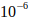.
Это тот уровень риска, к которому следует
стремиться, устанавливая степень риска,
обусловленную деятельностью промышленных
предприятий. При уменьшении риска ниже
уровня 10-6
в год общественность не выражает
чрезмерной озабоченности, и поэтому
редко предпринимаются специальные меры
для снижения степени риска. Это утверждение
означает, что ради экономической выгоды
от эксплуатации промышленного объекта
люди готовы идти на такой риск.

На сегодняшний день не существует простых
в использовании и точных в оценке методик
расчета надежности узлов нагрузки
систем электроснабжения промышленных
предприятий.

Поэтому разработка новых и усовершенствование
существующих методик оценки живучести
узлов нагрузки для систем электроснабжения
потребителей электрической энергии
является актуальной задачей.

Большинство элементов систем электроснабжения
являются восстанавливаемыми, при этом
быстрота и качество восстановления
зависят от приспособленности элемента
системы к ремонту (ремонтопригодности)
и от организации восстановления.
Применительно к элементам систем
электроснабжения восстановление
включает решение следующих вопросов:
- обнаружение факта появления отказа;
- обнаружение места появления отказа;
- обеспечение хорошей приспособленности к ремонту или замене отказавших элементов.

В общем случае время после появления
отказа может быть разделено на три
периода, а именно время с момента:
- появления отказа до момента установления этого факта системой контроля;
- установления факта появления отказа до момента обнаружения места появления отказа;
- обнаружения места появления отказа до момента ремонта или замены отказавшего элемента системы электроснабжения.

Длительность каждого из этих периодов зависит от
эффективности контроля и поиска места
появления отказов, конструкции элемента
системы электроснабжения, квалификации
обслуживающего персонала и т.д. 

Если законы распределения времени поиска
отказавшего элемента и его замены не
противоречат экспоненциальному

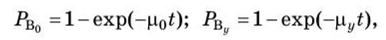

то закон восстановления можно определить
следующим образом. Плотность вероятности
двух случайных величин <i>t</i><i>0</i>
и составляет

где 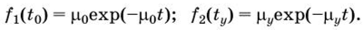

При р0= ру=р получаем уравнение

<table class="numeq">
<tr>
<td></td>
<td>(3.1)<td>
</tr>
</table>

которое характеризует время восстановления
элемента системы электроснабжения.

Если известны интенсивности отказов каждого
элемента ЭА, то среднее время восстановления
при экспоненциальном законе:

где

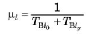

— интенсивность восстановления i-го элемента;
<i>Т</i>Вi0— среднее время обнаружения места отказа;
<i>Т</i>Вiу — среднее время устранения отказа.

Определим основные характеристики надежности
нерезервированного элемента системы
электроснабжения, предполагая, что
поток отказов простейший и время
восстановления экспоненциально.

Для резервированных последовательных
структур с восстановлением и произвольными
способами резервирования элементов
применяют марковские модели для описания
соответствующих графов (диаграмм)
состояний.[4] Обратимся к модели системы,
описанной с помощью теории марковских
однородных процессов. Рассмотрим формулу
для вероятности нахождения системы в
работоспособном состоянии:

<table class="numeq">
<tr>
<td>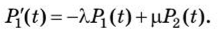</td>
<td>(3.2)<td>
</tr>
</table>

Учитывая, что

<table class="numeq">
<tr>
<td></td>
<td>(2.3)<td>
</tr>
</table>

<table class="numeq">
<tr>
<td></td>
<td>(3.4)<td>
</tr>
</table>

Если предположить, что в начальный момент
времени электрический аппарат с
вероятностью Р будет находиться в
работоспособном состоянии, т. е. Рх(0)
= Р, где 0 &lt; Р &lt; 1, тогда

<table class="numeq">
<tr>
<td>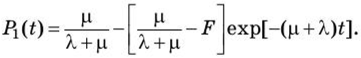 (2.5)</td>
<td>(3.5)<td>
</tr>
</table>

Если перед включением в работу производится
проверка объекта, и он оказывается
работоспособным, то Р = 1 и

<table class="numeq">
<tr>
<td> (2.6)</td>
<td>(3.6)<td>
</tr>
</table>

Если в момент включения объект неработоспособен
<i>(Р = </i>0), то

<table class="numeq">
<tr>
<td>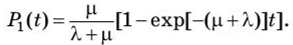</td>
<td>(3.7)<td>
</tr>
</table>

Выражения (3.5-3.7) характеризуют вероятность
работоспособного состояния электрического
аппарата в произвольный момент времени <i>t</i> и
могут быть использованы для определения
функции готовности электрического
аппарата.

Введем обозначение <i>М</i> = А./р. Тогда выражение (3.7) принимает вид:

<table class="numeq">
<tr>
<td></td>
<td>(3.8)<td>
</tr>
</table>

Для вероятности наступления неработоспособного
состояния можно аналогичным путем
получить следующую зависимость:

<table class="numeq">
<tr>
<td>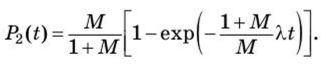</td>
<td>(3.9)<td>
</tr>
</table>

При <i>t</i> —&gt; ∞, что соответствует условию длительного
нахождения электрического аппарата в
рабочем состоянии, получим стационарное
решение:

<table class="numeq">
<tr>
<td>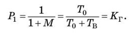</td>
<td>(3.10)<td>
</tr>
</table>

Выражение для определения функции готовности
может быть представлено в следующем
виде:

<table class="numeq">
<tr>
<td>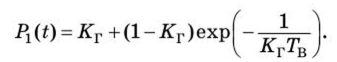</td>
<td>(3.11)<td>
</tr>
</table>

Если значение <i>t</i> мало, то

<table class="numeq">
<tr>
<td></td>
<td>(3.12)<td>
</tr>
</table>

т.е. <i>P</i>1(<i>t</i>)
совпадает с приближенным выражением
для вероятности безотказной работы при
малых значениях <i>t.</i>

Итак, при малых значениях <i>t</i>функция
готовности совпадает с вероятностью
безотказной работы <i>P(t)</i>, при
больших — с коэффициентом готовности.
Эти выводы получены для простейшего
потока отказов и экспоненциальном
законе времени восстановления.

Рассмотрим
характеристики надежности при произвольных
законах отказов и восстановления. Если
оценивать произвольный, но достаточно
большой промежуток времени <i>t</i>, то,
согласно эргодической теореме, вероятности
<i>Р</i><i>х
</i>и
<i>Р</i><i>2
</i>можно
рассматривать как отрезок времени, в
течение которого объект находится в
работоспособном или неработоспособном
состоянии. Таким образом, величина <i>P</i><i>x</i><i>t</i> представляет собой время, в течение которого объект
работоспособен, a <i>P</i><i>2</i><i>t</i> — время, затрачиваемое на восстановление работоспособности. Если за время <i>t</i>
было <i>п
</i>отказов,
то средняя наработка на отказ и среднее
время восстановления будут соответственно
равны:

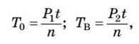

Откуда

Так как

то

Полученные зависимости для оценки надежности
нерезервированных восстанавливаемых
электрических аппаратов основаны на
предположении, что существует система
контроля, которая выявляет все отказы,
причем восстановление начинается
немедленно. В действительности некоторая
часть элементов системы электроснабжения
может быть не охвачена системой контроля,
поэтому значения показателей надежности
будут хуже, чем в случае наличия идеальной
системы контроля. Степень этого ухудшения
значений показателей надежности можно
оценить величиной

где <i>К</i> и <i>К’</i> — значения критериев соответственно при
идеальной и реальной системе контроля.

Для ориентировочных расчетов Δ<i>К</i> = 0,5...5,0%.

## Выводы

Анализ
общих закономерностей, определяющих
долговечность работы различных устройств
и сооружений, разработкай способов
предупреждения отказов на стадиях
проектирования, сооружения, эксплуатации,
оценивает количественно вероятность
того, что характеристики объекта будут
в пределах технических норм на протяжении
заданного периода времени. 

В практической деятельности инженеру-энергетику
приходиться принимать различные решения.
Например, выбирать проектный вариант
энергосистемы или ее части, производить
реконструкцию ее сетей и станций,
назначать режимы. В энергетике на выбор
решения влияет большое количество
факторов. Появляется неопределенность,
преодолевать ее помогают знания, опыт,
интуиция, качественный анализ. Среди
других факторов, надежность имеет особое
место, поэтому при расчетах необходимо
выяснить все условия работы и конструктивные
особенности элементов системы. 

В отчете приведены формулы, позволяющие
рассчитать вероятность безотказной
работы при различной длительности
времени обнаружения отказа на разных
его стадиях. 

## Список источников
<ol>
  <li>ГОСТ
	27.002-2015. Межгосударственный стандарт.
	Надежность в технике. Термины и
	определения.
  </li>
  <li>Матвеевский
	В.Р. Надежность технических систем.
	Учебное пособие. – Московский
	государственный институт электроники
	и математики. М., 2002 г. – 113 с.
  </li>
  <li>Аполлонский
	С., Куклев Ю. Надежность и эффективность
	электрических аппаратов. Учебное
	пособие. -  СПб.: Изд-во «Лань», 2011.-448.
  </li>
  <li>ГОСТ
	27.301-95. Межгосударственный стандарт.
	Надежность в технике. Расчет надежности.
	Основные положения.
  </li>
  <li>Шеметов
	А.Н. Надежность электроснабжения: учеб.
	пособие для студентов специальности
	140211 «Электроснабжение». – Магнитогорск:
	ГОУ ВПО «МГТУ им. Г.И. Носова», 2006.
  </li>
</ol>
