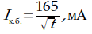

# Реферат по теме выпускной работы

## Содержание

<ul class=content>
  <li class=ct1><a href="#intro">Введение</a>
  <li class=ct1><a href="#p1">1. Действие электрического тока на организм человека и факторы, влияющие на исход поражения электрическим током</a>
  <li class=ct1><a href="#p2">2. Условия поражения человека электрическим током</a>
  <li class=ct1><a href="#p3">3. Меры обеспечения электробезопасности электроустановок на участках угольных шахт</a>
  <li class=ct1><a href="#p4">4. Использование разработанной  на кафедре ЭПГ математической модели для оценки электробезопасности электрооборудования на участках угольных шахт</a>

  <li class=ct1><a href="#conc">Выводы</a>
  
  <li class=ct1><a href="#ref">Список источников</a>
</ul>

## Введение

Современные
предприятия угольной промышленности
являются крупнейшими потребителями
электроэнергии. Они оснащены
высокопроизводительными машинами и
механизмами для работы в горных выработках
по добычи полезных ископаемых, мощными
транспортными средствами, а также
стационарными установками для обеспечения
выдачи добытого угля на поверхность и
для безопасной работы людей под землей.
К ним предъявляются повышенные требования
по применению электрооборудования. 

Специально для
угольной промышленности выпускается
взрывозащищенное электротехническое
оборудование Реконструкция и модернизация
шахт, дальнейшее внедрение технического
прогресса в угольной промышленности
предъявляют новые повышенные требования
к совершенствованию электрификации
горных работ. Возрастает потребность
в высокоэффективном и надежном
электрооборудовании, в более рациональных
и качественных схемах электроснабжения,
которые должны обеспечивать бесперебойную
и экономичную работу машин и механизмов,
повышать производительность труда,
повышать безопасность использования
электрической энергии в подземных
условиях. условия. 

Электрификация
горных предприятий имеет важное значение,
как основная энергетическая база
комплексной механизации и автоматизации
горных работ. Современные горнодобывающие
предприятия – крупные потребители
электрической энергии, обладающие
характерными особенностями, связанными
с условиями работы машин и механизмов.

## 1. Действие электрического тока на организм человека и факторы, влияющие на исход поражения электрическим током

Действие
электрического тока на организм человека
представляет довольно сложное и
многообразное явление. Человек, случайно
оказавшийся под напряжением, замыкает
электрическую цепь, по которой протекает
соответствующий ток, вызывающий
определённую реакцию организма, вид
которой зависит от силы тока.

Проходя через тело
человека, электрический ток может
вызывать поражение внутренних или
внешних органов. В первом случае при
достаточной величине тока может наступить
паралич органов дыхания или фибрилляции,
что часто влечет за собой смертельный
исход. Во втором случае могут иметь
место ожоги как в результате прохождения
через кожу человека значительных токов,
так и в результате непосредственного
воздействия электрической дуги.
Наибольшую опасность представляет
поражение внутренних органов человека.

Опасное действие
электрического тока на организм человека
зависит главным образом от величины
тока, протекающего через тело человека,
и длительности его воздействия.

В настоящее время
степень воздействия электрического
тока на человека в зависимости от
последствий принято классифицировать
следующим образом:

<ol>
	<li>Ощутимый
	ток – наименьшее значение тока, который
	ощущается человеком. Согласно опытам
	для разных людей этот ток колеблется
	в пределах 0,5-2мА при переменном токе с
	частотой 50Гц и 5-7мА – при постоянном
	токе.
	<li>Отпускающий
	ток – наибольшее (пороговое) значение
	тока, при котором человек сохраняет
	способность самостоятельно и произвольно
	освободиться от контакта с частями,
	находящимися под напряжением.
</ol>

Точное значение
этой величины указать сложно, потому
что она зависит от многих условий и
колеблется в широких пределах. Однако
можно сказать, что эта величина меньше
той, при которой уже появляются судорожные
непроизвольные сокращения мышц кисти
руки и предплечья, препятствующие
произвольному отделению человека от
контакта с сетью.

<ol start="3">
	<li>Неотпускающий
	ток – наименьшее значение тока, при
	котором человек теряет указанную выше
	способность и подвергается смертельной
	опасности при длительном воздействии
	тока. Наименьшее (пороговое) значение
	неотпускающего тока обычно принимают
	для переменного тока 50Гц – 10-15мА, а для
	постоянного тока – 5-80мА.
</ol>

Поражающее
действие электрического тока тесно
связано с длительностью его воздействия.

,

где 
 - кратковременный безопасный ток, мА;

<i>t</i> – длительность воздействия тока на
человека, с.

Эта формула
действительна для токов свыше 40-50мА и
длительность воздействия от 0,03 до 3с.

В настоящее время общепринятым пределом
опасности считается сила тока 100&nbsp;мА
при продолжительности его действия
3&nbsp;с. В любом случае, для обеспечения
безопасности людей необходимо быстро
отключать сеть.

Сила тока зависит как от приложенного
напряжения, так и от сопротивления тела
человека, которое определяется
сопротивлением кожного покрова и
сопротивлением внутренних органов. При
напряжении 200…300&nbsp;В
наступает электрический пробой верхнего
слоя кожи и общее сопротивление
уменьшается до своего минимального
значения (порядка 1&nbsp;кОм).

Сопротивление
тела человека – величина нелинейная.
Оно резко уменьшается при увеличении
приложенного к телу напряжения, увеличении
времени протекания тока через тело, при
неудовлетворительном физическом и
психическом состоянии и т.п. Из рис.1
следует, что увеличение приложенного
напряжения от 0 до 140&nbsp;В сопротивление
тела нелинейно падает от десятков тысяч
Ом до 800&nbsp;Ом. Соответственно возрастает
ток.

Кроме величины и
длительности воздействия тока опасность
поражения зависит также от: пути тока
(наиболее опасный ток, проходящий через
область сердца, органы дыхания и мозг);
рода и частоты тока; состояния организма
и физиологических особенностей человека
и др.

Рисунок
1 – Зависимость сопротивления тела
человека и тока, проходящего через него,
от величины приложенного напряжения

<i>Сопротивление
тела человека</i>
зависит от: места контакта, размеров
поверхности соприкосновения, состояния
кожи, ее влажности, загрязненности,
величины приложенного напряжения и
протекающего тока.

Исход поражения
в значительной мере определяется
длительностью протекания тока в
организме. Продолжительное (несколько
секунд) воздействие тока может приводить
к тяжелому исходу.

Замыкания на землю
в электроустановках, как правило,
отключаются защитой за доли секунды.
Однако устройства электробезопасности
(заземления и др.) рассчитывают, исходя
из больших величин допустимого тока и
длительности его воздействия (табл.1).

Таблица 1 – Параметры
электробезопасности (требования
ГОСТ&nbsp;12.1.038-82)

<table width="604" cellpadding="7" cellspacing="0" border="1">
  <col width="228"/>
  <col width="40"/>
  <col width="40"/>
  <col width="40"/>
  <col width="31"/>
  <col width="46"/>
  <col width="79"/>
  <tbody>
    <tr>
      <td rowspan="2" width="228">

        Расчётные
        параметры

      </td>
      <td colspan="6" width="346">

        Длительность
        воздействия тока, с.

      </td>
    </tr>
  </tbody>
  <tbody>
    <tr>
      <td></td>
      <td width="40" valign="top">

        0.1

      </td>
      <td width="40" valign="top">

        0.2

      </td>
      <td width="40" valign="top">

        0.5

      </td>
      <td width="31" valign="top">

        1

      </td>
      <td width="46" valign="top">

        1-30

      </td>
      <td width="79" valign="top">

        более 30

      </td>
    </tr>
  </tbody>
  <tbody>
    <tr valign="top">
      <td width="228">

        Допустимый ток,
        мА

      </td>
      <td width="40">

        500

      </td>
      <td width="40">

        250

      </td>
      <td width="40">

        100

      </td>
      <td width="31">

        50

      </td>
      <td width="46">

        5

      </td>
      <td width="79">

        2

      </td>
    </tr>
    <tr valign="top">
      <td width="228">

        Допустимое
        напряжение, В

      </td>
      <td width="40">

        500

      </td>
      <td width="40">

        250

      </td>
      <td width="40">

        100

      </td>
      <td width="31">

        50

      </td>
      <td width="46">

        24

      </td>
      <td width="79">

        9

      </td>
    </tr>
    <tr valign="top">
      <td width="228">

        Сопротивление
        тела, кОм

      </td>
      <td width="40">

        1

      </td>
      <td width="40">

        1

      </td>
      <td width="40">

        1

      </td>
      <td width="31">

        1

      </td>
      <td width="46">

        2.5

      </td>
      <td width="79">

        4.5

      </td>
    </tr>
  </tbody>
</table>

Постоянный ток
менее опасен, его пороговые значения в
3-4 раза выше, чем переменного тока
промышленной частоты 50&nbsp;Гц. Однако
это справедливо при небольших напряжениях,
когда ещё не наступает электрический
пробой верхнего слоя кожи. В диапазоне
400-600&nbsp;В опасность постоянного и
переменного тока примерно одинакова.
Переменный ток наиболее опасен при
частоте 50&nbsp;Гц, опасность снижается
при частоте 1-2&nbsp;кГц, а при частоте
400-500&nbsp;кГц биологическое действие тока
не проявляется вовсе. Однако и в этом
случае сохраняется опасность ожогов
как от электрической дуги, так и от тока,
проходящего через тело человека.

Исход поражения
зависит и от индивидуальных свойств
человека. У одного и того же человека
пороговые значения тока меняются в
зависимости от его физического и
психического состояния. Состояние
возбуждения уменьшает электрическое
сопротивление организма, а, следовательно,
и увеличивает опасность поражения.
Опасное действие оказывает ток на людей,
страдающих некоторыми заболеваниями
(болезни сердца, нервные заболевания).
Поэтому обслуживание электроустановок
поручается лицам, прошедшим медицинский
осмотр и специальное обучение.

## 2. Условия поражения человека электрическим током

В условиях
эксплуатации, ремонтов электроустановок,
профилактических испытаний возможны
замыкания на землю, в том числе и через
сопротивление человека. Опасность
электропоражения определяется значением
приложенного к человеку напряжения,
которое в свою очередь зависит от схемы
включения человека в электрическую
цепь, а также от режима работы и параметров
электрической цепи.

Наиболее опасным
в отношении поражения электрическим
током является случай одновременного
прикосновения человека к открытым
токоведущим частям двух фаз.

Величина тока,
протекающего через тело человека, в
этом случае будет иметь максимальное
значение

где Uл – линейное напряжение сети, В;

Rч
– сопротивление тела человека, Ом.

Если принять
сопротивление человека равным 1000 Ом, а
линейное напряжение большинства
приемников составляет 380 и 660 В, то
величина тока, длительно протекающего
через тело человека, составит 0,38-0,66А.
Такой ток является, безусловно, смертельным
для человека.

Однако
указанные случай одновременного
прикосновения к двум различным фазам
сети является сравнительно редким,
имеющим место лишь при отсутствии
осторожности. Наиболее распространенным
является случай прикосновения к одной
фазе сети либо к получившему электрическое
соединение с фазой корпусу
электрооборудования.

В этом случае
величина тока, протекающего через тело
человека, а, следовательно, и опасность
поражения током будут зависеть при
прочих равных условиях от того, заземлена
или изолирована нейтраль электрической
сети.

Величина тока,
протекающего через тело человека, в
значительной мере определяется режимом
нейтрали сети.

В промышленных электроустановках наиболее распространены
3-х фазные сети переменного тока. По
режиму нейтрали питающего трансформатора
(точка соединения обмоток) различают
сети с изолированной или глухозаземленной
нейтралью.

Изолированной нейтралью называется нейтраль (нулевая
точка) трансформатора или генератора,
изолированная от земли или присоединенная
к заземляющему устройству через аппараты,
компенсирующие емкостной ток в сети,
имеющей большое сопротивление (рис.2).

Глухозаземленной
нейтралью называется нейтраль (нулевая
точка) трансформатора или генератора,
присоединенная к заземляющему устройству
непосредственно или через малое
сопротивление (рис.3). 

Рисунок 2
– Прикосновение в трехфазной сети с
изолированной нейтралью

Рисунок 3 – Прикосновение в трехфазной сети с заземленной нейтралью

В настоящее время
изолированная нейтраль используется
везде, где нужно обеспечить повышенную
безопасность или нет возможности сделать
нормальное заземление, а именно
в шахтах
и других местах добычи ископаемых (с
напряжением 380-660В).

В связи в вышесказанным, вопрос оценки
вероятности поражения электрическим
током работников угольной отрасли
является актуальным.

Человек при
обслуживании или ремонте электроустановок
может прикоснуться к этим корпусам или
токоведущим частям, находящимся под
напряжением, либо случайно, либо в
результате нарушения требований по
безопасной эксплуатации электрооборудования.
Случаи поражения от непосредственного
прикосновения к двум фазам сети в шахтах
возникают редко, но иногда происходит
поражение человека электрическим током
от случайного прикосновения к двум
корпусам, на которых произошли замыкания
различных фаз.

В данных случаях
опасность поражения человека электрическим
током сопровождается возникновением
утечки электрического тока из сети на
землю через поврежденную изоляцию
электроустановок или через тело человека.

Величина
тока, проходящего через тело человека,
в сетях с изолированной нейтралью
зависит от соотношения сопротивления
изоляции отдельных фаз (рис.4).

Рисунок
4 – Векторные диаграммы фазных напряжений
в сети с изолированной нейтралью при
возможных состояниях изоляции фаз.

Случай 1. Сопротивления
изоляции отдельных фаз одинаковы:

Случай 2. Сопротивление изоляции первой фазы
равно 0, сопротивления изоляции остальных
фаз одинаковы. При прикосновении человека
к фазе с сопротивлением изоляции по
отношению к земле равным нулю (полное
замыкание фазы на землю) является
безопасным, поскольку тело человека
шунтируется сопротивлением, равным
нулю.

Случай 3. Сопротивление
второй фазы равно нулю (полное замыкание
фазы на землю). Человек прикасается к
фазе 1, сопротивление изоляции которой
равно сопротивлению изоляции фазы 3. В
этом случае человек оказывается под
полным линейным напряжением и ток
максимальный.

Согласно Правилам безопасности в угольных и сланцевых
шахтах общее переходное сопротивление
сети заземления, измеренное у любых
заземлителей, не должно превышать 2 Ом
[12].

Сопротивление изоляции сети складывается из активного,
обусловленного качеством изоляционных
материалов, и емкостного, обусловленного
тем, что токоведущие части (например,
жилы кабеля) и заземленные элементы
электроустановок (например, свинцовая
оболочка бронированного кабеля), будучи
разделенными изоляционными материалами,
становятся своеобразными обкладками
конденсатора.

При исправном электрооборудовании активное сопротивление
изоляции велико, но может снижаться под
воздействием влаги и пыли, в результате
старения изоляции и т.д.

Критическое сопротивление изоляции или сопротивление
симметричной трехфазной утечки, при
котором должна срабатывать защитная
аппаратура от утечек тока на землю, в
зависимости от напряжения защищаемой
сети должно быть на каждую фазу не менее
3,3кОм при 127В; 10кОМ при 220 и 380В; 30кОМ при
660В и 60кОм при 1140В.

Емкостное сопротивление изоляции зависит от
протяженности сети. Для шахтных участковых
сетей можно приближенно принимать, что
усредненная емкость всех трех фаз
относительно земли равна 1 мкФ на 1 км
сети. При применении экранированных
гибких кабелей емкость сети увеличивается.
Измерениями, выполненными на шахтах,
установлено, что общая емкость участковых
сетей угольных шахт может достигать
3 мкФ (или 1 мкФ на фазу).

Поражение человека
электрическим током зависит, прежде
всего, от величины тока и продолжительности
его протекания через тело человека.
Принято считать, что в шахтных условиях
для обеспечения электробезопасности
ток утечки из сети на землю не должен
превышать 25мА, а при большем токе должно
осуществляться отключение напряжения
защитой за время не более 0,2 с.

## 3. Меры обеспечения электробезопасности электроустановок на участках угольных шахт

Безопасность использования электрической энергии
в угольных шахтах достигается:
- применением
	специально сконструированного рудничного
	электрооборудования и специальных
	шахтных кабелей;
- соблюдением
	правил, выполнение которых исключает
	повреждения электрооборудования и
	кабелей под действием внешних факторов
	и их работу в режиме, на который он
	рассчитан;
- защитным отключением при потере электрооборудованием
	и кабелями своих безопасных свойств
	(утечка тока на землю, короткое замыкание);
- применением
	комплекса средств и мер против опасности
	поражения людей электрическим током.

Заземлению
подлежат металлические части
электротехнических устройств, нормально
не находящиеся под напряжением, но
которые могут оказаться под напряжением
в случае повреждения изоляции, а также
трубопроводы, сигнальные тросы и др.,
расположенные в выработках,  в которых
 имеются  электрические  установки  и 
проводки,  кроме металлической крепи,
нетоковедущих рельсов и оболочек
отсасывающих кабелей электровозной
контактной откатки.

Для подземных
электроустановок устраивают общую сеть
заземления, к которой подсоединяют все
подлежащие заземлению объекты, а также
главные и местные заземлители. Заземление
должно выполняться в соответствии с
“Инструкцией по устройству, осмотру и
измерению сопротивления шахтных
заземлений”.

На рисунке 5
представлена принципиальная схема
заземляющей сети в шахте.

Рисунок  5.
Принципиальная схема заземляющей сети
в шахте: 
1 – комплектные
распредустройства (КРУ);
2 – электродвигатели
насосов;
3 – трансформатор;
4 – автоматический
выключатель;
5 – аппарат защиты
от утечек тока (реле утечки);
6 – магнитный
пускатель;
7 – главный
заземлитель в зумпфе;
8 – главный
заземлитель в водосборнике;
9 – комбайн;
10 – местный
заземлитель;
11 – дополнительный
заземлитель реле утечки;
12 – кабельная
муфта.

Местные заземлители
должны устанавливаться в следующих
пунктах:
- в каждой распределительной или
	трансформаторной подстанции, а также
	в каждой электромашинной камере, за
	исключением центральной подземной
	подстанции (ЦПП) и околоствольных
	электромашинных камер, заземляющие
	контуры которых соединены с главными
	заземлителями заземляющими проводниками;
- у каждого стационарного или передвижного
	распределительного пункта, кроме
	распределительных пунктов, установленных
	на платформах, ежесуточно перемещающихся
	по рельсам;
- каждого индивидуально установленного
	выключателя или распределительного
	устройства;
- у каждой кабельной муфты;
- у отдельно установленных машин.

Для каждого аппарата
защиты от утечек тока на землю (реле
утечки) должен быть предусмотрен
отдельный дополнительный заземлитель
–  Дз, присоединяемый как и обычный
местный заземлитель и располагаемый
не ближе 5 м от последнего.

Защита от токов
короткого замыкания в подземных сетях
должна применяться:
- при
	напряжении выше 1140В – для кабельных
	линий, трансформаторов и электродвигателей.
	На отходящих линиях ЦПП и РПП-6 защита
	от токов короткого замыкания должна
	быть мгновенного действия (без выдержки
	времени);
- при
	напряжении до 1140В – для трансформаторов
	и каждого отходящего от них присоединения
	(автоматами с максимальной токовой
	защитой – МТЗ); для электродвигателей
	и питающих их кабелей (мгновенная или
	селективная в пределах до 0,2с); для
	искроопасных цепей, отходящих от
	вторичных обмоток понизительного
	трансформатора, встроенного в аппарат.

Защита от токов
короткого замыкания осуществляется на
всех ступенях напряжения во всех
коммутационных аппаратах, а также
обязательна для всех силовых кабельных
линий, проложенных  в подземных выработках
(в том числе по стволам и скважинам),
электродвигателей и питающих
трансформаторов.

Нулевая защита
предназначена для предотвращения
самопроизвольного включения коммутационных
аппаратов при появлении на их вводах
напряжения, снятого с них ранее.

Защита от опасных
токов утечки на землю осуществляется
серийно выпускаемыми в настоящее время
устройствами защитного отключения
различных типов.

Назначение
аппаратуры защиты от токов утечки –
защита людей от поражения электрическим
током при прикосновении к токоведущим
частям и предотвращение эксплуатации
сетей с поврежденной изоляцией и опасными
утечками тока на землю.

Ток утечки – это
ток, проходящий между элементом
электрооборудования, электрически
связанным с фазами сети и землей. 

Утечки в зависимости
от числа фаз с пониженным сопротивлением
изоляции относительно земли бывают:
однофазная, двухфазная, трехфазная.

Токи утечки по их
значению разделяют на два вида:
- длительные,
	которые не вызывают срабатывания
	защитной аппаратуры и поэтому могут
	протекать в течение неограниченного
	времени;
- кратковременные,
	обусловливающие срабатывание аппаратов
	защиты от токов утечки и отключение
	сети.

Основные причины возникновения токов утечки:
- снижение
	активного сопротивления изоляции
	элементов электрооборудования;
- механическое
	повреждение или перекрытие изоляционных
	деталей;
- прямой
	контакт человека с токоведущими
	элементами.

Защиту от опасных
утечек тока следует применять:
- в подземных сетях напряжением выше 1140В,
	в схемах защиты линий, трансформаторов
	и электродвигателей;
- в схемах электроснабжения передвижных
	подстанций (ПУПП) в сетях напряжением
	6000В, расположенных в выработках с
	исходящей  струей воздуха на шахтах,
	опасных по внезапным выбросам,
	разрабатывающих крутые пласты;
- в	сетях напряжением выше 1140В, от которых
	питаются ПУПП, установленных в
	проветриваемых ВМП тупиковых выработках
	шахт, опасных по газу;
- во всех электрически связанных сетях
	напряжением до 1140В, подключенных к
	одному или группе параллельно работающих
	трансформаторов автоматическими
	выключателями в комплексе с одним реле
	утечки. При срабатывании реле утечки
	должна отключаться вся сеть, подключенная
	к силовым трансформаторам, кроме отрезка
	кабеля длиной не более 10 м, соединяющего
	общесетевой автоматический выключатель
	с трансформатором.

Защиту от опасных
утечек на землю необходимо выполнять
с блокировкой, исключающей подачу
напряжения на сеть с поврежденной
изоляцией относительно земли.

Система защиты от
токов утечки в сетях 1140В состоит из
комплекса аппаратов, которые:
- контролируют
	сопротивление изоляции сети (блок БЗО - 1140); 
- производят
	защитное отключение сети в случае
	снижения сопротивления изоляции до
	опасного уровня (блок БЗО - 1140);
- снижают
	кратковременный ток утечки (ток через
	тело человека) до нужной величины (блок
	БКЗ - 1140);
- отключают
	КТП при повреждении ее изоляции или
	отказе автомата.

Для контроля
сопротивления изоляции в отходящих от
аппаратов силовых цепях применяют блок
контроля изоляции (БКИ), который
встраивается в рудничные коммутационные
аппараты и распредустройства напряжением
до 1140В.

Для электроустановок
наиболее опасных в отношении поражения
человека электрическим током применяют
пониженное напряжение. К таким установкам
в шахтах относятся переносные электрические
машины и аппараты (ручные электросверла,
переносные электроосветительные
установки, сигнальные устройства и
др.). Главным образом для ручных
электросверл применяется изоляция
нетоковедущих частей. Рукоятки и тыльную
часть электрооборудования, с которыми
непосредственно соприкасается бурильщик
во время работы, покрывают надежным и
прочным слоем изоляции. К общим мерам
безопасности относится применение
изолирующих подставок и ковриков,
резиновых бот и перчаток, сигнализации
и др.

## 4. Использование разработанной  на кафедре ЭПГ математической модели для оценки электробезопасности электрооборудования на участках угольных шахт

В основу оценки
электробезопасности при эксплуатации
электрооборудования на участке угольной
шахты может быть положено представление
о поражении человека электрическим
током как о случайном совмещении ряда
опасных состояний техники и человека.

Вероятность
поражения человека электрическим током
в течение времени 
,
при условии, что 

определяется следующим образом

,

где  - интенсивность поражения человека
электрическим током, 
.

Среднее время 

до первого поражения человека электротоком,
если в начальный момент времени все
элементы системы находились в безопасном
состоянии, определяется с помощью
системы уравнений [8]

,

где  - единичная матрица;

- матрица столбец
у которой все элементы равны 1;

- получается из
матрицы интенсивностей переходов
исключением из нее поглощающего состояния
(последней строки и последнего столбца).

Пользуясь матрицей
переходов можно получить матрицу
переходов для четырех, трех и двух
совпадений.

Если заданы интервалы времени между появлениями
случайных событий - 

и длительность нахождения событий в
опасном (отказавшем) состоянии - 
,
а также выполняется условие 

и, если можно предположить, что интервалы
времени между появлениями рассматриваемых
событий и длительность их нахождения
в опасном состоянии не противоречат
экспоненциальным функциям распределения
вероятностей, а переходы системы из
одного состояния в другое происходят
практически мгновенно (т.е. без выдержки
времени), то для определения интенсивности
поражения человека электрическим током
воспользуемся формулой:

,

где 
- интенсивность появления рассматриваемого
события (в данном случае рассматривается
частота поражения человека электрическим
током);

- среднее время
безотказной работы элемента системы;

- среднее время
нахождения элемента системы в отказавшем
состоянии.

Если заданы
интервалы времени между проверками
средств защиты 

-го
элемента, тогда среднее время нахождения
средств защиты в опасном (отказавшем)
состоянии можно определить пользуясь
формулой:

.

Если выполняется
условие , тогда:

.

## Выводы

Таким образом, задача повышения электробезопасности
на участках угольных шахт должна решаться
комплексом мероприятий, т.е. улучшением
характеристик всех звеньев защиты.

Эффективность защитного заземления и защиты от коротких
замыканий ниже, чем эффективность
защитного отключения, т.к. заземления,
являясь эффективным средством защиты
от поражения человека электротоком при
случайном прикосновении к корпусу и
однофазном замыкании на него, не оказывает
защитного действия при прикосновении
к токоведущим частям. Защита от коротких
замыканий не оказывает защитного
действия при случайном прикосновении
человека к токоведущей части или к
корпусу оборудования при однофазном
замыкании на него.

На основании предложенной методики можно
оценить электробезопасность
электрооборудования напряжением как
до, так и выше 1000В. А также определить
интенсивность поражения человека
электрическим током для различных
ситуаций.

<h2>Список источников</h2>
<ol>
  <li>ГОСТ
	12.1.009-2017 Система стандартов безопасности
	труда. Электробезопасность. Термины и
	определения.
  </li>
  <li>ГОСТ
	12.1.038-82 (Переизд. 2001 г.). ССБТ.
	Электробезопасность Предельно допустимые
	значения напряжений прикосновения и
	токов.
  </li>
  <li>Ополева,
	Г.Н. Электроснабжение промышленных
	предприятий и городов: Учебное пособие
	/ Г.Н. Ополева. - М.: Форум, 2018. - 350 c.
  </li>
  <li>Привалов,
	Е. Е. Основы электробезопасности / Е. Е.
	Привалов. – Москва, Берлин : Директ-Медиа,
	2016. – 157 c. – ISBN 9785447576172. – URL:
	http://biblioclub.ru/index.php?page=book_red&amp;id=436755 (дата
	обращения: 26.10.2021). – Текст : электронный.
  </li>
  <li>Цапенко,
	Е. Ф. Электробезопасность на горных
	предприятиях / Е. Ф. Цапенко, С. З. Шкундин.
	– Москва : Московский государственный
	горный университет, 2008. – 101 c. – ISBN
	9785741800579. – URL:
	http://biblioclub.ru/index.php?page=book_red&amp;id=100037 (дата
	обращения: 26.10.2021). – Текст : электронный.
  </li>
  <li>Бухтояров,
	В. Ф. Охрана труда при эксплуатации
	электроустановок: учебное пособие / В.
	Ф. Бухтояров. — 2-е изд. —  Москва : Ай Пи
	Ар Медиа, 2023. — 270 c. — ISBN 978-5-4497-1768-9. —
	Текст : электронный // Цифровой
	образовательный ресурс IPR SMART : [сайт].
	— URL: https://www.iprbookshop.ru/124637.html (дата обращения:
	12.10.2022). — Режим доступа: для авторизир.
	Пользователей
  </li>
  <li>Петров,
	Г. М. Электробезопасность на горных
	предприятиях  : учебное пособие / Г. М.
	Петров. —  Москва : Издательский Дом
	МИСиС, 2016. — 188 c. — ISBN 978-5-87623-987-7. — Текст
	: электронный // Цифровой образовательный
	ресурс IPR SMART : [сайт]. — URL:
	https://www.iprbookshop.ru/65418.html (дата обращения:
	19.11.2022). — Режим доступа: для авторизир.
	Пользователей.
  </li>
  <li>Тихонов&nbsp;В.И.
	Марковские процессы / В.И. Тихонов, М.А.
	Миронов. – М.: Советское радио, 1977. –
	488&nbsp;с. 
  </li>
</ol>
