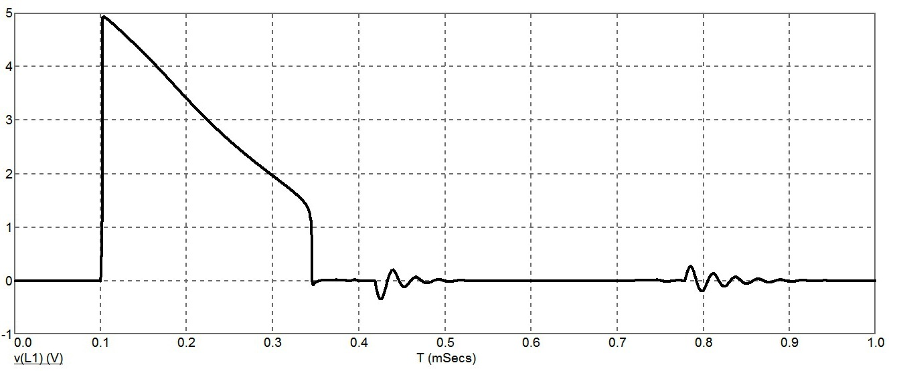

# Реферат по теме выпускной работы

## Содержание
<ul class=content>
  <li class=ct1><a href="#p1">1. Источник питания с динамической защитой для системы освещения КУОШ</a>
  <li class=ct2><a href="#p11">1.1 Схема источника питания</a>
  <li class=ct2><a href="#p12">1.2 Диаграмма сигналов источника питания</a>
  <li class=ct1><a href="#p2">2. Испытание источника питания с динамической защитой для системы освещения КУОШ</a>
  
  <li class=ct1><a href="#p3">Выводы</a>
  
  <li class=ct1><a href="#ref">Список источников</a>
</ul>

## 1. Актуальность темы

### 1.1 Схема источника питания

Для подземных потребителей очистных и
подготовительных выработок применяют
трёхфазный переменный ток, напряжением
660/1140 В, промышленной частоты 50 Гц [1].
Следовательно, источник питания должен
быть рассчитан для подключения к данной
сети и состоять из трех функциональных
узлов: сетевого трансформатора,
преобразователя напряжения переменного
тока в напряжение постоянного тока и
барьера искрозащиты (рис.1). 

В разработанной функциональной схеме
источника питания учтены  специфические
требования IEC
60079-11 к построению электрических цепей
с видом взрывозащиты «Искробезопасная
электрическая цепь «i». В частности,
обеспечено гальваническое разделение
искробезопасных цепей от сети за счет
трансформатора;  гальваническое
разделение между искробезопасными
цепями выходных каналов за счет
преобразователей АС/DC,
позволяющее использовать контрольный
кабель для подключения всех каналов
без дополнительных конструктивных в
них мер таких как экранирование,
заземление жил.

Рисунок 1 – Функциональная схема источника
питания с динамической защитой для
системы освещения КУОШ

Стоит отметить, что взрывозащищенные свойства
источника питания не ограничиваются
только выходными искробезопасными
цепями уровня <i>ib</i>,
а дополняются взрывозащитой вида «е»
и видом взрывонепроницаемая
оболочка «<i>d</i>».
Это позволяет обеспечить «высокий»
уровень взрывозащиты, достаточный для
безопасного применения в подземных
выработках угольных шахт, опасных по
газу и/или пыли.

В функциональной схеме барьера искрозащиты
(рис. 1), учтены и реализованы результаты
анализа характеристик искробезопасных
источников питания систем освещения,
заключающиеся в следующем:
- применен способ искусственного сокращения
длительности разряда (опережающее
отключение), как наиболее эффективный
метод увеличения искробезопасной
мощности;
- искусственное сокращение длительности разряда основано
на принципе отключении (изоляции) цепи
питания от участка с разрядом, который
характеризуется наиболее результативным
ограничением энергии разряда в случае
подключения кабельных линий.

<b>Шунтирующий ограничитель напряжения.</b>

Ограничение уровня напряжения достигается за счет
шунтирования выходной искробезопасной
цепи с помощью управляемых полупроводниковых
ключей 1 и 2, например, тиристоров. Схемы
сравнения <i>U</i>о
формируют сигнал на открытие «снижение
сопротивления» ключам при достижении
уровня напряжения 36 В в выходной цепи.
Быстродействие (время срабатывания
тиристоров) ограничения напряжения в
аварийном режиме преобразователя AC/DC
(рис. 1)  при увеличении их управляющего
сигнала составляет 3..4 мкс.

В соответствии с требованиями IEC
60079-11 искробезопасные цепи уровня <i>ib</i>
не должны вызывать воспламенение при
нормальной эксплуатации и введении
одного учитываемого и всех неучитываемых
повреждений, создающих наиболее опасные
условия. В связи с этим в схему введено
независимое дублирование узлов.

Рисунок 2 – Функциональная схема барьера
искрозащиты источника питания с
динамической защитой для системы
освещения КУОШ

<b>Последовательное токоограничительное устройство.</b>

Состоит из последовательных управляемых
полупроводниковых силовых ключей,
шунтов для измерения силы тока нагрузки
источника и скорости ее изменения, схем
сравнения измеренных параметров тока,
а также схем плавного включения. 

В качестве управляемых полупроводниковых
силовых ключей целесообразно остановиться
на полевых или биполярных транзисторах,
обеспечивающих приемлемое быстродействие
20…50 нс.

Для определения силы тока нагрузки источника
используем резистор (шунт), падение
напряжения на котором пропорционально
измеряемой величине. В качестве элементов
сравнения измеренных значений тока
принят биполярный транзистор, включенный
по известной схеме в минусовой цепи.  

Для обеспечения требуемого ограничения
силы тока на заданном уровне используются
две независимые схемы сравнения <i>I</i>о,
которые переводят ключи в линейный
режим работы при падении напряжения на
шунте 0,5..0,6 В. Соответственно ток уставки
определяется соотношением к сопротивлению
шунта
<i>I</i>уст=0,6/<i>R</i>ш.
В данном режиме происходит стабилизация
(ограничение) силы тока на уровне уставки
за счет быстродействующего управления
сопротивлением ключей. 

Наиболее эффективным устройством контроля начала
аварийного разряда (измерения скорости
изменения силы тока) в искробезопасных
цепях является дроссель. Анализ способов
реализации сравнения сигнала dI/dt показал,
что особенно результативным является
выделение полезного сигнала на база –
эмиттерных переходах биполярных
транзистров, подключенных эмиттерами
относительно дросселя [2,
3]. Сигнал с шунта подается на отдельные
схемы сравнения. При превышении модулем
скорости изменения силы тока в нагрузке
заданного значения они воздействуют
на соответствующие силовые ключи и
разрывают цепь питания нагрузки. Для
достижения максимальной эффективности
динамической искрозащиты при коммутации
цепи нагрузки энергия источника питания
почти полностью должна рассеивается
на сопротивлениях силовых ключей и
минимально выделяться в электрический
разряд. Данное условие достигается
сокращением времени срабатывания защиты
<i>Т</i>и
до нескольких микросекунд. 

Определим фактическое время запаздывания <i>Т</i>з
и задержки <i>Т</i>ф
путем моделирования в пакете MicroCap
9.0 с применением модели дугового разряда
размыкания (рис. 3).

Рисунок 3 – Расчетная схема определения задержек
и чувствительности динамической
искрозащиты при размыкании цепи

Блок
питания постоянного тока <i>V</i>1
формирует в цепи максимальное напряжение
36 В барьера искрозащиты источника
питания с динамической защитой для
системы освещения КУОШ. Устройство
контроля начала аварийного разряда <i>L</i>3
с элементами <i>Q</i>1,
<i>Q</i>2,
<i>R</i>1…<i>R</i>3
выделения и сравнения сигнала с дросселя.
Резистор <i>R</i>4
предназначен для регистрации управляющего
сигнала после сравнения, зашунтированный
стабилитроном <i>D</i>1
с целью удобства масштабирования данного
сигнала на уровне, не более 3В. Модель
кабельной линии представлена в виде
однозвенной Т-образной схемы замещения
с параметрами омического сопротивления
(включая нагрузку) <i>RH</i>,
индуктивности <i>LH</i>
и емкости <i>CH</i><i>
</i>для сечения
6 мм2
и длиной 400 м. <i>SW</i>1<i>,
</i><i>RD</i><i>,
</i><i>R</i>0<i>,
</i><i>RL</i><i>,
</i><i>E</i>1<i>,
</i><i>LI</i>
– элементы модели дугового разряда
замыкания. Учитывая требования ГОСТа [4]
чувствительность источников с динамической
защитой должна обеспечивать их
срабатывание при параметрах силы тока
в соответствии с кривыми IEC
60079-11. В соответствии с которыми для 36 В
максимальный искробезопасный ток
составляет 289 мА, что учтено в значении
сопротивления <i>RH</i>=125
Ом. Исследования проводились с дросселем
47 мкГн, 100 мкГн, 220 мкГн, 470 мкГн. При этом
фиксировались переходные процессы на
дросселе <i>L</i>3
(в узлах <i>L</i>1-<i>
</i><i>L</i>2).
Результаты представлены на рис. 3.4.

Рисунок 4 – Выделяемый сигнал на дросселе <i>L</i>3
от времени

### 1.1 Диаграмма сигналов источника питания

Диаграммы, характеризующие работу блока искрозащиты,
приведены на рис. 5, 6.

После отключения тока нагрузки одной из схем
сравнения <i>I</i>о
или <i>dI</i><i>/</i><i>dt</i>
должна обеспечиваться пауза не менее
110 мкс, для обеспечения расхождения
контактов на безопасное расстояние.
Эта задержка обеспечивается узлом
плавного включения. По истечении
вышеуказанной паузы, происходит плавное
включение силовых ключей со скоростью
увеличения силы тока, меньшей, чем порог
срабатывания <i>dI</i><i>/</i><i>dt</i><i>.</i>
<table style="margin:auto; text-align: center">
	<col width="662"/>
	<tr>
		<td width="662" valign="top">
			
		</td>
	</tr>
	<tr>
		<td width="662" valign="top">
			а)
		</td>
	</tr>
	<tr>
		<td width="662" valign="top">
			
		</td>
	</tr>
	<tr>
		<td width="662" valign="top">
			б)
		</td>
	</tr>
	<tr>
		<td width="662" valign="top">
			
		</td>
	</tr>
	<tr>
		<td width="662" valign="top">
			в)
		</td>
	</tr>
</table>

Рисунок 5 – Диаграммы, характеризующие работу
барьера искрозащиты в режиме коммутации: 
а) ток нагрузки <i>I(R0)</i>; 
б) напряжение на дросселе <i>V(</i><i>L</i><i>1)</i>; 
в) выходное напряжение <i>V(</i><i>out</i><i>)</i> 

<table style="margin:auto; text-align: center">
	<col width="668"/>
	<tr>
		<td width="668" valign="top">
			
		</td>
	</tr>
	<tr>
		<td width="668" valign="top">
			а)
		</td>
	</tr>
	<tr>
		<td width="668" valign="top">

			
		</td>
	</tr>
	<tr>
		<td width="668" valign="top">
			б)
		</td>
	</tr>
	<tr>
		<td width="668" valign="top">
			
		</td>
	</tr>
	<tr>
		<td width="668" valign="top">
			в)
		</td>
	</tr>
</table>

Рисунок
6 – Диаграммы, характеризующие работу
барьера искрозащиты в режиме коммутации: 
а) сила токов нагрузки <i>I(R0)</i>
и барьера <i>I(R</i><i>sh</i><i>)</i>; 
б) напряжения разряда <i>V</i><i>(</i><i>n</i><i>)</i>
и на выходе барьера <i>V(</i><i>out</i><i>)</i>; 
в) напряжения управляющего сигнала
<i>V(к1,к2)</i>
и на дросселе <i>V</i><i>(</i><i>L</i><i>1)
</i>

## 2. Испытание источника питания с динамической защитой для системы освещения КУОШ

Согласно IEC
60079-11 необходимо испытывать искробезопасные
цепи с применением коэффициента
искробезопасности 1,5, который должен
быть обеспечен одним из следующих
способов:

а) для индуктивных и резистивных цепей
уменьшают сопротивление ограничительного
резистора для увеличения силы тока
испытуемой цепи в число раз, кратное
коэффициенту искробезопасности. Если
коэффициент искробезопасности не может
быть достигнут таким способом, то
увеличивают напряжение;

б) для емкостных цепей напряжение испытуемой
цепи увеличивают в число раз, кратное
коэффициенту искробезопасности.

При заданном коэффициенте искробезопасности
для таких цепей вначале в 1,5 раза
увеличивают силу действующего в цепи
тока. Определяют индуктивность, при
которой установленный в цепи ток
становится минимальным воспламеняющим
(вызывает воспламенение взрывоопасной
смеси с вероятностью 10-3).
Затем в 1,5 раза увеличивают напряжение,
а силу тока устанавливают равной
искробезопасному значению для найденной
индуктивности и увеличенного напряжения.
После этого проводят испытание цепи на
искробезопасность.

Результаты оценки искробезопасности по разрядам
размыкания барьера искрозащиты источника
питания с динамической защитой для
системы освещения КУОШ с параметрами
кабельной линии (рис. 5) положительные.
Тестирование проводилось с учетом
коэффициента искробезопасности <i>K</i>i
= 1,5 по силе тока. Получили <i>I</i>(<i>R</i>0)
= 7,504 А за счет увеличения напряжении
источника <i>Uо</i>
= 54 В. Т.к уменьшение сопротивления
нагрузки влечет за собой изменение
постоянной времени электрической цепи
и как следствие завышение коэффициента
искробезопасности. 

Безопасные параметры в результате тестирования
составляют: <i>LН</i>
= 124 мкГн, <i>СН</i>
= 112 нФ, <i>T</i>p
=30,9 мкс, <i>W</i>p=
218,9 мкДж, <i>W</i>доп=
478 мкДж, опасная скорость размыкания -
<i>v</i>=6,5
м/с. Анализ полученных результатов
показывает, что барьер искрозащиты
обеспечивает с запасом искробезопасность
с подключенной кабельной линией длиной
400 м и сечением 6 мм2.

Предельные безопасные параметры барьера искрозащиты
источника питания с динамической защитой
для системы освещения КУОШ (рис. 3.5)
составляют при начальном токе цепи
<i>I(R0)</i>
= 7,504 А,  напряжении источника   <i>Uо</i>
= 36 В: <i>LН</i>
= 140 мкГн, <i>СН
=</i>126<i>
</i>нФ<i>,
T</i>p
=39 мкс, <i>W</i>p=
420 мкДж, опасная скорость размыкания
v=6,5 м/с.  Данные параметры эквивалентны
кабельной линии 450 м сечением 6 мм2.
При начальном токе цепи <i>I(R0)</i>
= 7,504 А,  напряжении источника <i>Uо</i>
= 54 В: <i>LН</i>
= 173 мкГн, <i>СН
=</i>157<i>
</i>нФ<i>,
T</i><i>p</i>
=39,1 мкс, <i>W</i><i>p</i>=
417 мкДж, опасная скорость размыкания
<i>v</i>=6,5
м/с (таблица 4.8). Данные параметры
эквивалентны кабельной линии 560 м
сечением 6 мм2.

Определим предельные параметры барьера искрозащиты
источника питания с динамической защитой
для системы освещения КУОШ при подключении
резистивно-индуктивной нагрузки при
<i>I(R0)</i>
= 7,504 А,  напряжении источника <i>Uо</i>
= 54 В. Безопасные параметры в результате
тестирования составляют: <i>LН</i>
= 190 мкГн, <i>T</i>p
=40,6 мкс, <i>W</i>p=
391 мкДж, опасная скорость размыкания
v=6,5 м/с.

Погрешность приведенных результатов расчетной и
экспериментальной оценки составляет
не более 5%.

## Выводы

1. Получены предельные искробезопасные
параметры источника питания по уточненной
методике бескамерной оценки
искробезопасности, их сравнение с
данными испытаний МакНИИ показало, что
расхождение результатов расчета с
экспериментальными данными не превышает
5%.
1. Обоснованы параметры и разработана
электрическая схема источника питания
напряжением 36 В  с повышенной искробезопасной
мощностью 180 Вт, который позволил
сформулировать требования в Техническое
задание.

## Список источников
<ol>
  <li>Озерной,
	М.И. Электрооборудование и электроснабжение
	подземных разработок угольных шахт. –
	 М.:  Недра, 1975. – 445 с.
  </li>
  <li>А.
	с. 1227819 СССР, МКИ E 21 F 9/00, G 05 F 1/58.
	Искробезопасный источник питания /
	Кириченко Б. М., Губкин А. В., Ефремов А.
	П. (СССР). –№3728152/24-07 ; заявл. 21.04.84 ; опубл.
	в Б. И. – 1986. – № 16.
  </li>
  <li>Гладков,
	А.Ю. Использование методов расчетной
	оценки искробезопасности для источников
	с опережающим отключением./ А.Ю. Гладков,
	И.А. Бершадский, В.В. Якимишина//
	Безопасность труда в промышленности.
	– М.: ЗАО НТЦ ПБ, 2019. –  Выпуск 2. – С.
	13-19.
  </li>
  <li>ГОСТ
	31610.39-2017. Взрывоопасные среды. Часть 39.
	Искробезопасные системы с электронным
	ограничением длительности искрового
	разряда. – Введ. c 01.06.2019. – М.: ФГУП
	«Стандартинформ», 2018. – 40 с.
  </li>
</ol>
