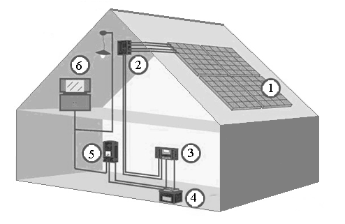

# Реферат по теме выпускной работы

<h2>Содержание</h2>

<ul class=content>
  <li class=ct1><a href="#p0">Введение</a>
  <li class=ct1><a href="#p1">1. </a>
  <li class=ct1><a href="#ref">Список источников</a>
</ul>

Основой современной электроэнергетики многих
стран являются тепловые, атомные и
гидравлические электростанции. На
протяжении последних 20 лет наблюдается
существенный рост производства
электроэнергии с использованием
возобновляемых источников: Солнца,
ветра, биомассы. Одним из наиболее
привлекательных возобновляемых
источников в условиях нашего региона
является электромагнитное излучение
Солнца. Причины этого следующие: <a href="#ref1">[1,2]</a>
* солнечная энергия доступна в каждой точке Земли;
* Солнце - практически неисчерпаемый источник энергии.

Основным технологическим элементом солнечной
электроэнергетики является фотоэлектрический
преобразователь (ФЭП), с помощью которого
энергия солнечного света достаточно
просто преобразуется непосредственно
в электроэнергию.

Для современных ФЭП также характерны такие
преимущества:
* отсутствие в них движущихся частей;
* экологичность;
* модульность конструкции;
* пригодность для создания установок практически любой мощности.

Кроме того, они почти не изнашиваются и не
повреждаются, поэтому имеют длительный
срок эксплуатации, работают бесшумно,
не требуют высокой квалификации
обслуживающего персонала, имеют
относительно низкие затраты на
строительство.

Среднегодовое количество суммарной солнечной радиации,
поступающей на 1 м2
поверхности, на территории Донецкой
области находится в пределах: от 1070
кВт*ч/кв.м до 1400 кВт*ч/м2
и выше <a href="#ref6">[6]</a>.

Преобразование
солнечного излучения в электрическую
энергию осуществляется в основном двумя
путями:
1) с использованием термодинамического
преобразования на базе тепловых
двигателей (косвенное преобразование);
1) с использованием фотоэлектрических
полупроводниковых преобразователей
(прямое преобразование).

Наиболее распространены солнечные электростанции
прямого типа преобразования, которые
используют кремниевые фотоэлектрические
элементы. Использование кремния связано
с наличием следующих преимуществ: он
является наиболее распространенным
после кислорода элементом на Земле;
производство кремния хорошо освоено;
ширина запрещенной зоны у кремния1,12
эВ, что позволяет выгодно использовать
видимый диапазон солнечного спектра;
кремниевые ФЭП менее чувствительны к
температурным колебаниям (более
термостойкие, чем германиевые); кремний
позволяет достигнуть минимальных потерь
на отражение <a href="#ref7">[7]</a>.

Существует большое количество электроприемников,
для которых использование стационарных
источников энергии на базе электрических
сетей является экономически нецелесообразным
или технически не реализуемо. Для таких
потребителей используют автономные
источники электроснабжения, например,
на базе электрогенераторов с приводом
от двигателей внутреннего сгорания или
дизельных двигателей. Их основной
недостаток - необходимость иметь запас
топлива, что ограничивает их возможности.
Автономные источники электроснабжения
на базе солнечных преобразователей не
требуют запасов топлива, поэтому сфера
их применения расширяется <a href="#ref13">[13]</a>.

Учитывая выше сказанное, актуальной задачей в
рамках специальности «Электротехнические
системы энергоснабжения», является
исследование режимов работы автономных
систем электроснабжения на базе
возобновляемых источников энергии.

Солнечная энергия распространяется в космосе в
виде так называемого прямого направленного
потока солнечного излучения (СИ) <a href="#ref8">[8,9]</a>.
По причине наличия атмосферы и подстилающей
поверхности - Земли, на произвольно-ориентированную
приемную площадку солнечное излучение
поступает уже в виде трех составляющих:
прямого, диффузного или рассеянного и
излучения отраженного от поверхности
Земли (см. рис.1). Таким образом, суммарный
поток солнечного излучения Ra (t) на
приемную площадку на поверхности Земли
в каждый момент времени t можно представить
как сумму указанных составляющих:

Ra(t) = Rпр(t) + Rд(t) + Rот(t)

где Rпр(t) - прямое солнечное излучение; Rд(t)
- диффузное солнечное излучение; Rот(t)
- отраженная от поверхности Земли часть
направленного солнечного излучения
<a href="#ref3">[3]</a>.

Рисунок
3 – Основные составляющие солнечного
излучения на поверхности Земли: 1 -
Солнце, 2 - поверхность Земли, 3 - приемная
площадка, 4 - облака, аэрозоли, пыль <a href="#ref13">[13]</a>

Учет природных факторов при проектировании СЭС

Показатель атмосферного влияния на интенсивность
солнечного излучения, доходящего до
земной поверхности, учитывается
коэффициентом, который называется
«атмосферная масса» <i>АМ</i>
и определяется по формуле:

,

где <i>y</i> – атмосферное давление, 

<i>y</i>0 – нормальное атмосферное давление (101.3 кПа), 

<i>ʋ</i> – угол высоты Солнца над горизонтом земного шара.

Солнечный свет ослабляется при прохождении через
атмосферу из-за поглощение инфракрасного
излучения парами воды, поглощение
ультрафиолетового излучения озоном, и
рассеяние излучения частицами пыли,
которые находятся в воздухе. 

Солнце часы – это условное время, за которое
можно принять освещенность равной
1000Вт/м2.
Величина инсоляции за месяц определяется
количеством солнце-часов, <i>N</i><i>сонце*ч</i>,
которое зависит от географических
координат, местности и сезона. Величина
инсоляции за световой день учитывается
посредством числа пиковых солнце-часов
<i>Nпик.ч</i>:

<i>N</i><i>пик.ч</i><i>.
 = N</i><i>сонце*ч</i><i>/ N</i><i>дней/мес</i>,

где
<i>N</i><i>дней/мес</i>–
число дней в месяце.

Фотоэлектрическая
система и элементы, входящие в нее.

Структурная схема фотоэлектрической системы
электроснабжения (ФЭС) показана на (рис. 2.) <a href="#ref14">[14]</a>.

Рисунок 2 – Схема электроснабжения на базе ФЭС <a href="#ref15">[15]</a>

Фотоэлектрические
модули, которые применяются в ФЭС
наземного типа, как правило конструируются
для зарядки свинцово-кислотных
аккумуляторных батарей (АБ) с номинальным
напряжением 12В и кратным ему 24В, 48В,120В.
При этом последовательно соединяются
36 солнечных элементов (при Uном = 24В) и
далее собираются в модуль. Полученный
пакет, как правило, обрамляют в алюминиевую
раму, облегчающую крепление к несущей
(опорной) конструкции. Мощность модулей
солнечной батареи может достигать
10-300Вт <a href="#ref14">[14]</a>. Батареи можно составлять в
любые желаемые комбинации. Простейшей
батареей является цепочка из последовательно
включенных элементов. Можно также
соединить параллельно цепочки элементов,
отдельные элементы в цепочках или
сочетать их в любой другой комбинации.

В автономных системах электроснабжения
на базе СЭС для обеспечения бесперебойности
питания потребителей необходимо иметь
дополнительный источник, не зависящий
от суточной цикличности в работе
фотоэлектрических модулей. Для этого
возможно применение электрогенераторов
на базе двигателей внутреннего сгорания
или дизельных двигателей.

Электрические параметры солнечных модулей отражаются
в вольтамперной характеристике,
определенной при стандартных условиях
(т. е. когда мощность солнечной радиации
равняется 1000 Вт/м2, температура элементов
- 25°С, атмосферная масса АМ1,5 и солнечный
спектр - на широте 45°) (рис. 3).

Точка пересечения кривой с осью напряжения
называется напряжением холостого хода
(UХХ),
а с осью тока - током короткого замыкания
(ІКЗ).
На этом же графике приведена кривая
мощности с точкой максимальной мощности
(ТММ), получаемой от солнечных элементов
в зависимости от нагрузки. Номинальная
мощность модуля определяется как
наибольшая мощность при стандартных
условиях. Значение напряжения,
соответствующее максимальной мощности,
именуется рабочим напряжением UР
или UММП
(напряжение в точке максимальной
мощности), а соответствующий ток - рабочим
током ІР
или ІММП
(ток в точке максимальной мощности).
Значение рабочего напряжения для модуля,
состоящего из 36 элементов примерно
равны 16-17В (0,45-0,47 В/элемент) при 25°С.

</img>

Рисунок
3 – Общий вид ВАХ и кривая мощности СЭ
<a href="#ref12">[12]</a>

Такой запас по напряжению нужен для того,
чтобы компенсировать уменьшение рабочего
напряжения при разогреве модуля солнечным
излучением. Температурный коэффициент
напряжения холостого хода для кремния
составляет - минус 0,4%/градус. Температурный
коэффициент тока - плюс 0,07%/градус.
Напряжение холостого хода солнечного
модуля практически не изменяется при
изменении освещенности, в то время как
ток короткого замыкания прямо
пропорционален. КПД солнечного модуля
определяется как отношение максимальной
мощности модуля к общей мощности
излучения, падающей на его поверхность
при стандартных условиях, и составляет
15-40% <a href="#ref12">[12]</a>.

Типовая схема электроснабжения на постоянном
токе приведена на рис. 4. Обычно такие
системы применяются, если максимальное
расстояние от аккумулятора до самой
дальней подключенной нагрузки не
превышает (10-15м), а мощность нагрузки -
не более 100Вт. При этом нужно следить за
тем, чтобы падение напряжения при всех
включенных потребителях в самой дальней
точке было в пределах допустимого
(обычно не более 10%).

Если нагрузка превышает указанные
рекомендованные максимальные значения,
или потребители электроэнергии находятся
на значительном расстоянии от аккумулятора,
необходимо добавить в систему инвертор
(преобразователь постоянного тока
низкого напряжения от аккумуляторов в
220В переменного тока). В этом случае
можно питать практически любую бытовую
нагрузку суммарной мощностью, которая
не превышает мощность инвертора.

Рисунок 4 – Фотоэлектрическая система постоянного
тока для дома 1 - солнечная батарея; 2 -
соединительная коробка; 3 - контролер
солнечного заряда; 4 - аккумулятор; 5 -
инвертор; 6 - потребитель (220 В)  

Автономная система электроснабжения дома с выходом
переменного тока на базе фотоэлектрической
солнечной батареи состоит из практически
тех же компонентов, как и в предыдущем
случае, но с добавлением инвертора <a href="#ref11">[11]</a>.

Факторы влияния на работу солнечной батареи.

Режим работы солнечной батареи зависит от
ряда факторов, одним из которых является
солнечное излучение, а оно в свою очередь
зависит от следующих факторов:
* широты и долготы местности,
* географических и климатических особенностей,
* состояния атмосферы,
* высоты Солнца над горизонтом,
* размещение приемника солнечного излучения на Земле,
* размещение приемника солнечного излучения по отношению к Солнцу и т.п. <a href="#ref4">[4, 14]</a>.

Система автономного освещения

Принцип работы такой установки построен на
использовании солнечных батарей
совместно с аккумуляторными батареями,
что позволяет использовать ее как
внутри, так и снаружи пожароопасных
зданий, на складах взрывчатых веществ
и даже в местах отдыха без использования
традиционных источников электропитания.

Преимущества
систем автономного освещения:
* наличие широкого диапазона программирования
	рабочего режима,
* работоспособность в условиях минусового температурного
	режима (до 20оС),
* долгий срок эксплуатации без дополнительного
	обслуживания (до 5 лет).

Такой срок эксплуатации обеспечивается
благодаря светодиодам. Их долговечность
является очень важной для труднодоступных
объектов, потому что они уменьшают
затраты материальных ресурсов и времени
на обслуживание. Светодиоды устойчивы
к ударам и другим механическим
повреждениям, при правильном использовании
возможно их бесперебойная работа до
10000 часов. Однако, при всех плюсах, они
стоят дороже всех разновидностей ламп.

Вариант реализации системы автономного освещения
приведен на рис.5.

Рисунок
5 – Схема обустройства системы автономного
освещения <a href="#ref5">[5]</a>: 
1 - фотоэлектрический модуль; 2 - светодиодный
светильник; 3 - опора; 4 - гравий; 5 -
аккумуляторная батарея; 6 - бетонный
фундамент; 7 – грунт

### Портативная система солнечного электропитания

Портативная система предназначена для питания
техники, работающей на постоянном токе,
и имеет мощность менее 60Вт. Работа
основана на солнечных фотоэлектрических
модулях. Система состоит из: 
* солнечной	батареи,
* аккумуляторной батареи с контролером заряда-разряда,
* сетевого зарядного устройства,
* светильника с компактной люминесцентной лампой.

Рассмотрим технические данные:

Преимуществами
автономной системы освещения на базе
ВИЭ являются:
* компактность и небольшой вес,
* универсальность заряда (энергия может поступать из
	различных источников - от сети до
	солнечных и термоэлектрических батарей).

</ul>

<h2>Список источников</h2>
<ol>
  <li>Алхасов
А.Б. Возобновляемая енергетика /А.Б.
Алхасов. - М.: Физмат Лит, 2010. – 255 с.
  </li>
  <li>Виссарионов
В.И., Дерюгина Г.В., Кузнецова В.А., Малинин
Н.К., Солнечная энергетика: учебное
пособие для вузов / Под ред. В. И.
Виссарионова. – М.: Издательский дом
МЭИ, 2008. – 320 с.
  </li>
  <li>Глиберман
А.Я., Зайцева А. К.  Кремниевые солнечные
батареи / А.Я. Глиберман, А.К. Зайцева. –
М.- Л.: Госэнергоиздат 1961. – 72 с.
  </li>
  <li>Городов
Р.В. Нетрадиционные и возобновляемые
источники энергии: учебное пособие /
Р.В. Городов, В.Е. Губин, А.С. Матвеев. –
1-е изд. – Томск: Изд-во Томского
политехнического университета, 2009. –
294 с.
  </li>
  <li>Збигниев
А., Стычинский Н., Воропай И. Возобновляемые
источники энергии: теоретические основы,
технологии, технические характеристики,
экономика / А. Збигниев, Н. Стычинский,
И. Воропай. - MAFO: Магдебург-Иркутск, 2010.
- 220 с.
  </li>
  <li>Кудря
С.О., Яценко Л.В., Душина Г.П., Атлас
энергетического потенциала возобновляемых
и нетрадиционных источников энергии
Украины /С. Кудря, Л. Яценко, Г. Душина. –
Киев: 2001
  </li>
  <li>Левшов
А.В Системы автономного электроснабжения
на базе фотоэлектрических / А.В. Левшов,
А.Ю. Федоров. – Донецк: Сборник научных
статей, 2012.
  </li>
  <li>Мирошниченко
Л. И., Физика Солнца и солнечно-земных
связей: учебное пособие / Л.И. Мирошниченко.
Под ред. М. И. Панасюка. – М.: Университетская
книга, 2011. – 174 с.
  </li>
  <li>Мейтин
М. Фотовольтаика: материалы, технологии,
перспективы / М. Мейтин // Электроника
для ТЭК. №6, 2000. –– С. 40-56.
  </li>
  <li>Обозов
А.ДЖ, Тагайматова А.А.  Методические
указания. Разработка фотоэлектрической
станции для электроснабжения
индивидуального жилого дома // А.Дж.
Обозов, А.А. Тагайматова. -  Бишкек, 2011.
  </li>
  <li>Ольшанский,
А. И. Основы энергосбережения: курс
лекций / А.И. Ольшанский, В.И. Ольшанский,
Н.В. Беляков. - УО «ВГТУ». – Витебск, 2007.
– 223 с.
  </li>
  <li>Парфенов
В.В., Закиров Р.Х., Болтакова Н.В. Изучение
работы солнечной батареи / В.В. Парфенов,
Р.Х. Закиров, Н.В. Болтакова. – Казань:
Казан. ун-т, 2014. – 33 с.
  </li>
  <li>Плыкин
В.Д. Возобновляемые источники энергии:
учебно-методическое пособие / В.Д. Плыкин.
- Ижевск: Издательство «Удмуртский
университет», 2012. – 60 с.
  </li>
  <li>Чо,
Г.Ч. Разработка главных схем фотоэлектрическмх
солнечных электростанций: учеб.пособие/Г.Ч.Чо,
М.Р.Жигащин.- Издательство МЭИ, 2017.-84с
  </li>
</ol>
