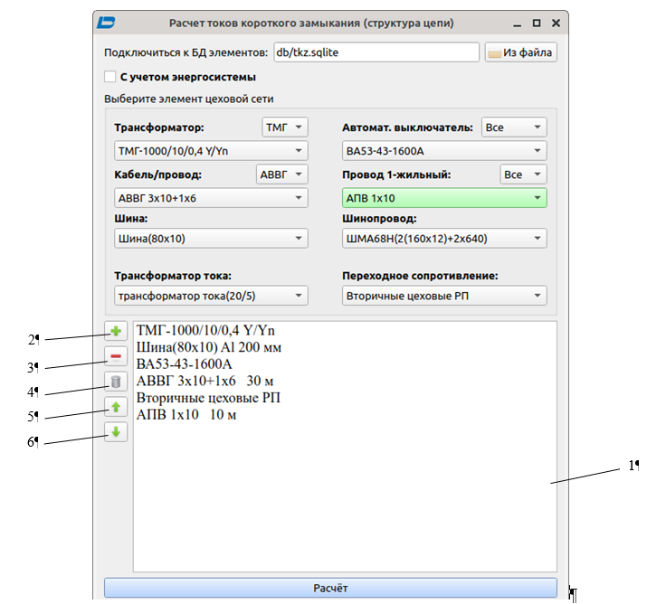
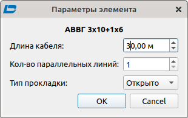

# Реферат по теме выпускной работы

<h2>Содержание</h2>

<ul class=content>
  <li class=ct1><a href="#p1">1. Расчет токов КЗ напряжением до 1 кВ</a>
  <li class=ct1><a href="#p2">2. Ввод схемы электроснабжения</a>
  <li class=ct1><a href="#p3">3. Ввод длины элементов</a>
  <li class=ct1><a href="#p4">4. Выполнение расчетов токов КЗ </a>
  <li class=ct1><a href="#conc">Выводы </a>
  
  <li class=ct1><a href="#ref">Список источников</a>
</ul>

## 1. Расчет токов КЗ напряжением до 1 кВ

Современные средства вычислительной техники
позволяют максимально формализовать
расчет токов КЗ, который затем используется
для выбора аппаратов и защиты в сети
0,4 кВ.

В проекте данной САПР расчетная задача
решается путем конструирования
электрической цепи КЗ от источника
питания (шины подстанции 6(10) кВ) до точки
замыкания. Необходимые данные каждого
элемента сети хранятся в БД с SQLite и могут
быть просмотрены в виде всплывающей
подсказки при наведении на него указателя
мыши. Результаты расчетов 3, 2 и 1 фазного
КЗ в каждой точке
записываются в файл БД и сохраняются при последующих
вызовах программы (рис. 1).

## 2. Ввод схемы электроснабжения

Перед выполнением расчета необходимо
инициализировать схему. Элементы,
которые могут в нее войти, расположены
в списках (трансформатор, кабель/провод,
шина, трансформатор тока, автоматический
выключатель, провод одножильный,
шинопровод, переходное сопротивление
в точке <i>К3</i>) – рис. 2. Выбранный пункт списка переносится
в расчетный лист 1 нажатием кнопки 2.
После добавления элемента становятся
доступны его параметры в форме.

Выбранный элемент можно удалить из списка кнопкой
3, переместить кнопками 5, 6. Для очистки
списка используется кнопка 4.

## 3. Ввод длины элементов

Для элементов, требующих контроля длины
(шины, кабели, шинопроводы, провода),
предусмотрена форма <i><b>Параметры
элемента </b></i>(рис. 3). В ней вводится материал (Al, Cu),
расстояние между фазами, длина в м,
количество параллельных линий в пучке
кабеля, тип прокладки, количество жил.

Рисунок 1 – База данных tkz_results
с результатами расчетов токов КЗ 0,4 кВ

Рисунок 2 – Главное окно блока расчетов токов
КЗ 0,4 кВ

<table align="center" width="690" cellpadding="7" cellspacing="0">
	<col width="325"/>
	<col width="337"/>
	<tr valign="top">
		<td style="background: transparent;">

			

		</td>
		<td style="background: transparent;">

			

		</td>
	</tr>
</table>

Рисунок 3 – Окна редактора провода (кабеля) блока
расчетов токов КЗ 0,4 кВ

## 4. Выполнение расчетов токов КЗ

После заполнения списка активируется кнопка
<i><b>Расчет</b></i>
и форма расчетов тока КЗ (рис. 4); в ней
выбирается как тип КЗ, так и имя расчетной
точки. Таблица заполняется результатами
расчета (рис. 4). Затем можно записать
их в файл БД, причем доступен выбор место
ее расположения на диске.

Рисунок 4 – Главное окно блока расчетов токов
КЗ 0,4 кВ

## Выводы

Данная программа является этапом разработки
САПР цеховой сети. В ней сформирована
и реализована объектная модель САПР,
позволяющая выполнять следующие
алгоритмы: добавление данных о потребителях
и их графических изображений в таблицу,
расчет нагрузок модифицированным
статистическим методом, выбор
распределительных пунктов из базы
данных (БД), выбор автоматических
выключателей с использованием базы
данных,выбор
проводов для питания отдельных
электроприемников (учитывается способ
прокладки, материал провода), корректирование
и дополнение базы данных и справочной
информации, расчет токов 3, 2 и 1 фазного
короткого замыкания в заданной точке
сети, формирование отчетов. 

## Список источников
<ol>
  <li>Стерлигов, В.Е. Проектирование элементов
САПР цехового электроснабжения / В.Е.
Стерлигов, Сабер Ажили, И.А, Бершадский
// Наукова-технічна конференція студентів
ДонНТУ. День науки 2005. Секція „Електротехнічні
системи електроспоживання”.- с.39-40.
  </li>
  <li>Бершадский, И.А., Сабер Ажили (Тунис),
Ильюшенкова Л.Д. Вопросы программной
реализации алгоритмов системы
автоматизированного проектирования
(САПР) электроснабжения участка цеха /
И.А. Бершадский, Сабер Ажили, Л.Д.
Ильюшенкова // Взрывозащищенное
электрооборудование: Сб. научн. Трудов
УкрНИИВЭ. –Донецк, 2006.
  </li>
  <li>Ажили, Сабер. Программное обеспечение
САПР цехового электроснабжения в
условиях России / Сабер Ажили, И.А.
Бершадский // Наукова-технічна конференція
студентів ДонНТУ. День науки 2005. Секція
„Електротехнічні системи електроспоживання”.-
с.37-38.
  </li>
  <li>Бершадский,&nbsp;И.&nbsp;А.&nbsp;Разработка
САПР для проектирования электроснабжения
цеха на напряжении 0,4 кВ / И. А. Бершадский,
А. П. Ковалёв, А.В. Згарбул // Журнал&nbsp;Электро.
— 2016, №4, с. 47-52.
  </li>
</ol>
