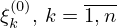

# Реферат по теме выпускной работы

<h2>Содержание</h2>

<ul class=content>
  <li class=ct1><a href="#p1">1. Основные понятия и определения</a>
  <li class=ct1><a href="#p2">2. Постановка задачи</a>
  <li class=ct1><a href="#p3">3. Решение поставленной задачи</a>
  
  <li class=ct1><a href="#ref">Список источников</a>
</ul>

## 1. Основные понятия и определения

Известно, что защитный коммутационный аппарат может находиться в трех несовместных режимах: статистический, динамический, при отключении токов короткого замыкания (КЗ), и оперативных переключений.

Наиболее опасным для систем электроснабжения промышленных предприятий – динамический режим, так как наиболее крупные аварии на предприятиях происходит как раз тогда, когда случайным образом появляется КЗ в защищаемом элементе сети и отказывает в срабатывании ближайшей к месту повреждения защитный коммутационный аппарат, через который прошел сквозной аварийный ток.

Авария на предприятии будет тем крупнее, чем большее число коммутационных аппаратов, через которые проходит сквозной аварийный ток КЗ, откажут в срабатывании, поэтому моделирование системы отключения защитного коммутационного аппарата в этом режиме задача, на наш взгляд, актуальная.

В качестве параметров надежности математической модели защитного коммутационного аппарата в динамическом режиме, следует использовать только ту статистическую информацию, которую можно получить, например, из актов расследований технологических нарушений, которые ведутся на предприятиях, либо из оперативных журналов, где фиксируются все аварийные отключения коммутационных аппаратов.

Защитный коммутационный аппарат и электрооборудование, которое входит в зону действия его автоматических средств защиты, будем рассматривать, как один элемент системы, который может находиться в трех несовместных состояниях: «ждущий режим»; отказ «обрыв цепи»; отказ в «срабатывании».

Под «ждущим режимом» защитного коммутационного аппарата будем понимать такое состояние его автоматической системы отключения, когда в зоне действия его релейной защиты (РЗ) не наблюдаются возмущения, которые способны привести его в действие.

Отключаемые КЗ и замыкания на землю ОЗ, ложные, излишние срабатывания РЗ, ошибки обслуживающего и эксплуатирующего персонала, при которых происходит отключение защитного коммутационного аппарата, либо автоматически, либо с помощью оперативного персонала – будем относить к отказам «обрыв цепи».

К отказам в «срабатывании» защитного коммутационного аппарата будем относить такие повреждения, КЗ или ОЗ в элементе сети, в зоне действия их РЗ, при котором через него проходит сквозной аварийный ток, а его автоматическая система отключения не «срабатывает».

Например, при КЗ в линии Л1 узла нагрузки промышленного предприятия рис. 1 произойдет отключение поврежденной линии с помощью РЗ коммутационного аппарата под номером 1, что приведет к обесточиванию потребителя электрической энергии, в результате этого прерывается рабочий цикл технологической установки.

Рисунок 1 . Узел нагрузки промышленного предприятия.

В том случае, если при КЗ в линии Л1 откажет в срабатывании автоматическая система отключения коммутационного аппарата под номером 1, то поврежденную линию с выдержкой времени отключит РЗ вводного коммутационного аппарата под номером 5, АВР на секционном коммутационном аппарате под номером 4 в этом случае не срабатывает, что приведет к обесточиванию не только потребителя электрической энергии, который получает ее по линии Л1, но и всех потребителей секции 10 кВ. Это событие приведет к расстройству технологического процесса на предприятии, с вытекающими из этого нежелательными последствиями.

## 2. Постановка задачи

Изменение состояния автоматической системы отключения защитного коммутационного аппарата представим в виде двух однородных марковских процессов: ξ(t) и α(t).

Пусть ξ(t) в течение времени t может находиться в двух дискретных состояниях: 0 – в сети не наблюдаются события, которые могли бы привести к отказу «обрыв цепи», те аварийному отключению защитного коммутационного аппарата; 1 – произошло КЗ в элементе сети, сработала РЗ защитного коммутационного аппарата, и он отключил соответствующий потребитель электрической энергии («обрыв цепи»).

Обозначим параметры процесса ξ(t) следующими величинами: λ0 – интенсивность аварийных отключений поврежденных элементов сети, которые находились в зоне действия РЗ защитного коммутационного аппарата (отказ «обрыв цепи»); μ0 – интенсивность обнаружения и восстановления поврежденного элемента сети, включение в работу аварийно отключившегося защитного коммутационного аппарата.

Индекс «0» указывает на то, что учитываются повреждения в сети, которые приводят к отказам «обрыв цепи».

Появление в защищаемой сети событий, при которых, через защитный коммутационный аппарат проходит аварийный ток КЗ, а его РЗ не «срабатывает», представим в виде процесса α(t) с двумя дискретными состояниями и непрерывным временем. Обозначим: 0 – в сети не наблюдается событие, в результате появления которого отказывает в «срабатывании» автоматическая система отключения защитного коммутационного аппарата; 1 – произошло КЗ в элементе сети, через защитный коммутационный аппарат, ближайший к месту повреждения прошел аварийный ток, а его автоматическая система отключения оказалась в не работоспособном состоянии, произошел отказ в «срабатывании».

Параметры процесса α(t) следующие: λs – интенсивность отказов в срабатывании автоматической системы отключения защитного коммутационного аппарата, при появлении КЗ в зоне действия его РЗ; μs – интенсивность обнаружения и восстановления работоспособности автоматической системы отключения защитного коммутационного аппарата и введения ее в эксплуатацию.

Индекс «s» указывает на то, что учитываются отказы в «срабатывании» автоматической системы защитного коммутационного аппарата.

Совокупность двух независимых процессов ξ(t) и α(t) рассмотрим, как один однородный марковский процесс с тремя дискретными состояниями и непрерывным временем.

В любой момент времени автоматическая система отключения защитного коммутационного аппарата может находится в одном из трех несовместных состояниях 
, где состояния:

 – в сети не наблюдается событие, которое могло бы привести к аварийному отключению защитного коммутационного аппарат (отказу «обрыв цепи») и в сети не наблюдается событие в результате появления которого откажет в «срабатывании» автоматическая система отключения защитного коммутационного аппарата, т.е. это означает, что автоматическая система отключения защитного коммутационного аппарата находится в «ждущем режиме»;

 – произошло КЗ в элементе сети, сработала РЗ защитного коммутационного аппарата, и он отключил соответствующий потребитель электрической энергии, произошел отказ «обрыв цепи» и в сети не наблюдается событие, в результате которого откажет в «срабатывании» автоматическая система отключения защитного коммутационного аппарата;

 – в сети не наблюдается событие, которое могло бы привести к аварийному отключению защитного коммутационного аппарата (отказу «обрыв цепи») и произошло КЗ в защищаемом элементе сети, через защитный коммутационный аппарат прошел аварийный ток, а его автоматическая система отключения в это время находилась в неработоспособном состоянии – произошел ее отказ в «срабатывании».

Пусть в начальный момент времени ξ(t) = 0 и α(t) = 0. На рис.2 приведена возможная реализация однородного марковского процесса с тремя дискретными состояниями и непрерывным временем, которая описывает возможные состояния автоматической системы отключения защитного коммутационного аппарата.

Рисунок 2. Возможная реализация однородного марковского процесса с тремя дискретными состояниями и непрерывным временем

На рис. 2 через 

 обозначаются случайные интервалы времени между аварийными отключениями защитного коммутационного аппарата, при КЗ в зоне действия его РЗ; 

 – случайные интервалы времени обнаружения поврежденного элемента сети, его восстановление и включение в работу защитного коммутационного аппарата; 

 – случайные интервалы времени между отказами в срабатывании автоматической системы отключения защитного коммутационного аппарата; 

 – случайные интервалы времени обнаружения поврежденного элемента в автоматической системе отключения защитного коммутационного аппарата, его восстановление и введение в эксплуатацию.

Задача состоит в том, что, если известны параметры процессов: ξ(t) и α(t), т.е. λ0, μ0 и λs, μs, то следует определить:

pi(t) – вероятность нахождения i-того защитного коммутационного аппарата в течение времени t в состоянии e0(0,0), т.е. в «ждущем режиме»;

q0i(t) – вероятность нахождения i-того защитного коммутационного аппарата в течение времени t в состоянии e1(1,0), т.е. вероятность отключения от сети поврежденного электрооборудования при появлении КЗ в течении времени t в зоне действия его РЗ;

qsi(t) – вероятность нахождения i-того защитного коммутационного апарата в течение времени t в состоянии e2(0,1), т.е. вероятность отказов в «срабатывании» системы автоматического отключения i-того защитного коммутационного аппарата, при появлении КЗ в зоне действия его РЗ в течение времени t;

Аi(τ) – вероятность нахождения автоматической системы отключения i-того защитного коммутационного аппарата в «ждущем режиме» для некоторого произвольно выбранного интервала времени τ;

Аi(∞) – коэффициент готовности автоматической системы отключения i-того защитного коммутационного аппарат;

Кэ – коэффициент эффективности электроснабжения узла нагрузки.

## 3. Решение поставленной задачи

В результате решения этой задачи были получены формулы:

где

n0 – число аварийных отключений («обрыв цепи») защитного коммутационного аппарата за время наблюдения;

Т – время наблюдения за эксплуатацией защитного коммутационного аппарата;

 – среднее время обнаружения аварийно отключившегося от сети электрооборудования, его восстановления и включения защитного коммутационного аппарата в работу;

ns – число отказов в «срабатывании» автоматической системы отключения защитного коммутационного аппарата, при появлении тока КЗ в зоне действия РЗ за время наблюдения;

 – среднее время обнаружения поврежденного элемента в автоматической системе отключения защитного коммутационного аппарата, его ремонт (замена) и включение ее в работу;

Используя формулы (1) – (12) представляется возможность оценить влияние надежности автоматической системы отключения защитного коммутационного аппарата на обеспечение бесперебойности электроснабжения узла нагрузки.

Пример. В результате наблюдения по плану 

в течение T=5лет за эксплуатацией защитных коммутационных аппаратов узла нагрузки (секция шин трансформаторной подстанции 110/10 кВ одного из промышленных предприятий Донбасса) рис. 1, была получена следующая статистическая информация.

Установлено, что коммутационный аппарат под номером 5 аварийно отключался шесть раз n05 = 6, из-за КЗ в отходящих от секции шин 10 кВ линий: Л1 или Л2, или Л3, либо в их потребителях, которые получают по ним электроэнергию и отказе в «срабатывании» соответствующих им защитных коммутационных аппаратов под номерами 1 или 2, или 3, т.е. ns1 = 2; ns2 = 4; ns3 = 3.

Среднее время обнаружения поврежденного элемента в сети, его отключение соответствующим коммутационным аппаратом и включение в работу аварийно отключившегося коммутационного аппарата под номером 5 составило 

 = 2,7 ч. Три раза за пять лет наблюдения, через коммутационный аппарат под номером 5 проходил аварийный ток КЗ, а его РЗ и ближайший к месту повреждения элемента сети коммутационный аппарат, через который прошел также аварийный ток, находились в неработоспособном состоянии ns5 = 3. В этом случае поврежденный элемент сети отключался с помощью РЗ коммутационного аппарата под номером 6. За время наблюдения не было зафиксировано ни одного случая отказов в «срабатывании» коммутационного аппарата под номером 6. Среднее время обнаружения поврежденного элемента в автоматической системе отключения коммутационного аппарата под номером 5, его ремонт и включение в работу составило 

 = 3,2 ч.

Анализ отказов в «срабатывании» коммутационных аппаратов под номерами 1, 2, 3 и 5 показал, что из-за ошибок обслуживающего их персонала произошло следующее число отказов в системе отключения коммутационных аппаратов: 

 = 2; 

 = 2; 

 = 1; 

 = 1.

Определить: p5(t); q05(t); qs5(t); A5(τ); К5(∞); Кэ, t=τ=8 ч.

Используя исходные данные примера формулы (9)-(12) находим:

Используя формулы (1)-(8) находим:

p5(8) = 0,99945; q05(8) = 0,00034; qs5(8) = 0,0002; A5(8) = = 0,99961; К5(∞) = 0,99941.

В том случае, если за счет обучения персонала, обслуживающего электрооборудование трансформаторной подстанции, либо его замены на более квалифицированный, удается избежать отказов в автоматической системе отключения защитного коммутационного аппарата, то в этом случае следует ожидать: 

 = 3 и 

 = 1, тогда, используя формулы (9)-(12) и (5), находим: 

 = 0,99974.

Эффективность выполнения предлагаемого мероприятия можно оценить, используя формулу (6):

 – означает, что в этом случае число аварийных отключений секции шин 10 кВ снизится в 2,28 раза.

На рис. 3 приведены основные характеристики надежности защитного коммутационного аппарата под номером 5 в зависимости от изменения времени в пределах 

&#xA0;ч.

Рис. 3. Характеристика надежности системы автоматического отключения коммутационного аппарата под номером 5.

Из анализов графиков (рис.3) видно в какой степени в зависимости от времени наблюдения t изменяются основные характеристики надежности системы отключения вводного защитного коммутационного аппарата.

## Список источников
<ol>
  <li>Ковалёв А.П., Бершадский И.А., Згарбул А.В. О причастности коротких замыканий в электрической проводке 0,4/0,22 кВ к пожарам в электрифицированных помещениях. Промышленная энергетика, №4, 2018. –С. 60-65.
  </li>
  <li>Ковалёв, А.П. О надежности защитных коммутационных аппаратов, которые эксплуатируются в системах электроснабжения 10 – 0,4 кВ промышленных предприятий / А.П. Ковалёв, И.И. Москвина, А.А. Сорочка – Промышленная энергетика, №3, 2019. - С. 32-37.
  </li>
  <li>Фабрикант В.П. О применении теории надежности к оценке устройств релейной защиты // Электричество, №9, 1965.-С.36-40.
  </li>
  <li>Тихомиров, В.И. Марковские процессы / В.И. Тихомиров, М.А. Миронов – М.: Сов.радио. – 1977. – 489с.
  </li>
  <li>Бронштейн И.Н., Семендяев К.А. Справочник по математике. Для инженеров и учащихся вузов. –М.: Наука, 1986.- 544С.
  </li>
  <li>Сандлер Дж. Техника надежности систем - М.: Наука, 1966. – 300с.
  </li>
  <li>Абдурахманов А.М. Еще раз о состаляющих модели отказов выключателя / А.М. АбдурахмановЭ М.Ш. Мисриханов, Б.М.Неклепаев, А.В. Шутов// Электрические станции. – «4. -2005. –С. 41-48.
  </li>
</ol>
