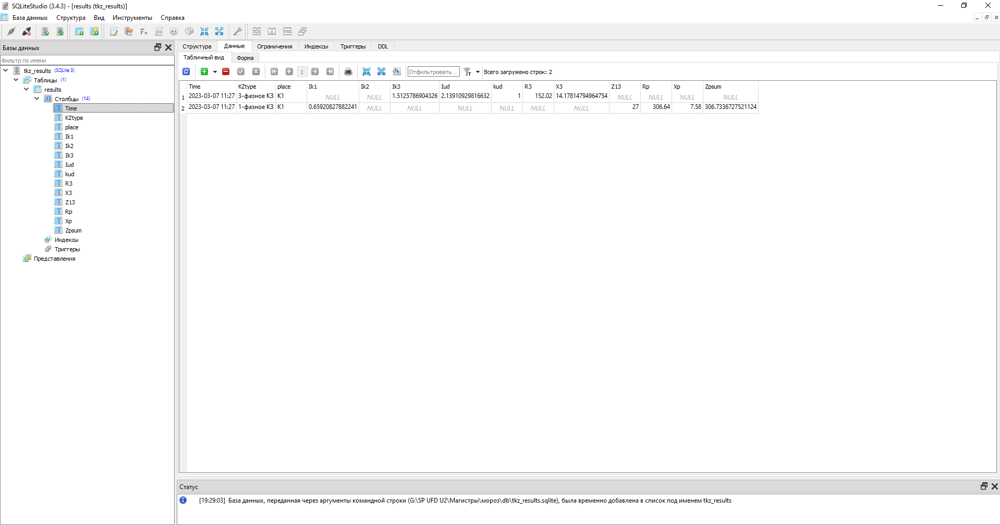
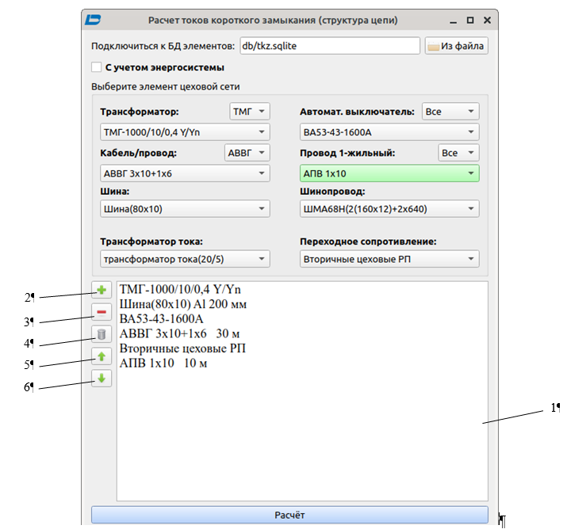
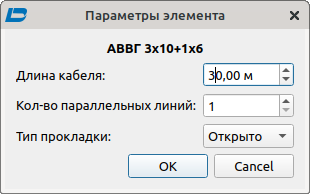
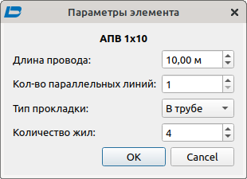
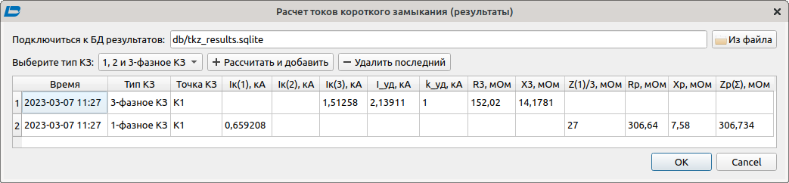

# Abstract

<h2>Contents</h2>
<ul class=content>
  <li class=ct1><a href="#p1">1. Calculation of short-circuit currents with voltage up to 1 kV</a>
  <li class=ct1><a href="#p2">2. Entering the power supply scheme</a>
  <li class=ct1><a href="#p3">3. Entering the length of elements</a>
  <li class=ct1><a href="#p4">4. Performing short circuit current calculations</a>
  <li class=ct1><a href="#conc">Сonclusions</a>
  <li class=ct1><a href="#ref">References</a>
</ul>

## 1. Calculation of short-circuit currents with voltage up to 1 kV

Modern means of computer technology
make it possible to formalize
calculation of short-circuit currents, which is then used
for machine selection and network protection
0.4 kV.

In the project of this CAD system, the calculation task
solved by constructing
electric circuit short circuit from the source
power supply (substation busbars 6(10) kV) to the point
closures. Required information for each
network elements are stored in a database with SQLite and can
be viewed as a popup
hover tooltips
mice. Calculation results for 3, 2 and 1 phase
Short circuit at every point
are written to the database file and saved during subsequent
program calls (Fig. 1).

## 2. Entering the power supply scheme

Before performing the calculation,
initialize the schema. elements,
who can enter it are located
in the lists (transformer, cable/wire,
busbar, current transformer, automatic
switch, single wire,
busbar, contact resistance
at the point <i>K3</i>) – fig. 2. The selected list item is transferred
to payroll 1 by pressing button 2.
After adding an element, they become
its parameters are available in the form.

The selected element can be removed from the list with the button
3, move with buttons 5, 6. To clean
list, button 4 is used.

## 3. Entering the length of elements

For elements requiring length control
(tires, cables, busbars, wires),
the form <i><b>Parameters is provided
element </b></i> (Fig. 3). Material (Al, Cu) is introduced into it,
distance between phases, length in m,
number of parallel lines in a bundle
cable, type of laying, number of cores.

Figure 1 - Database tkz_results
with the results of calculations of short-circuit currents 0.4 kV

Figure 2 - The main window of the block for calculating currents
KZ 0.4 kV

<table align="center" width="690" cellpadding="7" cellspacing="0">
	<col width="325"/>
	<col width="337"/>
	<tr valign="top">
		<td style="background: transparent;">

			

		</td>
		<td style="background: transparent;">

			

		</td>
	</tr>
</table>

Figure 3 - Wire (cable) block editor windows
calculation of short circuit currents 0.4 kV

## 4. Performing Short Circuit Calculations

After the list is filled, the button is activated.
<i><b>Calculation</b></i>
and the form of short-circuit current calculations (Fig. 4); in it
both the short circuit type and the name of the calculated
points. The table is filled with results
calculation (Fig. 4). Then you can write
them to the database file, and the choice of location is available
its location on the disk.

Figure 4 - The main window of the block for calculating currents
KZ 0.4 kV

## Conclusions

This program is under development
CAD shop network. It has formed
and implemented the CAD object model,
allowing the following
algorithms: adding consumer data
and their graphic images in a table,
calculation of loads modified
statistical method, choice
distribution points from the base
data (DB), selection of automatic
switches using the base
data, selection
wires for powering individual
electrical receivers (taking into account the method
gaskets, wire material), correction
and supplementing the database and reference
information, calculation of currents 3, 2 and 1 phase
short circuit at a given point
networks, reporting.

## References
<ol>
  <li>Стерлигов, В.Е. Проектирование элементов
САПР цехового электроснабжения / В.Е.
Стерлигов, Сабер Ажили, И.А, Бершадский
// Наукова-технічна конференція студентів
ДонНТУ. День науки 2005. Секція „Електротехнічні
системи електроспоживання”.- с.39-40.
  </li>
  <li>Бершадский, И.А., Сабер Ажили (Тунис),
Ильюшенкова Л.Д. Вопросы программной
реализации алгоритмов системы
автоматизированного проектирования
(САПР) электроснабжения участка цеха /
И.А. Бершадский, Сабер Ажили, Л.Д.
Ильюшенкова // Взрывозащищенное
электрооборудование: Сб. научн. Трудов
УкрНИИВЭ. –Донецк, 2006.
  </li>
  <li>Ажили, Сабер. Программное обеспечение
САПР цехового электроснабжения в
условиях России / Сабер Ажили, И.А.
Бершадский // Наукова-технічна конференція
студентів ДонНТУ. День науки 2005. Секція
„Електротехнічні системи електроспоживання”.-
с.37-38.
  </li>
  <li>Бершадский,&nbsp;И.&nbsp;А.&nbsp;Разработка
САПР для проектирования электроснабжения
цеха на напряжении 0,4 кВ / И. А. Бершадский,
А. П. Ковалёв, А.В. Згарбул // Журнал&nbsp;Электро.
— 2016, №4, с. 47-52.
  </li>
</ol>
