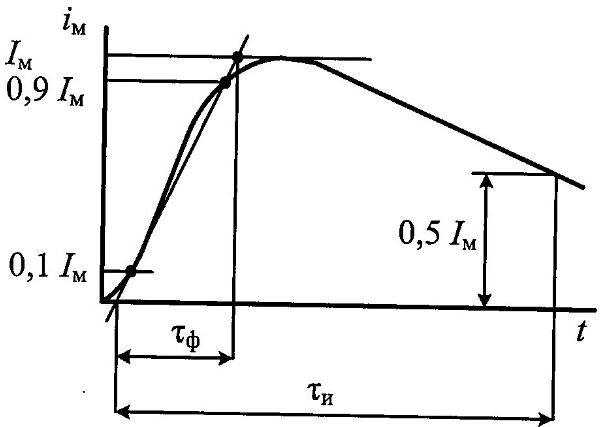

# Abstract

<h2>Contents</h2>
<ul class=content>
  <li class=ct1><a href="#p0">Introduction</a>
  <li class=ct1><a href="#p1">1. State of the issue</a>
  <li class=ct1><a href="#ref">References</a>
</ul>

## Introduction

In the electric power industry, the use of high voltage is important for the generation, transmission and distribution of electrical energy.
The advantage of high voltage is that the transmitted power increases proportionally to the square of the voltage. At the same time, reliable, long-term and economical operation of the electric power system is mainly determined by the insulation of electrical equipment and other parts of the system. In turn, damage and destruction of insulation due to the occurrence of overvoltages in systems is one of the causes of accidents in electrical installations. Overvoltage is an excess of voltage that poses a danger to the insulation.

Overvoltages are short-term in nature, because arise when
rapidly decaying transient processes or in emergency modes.
The duration of overvoltages ranges from microseconds to several
hours, and they can lead to breakdown or overlapping of insulation with
subsequent disconnection of the damaged section of the network and interruption in power supply to consumers or a decrease in power quality.

The number of overvoltages is estimated by the multiplicity factor <em>k</em><em>п</em>:

where <em>U</em>max is maximum value of the applied voltage (overvoltage); <em>U</em><em>р</em><em>а</em><em>б</em>.<em>н</em><em>а</em><em>и</em><em>б</em>. is effective value of the highest operating voltage for a given insulation class.

Overvoltage is also characterized by the rate of rise, pulse front length, pulse duration, repeatability (frequency) and maximum voltage or current value. Depending on the cause of overvoltage, they are divided into external (lightning or atmospheric) and internal (switching).

Internal overvoltages arise due to the energy of generating sources and reactive elements of the system during transient processes during equipment switching, asymmetrical modes, accidents and other phenomena. Depending on the duration of exposure, they are divided into switching and quasi-stationary. The magnitude of internal overvoltages is less than atmospheric and depends on the voltage class and network parameters, and their duration is much longer than lightning (from several seconds to minutes) and is limited by the time of action of relay protection or operating personnel.

The general purpose of surge protection measures is to obtain the maximum economic effect from reducing damage caused by surges and increasing the reliability of power systems at minimal additional costs.

To protect against overvoltages, various measures are used, which can be divided into preventive, preventing the occurrence of overvoltages, and switching, limiting the magnitude of overvoltages. Preventative measures have a permanent impact on the electrical network and their effect is evident throughout the transition process. These include the use of lightning rods at substations and overhead lines, grounding of transformer neutrals through arc suppression reactors (ARs) or resistors, grounding of supports on overhead lines, the use of switches with arc-extinguishing contacts and shunt resistors, etc. Switching surge protection means include various switching elements that are triggered , when the overvoltage at the point of their installation exceeds a certain permissible value, and reduces the value applied overvoltage. These include spark gaps, arresters and non-linear surge arresters (SPDs).

**The object** of the study is the protection schemes for a 500 kV autotransformer from lightning overvoltages.

**The purpose** of this work is to estimate the probability of an autotransformer winding insulation breakdown occurring during time t due to the appearance of a thunderstorm overvoltage wave running along the connected overhead line.

To achieve this goal, it is necessary to solve the following tasks: review existing methods for calculating the reliability of lightning protection schemes for substations; develop a mathematical model that allows you to assess the reliability level of the circuit during time t; evaluate the degree of effectiveness of installing an additional arrester in the line disconnector cell to protect the autotransformer.

**Relevance** of the topic is to increase the reliability of operation of overhead power lines and transformers from the impact of lightning surge waves on them. The relevance of this problem is especially acute when designing and operating overhead lines of higher voltage classes.

**Scientific novelty**: the dependence of the probability of breakdown of the autotransformer winding insulation during time t on the frequency and duration of the appearance of a lightning overvoltage wave in the connected overhead line that powers the autotransformer, the reliability of the surge arrester and the timing of its diagnosis was obtained.

**Practical value** of the results: a methodology for selecting the optimal ones, from the point of view of the survivability of the transformer winding insulation, and the timing of diagnosing the operability of the surge arrester, is proposed. The feasibility of installing an additional arrester in the line disconnector cell of the connected overhead line has been proven.

## 1. State of the issue

Lightning (thunderstorm) is a type of spark discharge in long air gaps (Figure 1).

There are two main types of lightning: downward, when a discharge develops from a cloud to the ground, and upward, when a discharge develops from a grounded structure to a cloud. Downward lightning occurs on flat terrain and affects lower structures, while upward lightning dominates overhanging and tall structures. Lightning can be in the form of short strikes lasting less than 2 ms and long strikes lasting more than 2 ms.

Figure 1 - Lightning discharge

Lightning discharges occur as a result of the accumulation of charges in clouds under the influence of air currents. In most cases (-90%), negative charges accumulate in the lower layers of clouds and play the main role, and positive charges are the initiators of the discharge.
The discharge enters the self-sustaining stage at electric field strengths of 25 - 30 kV/cm. The initial stage of the discharge has the character of a stepped leader with a speed of 107-108 cm/s, with a step length of ~50m and a growth rate of 5-109 sup> cm/s. When the leader reaches the ground (0.005 -0.01 s), the main discharge begins with a duration of 50-100 μs. The lightning current at the main discharge stage is the largest and can reach values ​​of up to 100 kA or more.
After the main discharge, an afterglow period begins (0.03 - 0.05 s), then repeated discharges are possible. The number of repeated discharges can reach 20, but most often 3-4. The currents of repeated discharges have lower values ​​than during the first discharge. The total charge flowing into the ground during a lightning strike is up to 100 C or more.

Figure 2 shows the standard shape of a current pulse in an object struck by lightning. The lightning current has the form of an aperiodic pulse and is characterized by the following parameters:
1. <em>I</em><em>м</em> is amplitude of the lightning current, which is the initial value when calculating lightning protection of electrical installations, and is often simply called lightning current. Lightning currents range from several kA to hundreds of kA (currents up to 50 kA are common, currents of 50-100 kA are rare, more than 100 kA are very rare).
2. Lightning current slope <em>d</em><em>i</em><em>м</em>/<em>d</em><em>t</em> is the rate of current rise at the pulse front.
3. Lightning current pulse front duration <em>τ</em><em>ф</em>. The duration of the front is determined by the following convoy. In Figure 2, mark the edge points corresponding to the current values 0,1<em>I</em><em>м</em> и 0,9<em>I</em><em>м</em>. A straight line is drawn through these points until it intersects with the zero current level and the current amplitude level.
4. Lightning current pulse duration (wavelength)  <em>τ</em><em>и</em>.
Determined by the time interval from the conditional beginning of the pulse to the moment when the pulse curve that has passed through the maximum decreases to a current value equal to half the amplitude0,5<em>I</em><em>м</em>, (рисунок 2).
5. Lightning resistance   <em>z</em><em>м</em>. In lightning protection calculations, lightning is represented as the wave impedance of the lightning channel <em>z</em><em>м</em>, along which a lightning current wave moves (<em>z</em><em>м</em> ≈ 200 ohms).

The intensity of thunderstorm activity depends on the geographical location and is assessed by the following parameters:
- number of thunderstorm days per year <em>n</em><em>д</em> or the number of thunderstorm hours per year <em>n</em><em>ч</em>;
- number of direct lightning strikes per 1 km2 earth's surface per year <em>n</em><em>у</em><em>д</em>.;

Using these parameters, the average number of lightning strikes on ground objects per year is determined:

where S is the estimated area of ​​the affected structure.
  

Figure 2 - Lightning current pulse

The main source of external overvoltages in high-voltage electrical networks are lightning discharges. The most dangerous lightning overvoltages occur when there is a direct lightning strike (PLS) on live parts, and a lightning strike on grounded structures leads to overvoltages on them, which can cause reverse flashovers from grounded parts to current-carrying parts. Such overvoltages are called overvoltages of a direct lightning strike. The amplitudes of lightning currents with object grounding resistance R, up to 25-30 Ohms (well-grounded objects) do not depend on Rз, and at higher levels they decrease in inverse proportion of Rз.

Lightning current flowing through the affected object creates a significant voltage drop and has electromagnetic, thermal and mechanical effects.

The voltage drop Uз created by lightning current in an object with resistance Rз can reach hundreds and thousands of kilovolts.
It is obvious that under the influence of such overvoltages, the insulation of almost any voltage class will be damaged. To protect equipment from lightning strikes, lightning rods are used at stations and substations and lightning protection cables on overhead lines, which are connected to a grounding device. Means of protection against lightning rods must withstand lightning strikes of the highest intensity, since the current-carrying parts of lightning rods can heat up and deform, and when lightning strikes objects with poor conductivity, their mechanical destruction and fire can occur.

There are special methods of protection against the destructive effects of atmospheric electricity, united under the single concept of “Lightning protection”.

Lightning protection is a set of protective measures against lightning that ensures the safety of people, the safety of buildings and structures, equipment and materials from explosions, fires, and destruction.

A modern lightning protection system is designed to:
a) for protection against direct lightning strike (external lightning protection);
b) for protection against lightning and communication overvoltages in networks (internal lightning protection).

Main elements of a lightning protection system:
a) the lightning rod, which directly absorbs a lightning strike, is a steel rod protected from corrosion;
b) the down conductor is designed to connect the lightning rod to the grounding conductor and serves to remove dangerous lightning current (200 thousand Amperes or more);
c) ground electrode - a steel structure consisting of one, two or three vertical electrodes connected by a horizontal conductor. The ground electrode is driven into the ground and connected using a down conductor to a lightning rod;
d) potential equalization system - serves to eliminate the potential difference between the conductive parts of the building, electrical installation and grounding.

Potential equalization involves connecting all conductors and metal structures to be grounded to each other and to grounding. The potential equalization system is equipped with busbars, connecting terminals, clamps, etc.

Complex overvoltage protection system - its task is to limit atmospheric and communication overvoltages in networks. It represents arresters and surge suppressors included in the potential equalization system for stepwise protection of various electrical circuits, telecommunication networks, and instrument equipment.

When installing lightning protection, the following conditions are observed: compliance of the type of lightning protection with the nature of the production process in the building or structure, as well as throughout the entire facility, the possibility of typing structural elements of lightning protection, reliability of operation of all lightning protection elements and their “equal strength”, long service life (10 years or more) , the possibility of using inexpensive materials and the use of structural elements of a building and structure, clarity of installation, warning and prohibition signs or fencing, access to all elements during inspection, restoration or repair.
When performing lightning protection of buildings and structures of all categories to increase the safety of people and animals, grounding electrodes, except deep ones, are placed in rarely visited places (on lawns, in bushes) at a distance of 5 m or more from the main dirt roadways and pedestrian roads, they are located under asphalt coverings or installing warning signs. Down conductors are placed in inaccessible places.

To reduce the danger of step voltages, deep and dispersed grounding conductors in the form of beams and rings are used.

When installing lightning protection for buildings and structures of any category, the possibility of shielding them with lightning rod protection zones of other nearby buildings and structures is taken into account. At the same time, natural lightning rods (exhaust pipes, water towers, chimneys, power lines and other elevated structures) are used as much as possible.

The required degree of protection of buildings, structures and open installations from the effects of atmospheric electricity depends on the explosion and fire hazard of these objects and is ensured by the correct choice of the category of lightning protection device and the type of zone to protect the object from direct lightning strikes.

The degree of explosion and fire hazard of objects is assessed according to the classification of the Electrical Installation Rules (PUE).

## References
<ol>
  <li>Ефимов Б.В.. Регистрация грозовых перенапряжений на подстанции / Ефимов Б.В. и другие // Труды КЕЦ РАН, энергетика. Вып 5. Апатиты. 2012. С.28-37.
  </li>
  <li>Дмитриев М.В. Применение ОПН в электрических сетях 6-750 кв. СПб.; Изд-во Политехн. ун-та. 2009. - 92 с.
  </li>
  <li>Дмитриев В.Л., Дмитриев М.В. параметры разряда молнии в задачах грозозвщиты // Известия РАН. Энергетика. 2005. №4. С. 54-61.
  </li>
  <li>Ефимов Б.В. Оптимизация схем замещения систем «подход ВЛ-подстанция» для целей анализа надежности грозозащиты подстанций // IV Российская конф. по молниезащите: сб.докладов СПб., 2014. С. 373-382.
  </li>
  <li>Горелов С.В. Перенапряжения и молниезащита: Учебное пособие / В.Н. Андреев, М.А. Бучельников, С.В. Горелов, В.И. Мухин; Под ред. В.П. Горелова.- 3-е изд., дополн.- Новосибирск: Новосиб. гос. акад. водн. трансп, 2003. - 251 с.
  </li>
  <li>Титков В.В. перенапряжение и молниезащита: Учебное пособие. – 2-е изд., стер. – СПб.: Изд-во «Лань», 2016. – 224с. – (Учебное пособие для вузов. Специальная литература).
  </li>
</ol>
