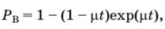

# Abstract

<h2>Contents</h2>
<ul class=content>
  <li class=ct1><a href="#p3">Calculation of the reliability of the restored element of the power supply system</a>
  <li class=ct1><a href="#p4">Conclusions</a>
  <li class=ct1><a href="#ref">References</a>
</ul>

## 3. Calculation of the reliability of the restored element of the power supply system

Experts in the field of assessing the reliability of technical systems believe that the probability of occurrence of accidents at an industrial enterprise during the year should not exceed the value
Q(8760) ≤ 1×.
This is the level of risk to which one should strive when establishing the degree of risk due to the activities of industrial enterprises. When the risk decreases below 10-6 per year, the public does not express undue concern, and therefore special measures are rarely taken to reduce the degree of risk. This statement means that for the sake of economic benefit from the operation of an industrial facility, people are ready to take such a risk.

To date, there are no easy-to-use and accurate methods for calculating the reliability of load nodes of power supply systems of industrial enterprises.

Therefore, the development of new and improvement of existing methods for assessing the survivability of load nodes for power supply systems for consumers of electrical energy is an urgent task.

Most elements of power supply systems are recoverable, while the speed and quality of restoration depend on the suitability of the system element for repair (maintainability) and on the organization of restoration.
With regard to the elements of power supply systems, restoration includes the solution of the following issues:
- detection of the fact of failure occurrence;
- detection of the place of occurrence of failure;
- ensuring good adaptability to the repair or replacement of failed elements.

In general, the time after the occurrence of a failure can be divided into three periods, namely the time since:
- the occurrence of a failure before the establishment of this fact by the control system;
- establishing the fact of the occurrence of a failure until the location of the occurrence of the failure is found;
- detection of the place of occurrence of failure until the moment of repair or replacement of the failed element of the power supply system.

The duration of each of these periods depends on the effectiveness of control and search for the place of occurrence of failures, the design of the element of the power supply system, the qualifications of the maintenance personnel, etc.

If the distribution laws for the search for a failed element and its replacement do not contradict the exponential

then the renewal law can be defined as follows. The probability density of two random variables <i>t</i><i>0</i> is

where

For p0= py=p we get the equation

<table class="numeq">
<tr>
<td></td>
<td>(3.1)<td>
</tr>
</table>

which characterizes the recovery time of an element of the power supply system.

If the failure rates of each EA element are known, then the average recovery time under the exponential law is:

где

 is the recovery intensity of the i-th element;
<i>Т</i>Вi0 is the average time to detect a failure point;
<i>T</i>Biy is the average time to fix a failure.

Let us determine the main characteristics of the reliability of a non-redundant element of the power supply system, assuming that the failure flow is the simplest and the recovery time is exponential.

For redundant sequential structures with restoration and arbitrary methods of element redundancy, Markov models are used to describe the corresponding state graphs (diagrams).[4] Let us turn to the system model described using the theory of Markov homogeneous processes. Consider the formula for the probability of finding the system in a working state:

<table class="numeq">
<tr>
<td></td>
<td>(3.2)<td>
</tr>
</table>

Given that

<table class="numeq">
<tr>
<td></td>
<td>(2.3)<td>
</tr>
</table>

<table class="numeq">
<tr>
<td></td>
<td>(3.4)<td>
</tr>
</table>

If we assume that at the initial moment of time the electrical apparatus will be in working condition with probability Р, i.e. Рх(0) = Р, where 0 < Р < 1, then

<table class="numeq">
<tr>
<td> (2.5)</td>
<td>(3.5)<td>
</tr>
</table>

If the object is checked before being put into operation, and it turns out to be operational, then Р = 1 and

<table class="numeq">
<tr>
<td> (2.6)</td>
<td>(3.6)<td>
</tr>
</table>

If at the time of inclusion the object is inoperable <i>(P = </i>0), then

<table class="numeq">
<tr>
<td></td>
<td>(3.7)<td>
</tr>
</table>

Expressions (3.5-3.7) characterize the probability of an operable state of the electrical apparatus at an arbitrary time point <i>t</i> and can be used to determine the readiness function of the electrical apparatus.

Let us introduce the notation <i>М</i> = А./р. Then expression (3.7) takes the form:

<table class="numeq">
<tr>
<td></td>
<td>(3.8)<td>
</tr>
</table>

For the probability of an inoperable state, the following dependence can be obtained in a similar way:

<table class="numeq">
<tr>
<td></td>
<td>(3.9)<td>
</tr>
</table>

At <i>t</i> —> ∞, which corresponds to the condition of a long stay of the electric apparatus in working condition, we obtain a stationary solution:

<table class="numeq">
<tr>
<td></td>
<td>(3.10)<td>
</tr>
</table>

The expression for determining the readiness function can be represented as follows:

<table class="numeq">
<tr>
<td></td>
<td>(3.11)<td>
</tr>
</table>

If <i>t</i> is small, then

<table class="numeq">
<tr>
<td></td>
<td>(3.12)<td>
</tr>
</table>

those. <i>P</i>1(<i>t</i>) coincides with an approximate expression for the probability of failure-free operation for small values ​​of <i>t.</i>

So, for small values ​​of <i>t</i>, the readiness function coincides with the probability of failure-free operation <i>P(t)</i>, for large values, with the availability factor. These conclusions are obtained for the simplest flow of failures and the exponential law of recovery time.

Consider the reliability characteristics for arbitrary failure and recovery laws. If we evaluate an arbitrary but sufficiently large time interval <i>t</i>, then, according to the ergodic theorem, the probabilities <i>Р</i><i>х </i> and < i>Р</i><i>2 </i>can be considered as a period of time during which the object is in a healthy or inoperable state. Thus, the value <i>P</i><i>x</i><i>t</i> represents the time during which the object is operational, and <i>P </i><i>2</i><i>t</i> — time spent on recovery. If during the time <i>t</i> there were <i>n</i> failures, then the mean time between failures and the mean recovery time will be respectively equal:

Where

because

then

The dependencies obtained for assessing the reliability of non-redundant recoverable electrical devices are based on the assumption that there is a control system that detects all failures, and restoration begins immediately. In reality, some of the elements of the power supply system may not be covered by the control system, so the reliability indicators will be worse than in the case of an ideal control system. The degree of this deterioration in the values ​​of reliability indicators can be estimated by the value

where <i>К</i> and <i>К’</i> are the values ​​of the criteria, respectively, for an ideal and real control system.

For approximate calculations Δ<i>К</i> = 0.5...5.0%.

## Conclusion

An analysis of the general patterns that determine the durability of the operation of various devices and structures, the development of methods for preventing failures at the stages of design, construction, operation, quantifies the probability that the characteristics of the object will be within the technical standards for a given period of time.

In practical activities, an energy engineer has to make various decisions. For example, to choose a design version of the power system or its part, to reconstruct its networks and stations, to assign modes. In the energy sector, a large number of factors influence the choice of solution. Uncertainty appears, knowledge, experience, intuition, qualitative analysis help to overcome it. Among other factors, reliability has a special place, so when calculating it is necessary to find out all the operating conditions and design features of the system elements.

The report contains formulas that allow you to calculate the probability of failure-free operation for different durations of the failure detection time at its different stages.

## References
<ol>
  <li>ГОСТ
	27.002-2015. Межгосударственный стандарт.
	Надежность в технике. Термины и
	определения.
  </li>
  <li>Матвеевский
	В.Р. Надежность технических систем.
	Учебное пособие. – Московский
	государственный институт электроники
	и математики. М., 2002 г. – 113 с.
  </li>
  <li>Аполлонский
	С., Куклев Ю. Надежность и эффективность
	электрических аппаратов. Учебное
	пособие. -  СПб.: Изд-во «Лань», 2011.-448.
  </li>
  <li>ГОСТ
	27.301-95. Межгосударственный стандарт.
	Надежность в технике. Расчет надежности.
	Основные положения.
  </li>
  <li>Шеметов
	А.Н. Надежность электроснабжения: учеб.
	пособие для студентов специальности
	140211 «Электроснабжение». – Магнитогорск:
	ГОУ ВПО «МГТУ им. Г.И. Носова», 2006.
  </li>
</ol>
