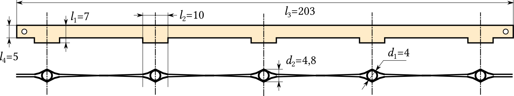
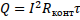
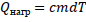
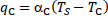
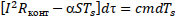
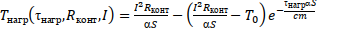
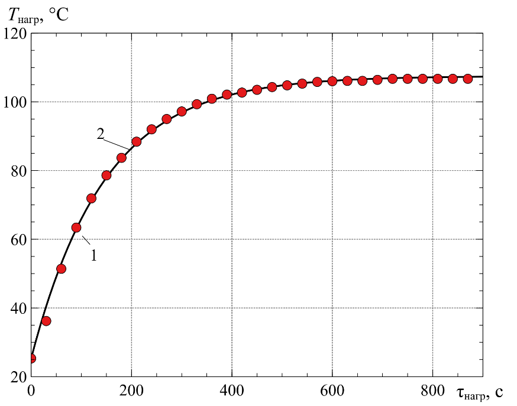
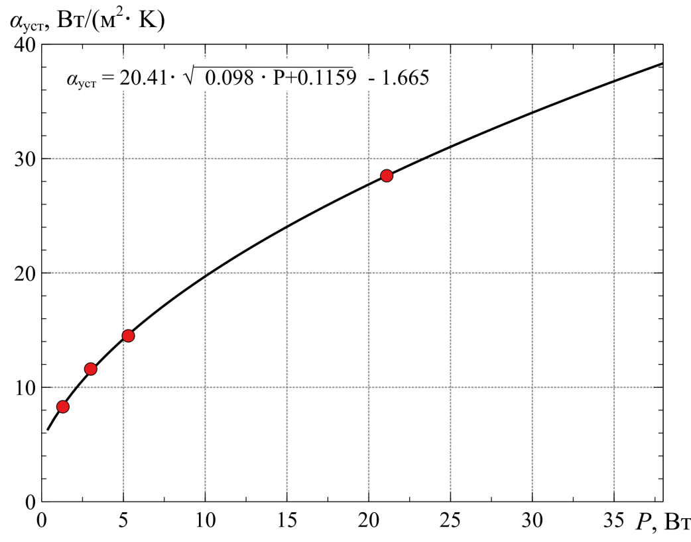
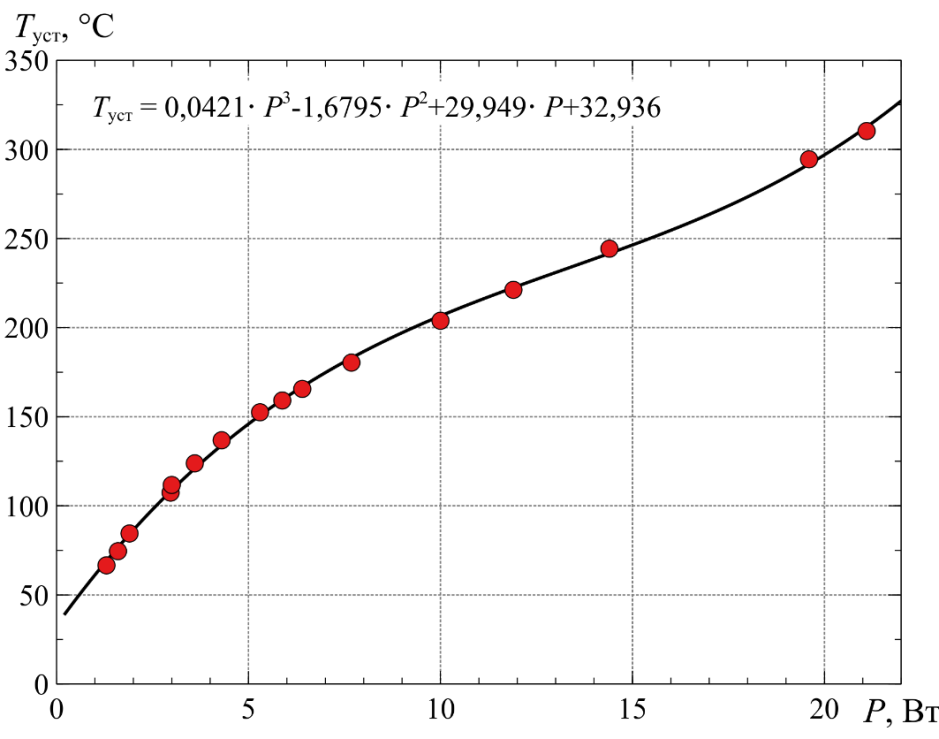

# Abstract

<ul class=content>
  <li class=ct1><a href="#p0">Introduction</a>
  <li class=ct1><a href="#p1">1. Mathematical model of heating of conductors in the contact connection of an extension cord</a>
  <li class=ct1><a href="#p2">2. Computational and experimental method for determining the operating temperature of the sensors of the thermal relay of the extension cable</a>
  
  <li class=ct1><a href="#p3">3. Description of the protection scheme</a>
  
  <li class=ct1><a href="#conc">Conclusions</a>
  
  <li class=ct1><a href="#ref">Literature</a>
</ul>

## Introduction

A significant problem of ensuring fire safety in low-voltage electrical installations of residential and public buildings are failures associated with incandescent connections and sparks, which usually occur due to overheating of substandard electrical connections characterized by high electrical resistance <a href="#ref1">[1]</a>.

According to statistics, in recent years, fires in buildings caused by electrical factors account for approximately 30 to 50% of the total number and their share continues to grow <a href="#ref2">[2–3]</a>.

A bad electrical contact is a malfunction in a low–voltage electrical network that is not detected by conventional protective devices <a href="#ref4">[4]</a>. At the same time, it can cause spot heating or a series of electric arcs, as well as monotonous heating of the contact connection, which are common causes of fires caused by damage in low-voltage electrical installations.

In this case, a fire may occur due to heating:
- products made of materials with low heat capacity (bed linen, curtains, bedspreads, pillows ...), which are placed directly near the bad contact;
- plastic parts of electrical installation elements;
- wooden structures and objects.

A fire is usually caused by a combination of several causes. Many fires are caused by overheating of the component, followed by sparking and finally ignition. For example, a conductor may overheat due to overcurrent or poor electrical contact. Overheating can reduce the dielectric strength of the conductor insulation over time, which will lead to a short circuit when the conductor bends or passes through the metal.

The probability of a fire increases if, in addition to electrical, there are also mechanical disturbances in the electrical installation. Experiments conducted in Norway
<a href="#ref5">[5]</a> have shown that the temperature of a good plug-socket connection at the contact points stabilizes at about 60 °C at rated current loads. However, when the plug connection was exposed to weak vibrations when working with a rated current load, the temperature at the contact points rose to 400-450 ° C in a short time, which caused the melting of the surrounding insulating material in the immediate vicinity of the <q>plug</q> and <q>sockets</q> of sockets, followed by the appearance of a regular electric arc.

Based on the review presented, it can be concluded that two types of failure - overheating of a bad electrical contact and a regular electric arc - are critical from the point of view of fire occurrence, since no classical protective component detects them.

The International Foundation for Electrical Safety (ESFI) shows that extension cords are a common cause of fires. There is a known method of protecting a 220 V extension cord from overload currents using a thermobimetal and from short circuit with a fuse. However, this method does not provide protection against fires at currents less than the operating permissible <i>I</i>раб.д,
caused by overheating of a bad electrical contact due to sparking or monotonous changes in its transient resistance <i>R</i>конт.

## 1. Mathematical model of heating of conductors in the contact connection of an extension cord

In order to determine the operating temperature settings of the thermorel sensors, it is necessary to conduct mathematical modeling and obtain an informed solution to determine the dependence of the change in the heating temperature of the conductor at the point of contact connection on time.

Let's consider this problem on the example of a 5-socket extension cord with a rated current of 10 A, with a power of 2.2 kW. The main dimensions of the extension contact plates in mm (Fig. 1) are used in calculating the heat transfer coefficient.

Fig. 3. Assembly drawingof the contact plate extension

The purpose of the simulation is to determine the parameters of the permissible heating of the contact connection depending on its resistance, load current and the size of the heat–conducting elements of the extension.

During the passage of current in the conductor, part of the heat released is used to increase its temperature in the contact connection and electrical insulation, and the other part is dissipated into the atmosphere, increasing the temperature of the insulation of electrical wiring and housing parts.

The stationary heating mode, in which the temperature of the conductor at the point of contact connection reaches a constant value, is due to the value of the current, the transient resistance and the conditions of heat transfer.

During the time τ, s, heat is released in the conductor:
<table class="numeq">
  <tr>
    <td></td>
    <td>(1)</td>
  </tr>
<table>

where <i>Q</i> – amount of heat released in the conductor, J; 
<i>I</i> – long–term permissible current, A; 
<i>R</i>конт – transient resistance of the contact connection, Ohm.

The balance of the heat released <i>Q</i>
is distributed to the heating of the conductor and the return of heat to the environment from the surface of the contact connection:
<table class="numeq">
  <tr>
    <td></td>
    <td>(1)</td>
  </tr>
<table>

where <i>Q</i>нагр
– amount of heat spent on heating the conductor together of the contact connection, J.
<table class="numeq">
  <tr>
    <td></td>
    <td>(3)</td>
  </tr>
<table>

<i>c</i>
– heat capacity of the conductor material, J/(kg·K); 
<i>m</i> – mass of the conductor, kg; 
<i>Q</i>рас
– amount of heat expended in the contact connection on radiation from the surface of the conductor, convection and thermal conductivity, J.
<table class="numeq">
  <tr>
    <td></td>
    <td>(4)</td>
  </tr>
<table>

α –  coefficient of heat transfer from the surface of the conductor,
W/(m2·K); 
<i>S</i> – area of the heat–emitting surface of the conductor, m2; 
<i>T</i>S – surface temperature of the conductor, К.

In formula (4), the heat transfer coefficient  from the surface of the conductor is most difficult to determine. It should be noted that α depends on a large number of different factors: the shape and size of the body, the pressure and speed of the environment, the physical properties of the medium, etc., but most importantly, as further experiments have shown, with an increase in the load current of the extension cord,  also increases, and this growth has a nonlinear character depending on the amount of power <i>P</i>.

Under certain conditions, the share of radiant heat exchange can be up to 30% <a href="#ref9">[9]</a>.

According to Newton's law, the amount of heat given by a unit of the surface of a body per unit of time is proportional to the temperature difference between the surface of the conductor <i>T</i><i>S</i>
and the environment <i>T</i>C:
<table class="numeq">
  <tr>
    <td>, Вт/м2</td>
    <td>(5)</td>
  </tr>
<table>
where αC – convective heat transfer coefficient, W/(m2·К); 
<i>T</i>C – ambient temperature, К.

In <a href="#ref\1">[\1]</a>  analytical dependences were obtained for determining alternating current in the temperature range from 20 to 140 °C. It was assumed that the contact connection is represented as a horizontal conductor (cylinder) with a length of <i>l</i>, m and a diameter of
<i>d</i>, m. Obtaining analytical dependencies is based on formulas for dimensionless heat transfer coefficients.

Common disadvantages of this approach can be called:
- o calculate the αC
, it is necessary to know in advance the temperature of the steady-state overheating of the conductor in the contact connection <i>Т</i>уст;
- the difference in the shape of the contact plates from the cylinder.

Therefore, the task was set to compare the calculation method with the results of the experiment to determine the heating temperature of the contact plates of the extension and adjust the coefficient αC
 so that the experimental heating curves coincide with the theoretical ones in time.

Taking into account the equations (1),(3), (4) expression (2) will take the form:
<table class="numeq">
  <tr>
    <td></td>
    <td>(6)</td>
  </tr>
<table>

Moving on to the differentiation with separable variables
<table class="numeq">
  <tr>
    <td></td>
    <td>(7)</td>
  </tr>
<table>

After integration (7):
<table class="numeq">
  <tr>
    <td></td>
    <td>(8)</td>
  </tr>
<table>

Establishing the temperature of the conductor in the contact took the test from (6) with the input of <i>T</i>уст which in this mode
<i>cmdT</i>s = 0:
<table class="numeq">
  <tr>
    <td></td>
    <td>(9)</td>
  </tr>
<table>

Initially, taking into account the complexity of the dependence α = α(<i>Т</i>s), we obtain the solution (6) under the assumption =const. Integrating (8), we find the dependence of the heating temperature of the conductor at the point of the contact connection <i>T</i>нагр. from time to time:
<table class="numeq">
  <tr>
    <td></td>
    <td>(10)</td>
  </tr>
<table>
Taking into account (9):
<table class="numeq">
  <tr>
    <td></td>
    <td>(11)</td>
  </tr>
<table>

where <i>T</i>0 – initial heating temperature of the conductor at the point of contact connection, K; 
τнагр – heating time, s.

## 2. Computational and experimental method for determining the operating temperature of the sensors of the thermal relay of the extension cable

The coefficient α
can be determined most accurately by experimentally examining the heating of the contact plate of the extension cord by placing the <i>Pt</i>100
thermocouple (Fig. 4) near the point of local heating of the contact connection - the installation location of the plug of the electric receiver.

Fig. 4. Workplace for experiment al study of heating of the contact plate of the extension

A DC power supply (DC) with an adjustable voltage level is connected to the contact plates of the extension cable via an ammeter. The required resistance <i>R</i>конт
of the plug–plate contact connection is provided by copper sleeves pre-oxidized with household ammonia. The plug is connected to an ohmic load – rheostat, which ensures the flow of a given current through the contact connection. The criterion for the end of the experiment is the value of the rate of temperature increase ≤ 0.1 0С/min.

Let's consider the calculation features using the example of a current load
<i>I</i>нагр
= 3 А. The resistance of the contact connection is assumed to be <i>R</i>конт
= 0,33 Ohm, мthe power released in the contact connection is <i>P</i>
= <i>I</i>2·<i>R</i>конт
= 2,97 W, and <i>T</i>0
= 25,3 °С. By parametric analysis, the coefficient  α
= 11,57, W/(m2·К)
and the dependence of <i>T</i>нагр(τнагр)
– were determined – Fig. 5, according to (9) – <i>Т</i>уст
= 107,4 °С.

Fig. 5. The dependenceof the heating temperature of the conductorat the place of the contact connection ontime (1- experiment, 2- theory)

Similarly, when varying <i>I</i>нагр=
2..16 А, <i>R</i>конт
= 30..330 mOhm, the values of <i>T</i>уст<i>
(</i><i>P</i><i>,
</i><i>R</i>конт<i>)</i> and the regression equation α(<i>P</i>) are determined – Table 1, Fig. 6.

<table dir="ltr" width="576" cellpadding="7" cellspacing="0" style="text-align: center; margin: auto">
  <caption>Таb. 1 – Calculation and experimental data</caption>
  <col width="41"/>
  <col width="43"/>
  <col width="33"/>
  <col width="194"/>
  <col width="75"/>
  <col width="104"/>
  <tr>
    <td rowspan="2" style="border: 1px solid #000000">
      <i>R</i>конт,
      mOhm
    </td>
    <td rowspan="2" style="border: 1px solid #000000">
      <i>P</i>,
      W
    </td>
    <td rowspan="2" style="border: 1px solid #000000">
      <i>I</i>,
      A
    </td>
    <td rowspan="2" style="border: 1px solid #000000">
      α = 
    W/(m2К)
    </td>
    <td colspan="2" width="193" style="border: 1px solid #000000">
      <i>T</i>уст,
        °C
    </td>
  </tr>
  <tr valign="top">
    <td style="border: 1px solid #000000">
      <i>theory</i>
    </td>
    <td style="border: 1px solid #000000">
      <i>experiment</i>
    </td>
  </tr>
  <tr valign="top">
    <td height="61" style="border: 1px solid #000000">
      330
    </td>
    <td style="border: 1px solid #000000">
      1,3 
      2,97 
      5,3 
      11,9 
      21,1
    </td>
    <td style="border: 1px solid #000000">
      2 
      3 
      4 
      6 
      8
    </td>
    <td style="border: 1px solid #000000">
      8,485 
      11,57 
      14,667 
      22,489 
      28,451
    </td>
    <td style="border: 1px solid #000000">
      64,8 
      106,7 
      152,3 
      221 
      319
    </td>
    <td style="border: 1px solid #000000">
      66,6 
      107,4 
      152,5 
      - 
      310,3
    </td>
  </tr>
  <tr valign="top">
    <td style="border: 1px solid #000000">
      100
    </td>
    <td style="border: 1px solid #000000">
      1,6 
      3,6 
      6,4 
      10 
      14,4 
      19,6
    </td>
    <td style="border: 1px solid #000000">
      4 
      6 
      8 
      10 
      12 
      14
    </td>
    <td style="border: 1px solid #000000">
      8,986 
      12,172 
      16,176 
      20,541 
      24.679 
      27,872
    </td>
    <td style="border: 1px solid #000000">
      74,55 
      123,85 
      165,6 
      203,85 
      244,3 
      294,46
    </td>
    <td style="border: 1px solid #000000">
      - 
      - 
      - 
      - 
      - 
      -
    </td>
  </tr>
  <tr valign="top">
    <td style="border: 1px solid #000000">
      30
    </td>
    <td style="border: 1px solid #000000">
      1,9 
      3 
      4,3 
      5,88 
      7,68
    </td>
    <td style="border: 1px solid #000000">
      8 
      10 
      12 
      14 
      16
    </td>
    <td style="border: 1px solid #000000">
      9,51 
      11,245 
      13,223 
      15,473 
      17,829
    </td>
    <td style="border: 1px solid #000000">
      84,5 
      111,71 
      136,8 
      159,12 
      180,37
    </td>
    <td style="border: 1px solid #000000">
      - 
      - 
      - 
      - 
      -
    </td>
  </tr>
</table>

The final result of calculations using this technique was the characteristic:

<table class="numeq">
  <tr>
    <td><i>T</i>уст<i>(</i><i>P</i>)=0,0421·<i>P</i>3
– 1,6795·<i>P</i>2
+29,949·<i>P</i>
+ 32,936</td>
    <td>(12)</td>
  </tr>
<table>

Fig. 6. Dependence of the heattransfer coefficient on the dissipated power in the contact node

It allows you to calculate the<i>Т</i>уст for any combination of <i>I</i>нагр
and <i>R</i>конт
for the specified type of extension cords (Fig. 7).

According to GOST R51539-99<a href="#ref\1">[\1]</a>, in normal mode,
<i>R</i>конт&le;0,05
Ohmshould be performed in extension cords with connections between fixed and moving parts. In our experiments,
<i>R</i>конт
did not exceed 0,02 Ohm, then at <i>I</i>нагр
= 10 A from (12) we get <i>T</i>уст
= 86,5 °С. The thermorail ThermalFuseSeries is selected with an action temperature of 95±5° С and a return temperature of  70±10°С.

Fig. 7. Dependence of thesteady-state heating temperature of the conductoron the dissipated power in the contactnode

## 3. Description of the protection scheme

The implementation of the electrical circuit to protect the extension cord from overheating of the contact connection is shown in Fig. 8. The extension cord is connected to the mains power supply circuit by means of the <i>ХТ</i>,
plug mounted at the end of the wire.

Fig. 8. Schematicdiagram of an extension cord with additional protection

The safety switch
<i>SA</i>1
of type <i>ST</i>001
is designed for both mechanical voltage relief from the consumer and disconnection when the load exceeds the current strength of 10A.

Protection against pulse overvoltages is formed on the basis of a varistor <i>RU</i>1
(at an amplitude level of 470 V) and a safety switch<i>SA</i>1
(a varistor protection device instead of a fuse).

To ensure stable power supply for the own needs of the protection elements, a linear voltage converter <i>DA</i>1 with a DC output voltage of 5 V. Limiting the dissipated power on the stabilizer in nominal operating modes (no more than 0.2 W) of the circuit provides a parametric stabilizer at 8.2 V (<i>VD</i>3,
<i>R</i>5).

To reduce the voltage of the network level and its rectification due to the diode bridge <i>VD</i>, a power source with a quenching capacitor <i>С</i>1
and discharge resistors <i>R</i>1,
<i>R</i>3,
<i>R</i>4
is used (voltage can be present on the capacitor for a long time even after disconnecting from the mains). The circuit also provides a smoothing capacitor <i>С</i>2
and filtering pulsations in the 5V circuit capacitors<i>С</i>4,
<i>С</i>5.

To measure the heating temperature of the copper plates of the extension sockets, two thermal relays <i>SA</i>2,
<i>SA</i>3
with a threshold of 95±5° С were used (each relay is installed on its own copper plate). The node for monitoring the status of contacts <i>SA</i>2,
<i>SA</i>3
with an executive relay <i>К</i>1
and an LED indication <i>VD</i>1
consists of <i>VT</i>1,
<i>VT</i>2,
<i>VD</i>5,
<i>R</i>7…<i>R</i>9,
<i>R</i>10,
<i>R</i>11.
In this scheme, the voltage supply to the load is blocked when one of the controlled contact connections overheats. This prevents the self-repair of the device circuit, and also helps to identify and eliminate the causes of its normal operation.

<i>RC</i>
chain <i>R</i>7,
<i>С</i>6
provides the necessary signal delay to pick up (reduces the likelihood of false alarms when power is applied to the extension cord, protection reset, etc.).

The protection circuit works as follows. When the extension cord is turned on, the <i>SA</i>1
button generates a voltage of its own needs of 5V, but there is no voltage in the sockets (relay <i>К</i>1
is disabled). If there is no temperature exceeding the permissible temperature on both thermosets, the transistor <i>VT</i>1
opens and turns on the relay <i>К</i>1, thereby supplying voltage to the load through the extension sockets. The green LED is lit, but the red one is not (shunted by the <i>VT</i>1 collector).

The <i>VT</i>2 transistor is designed to form a "latch" mode when the protection is triggered. While the transistor <i>VT</i>1
is open, the potential of its collector is attracted to the common circuit (shunting of the red LED and the base <i>VT</i>2).

In case of exceeding the temperature of one of the thermorelets (opening its contact), the green LED goes out, the transistor <i>VT</i>1
closes (relay <i>К</i>1
turns off – the load is de-energized), the red LED lights up, the pick-up transistor <i>VT</i>2
opens and shunts the base <i>VT</i>1,
with its collector, forcibly closing it. In this case, when the temperature is restored (the triggered thermal relay turns on), the green LED lights up (since green and red are in the same housing, yellow is obtained when two colors glow simultaneously), the relay
<i>К</i>1 does not turn on due to <i>VT</i>2 picking up.

The protection will be reset only by disabling and re-enabling the <i>SA</i>1 button.

Features of protection indication:
- green – the temperature is normal, the network is supplied to the load;
- yellow – the temperature has decreased (normal), the protection must be reset in the device (until yellow lights up - it is impossible to reset the protection);
- red – the temperature has risen above the permissible, the network is disconnected to the load.

## Conclusions

1. In electrical installations of residential and public buildings of low voltage, the cause of fires caused by contact heating is common. Extension cords are a common cause of fires, and they suggest using a method for detecting "hot spots", involving the installation of thermal sensors that are introduced in potentially dangerous places (most often on connecting terminals or clamps).
2. For the first time, formulas convenient for engineering calculations are proposed for determining the steady-state heating temperature of the contact plates of an extension cord depending on the amount of power allocated using the example of a typical 5 outlet extension cord with a rated current of 10 A.
3. By the developed computational and experimental method, the operating temperature of the sensors of the thermal relay for protecting the extension cable from overheating of its contact connections (95 ± 5 ° C) was determined with various combinations of <i>I</i>нагр and <i>R</i>конт for the type of extension specified in paragraph 2.
4. In the protection circuit, the voltage supply to the load is blocked when one of the controlled contact connections overheats. This prevents the self-repair of the device circuit, and also helps to identify and eliminate the causes of its normal operation. The light indication allows you to determine all possible modes of additional protection of the extension cord, which can be located in the technological cavities of its body structure.

## Список источников

<ol>
  <li>Бершадский, И. А.
Обоснование способа защиты электрической
сети напряжением 220 В от перегрузок с
учетом нестационарного нагрева
электропроводки [Электронный ресурс]
/ И. А. Бершадский, А. В. Згарбул,А. А. Кулиш
// Вестник Донецкого национального
технического университета. — 2019. —
2(16). — С. 71—79.
  </li>
  <li>European
statistics and potential fire safety measures, Final report, January
2009.
  </li>
  <li>Бершадский, И. А.
Анализ статистики пожаров по
электротехническим причинам и состояния
устройств защиты в сетях 0,4 кВ [Текст] /
И. А. Бершадский, А. В. Згарбул // Пожарная
безопасность. — 2017. — № 4. — С. 119—125.
  </li>
  <li>Hadziefendic,N.Thermal imaging of poor contacts and AFCI technique
for series arc breaking [Text] /N. Hadziefendic, M. Kostic, J.
Trifunovic // Proceedings of II Fire Safety Consulting. —  Belgrade
(in Serbian). — 2012. —  P. 25–42.
  </li>
  <li>SINTEF,
Fire in electrical installations, Norwegian Institute of Technology,
January 28, 2008.
  </li>
  <li><a href="https://www.researchgate.net/profile/Jj-Shea">J.J.
Shea</a>, US Patent No. 8,854,066 (3 Oct, 2014). Method and apparatus
for detecting a glowing contact in a power circuit - Режимдоступа
https://patents.google.com/patent/WO2013151626A1/en. - Загл. c
экрана.
  </li>
  <li>NedzadHadziefendic. The influence of poor electrical contacts on the
occurrence of initial fire and a method for their detection in
low-voltage electrical installations [Text] :Doctoral
Dissertation–Belgrade : UniversityofBelgrade,
schoolofelectricalengineering, 2019. – 237 c.
  </li>
  <li>Solyonyj,
S. Automatic System of Monitoring and Diagnostics of Sparking in
Contact [Text] / S. Solyonyj, O. Solenaya and Andrey Roznhin // MATEC
Web of Conferences&nbsp;77, 12003 . – 2016. –  P. 1–5.
  </li>
  <li>Зинченко, E.О.
Температура нагревания проводников в
контактных соединениях электроустановок[Текст]
/ Научный вестник НИИГД «Респиратор».–2017.
– № 3(54). – С. 36-47.
  </li>
  <li>Удлинители бытового
и аналогичного назначения на кабельных
катушках. Общие требования и методы
испытаний: ГОСТ 31223-2012 (IEC 61242:1995). Введ.
01.01.2014. Москва: Росстандарт, 2014. 52 с.
  </li>
</ol>
