# Abstract

<h2>Contents</h2>
<ul class=content>
  <li class=ct1><a href="#p3">3. Using of Markov random processes to describe the processes of electric shock to a person</a>
  <li class=ct1><a href="#p4">Conclusion</a>
  <li class=ct1><a href="#ref">References</a>
</ul>

## 3. Using of Markov random processes to describe the processes of electric shock to a person

Using Markov random processes, a mathematical model "source-environment" was proposed, with the help of which it was shown that such phenomena as different in nature, such as an explosion, a fire, a case of electric shock to a person, occur according to one logical scheme and have common mathematical models. A formula for determining
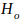 – the number of accidents per unit of time, which takes into account the dangerous and safe state of the source and the environment.

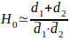,

where ,  - the average time interval for the element to be in a safe and dangerous state, respectively
( = 1;2).

The formula is valid when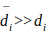.

A formula is proposed that allows you to choose such terms for the prevention of protective equipment

from current leakage to the ground, at which the normalized level of intensity of electric shock to a person is provided - Н.

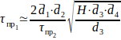,

where 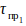 – time interval between safety shutdown checks;

 – time interval between protective grounding checks;
  
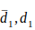 – the average time interval between faults of the protective shutdown and the average time the protective shutdown is in the failed state;
    
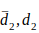 – the average time interval between protective ground faults and the average time it is in an undetected failed state;

 – the average time interval between human touches to the body of the switching device without personal protective equipment and the average duration of the person's hands touching the metal case;

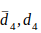 – average time interval between
the appearance of a ground fault in the switching device and the average duration of its existence.

Formula (1.31) is valid under the conditions:
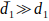;
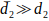;
;
;
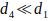;
;
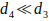.

The paper presents a block diagram of a person's electric shock (Fig. 1), which is characterized by the transition of the system from a safe state
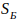
in the failed state
.

The paper describes a system consisting of three elements and obtains a system of linear differential equations. From it you can find the probabilities of finding the system in each of the possible states
,
где 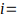
.

Rice. 1 Scheme for the process of electric shock to a person:

 – finding electrical equipment under voltage;

 – state of insulation of the power supply system;

 – state of the residual current device;

 – human contact with live parts;

 – touching a person to the body of electrical equipment;

 – condition of protective grounding;

 – single-phase earth fault;

 – resistance level of the human body.

## Conclusion

- The use of logical-probabilistic methods for assessing the electrical safety of electrical equipment operated in coal mines makes it possible to qualitatively determine the level of electrical safety. The assessment of electrical safety by such models greatly underestimates the true level of electrical safety due to the fact that these models do not take into account the time spent by the elements included in the system in an undetected failed state. This means that mathematical models take into account only the probability of the occurrence of an event, but do not take into account the duration of the existence of the event itself.
- The use of Markov processes for modeling cases of electric shock to people, in our opinion, will make it possible to describe all possible cases of electric shock to people during the operation of electrical equipment and to obtain the characteristics missing for the analysis of systems, except for those obtained in [17,18,19], i.e.: the probability of finding systems in each of the possible states
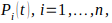
где  - the number of elements, the simultaneous presence of which in a dangerous state leads to electric shock to a person; the average time and variance of the time the system spends in each of the possible states
 и 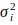;
distribution function of time intervals before the first electric shock to a person, provided that
.
- The developed mathematical models based on Markov random processes will allow creating a universal methodology that will allow to adequately assess the level of electrical safety of objects in any ratio of dangerous and safe states of the elements, as well as take into account their maintenance (or without maintenance, when ).

## References
<ol>
  <li>С.В.Белов.Безопасность
	жизнедеятельности и защита окружающей
	среды. М.:Юрайт, 2011. 680 с.
  </li>
  <li>Манойлов В.Е. 
	Основы  электробезопасности.  – Л.:
	Энергоатомиздат, 1991. – 480 с.
  </li>
  <li>Щуцкий В.И., Бурлаков
	А.А. Моделирование опасности поражения
	электрическим током и критерий выбора
	режима нейтрали в дражных низковольтных
	 электрических  сетях //  Изв.  вузов.  –
	 Горный  журнал.  – 1978. -  №11.  – С. 114-121.
  </li>
  <li>Эндренн Дж.
	Моделирование при расчетах надежности
	в электроэнергетических системах: 
	Пер. с англ. под. ред. Ю.Н. Руденко. – М.:
	Энергоатомиздат, 1983. – 336 с.
  </li>
  <li>Ковалев А.П. О
	проблемах оценки безопасности
	электротехнических объектов //
	Электричество. – 1991. - №8. – С. 50-55.
  </li>
  <li>Щуцкий В.И., Бурлаков
	А.А. О вероятностной оценке уровня
	электробезопасности // Электричество.
	– 1982. - №2. – С. 16-20.
  </li>
  <li>Безопасность
	жизнедеятельности. Учебное пособие.
	Калининград: КГТУ, 1998 – 232 с.
  </li>
</ol>