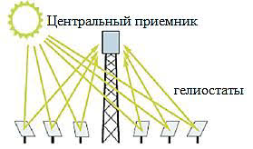
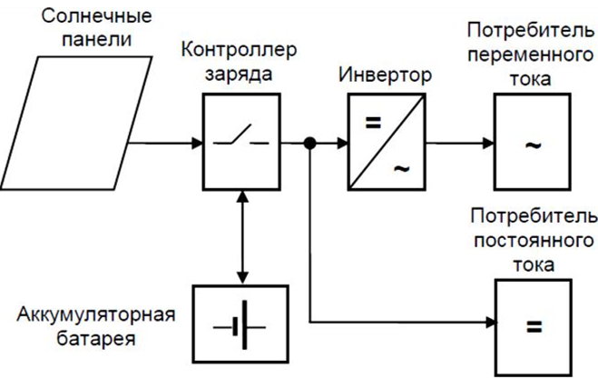
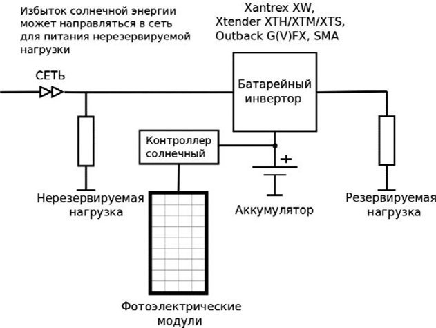
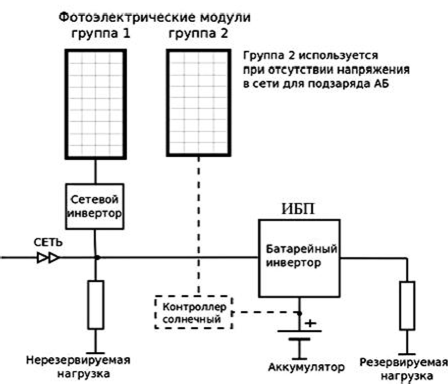

# Abstract

<h2>Content</h2> 

<ul class=content>
  <li class=ct1><a href="#p0">Introduction. solar energy</a>
  <li class=ct1><a href="#p1">1. Solar power plants operating using the thermodynamic cycle</a>
  <li class=ct1><a href="#p2">2. Solar power plants with direct conversion of solar radiation into electricity</a>
  
  <li class=ct1><a href="#conc">Conclusions</a>
  
  <li class=ct1><a href="#ref">List of sources</a>
</ul> 

## Introduction. solar energy

At present, solar energy is used to produce low- and medium-temperature heat carriers, mainly for hot water supply, water heating in swimming pools, heating, and in some cases for process heat. In addition, solar energy is used to generate electricity in power plants operating either on a thermodynamic cycle or with direct conversion of solar radiation into electricity.

The radiant energy of the Sun, coming to the Earth, is the most significant source of energy available to mankind. The flow of solar energy to the earth's surface is equivalent to conventional fuel in the amount of 1.2 · 1014 tons. The sun, like other stars, is an incandescent gas. It contains 82%&nbsp; hydrogen, 17% helium, the remaining elements make up about 1%. Inside the sun there is a region of high pressure, where the temperature reaches 5–20 million degrees.

The Earth is located at a distance of about 150 million km from the Sun. The flux of solar radiation reaching the Earth, according to various estimates, is (7.5–10)107 kWh/year, or (0.85–1.2)1014 kW, which significantly exceeds the resources of all other renewable energy sources.

Solar radiation to the Earth's surface depends on many factors: the latitude and longitude of the area, its geographical and climatic features, the state of the atmosphere, the height of the Sun above the horizon, etc.

The flux of solar radiation to Earth varies, reaching a maximum of 2200 kW h/m2 per year for the northwestern United States, western South America, parts of southern and northern Africa, Saudi Arabia and central Australia. Russia is located in a zone where the solar radiation flux varies from 800 to 1400 kWh/m2 per year. At the same time, the duration of sunshine in Russia is in the range from 1700 to 2000 h/year and somewhat more. The maximum of these values on Earth is more than 3600 h/yr. In a year, the entire territory of Russia receives more solar energy than the energy of all Russian resources of oil, gas, coal and uranium.

In the world today, solar energy is developing very intensively, occupying a prominent place in the fuel and energy complex of a number of countries.

From a thermodynamic point of view, solar radiation coming from a source of high temperature (about 6000 °C) is a high-quality primary energy source that allows its conversion into other types of energy (electricity, heat, etc.) with high efficiency. However, significant drawbacks from a technical point of view are the instability and the relative low density of the solar flux: outside the atmosphere 1.4 kW/m2, on the earth's surface on a clear noon about 1 kW/m2< /sup>. These properties of solar radiation make it difficult to create efficient energy devices, since a large area is required for solar radiation receivers and the creation of energy accumulators. As a result, the cost of solar installations is high, which reduces their competitiveness in relation to traditional power plants using fossil fuels.

## 1. Solar power plants operating using the thermodynamic cycle

Solar power plants (SPP) with a thermodynamic conversion cycle use concentrated solar radiation to heat an intermediate coolant or directly to the working fluid of a thermal power plant. Concentrates of solar radiation are: flat, parabolic and parabolic-cylindrical
<a href="#ref1">[1]</a>.
 

I use flat concentrators - heliostats in tower-type solar power plants with a central receiver. The principle of operation of the device of such SPP is explained in Fig. 1.2.

</img>

а)

</img>                                                         

б)

Figure 1 SPP type with a central tower receiver  a) - the principle of operation; b) - a direct heliostat (trekker) with an orientation system drive

</img>

 Figure 2 - a simplified technological scheme of a tower-type solar power plant
 

Concentrators of visual parabolic and parabolic-cylindrical shapes are shown in fig. 3.4

</img>

а)

</img>                                                         

б)

 Figure 3 - concentrators of solar radiation:
  a) mirror parabolic; b) parabolic-cylindrical
 

The focus of the concentrators is the heat receiver. With the help of concentrators shown in Fig. 3, a modular SPP is created. Parabolic-cylindrical systems find wider application, because for their work, a simpler system of regulation is used only in one coordinate (by the angle of elevation of the sun above the horizon).

To reduce heat losses and achieve high heating temperatures, the heat receiver pipe is enclosed in an evacuated transparent shell.

SPP&nbsp; with parabolic trough concentrators began to be actively built in the 1980s and early
1990s For example, in California (USA), 9 SPPs of this type were built with a total capacity of 354 MW. Some of them still work. High-temperature mineral oil is used as a heat carrier heated in the concentrator to a temperature of 380◦C, which transfers heat to water vapor, the working medium of a steam turbine plant. In order to reduce the dependence of solar power plants on weather conditions, additional combustion of natural gas is provided (up to 20% per year in terms of heat).

At about the same time, tower-type SPPs with a capacity of 1 to 10 MW were built in different countries (including the USSR). The most famous solar power plant is Solar One with a capacity of 10 MW, built in the USA and subsequently reconstructed into Solar Two with the same capacity. Solar Two worked for several years and after the planned cycle of research was stopped due to non-competitiv

A feature of these solar power plants is the work only due to solar energy, without the use of conventional fuels. To this end, the SPP circuit includes a heat accumulator that uses molten salt, and allows you to somewhat extend the operation of the SES beyond daylight hours.

Foreign experience in creating solar power plants shows that in the future such stations will become competitive with conventional sources of electricity.

The power of solar power plants with parabolic concentrators is limited by the size of the paraboloid. The largest paraboloid built in Australia has an aperture area of 400 m2, and is powered by a Stirling engine with an efficiency of about
20% could develop power up to 60 kW. All other solar power plants with paraboloids were created as experimental ones for a power of 10–25 kW.

## 2. Solar power plants with direct conversion of solar radiation into electricity

For direct conversion of the radiant energy of the Sun, semiconductor-type photocells with a barrier layer (PVC photovoltaic converters) are used. <a href="#ref1">[2]</a>. 

Solar photovoltaic stations (SPP, FES, PV farms or PV plants) are one of the types of power plants that generate electricity by directly converting the energy of solar radiation into electricity.

In order to reliably provide the consumer with electricity using solar energy, in addition to photovoltaic panels (FP), the composition of the FES includes a number of additional elements, the list of which largely depends on the type and purpose of the solar power plant.

There are two main types of solar photovoltaic systems:
- autonomous systems;
- systems operating in parallel with the network.

Autonomous FES, in addition to solar panels, as a rule, contains storage batteries (AB) and a charge/discharge controller. If it is necessary to supply power to consumers requiring a standard voltage of 220/380V AC, an inverter must be included in the FES (Fig. 4)

</img>

 Figure 4. Structural diagram of an autonomous solar power plant
 

The parameters of the solar power plant elements (type and number of photovoltaic converters, battery capacity, inverter power), and, accordingly, its cost depend on many factors: the composition of the electrical load, average daily power consumption, the nature of the solar power plant operation (seasonal or year-round), the average monthly arrival of solar radiation and the number of consecutive days without sun at the place of installation of photovoltaic modules, systems for orienting solar panels to the sun and some other factors.

Since solar cells are capable of generating electricity only during daylight hours, the value of their installed capacity should be selected with the expectation that the energy stored during the day will be enough to guarantee the supply of consumers during the day. This leads to the need to significantly increase the installed power of the FP and the capacity of the batteries.

An obvious disadvantage of stand-alone PV power plants is the loss of excess energy in low load modes. In most standard off-grid PV systems, the solar array simply turns off when the batteries are fully charged. It is possible to use excess energy on ballast resistances for heating water or air, which makes it possible to somewhat increase the efficiency of the useful use of the generated energy, but the problem is not completely solved.

A serious disadvantage of stand-alone solar power plants is the need to use rechargeable batteries operating in a cyclic mode. The number of operating cycles of common lead-acid batteries is small (1500-2000), which requires their frequent replacement. The use of industrial batteries with a long service life, such as nickel-cadmium or lithium-ion, requires a significant increase in financial investments in building an energy system.

In addition, it must be taken into account that batteries also lose energy. In the best case, the efficiency of the charge-discharge processes of batteries is 90%, and it deteriorates as they age.

The use of PV in the presence of a network avoids many, if not all, of the disadvantages of autonomous systems. In essence, the network is a large battery with 100% efficiency, which can take all the excess energy.

The block diagram of the network photovoltaic power plant is shown in Fig.5. The electrical network can be either decentralized or local, formed by a diesel power plant.

The network photovoltaic system, in addition to solar panels, also usually includes:
- network inverters that convert direct current generated by solar panels into alternating current;
- controllers for maximum power take-off from solar panels;
- a monitoring system that allows you to track the parameters of the operating mode of the solar power plant;
- centralized network - a power line to which the power plant is connected.

</img>

 Figure 5 - Structural diagram of a network photovoltaic power plant
 

In turn, network FES are divided into two main types according to the method of construction:
- without rechargeable batteries;
- with rechargeable batteries.

In practice, photovoltaic systems without batteries are most widely used. Batteryless solar power plants are very reliable and require virtually no maintenance. In addition, they have the highest efficiency in the use of energy generated by solar panels - from 90 to 98%. These systems use special grid-driven inverters that use the grid to generate a reference voltage to drive and synchronize them.

The disadvantage of such systems is the interruption of consumer power when the central network is turned off. Since grid inverters produce voltage identical to the mains voltage, if it is lost, the inverter stops working. The reason for the disappearance of voltage in the network (and as a result, the cessation of generation of network inverters of SPP) may be, for example, a blackout of a section of the network to ensure safety during repair work.

With an unreliable electrical network, solar power plants with batteries are used, which are much more complex, but allow you to create systems for uninterrupted power supply to consumers.

The inverter power in such systems is determined by the total load power that needs to be supplied during network failures, and the duration of failures determines the battery capacity and the installed power of the solar battery.

To ensure maximum efficiency, a grid-connected battery PV system requires the use of a dedicated off-grid (battery) inverter.

There are 3 options for building such systems:
1. Solar panels charge the battery through the charge controller, and then the energy is transferred to the load or network through the inverter.
2. Solar panels are powered by a network photovoltaic inverter, from which the load is powered, excess energy is used to charge the batteries, and if the batteries are charged, they are sent to the network.
3. A hybrid system that includes elements of both of the above types.

The block diagram of a network photovoltaic system with a charge controller is shown in fig. 6.

This version of the system is the simplest and most common. In this system, the batteries are charged from solar panels through a DC charge controller.

When using a standard uninterruptible power supply (UPS), when the mains is available, the batteries are charged from the mains, and solar panels are practically not used. To maximize the use of the energy generated by solar panels, a controller with tracking the maximum power point (MPPT) and a special inverter with the function of transferring electricity to the load or network when the voltage on the battery is higher than the specified one are used. In this case, even if the batteries are fully charged, the energy from the FC is directed to the load, thereby reducing the consumption from the network.

If the load consumes less energy than the solar panels produce, such an inverter can either direct the excess to the grid, or reduce the output of the solar panels by increasing the voltage on the batteries.

</img>

 Figure 6 - Grid-mounted photovoltaic power supply system with DC charge controller
 

The advantages of such systems is the possibility of using solar energy, both in the presence of a network and during outages; the possibility of restoring work during long interruptions in the power supply and deep discharge of batteries by charging the battery from the FP.

The disadvantages include double conversion of solar electricity, which leads to additional losses in the controller, inverter, and partially in batteries; cyclic operation of batteries during interruptions in the centralized power supply, which leads to their rapid wear.

In case of accidents in the network, the inverter starts to convert energy from the batteries. If the solar panels are connected via a charge controller to the batteries, then the inverter uses solar electricity and, if it is not enough, energy from the batteries. If there is more solar energy than is needed for consumers, it is used to charge batteries.

A photovoltaic power supply system with a network inverter at the input of an uninterruptible power supply (UPS) is shown in Fig. 7.

 Figure 7 - Grid-mounted photovoltaic power supply system with grid inverter at UPS input
 

The advantages of this scheme for constructing a solar power plant is the possibility of using network and autonomous inverters with a minimum set of options, widely represented on the market by numerous manufacturers. Batteries are always in a charged state, are operated in a buffer mode and are used only during power outages.

It is advisable to use this type of solar power plant in power supply systems in which the main consumption of solar electricity takes place during the day, and outages of centralized power supply are rare and short-lived.

In the daytime, the network inverter provides energy to all consumers, including the reserved ones. Excess energy is sent to the general network only in cases where the consumption is less than that generated by solar panels, while the solar energy is also used to charge the battery. Grid inverters are typically more than 90% efficient, ensuring good energy performance for the entire power supply system. The only drawback is the termination of the use of solar energy in case of accidents in the network.

The power of the UPS in such systems is selected according to the power of the redundant load and does not depend on the power of the solar panels. The power of the grid inverter can be either greater or less than the power of the UPS. To ensure system recovery in case of deep battery discharge, a small solar battery can be provided in the power plant circuit, which is connected to the battery through a charge controller (shown by a dotted line). If the outages are short-term, then these elements can not be used.

The most versatile are photovoltaic systems with a network inverter at the output of the UPS (Fig. 8). In this power plant construction scheme, a highly efficient grid inverter is also used, but, unlike the previous scheme, in the absence of mains voltage, solar panels continue to feed the reserved load and charge the batteries.

In normal mode, in the presence of voltage in the network, the grid inverter supplies energy to the reserved load, while the conversion efficiency of the inverter is very high - more than 90-95%. If the load consumes less than the solar panels produce, the excess energy goes to charge the batteries. If the load consumes more, then the missing energy is taken from the network. After the batteries are fully charged, the excess energy is sent to the general network and feeds the rest of the load.

In the event of a utility power failure, the UPS switches to battery operation and simultaneously provides the reference voltage for the utility inverter. Therefore, the energy of the sun continues to be used in case of accidents in the networks. As in the presence of a network, excess solar electricity is directed to charge batteries.

</img>

 Figure 8 &mdash; Grid-mounted photovoltaic power system with grid-tied inverter at UPS output
 

If the voltage in the network did not disappear, but went beyond the permissible limits, then the inverter disconnects from such a network and continues to supply the responsible load with high-quality current - from the SB and from the battery. The load connected to the inverter is powered by the voltage that is in the network.

The advantages of the system are the efficient use of batteries (operation in buffer mode), the efficient use of renewable solar energy, the ability to recover from deep discharge of batteries when using a small solar battery connected to the battery through a charge controller (shown by a dotted line).

The disadvantages include the need to use special hybrid autonomous inverters that can charge the battery from the output, as well as direct excess solar energy to the grid. Such an inverter must either give a signal to turn off the grid inverter, or increase the output frequency to control the grid inverter (most grid inverters stop working when the frequency parameters go beyond the specified limits).

## Conclusions

Comparative analysis of PV construction schemes shows that:
1. The use of network inverters and switching circuits shown in fig. 7.8 in most cases increases the efficiency of the system, especially if most of the solar energy is consumed during the daytime. The use of special UPS with the ability to charge batteries from the output allows the use of network photovoltaic inverters even during interruptions in the power supply from the centralized network.
2. Schemes for building photovoltaic systems are quite diverse and require the use of specialized power equipment. At the same time, the efficiency of the entire energy system will be largely determined by the composition and characteristics of the energy equipment used.

<h2>List of sources</h2>
<ol>
  <li>O. Solovyov. Solar power stations. Access mode: <a href="https://metallurgist.pro/solnechnye-fotoelektriche">https://metallurgist.pro/solnechnye-fotoelektriche</a>
  </li>
  <li>Structure and composition of photoelectric power station equipment. Access mode: <a href="https://ozlib.com/830023/tehnika/struktura_sostav_oborudovaniya_fotoelektrostantsiy">https://ozlib.com/830023/tehnika/struktura_sostav_oborudovaniya_fotoelektrostantsiy</a>
  </li>
</ol>
