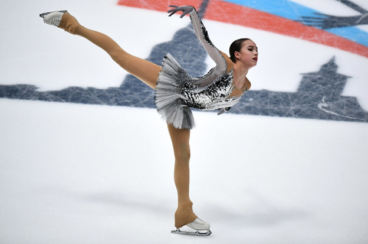

# Фигурное &ndash; катание

<h3>Содержание</h3>
<ul class=content>
<li class=ct1><a href="#p1">1. Введение</a>
<li class=ct1><a href="#p2">2. История возникновения </a>
<li class=ct1><a href="#p3">3. Виды и направления </a>
<li class=ct1><a href="#p4">4. Правила и снаряжение </a>
<li class=ct1><a href="#p5">5. Элементы выступлений и техника безопасности </a>
<li class=ct1><a href="#ref">Список использованных источников</a>
</ul>

## Ведение

<b>Одним из самых захватывающих и популярных видов спорта в зимний период является фигурное катание. Секреты завораживающих выступлений, в которых любое движение выглядит красиво и волшебно. Добиться такого мастерства непросто, для этого необходимы долгие годы тренировок и колоссальный труд спортсмена.</b>

                        

</a>

## История возникновения

  Фигурное катание подразумевает перемещение спортсменов на коньках по льду и выполнение различных элементов под музыкальное сопровождение. Самыми древними среди найденных коньков стали изделия из фаланги передней ноги лошади. Найдены они были неподалеку от Одессы в период бронзового века.

 Принято считать, что фигурное катание как вид спорта зародилось в Голландии примерно в XIII-XIV вв. Спортсмены тогда выступали уже в железных коньках, благодаря чему стало возможно дальнейшее развитие и усовершенствование фигурного катания. 

 Обязательные фигуры для исполнения были изобретены в Великобритании, поскольку именно в этой стране появился первый клуб конькобежцев. Здесь же были разработаны правила проведения официальных соревнований.

 О катании на коньках было известно еще во времена правления Петра l. Именно он впервые привез в Россию образцы коньков из Европы. Правителю принадлежит идея нового способа их крепления к сапогам. 

 Свое название коньки получили, поскольку в древние времена переднюю часть деревянного снаряжения украшали конской головой. В 1838 году был опубликован первый учебник для конькобежцев. Всплеск популярности коньков произошел в России после визита американского спортсмена Гейса, который во время своих выступлений продемонстрировал невероятные и неожиданные возможности выполнения разнообразных фигур на льду.

 Отдельным видом спорта фигурное катание стало в 1865 г. В этот период произошло торжественное открытие общественного катка в Юсуповском саду, который сразу же стал центром подготовки спортсменов. Здесь же состоялось первое соревнование между русскими фигуристами. 

 Развитие фигурного катания среди женщин началось только в 1906 году. Элементы для выступлений у мужчин и женщин были аналогичными, но произвольное женское катание обратило на себя внимание благодаря высокой пластичности, художественности и музыкальности движений.
Официальные чемпионаты для женщин стали проводиться с 1924 г., а с 1930-х годов соревнования объединили и стали проводить в тот же период, что и мужские. Вскоре появилось парное катание.
 

<i> В 1924 году также состоялось официальное включение.&nbsp;&nbsp;&nbsp;&nbsp;</i> 
<i>выступлений в программу Олимпийских игр. Спортивные танцы &nbsp;&nbsp;&nbsp;&nbsp;</i> 
<i>на льду появились в Великобритании, а в 1952 г. во Франции был &nbsp;&nbsp;&nbsp;&nbsp;</i> 
<i>организован первый чемпионат по этому виду спорта. &nbsp;&nbsp;&nbsp;&nbsp;</i>

</a>

## Виды и направления

«Фигурное катание» следует отметить, что существует несколько видов выступлений на льду.

<b>Всего выделяют 4 основных направления:</b>

Одиночное катание - одно из самых зрелищных выступлений, в котором нет места для ошибок. Каждое движение спортсмена находится под пристальными взглядами судей. Участник, который наберет больше баллов, станет победителем состязания. Выступления проходят в два этапа: короткая программа и произвольная. Задачей участника соревнований является необходимость продемонстрировать владение всеми группами элементов. Чем выше точность и качество их выполнения, тем выше уровень фигуриста. При оценке выступлений судьями учитываются следующие параметры: пластика, связь движений с музыкой, эстетика, артистизм.

</a>

</a>

 1. Одиночное катание - одно из самых зрелищных выступлений, в котором нет места для ошибок. Каждое движение спортсмена находится под пристальными взглядами судей. Участник, который наберет больше баллов, станет победителем состязания. Выступления проходят в два этапа: короткая программа и произвольная. Задачей участника соревнований является необходимость продемонстрировать владение всеми группами элементов. Чем выше точность и качество их выполнения, тем выше уровень фигуриста. При оценке выступлений судьями учитываются следующие параметры: пластика, связь движений с музыкой, эстетика, артистизм.
 

 2. В парном катании необходимо продемонстрировать слаженность действий при выступлении в дуэте. Спортсменам следует выполнять на льду сложнейшие фигуры так, чтобы у зрителей создалось впечатление единства действий. Помимо традиционных элементов фигурного катания в этом направлении есть и те, что используются только при работе в паре: поддержка, подкрутка, выброс, вращение и т. д. Важным критерием при оценке выступлений является слаженность действий и синхронность. Соревнования проходят в 2 этапа: короткое выступление и произвольная программа.
 

3. В спортивных танцах основное внимание уделяется тому, насколько хорошо фигуристы исполняют совместные танцевальные шаги в различных позициях. Важно не допускать продолжительного разъединения партнеров. От парного катания этот вид отличается тем, что в нем отсутствуют некоторые элементы: прыжки, броски и т. д. При оценке действий фигуристов в спортивных танцах особое внимание уделяется скорости, изяществу, виртуозности, плавности движений, внешнему виду партнеров, костюмам и музыкальному сопровождению.
 

4. В синхронном катании, в отличие от остальных видов, принимает участие большое количество спортсменов. На ледовой арене одновременно могут выступать от 16 до 20 фигуристов. Основной задачей спортсменов является демонстрация командного единства при выполнении кругов, линий, колеса, пересечения, блоков и других элементов. В состав команды могут входить как мужчины, так и женщины, а возрастное разделение подразумевает формирование отдельных групп: новисы (до 15 лет), юниоры (12-18 лет), сеньоры (от 14 и старше). 

<i> Сейчас синхронное катание является единственным .&nbsp;&nbsp;&nbsp;&nbsp;</i> 
<i>направлением, которое еще не входит в программу &nbsp;&nbsp;&nbsp;&nbsp;</i> 
<i>Олимпийских игр. Возможность его внесения в программу &nbsp;&nbsp;&nbsp;&nbsp;</i> 
<i>Олимпиады находится на рассмотрении.&nbsp;&nbsp;&nbsp;&nbsp;</i>

## Правила и снаряжение

 На одно выступление выделяют 2 мин. 50 сек. За это время конкурсанты должны успеть показать свою программу, которая должна соответствовать всем стандартам и содержать в себе определенные элементы. Сложность тех или иных движений, входящих в программу выступления, определяется тренером, хореографами и самим спортсменом.

 Большое внимание уделяется состоянию катка. Лед на нем должен быть идеально чистым и гладким. Высокое качество покрытия достигается с помощью применения специализированной техники. По регламенту установлено, что неровность поверхности не может превышать 5 миллиметров. Стандартная площадь льда составляет 180 м, бортики выполнены из пластика.

</a>

<b>Состоят они из двух частей:</b>

Коньки являются частью костюма, от которой зависит успех выступления. Спортсмены проводят в них много часов на тренировках и соревнованиях. Чаще всего для профессиональных фигуристов коньки изготавливаются по индивидуальному заказу. У спортсмена замеряется стопа, чтобы обувь была удобна в носке. Ботинки делаются из толстой кожи и имеют язычок. Шнурки у коньков высокие. Лезвия производятся из карбоновой стали.

<i>1. Зубцы на носике используются для толчков и выполнения некоторых элементов.</i>

<i> 2. Вогнутая бородка необходима для обеспечения максимального скольжения по поверхности льда</i>

Спортсмены надевают яркие и красивые костюмы. Это необходимо для того, чтобы как можно точнее передать дух выступления и раскрыть основную идею программы.

<i> Все костюмы шьются на заказ из эластичной ткани. Женщины надевают платья с короткой юбочкой, а мужчины облачаются в узкие брюки.</i>

## Элементы выступлений и техника безопасности

«Фигурное катание» стоит рассмотреть широкий перечень существующих в этом виде спорта элементов. Их формирование происходило исторически, а выполнять их необходимо в любом коротком выступлении. Все элементы имеют различные степени сложности. Перед началом соревнований каждый участник представляет официальную форму с описанием примерного содержания своей программы 

<b>Существующие элементы:</b>

</a>

1. Шаги используются в программах в виде дорожек и в качестве связующих элементов.
2. Спираль - позиция, в которой одна нога спортсмена остается на льду, а вторая находится выше уровня бедра. Элементы этого типа могут отличаться друг от друга направлением движения, позицией свободной ноги, скользящей ногой и т. д. Чтобы судьи засчитали выполнение элемента, фигуристу необходимо находиться в позиции не меньше трех секунд.
3. Бильман - позиция, в которой свободная нога поднимается, а лезвие конька захватывается рукой. В идеальном исполнении спортсмен демонстрирует вертикальный шпагат.
4. Аксель - краткий прыжок, который получил название благодаря норвежскому фигуристу, исполнившему его впервые в истории в 1882 г.
5. Риттбергер - прыжок, получивший название в честь немецкого фигуриста, исполнившего его в 1910 г.
6. Сальхов - прыжок в честь шведского фигуриста, выполнившего его в 1908 г.
7.	Выполняя упражнения, спортсмен должен быть внимательным и осторожным, поскольку это очень травмоопасный спорт. Падений на лед во время тренировок не избежать, а профессиональные занятия на коньках приводят к повышенным физическим нагрузкам на организм.

</a>

Для занятий на любительском уровне достаточно придерживаться техники безопасности и применять средства защиты: наколенники и щитки на запястья. Важно правильно подготовить коньки перед началом тренировок. Лезвия должны быть хорошо подточены и не иметь следов ржавчины на поверхности. Перед непосредственным выходом на лед следует максимально плотно завязать шнурки. Острое лезвие опасно, поэтому выполнять и учить элементы не следует вблизи других катающихся.

<b>Фигурное катание - красивое и захватывающее зрелище. Занятия на коньках - отличный способ провести время с пользой и выполнить необходимые организму физические нагрузки. Главное в этом спорте - получать удовольствие от занятий и стремиться к совершенствованию техники выполнения.</b>

## Список использованных источников
<ol>
  <li><a href="https://nauka.club/fizkultura/figurnoe-katanie.html">Фигурное катание</a></li>
  <li><a href="https://ru.wikipedia.org/wiki/">Фигурное катание &ndash; Википедия</a></li>
</ol>