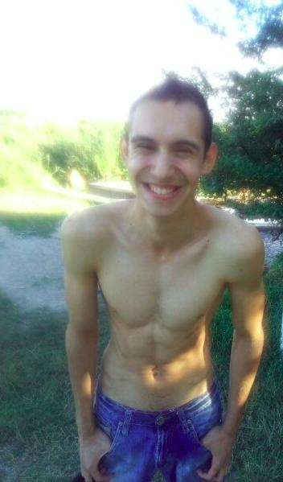

# Отдых в деревне

Это лето было интересным. Первый месяц отдыха очень походил на предыдущие летние каникулы, поскольку я оставался в городе. Однако последующие два летних месяца оказались для меня потрясающе интересными – я провел их в деревне у тети. Именно с этими днями, проведенными за городом, у меня связаны самые яркие события и неизгладимые впечатления моего лета.

Время в деревне проходит неторопливо, совсем не так, как в мегаполисах. Создается ощущение, что прошел целый месяц, тогда как на самом деле – всего неделя. Мое утро обычно начинается с помощи тете в огороде. Наша деревня находится вдали от поселка, и вода из-под крана является неслыханной роскошью. Поэтому я хожу к колодцу с двумя старыми железными ведрами. Вода в нем потрясающе чистая и очень холодная. Еще я помогаю тете по дому, но при первой возможности бегу играть с друзьями.

У меня есть хорошие друзья в деревне. Мы проводим вместе все свободное время. В наиболее жаркое время мы часами сидим на берегу речки. Искупавшись, резвимся вовсю и смотрим на проходящие баржи. Однажды мне влетело от моей тети за то, что я не пришел на обед. А на самом деле мне совсем не хотелось есть, поскольку вместе с другом Пашкой мы пекли в костре картошку. Это такое удовольствие – перекладывать из руки в руку раскаленную картошку, а затем разламывать ее и съедать по кусочку. Согласны, что это не тарелка с приготовленным супом? А главное – сколько романтики и счастья в этих летних днях, проведенных как будто в ином мире!

