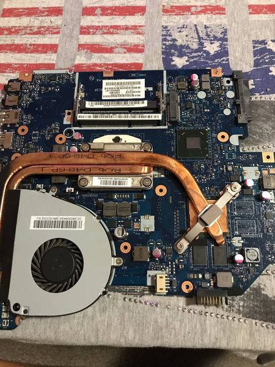
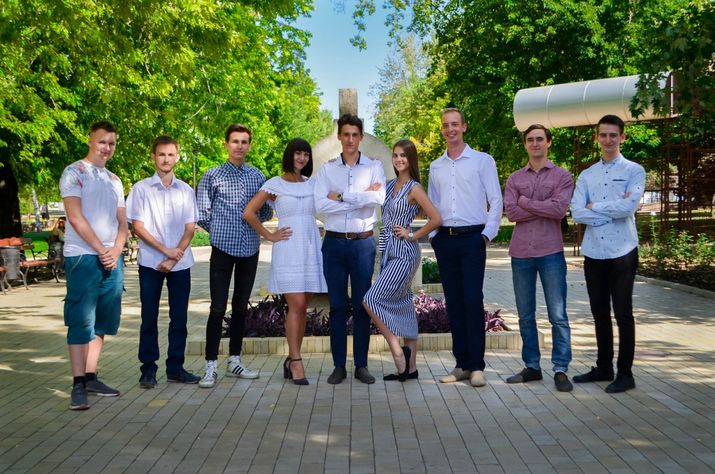
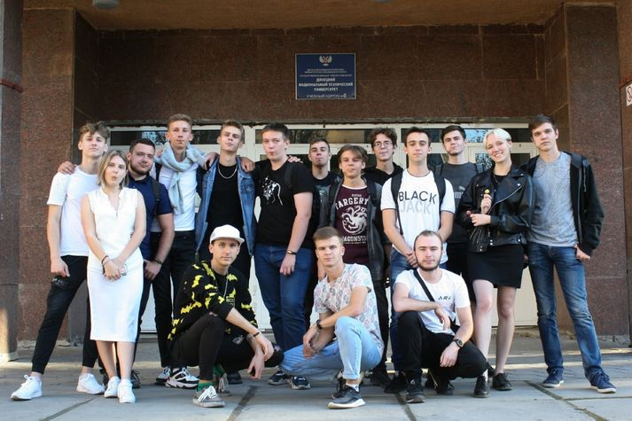
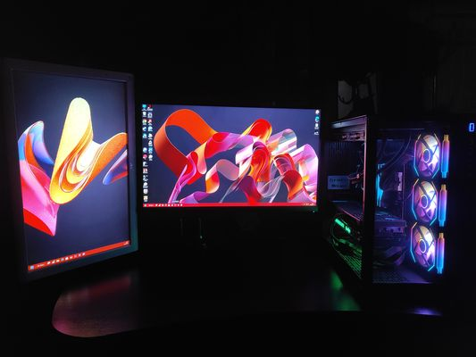
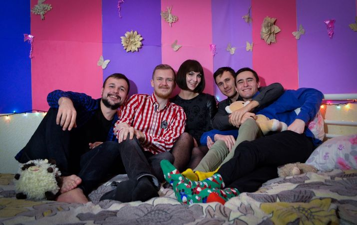

# Как перевернуть жизнь за один день

Если бы мне 5 лет назад, в момент моего поступления в ДонНТУ, сказали, что одно моё решение полностью перевернёт мою жизнь и позволит обрести вторую семью, то я, честно сказать, от души бы посмеялся с этого заявления.

Так уж сложилось, что я человек, который не особо просто находит общий язык с незнакомыми людьми. Поэтому, во время моего обучения в школе и техникуме, моя общественная жизнь практически всегда ограничивалась классом или группой.  При поступлении в университет в мои планы не входило менять данную тенденцию. Работает и хорошо. Но когда в мои руки попала анкета первокурсника, которую нам предоставили на посвящении в студенты от имени актива ЭтФ (на тот момент), мне пришлось очень сильно задуматься о себе. Не удивительно, что ничего интересного я о себе не написал, как и не удивительно, что меня не позвали на встречу новичков со старшекурсниками, которые этим активом и заведовали.

Вот тут-то всё и завертелось. Обиженный я принял нестандартное для себя решение всё равно пойти на собрание и узнать какие интересности может предложить мне актив. Благо вход был свободный. Так я попал на дебют первокурсника.

</img>

После прекрасного семестра, наполненного весельем, общением, репетициями и, конечно же, учёбой, дорога к активу не была забыта. За всё это время, я очень привык и сдружился не только с такими же первокурсниками, как и я, но и с нашими наставниками.

Так как сам я не из Донецка, на время учебы я проживал в общежитии. И это стало важнейшим критерием для моего дальнейшего роста в семье факультета. Дмитрий Колотенко, председатель профбюро нашего факультета и просто прекрасный человек, искал надежного и знакомого человека на должность  председателя жилищно-бытовой комиссии и нашёл меня. Это еще больше увеличило мою привязанность к факультету и активу, а конкретнее, к людям, с которыми я проводил огромную часть свободного времени.

</img>

На своей должности я пробыл больше 4 лет. Но одним только профкомом всё не ограничилось. Неожиданно для меня, так вышло, что я стал частью того актива, которого испугался при поступлении. Довелось участвовать в подготовке следующих первокурсников для их дебютов, содействовать организации мероприятий для дня Факультета и  дня Энергетика, ежегодного квеста для первокурсников. Короче говоря, принимал активное участие в общественной жизни факультета. И всё это с огромным удовольствием.

</img>

</img>

Но, что самое главное, актив подарил мне компанию самых близких и дорогих друзей, с которыми я общаюсь и вижусь всё так же буквально ежедневно, как на первом курсе университета. За все это время было много всего: веселье и ссоры, совместные праздники, путешествия, удалённое общение (а с некоторыми пришлось даже жить). Но неизменно одно: мы все так же вместе и дороги друг другу.

Честно сказать, не мог даже представить, что те старшекурсники и наставники, которых я побаивался и стеснялся, будут принимать участие в моей жизни спустя 5 лет. И уверен, это только начало. Я благодарен университету и факультету за то, что у меня появилась вторая семья.

</img>

