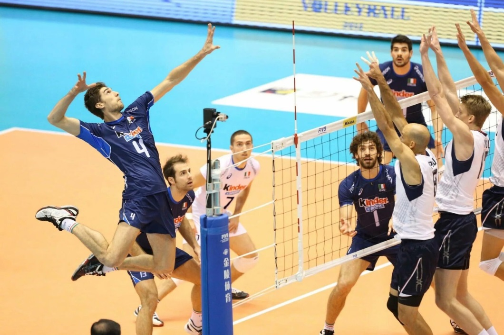
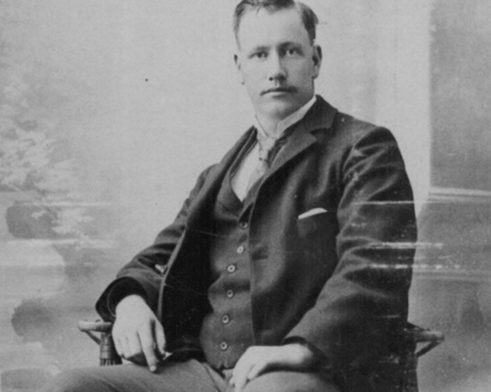
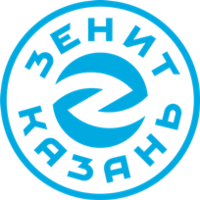
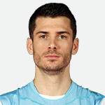

# Волейбол

Волейбол — это динамичная командная игра, которая требует от участников
ловкости, координации и командного взаимодействия. Игроки делятся на две
команды, каждая из которых состоит из шести человек. Цель игры
заключается в том, чтобы отправить мяч через сетку на половину соперника
и приземлить его на землю, избегая возможности отбивания мяча
противником.

Основные правила волейбола включают, что каждая команда может
поддерживать мяч в воздухе не более трех касаний перед его отправкой на
сторону соперников. Игроки могут использовать любые части тела, чтобы
отправить мяч; однако, блокирование передачи соперника не считается
одним из касаний. Игра начинается с подачи, и команда, получившая мяч,
имеет право на возможность атаковать, когда мяч возвращается к ним.

Результат матча определяется по количеству выигранных сетов, обычно
играют до трех выигрышей. Каждый сет до 25 очков, однако команда должна
выигрывать с разрывом в два очка. Волейбол — это не только физическая
активность, но и искусство стратегии и командной игры, что делает его
захватывающим зрелищем.

Рисунок 1 – Процесс игры в волейбол

В 1895 году Уильям Морган предложил своим ученикам перебрасывать мяч
через теннисную сетку, которая была поднята почти на два метра над
полом.  
Идея пришла к Уильяму не просто так. В те годы в Америке огромной
популярностью пользовался баскетбол. Вот только из-за высокой
интенсивности и нагрузки в него не могли играть пожилые люди и физически
неподготовленные игроки.

Морган захотел исправить эту несправедливость и придумать новую игру:
менее агрессивную, активную и контактную. Такую, чтобы в нее могли
играть все желающие. Из тенниса Морган позаимствовал сетку. Мяч — из
баскетбола, а способ его подачи — из бейсбола. Ведение игры руками — от
гандбола.  
В 1896 году о своей новой игре Морган рассказал директору школы YMCA по
физическому воспитанию молодежи Спрингфилда и получил его одобрение.  
В том же году состоялась официальная демонстрация волейбола на
конференции в колледже Спрингфилд перед делегатами Спортивного
Сообщества Восточного побережья. В ее показе приняли участие две команды
по 5 человек.  
Правда тогда игра еще не была волейболом. Морган называл ее «Минтонетт»,
использовав внешнее сходство с бадминтоном.

Один из участников конференции, профессор Алфред Холстед, предложил
воспользоваться словом «volley» (с англ. — удар с лету) и добавить к
нему «ball» (мяч). Морган оказался не против.

До 1952 года название «Volley Ball» писалось раздельно, пока федерация
волейбола США не решила писать его слитно. Так и появился волейбол или
летающий мяч.

Рисунок 2 – Уильям Морган, создатель волейбола

Моя любимая волейбольная команда – это Зенит Казань. Я смотрю каждую их
игру по телевизору.

Рисунок 3 – Эмблема команды Зенит-Казань

Зенит-Казань один из самых сильнейших волейбольных команд не только в
России, но и во всем мире. Каждая их игра выглядит как искусство от
которого невозможно оторваться. [Центр волейбола
«Санкт-Петербург»](https://ru.wikipedia.org/wiki/%D0%A1%D0%B0%D0%BD%D0%BA%D1%82-%D0%9F%D0%B5%D1%82%D0%B5%D1%80%D0%B1%D1%83%D1%80%D0%B3_(%D1%86%D0%B5%D0%BD%D1%82%D1%80_%D0%B2%D0%BE%D0%BB%D0%B5%D0%B9%D0%B1%D0%BE%D0%BB%D0%B0)) (вместимость
большого зала — 4600 зрителей).
Адрес: [Казань](https://ru.wikipedia.org/wiki/%D0%9A%D0%B0%D0%B7%D0%B0%D0%BD%D1%8C),
ул. Булатова, 1.

Ранее свои матчи клуб проводил на арене
«[Баскет-холл](https://ru.wikipedia.org/wiki/%D0%91%D0%B0%D1%81%D0%BA%D0%B5%D1%82-%D1%85%D0%BE%D0%BB%D0%BB_(%D0%9A%D0%B0%D0%B7%D0%B0%D0%BD%D1%8C))».
Загородная учебно-тренировочная база клуба находится у [посёлка
Мирный](https://ru.wikipedia.org/wiki/%D0%9C%D0%B8%D1%80%D0%BD%D1%8B%D0%B9_(%D0%9A%D0%B0%D0%B7%D0%B0%D0%BD%D1%8C)).

Список достижений:

1. 12-кратный [чемпион России](https://ru.wikipedia.org/wiki/%D0%A7%D0%B5%D0%BC%D0%BF%D0%B8%D0%BE%D0%BD%D0%B0%D1%82_%D0%A0%D0%BE%D1%81%D1%81%D0%B8%D0%B8_%D0%BF%D0%BE_%D0%B2%D0%BE%D0%BB%D0%B5%D0%B9%D0%B1%D0%BE%D0%BB%D1%83_%D1%81%D1%80%D0%B5%D0%B4%D0%B8_%D0%BC%D1%83%D0%B6%D1%87%D0%B8%D0%BD) — [2006/07](https://ru.wikipedia.org/wiki/%D0%A7%D0%B5%D0%BC%D0%BF%D0%B8%D0%BE%D0%BD%D0%B0%D1%82_%D0%A0%D0%BE%D1%81%D1%81%D0%B8%D0%B8_%D0%BF%D0%BE_%D0%B2%D0%BE%D0%BB%D0%B5%D0%B9%D0%B1%D0%BE%D0%BB%D1%83_%D1%81%D1%80%D0%B5%D0%B4%D0%B8_%D0%BC%D1%83%D0%B6%D1%87%D0%B8%D0%BD_2006/2007), [2008/09](https://ru.wikipedia.org/wiki/%D0%A7%D0%B5%D0%BC%D0%BF%D0%B8%D0%BE%D0%BD%D0%B0%D1%82_%D0%A0%D0%BE%D1%81%D1%81%D0%B8%D0%B8_%D0%BF%D0%BE_%D0%B2%D0%BE%D0%BB%D0%B5%D0%B9%D0%B1%D0%BE%D0%BB%D1%83_%D1%81%D1%80%D0%B5%D0%B4%D0%B8_%D0%BC%D1%83%D0%B6%D1%87%D0%B8%D0%BD_2008/2009), [2009/10](https://ru.wikipedia.org/wiki/%D0%A7%D0%B5%D0%BC%D0%BF%D0%B8%D0%BE%D0%BD%D0%B0%D1%82_%D0%A0%D0%BE%D1%81%D1%81%D0%B8%D0%B8_%D0%BF%D0%BE_%D0%B2%D0%BE%D0%BB%D0%B5%D0%B9%D0%B1%D0%BE%D0%BB%D1%83_%D1%81%D1%80%D0%B5%D0%B4%D0%B8_%D0%BC%D1%83%D0%B6%D1%87%D0%B8%D0%BD_2009/2010), [2010/11](https://ru.wikipedia.org/wiki/%D0%A7%D0%B5%D0%BC%D0%BF%D0%B8%D0%BE%D0%BD%D0%B0%D1%82_%D0%A0%D0%BE%D1%81%D1%81%D0%B8%D0%B8_%D0%BF%D0%BE_%D0%B2%D0%BE%D0%BB%D0%B5%D0%B9%D0%B1%D0%BE%D0%BB%D1%83_%D1%81%D1%80%D0%B5%D0%B4%D0%B8_%D0%BC%D1%83%D0%B6%D1%87%D0%B8%D0%BD_2010/2011), [2011/12](https://ru.wikipedia.org/wiki/%D0%9E%D1%82%D0%BA%D1%80%D1%8B%D1%82%D1%8B%D0%B9_%D1%87%D0%B5%D0%BC%D0%BF%D0%B8%D0%BE%D0%BD%D0%B0%D1%82_%D0%A0%D0%BE%D1%81%D1%81%D0%B8%D0%B8_%D0%BF%D0%BE_%D0%B2%D0%BE%D0%BB%D0%B5%D0%B9%D0%B1%D0%BE%D0%BB%D1%83_%D1%81%D1%80%D0%B5%D0%B4%D0%B8_%D0%BC%D1%83%D0%B6%D1%87%D0%B8%D0%BD_2011/2012), [2013/14](https://ru.wikipedia.org/wiki/%D0%9E%D1%82%D0%BA%D1%80%D1%8B%D1%82%D1%8B%D0%B9_%D1%87%D0%B5%D0%BC%D0%BF%D0%B8%D0%BE%D0%BD%D0%B0%D1%82_%D0%A0%D0%BE%D1%81%D1%81%D0%B8%D0%B8_%D0%BF%D0%BE_%D0%B2%D0%BE%D0%BB%D0%B5%D0%B9%D0%B1%D0%BE%D0%BB%D1%83_%D1%81%D1%80%D0%B5%D0%B4%D0%B8_%D0%BC%D1%83%D0%B6%D1%87%D0%B8%D0%BD_2013/2014), [2014/15](https://ru.wikipedia.org/wiki/%D0%A7%D0%B5%D0%BC%D0%BF%D0%B8%D0%BE%D0%BD%D0%B0%D1%82_%D0%A0%D0%BE%D1%81%D1%81%D0%B8%D0%B8_%D0%BF%D0%BE_%D0%B2%D0%BE%D0%BB%D0%B5%D0%B9%D0%B1%D0%BE%D0%BB%D1%83_%D1%81%D1%80%D0%B5%D0%B4%D0%B8_%D0%BC%D1%83%D0%B6%D1%87%D0%B8%D0%BD_2014/2015), [2015/16](https://ru.wikipedia.org/wiki/%D0%A7%D0%B5%D0%BC%D0%BF%D0%B8%D0%BE%D0%BD%D0%B0%D1%82_%D0%A0%D0%BE%D1%81%D1%81%D0%B8%D0%B8_%D0%BF%D0%BE_%D0%B2%D0%BE%D0%BB%D0%B5%D0%B9%D0%B1%D0%BE%D0%BB%D1%83_%D1%81%D1%80%D0%B5%D0%B4%D0%B8_%D0%BC%D1%83%D0%B6%D1%87%D0%B8%D0%BD_2015/2016), [2016/17](https://ru.wikipedia.org/wiki/%D0%A7%D0%B5%D0%BC%D0%BF%D0%B8%D0%BE%D0%BD%D0%B0%D1%82_%D0%A0%D0%BE%D1%81%D1%81%D0%B8%D0%B8_%D0%BF%D0%BE_%D0%B2%D0%BE%D0%BB%D0%B5%D0%B9%D0%B1%D0%BE%D0%BB%D1%83_%D1%81%D1%80%D0%B5%D0%B4%D0%B8_%D0%BC%D1%83%D0%B6%D1%87%D0%B8%D0%BD_2016/2017), [2017/18](https://ru.wikipedia.org/wiki/%D0%A7%D0%B5%D0%BC%D0%BF%D0%B8%D0%BE%D0%BD%D0%B0%D1%82_%D0%A0%D0%BE%D1%81%D1%81%D0%B8%D0%B8_%D0%BF%D0%BE_%D0%B2%D0%BE%D0%BB%D0%B5%D0%B9%D0%B1%D0%BE%D0%BB%D1%83_%D1%81%D1%80%D0%B5%D0%B4%D0%B8_%D0%BC%D1%83%D0%B6%D1%87%D0%B8%D0%BD_2017/2018), [2022/23](https://ru.wikipedia.org/wiki/%D0%A7%D0%B5%D0%BC%D0%BF%D0%B8%D0%BE%D0%BD%D0%B0%D1%82_%D0%A0%D0%BE%D1%81%D1%81%D0%B8%D0%B8_%D0%BF%D0%BE_%D0%B2%D0%BE%D0%BB%D0%B5%D0%B9%D0%B1%D0%BE%D0%BB%D1%83_%D1%81%D1%80%D0%B5%D0%B4%D0%B8_%D0%BC%D1%83%D0%B6%D1%87%D0%B8%D0%BD_2022/2023), [2023/24](https://ru.wikipedia.org/wiki/%D0%A7%D0%B5%D0%BC%D0%BF%D0%B8%D0%BE%D0%BD%D0%B0%D1%82_%D0%A0%D0%BE%D1%81%D1%81%D0%B8%D0%B8_%D0%BF%D0%BE_%D0%B2%D0%BE%D0%BB%D0%B5%D0%B9%D0%B1%D0%BE%D0%BB%D1%83_%D1%81%D1%80%D0%B5%D0%B4%D0%B8_%D0%BC%D1%83%D0%B6%D1%87%D0%B8%D0%BD_2023/2024).

2. Серебряный призёр чемпионатов России — [2018/19](https://ru.wikipedia.org/wiki/%D0%A7%D0%B5%D0%BC%D0%BF%D0%B8%D0%BE%D0%BD%D0%B0%D1%82_%D0%A0%D0%BE%D1%81%D1%81%D0%B8%D0%B8_%D0%BF%D0%BE_%D0%B2%D0%BE%D0%BB%D0%B5%D0%B9%D0%B1%D0%BE%D0%BB%D1%83_%D1%81%D1%80%D0%B5%D0%B4%D0%B8_%D0%BC%D1%83%D0%B6%D1%87%D0%B8%D0%BD_2018/2019), [2019/20](https://ru.wikipedia.org/wiki/%D0%A7%D0%B5%D0%BC%D0%BF%D0%B8%D0%BE%D0%BD%D0%B0%D1%82_%D0%A0%D0%BE%D1%81%D1%81%D0%B8%D0%B8_%D0%BF%D0%BE_%D0%B2%D0%BE%D0%BB%D0%B5%D0%B9%D0%B1%D0%BE%D0%BB%D1%83_%D1%81%D1%80%D0%B5%D0%B4%D0%B8_%D0%BC%D1%83%D0%B6%D1%87%D0%B8%D0%BD_2019/2020).

3. Бронзовый призёр чемпионатов России — [2003/04](https://ru.wikipedia.org/wiki/%D0%A7%D0%B5%D0%BC%D0%BF%D0%B8%D0%BE%D0%BD%D0%B0%D1%82_%D0%A0%D0%BE%D1%81%D1%81%D0%B8%D0%B8_%D0%BF%D0%BE_%D0%B2%D0%BE%D0%BB%D0%B5%D0%B9%D0%B1%D0%BE%D0%BB%D1%83_%D1%81%D1%80%D0%B5%D0%B4%D0%B8_%D0%BC%D1%83%D0%B6%D1%87%D0%B8%D0%BD_2003/2004), [2004/05](https://ru.wikipedia.org/wiki/%D0%A7%D0%B5%D0%BC%D0%BF%D0%B8%D0%BE%D0%BD%D0%B0%D1%82_%D0%A0%D0%BE%D1%81%D1%81%D0%B8%D0%B8_%D0%BF%D0%BE_%D0%B2%D0%BE%D0%BB%D0%B5%D0%B9%D0%B1%D0%BE%D0%BB%D1%83_%D1%81%D1%80%D0%B5%D0%B4%D0%B8_%D0%BC%D1%83%D0%B6%D1%87%D0%B8%D0%BD_2004/2005), [2007/08](https://ru.wikipedia.org/wiki/%D0%A7%D0%B5%D0%BC%D0%BF%D0%B8%D0%BE%D0%BD%D0%B0%D1%82_%D0%A0%D0%BE%D1%81%D1%81%D0%B8%D0%B8_%D0%BF%D0%BE_%D0%B2%D0%BE%D0%BB%D0%B5%D0%B9%D0%B1%D0%BE%D0%BB%D1%83_%D1%81%D1%80%D0%B5%D0%B4%D0%B8_%D0%BC%D1%83%D0%B6%D1%87%D0%B8%D0%BD_2007/2008), [2012/13](https://ru.wikipedia.org/wiki/%D0%9E%D1%82%D0%BA%D1%80%D1%8B%D1%82%D1%8B%D0%B9_%D1%87%D0%B5%D0%BC%D0%BF%D0%B8%D0%BE%D0%BD%D0%B0%D1%82_%D0%A0%D0%BE%D1%81%D1%81%D0%B8%D0%B8_%D0%BF%D0%BE_%D0%B2%D0%BE%D0%BB%D0%B5%D0%B9%D0%B1%D0%BE%D0%BB%D1%83_%D1%81%D1%80%D0%B5%D0%B4%D0%B8_%D0%BC%D1%83%D0%B6%D1%87%D0%B8%D0%BD_2012/2013), [2021/22](https://ru.wikipedia.org/wiki/%D0%A7%D0%B5%D0%BC%D0%BF%D0%B8%D0%BE%D0%BD%D0%B0%D1%82_%D0%A0%D0%BE%D1%81%D1%81%D0%B8%D0%B8_%D0%BF%D0%BE_%D0%B2%D0%BE%D0%BB%D0%B5%D0%B9%D0%B1%D0%BE%D0%BB%D1%83_%D1%81%D1%80%D0%B5%D0%B4%D0%B8_%D0%BC%D1%83%D0%B6%D1%87%D0%B8%D0%BD_2021/2022).

4. 12-кратный победитель [Кубка России](https://ru.wikipedia.org/wiki/%D0%9A%D1%83%D0%B1%D0%BE%D0%BA_%D0%A0%D0%BE%D1%81%D1%81%D0%B8%D0%B8_%D0%BF%D0%BE_%D0%B2%D0%BE%D0%BB%D0%B5%D0%B9%D0%B1%D0%BE%D0%BB%D1%83_%D1%81%D1%80%D0%B5%D0%B4%D0%B8_%D0%BC%D1%83%D0%B6%D1%87%D0%B8%D0%BD) — [2004](https://ru.wikipedia.org/wiki/%D0%9A%D1%83%D0%B1%D0%BE%D0%BA_%D0%A0%D0%BE%D1%81%D1%81%D0%B8%D0%B8_%D0%BF%D0%BE_%D0%B2%D0%BE%D0%BB%D0%B5%D0%B9%D0%B1%D0%BE%D0%BB%D1%83_%D1%81%D1%80%D0%B5%D0%B4%D0%B8_%D0%BC%D1%83%D0%B6%D1%87%D0%B8%D0%BD_2004), [2007](https://ru.wikipedia.org/wiki/%D0%9A%D1%83%D0%B1%D0%BE%D0%BA_%D0%A0%D0%BE%D1%81%D1%81%D0%B8%D0%B8_%D0%BF%D0%BE_%D0%B2%D0%BE%D0%BB%D0%B5%D0%B9%D0%B1%D0%BE%D0%BB%D1%83_%D1%81%D1%80%D0%B5%D0%B4%D0%B8_%D0%BC%D1%83%D0%B6%D1%87%D0%B8%D0%BD_2007), [2009](https://ru.wikipedia.org/wiki/%D0%9E%D1%82%D0%BA%D1%80%D1%8B%D1%82%D1%8B%D0%B9_%D0%9A%D1%83%D0%B1%D0%BE%D0%BA_%D0%A0%D0%BE%D1%81%D1%81%D0%B8%D0%B8_%D0%BF%D0%BE_%D0%B2%D0%BE%D0%BB%D0%B5%D0%B9%D0%B1%D0%BE%D0%BB%D1%83_%D1%81%D1%80%D0%B5%D0%B4%D0%B8_%D0%BC%D1%83%D0%B6%D1%87%D0%B8%D0%BD_2009), [2014](https://ru.wikipedia.org/wiki/%D0%9A%D1%83%D0%B1%D0%BE%D0%BA_%D0%A0%D0%BE%D1%81%D1%81%D0%B8%D0%B8_%D0%BF%D0%BE_%D0%B2%D0%BE%D0%BB%D0%B5%D0%B9%D0%B1%D0%BE%D0%BB%D1%83_%D1%81%D1%80%D0%B5%D0%B4%D0%B8_%D0%BC%D1%83%D0%B6%D1%87%D0%B8%D0%BD_2014), [2015](https://ru.wikipedia.org/wiki/%D0%9A%D1%83%D0%B1%D0%BE%D0%BA_%D0%A0%D0%BE%D1%81%D1%81%D0%B8%D0%B8_%D0%BF%D0%BE_%D0%B2%D0%BE%D0%BB%D0%B5%D0%B9%D0%B1%D0%BE%D0%BB%D1%83_%D1%81%D1%80%D0%B5%D0%B4%D0%B8_%D0%BC%D1%83%D0%B6%D1%87%D0%B8%D0%BD_2015), [2016](https://ru.wikipedia.org/wiki/%D0%9A%D1%83%D0%B1%D0%BE%D0%BA_%D0%A0%D0%BE%D1%81%D1%81%D0%B8%D0%B8_%D0%BF%D0%BE_%D0%B2%D0%BE%D0%BB%D0%B5%D0%B9%D0%B1%D0%BE%D0%BB%D1%83_%D1%81%D1%80%D0%B5%D0%B4%D0%B8_%D0%BC%D1%83%D0%B6%D1%87%D0%B8%D0%BD_2016), [2017](https://ru.wikipedia.org/wiki/%D0%9A%D1%83%D0%B1%D0%BE%D0%BA_%D0%A0%D0%BE%D1%81%D1%81%D0%B8%D0%B8_%D0%BF%D0%BE_%D0%B2%D0%BE%D0%BB%D0%B5%D0%B9%D0%B1%D0%BE%D0%BB%D1%83_%D1%81%D1%80%D0%B5%D0%B4%D0%B8_%D0%BC%D1%83%D0%B6%D1%87%D0%B8%D0%BD_2017), [2018](https://ru.wikipedia.org/wiki/%D0%9A%D1%83%D0%B1%D0%BE%D0%BA_%D0%A0%D0%BE%D1%81%D1%81%D0%B8%D0%B8_%D0%BF%D0%BE_%D0%B2%D0%BE%D0%BB%D0%B5%D0%B9%D0%B1%D0%BE%D0%BB%D1%83_%D1%81%D1%80%D0%B5%D0%B4%D0%B8_%D0%BC%D1%83%D0%B6%D1%87%D0%B8%D0%BD_2018), [2019](https://ru.wikipedia.org/wiki/%D0%9A%D1%83%D0%B1%D0%BE%D0%BA_%D0%A0%D0%BE%D1%81%D1%81%D0%B8%D0%B8_%D0%BF%D0%BE_%D0%B2%D0%BE%D0%BB%D0%B5%D0%B9%D0%B1%D0%BE%D0%BB%D1%83_%D1%81%D1%80%D0%B5%D0%B4%D0%B8_%D0%BC%D1%83%D0%B6%D1%87%D0%B8%D0%BD_2019), [2021](https://ru.wikipedia.org/wiki/%D0%9A%D1%83%D0%B1%D0%BE%D0%BA_%D0%A0%D0%BE%D1%81%D1%81%D0%B8%D0%B8_%D0%BF%D0%BE_%D0%B2%D0%BE%D0%BB%D0%B5%D0%B9%D0%B1%D0%BE%D0%BB%D1%83_%D1%81%D1%80%D0%B5%D0%B4%D0%B8_%D0%BC%D1%83%D0%B6%D1%87%D0%B8%D0%BD_2021), [2022](https://ru.wikipedia.org/wiki/%D0%9A%D1%83%D0%B1%D0%BE%D0%BA_%D0%A0%D0%BE%D1%81%D1%81%D0%B8%D0%B8_%D0%BF%D0%BE_%D0%B2%D0%BE%D0%BB%D0%B5%D0%B9%D0%B1%D0%BE%D0%BB%D1%83_%D1%81%D1%80%D0%B5%D0%B4%D0%B8_%D0%BC%D1%83%D0%B6%D1%87%D0%B8%D0%BD_2022), [2023](https://ru.wikipedia.org/wiki/%D0%9A%D1%83%D0%B1%D0%BE%D0%BA_%D0%A0%D0%BE%D1%81%D1%81%D0%B8%D0%B8_%D0%BF%D0%BE_%D0%B2%D0%BE%D0%BB%D0%B5%D0%B9%D0%B1%D0%BE%D0%BB%D1%83_%D1%81%D1%80%D0%B5%D0%B4%D0%B8_%D0%BC%D1%83%D0%B6%D1%87%D0%B8%D0%BD_2023).

5. Финалист Кубка > России — [2012](https://ru.wikipedia.org/wiki/%D0%9A%D1%83%D0%B1%D0%BE%D0%BA_%D0%A0%D0%BE%D1%81%D1%81%D0%B8%D0%B8_%D0%BF%D0%BE_%D0%B2%D0%BE%D0%BB%D0%B5%D0%B9%D0%B1%D0%BE%D0%BB%D1%83_%D1%81%D1%80%D0%B5%D0%B4%D0%B8_%D0%BC%D1%83%D0%B6%D1%87%D0%B8%D0%BD_2012), [2024](https://ru.wikipedia.org/wiki/%D0%9A%D1%83%D0%B1%D0%BE%D0%BA_%D0%A0%D0%BE%D1%81%D1%81%D0%B8%D0%B8_%D0%BF%D0%BE_%D0%B2%D0%BE%D0%BB%D0%B5%D0%B9%D0%B1%D0%BE%D0%BB%D1%83_%D1%81%D1%80%D0%B5%D0%B4%D0%B8_%D0%BC%D1%83%D0%B6%D1%87%D0%B8%D0%BD_2024), Бронзовый призёр Кубка России — [2008](https://ru.wikipedia.org/wiki/%D0%9A%D1%83%D0%B1%D0%BE%D0%BA_%D0%A0%D0%BE%D1%81%D1%81%D0%B8%D0%B8_%D0%BF%D0%BE_%D0%B2%D0%BE%D0%BB%D0%B5%D0%B9%D0%B1%D0%BE%D0%BB%D1%83_%D1%81%D1%80%D0%B5%D0%B4%D0%B8_%D0%BC%D1%83%D0%B6%D1%87%D0%B8%D0%BD_2008), [2010](https://ru.wikipedia.org/wiki/%D0%9A%D1%83%D0%B1%D0%BE%D0%BA_%D0%A0%D0%BE%D1%81%D1%81%D0%B8%D0%B8_%D0%BF%D0%BE_%D0%B2%D0%BE%D0%BB%D0%B5%D0%B9%D0%B1%D0%BE%D0%BB%D1%83_%D1%81%D1%80%D0%B5%D0%B4%D0%B8_%D0%BC%D1%83%D0%B6%D1%87%D0%B8%D0%BD_2010), [2013](https://ru.wikipedia.org/wiki/%D0%9A%D1%83%D0%B1%D0%BE%D0%BA_%D0%A0%D0%BE%D1%81%D1%81%D0%B8%D0%B8_%D0%BF%D0%BE_%D0%B2%D0%BE%D0%BB%D0%B5%D0%B9%D0%B1%D0%BE%D0%BB%D1%83_%D1%81%D1%80%D0%B5%D0%B4%D0%B8_%D0%BC%D1%83%D0%B6%D1%87%D0%B8%D0%BD_2013).

6. 10-кратный обладатель [Суперкубка России](https://ru.wikipedia.org/wiki/%D0%A1%D1%83%D0%BF%D0%B5%D1%80%D0%BA%D1%83%D0%B1%D0%BE%D0%BA_%D0%A0%D0%BE%D1%81%D1%81%D0%B8%D0%B8_%D0%BF%D0%BE_%D0%B2%D0%BE%D0%BB%D0%B5%D0%B9%D0%B1%D0%BE%D0%BB%D1%83) — 2010, 2011, 2012, 2015, 2016, 2017, 2018, 2020, 2023, 2024.

7. 6-кратный победитель [Лиги чемпионов](https://ru.wikipedia.org/wiki/%D0%9B%D0%B8%D0%B3%D0%B0_%D1%87%D0%B5%D0%BC%D0%BF%D0%B8%D0%BE%D0%BD%D0%BE%D0%B2_%D0%95%D0%9A%D0%92) — 2007/08, 2011/12, 2014/15, 2015/16, 2016/17, 2017/18.

8. Финалист Лиги чемпионов — 2010/11, 2018/19.

9. Бронзовый призёр Лиги чемпионов — 2012/13.

10. Победитель [чемпионата мира среди клубов](https://ru.wikipedia.org/wiki/%D0%A7%D0%B5%D0%BC%D0%BF%D0%B8%D0%BE%D0%BD%D0%B0%D1%82_%D0%BC%D0%B8%D1%80%D0%B0_%D0%BF%D0%BE_%D0%B2%D0%BE%D0%BB%D0%B5%D0%B9%D0%B1%D0%BE%D0%BB%D1%83_%D1%81%D1%80%D0%B5%D0%B4%D0%B8_%D0%BA%D0%BB%D1%83%D0%B1%D0%BD%D1%8B%D1%85_%D0%BA%D0%BE%D0%BC%D0%B0%D0%BD%D0%B4) — [2017](https://ru.wikipedia.org/wiki/%D0%A7%D0%B5%D0%BC%D0%BF%D0%B8%D0%BE%D0%BD%D0%B0%D1%82_%D0%BC%D0%B8%D1%80%D0%B0_%D0%BF%D0%BE_%D0%B2%D0%BE%D0%BB%D0%B5%D0%B9%D0%B1%D0%BE%D0%BB%D1%83_%D1%81%D1%80%D0%B5%D0%B4%D0%B8_%D0%BC%D1%83%D0%B6%D1%81%D0%BA%D0%B8%D1%85_%D0%BA%D0%BB%D1%83%D0%B1%D0%BD%D1%8B%D1%85_%D0%BA%D0%BE%D0%BC%D0%B0%D0%BD%D0%B4_2017).

11. Серебряный призёр чемпионата мира среди клубов — [2015](https://ru.wikipedia.org/wiki/%D0%A7%D0%B5%D0%BC%D0%BF%D0%B8%D0%BE%D0%BD%D0%B0%D1%82_%D0%BC%D0%B8%D1%80%D0%B0_%D0%BF%D0%BE_%D0%B2%D0%BE%D0%BB%D0%B5%D0%B9%D0%B1%D0%BE%D0%BB%D1%83_%D1%81%D1%80%D0%B5%D0%B4%D0%B8_%D0%BC%D1%83%D0%B6%D1%81%D0%BA%D0%B8%D1%85_%D0%BA%D0%BB%D1%83%D0%B1%D0%BD%D1%8B%D1%85_%D0%BA%D0%BE%D0%BC%D0%B0%D0%BD%D0%B4_2015), [2016](https://ru.wikipedia.org/wiki/%D0%A7%D0%B5%D0%BC%D0%BF%D0%B8%D0%BE%D0%BD%D0%B0%D1%82_%D0%BC%D0%B8%D1%80%D0%B0_%D0%BF%D0%BE_%D0%B2%D0%BE%D0%BB%D0%B5%D0%B9%D0%B1%D0%BE%D0%BB%D1%83_%D1%81%D1%80%D0%B5%D0%B4%D0%B8_%D0%BC%D1%83%D0%B6%D1%81%D0%BA%D0%B8%D1%85_%D0%BA%D0%BB%D1%83%D0%B1%D0%BD%D1%8B%D1%85_%D0%BA%D0%BE%D0%BC%D0%B0%D0%BD%D0%B4_2016).

12. Бронзовый призёр чемпионата мира среди
клубов — [2009](https://ru.wikipedia.org/wiki/%D0%A7%D0%B5%D0%BC%D0%BF%D0%B8%D0%BE%D0%BD%D0%B0%D1%82_%D0%BC%D0%B8%D1%80%D0%B0_%D0%BF%D0%BE_%D0%B2%D0%BE%D0%BB%D0%B5%D0%B9%D0%B1%D0%BE%D0%BB%D1%83_%D1%81%D1%80%D0%B5%D0%B4%D0%B8_%D0%BC%D1%83%D0%B6%D1%81%D0%BA%D0%B8%D1%85_%D0%BA%D0%BB%D1%83%D0%B1%D0%BD%D1%8B%D1%85_%D0%BA%D0%BE%D0%BC%D0%B0%D0%BD%D0%B4_2009), [2011](https://ru.wikipedia.org/wiki/%D0%A7%D0%B5%D0%BC%D0%BF%D0%B8%D0%BE%D0%BD%D0%B0%D1%82_%D0%BC%D0%B8%D1%80%D0%B0_%D0%BF%D0%BE_%D0%B2%D0%BE%D0%BB%D0%B5%D0%B9%D0%B1%D0%BE%D0%BB%D1%83_%D1%81%D1%80%D0%B5%D0%B4%D0%B8_%D0%BC%D1%83%D0%B6%D1%81%D0%BA%D0%B8%D1%85_%D0%BA%D0%BB%D1%83%D0%B1%D0%BD%D1%8B%D1%85_%D0%BA%D0%BE%D0%BC%D0%B0%D0%BD%D0%B4_2011), [2019](https://ru.wikipedia.org/w/index.php?title=%D0%A7%D0%B5%D0%BC%D0%BF%D0%B8%D0%BE%D0%BD%D0%B0%D1%82_%D0%BC%D0%B8%D1%80%D0%B0_%D0%BF%D0%BE_%D0%B2%D0%BE%D0%BB%D0%B5%D0%B9%D0%B1%D0%BE%D0%BB%D1%83_%D1%81%D1%80%D0%B5%D0%B4%D0%B8_%D0%BC%D1%83%D0%B6%D1%81%D0%BA%D0%B8%D1%85_%D0%BA%D0%BB%D1%83%D0%B1%D0%BD%D1%8B%D1%85_%D0%BA%D0%BE%D0%BC%D0%B0%D0%BD%D0%B4_2019&action=edit&redlink=1).

Моим фаворитом среди игроков является Мэттью Андерсон. Он играет на
позиции доигровщика и провел в клубе 7 сезонов (281 игру), в
результате чего был удостоен места в зале славы «Зенита». Никто из
легионеров не задерживался в Казани так долго, как Мэттью Андерсон.
Американец пришёл в команду перспективным игроком, а в «Зените»
раскрыл свой потенциал и превратился в звезду мирового волейбола. Мэтт
был частью золотой команды Владимира Алекно, которая несколько лет
доминировала как в российском, там и в европейском волейболе, выиграв
четыре подряд розыгрыша Лиги чемпионов. Андерсон был частью мощного
атакующего трезубца и не раз брал на себя лидерство в самых важных
матчах.

Рисунок 4 – - Мэттью Андерсон, игрок клуба «Зенит-Казань»

В 2025 году волейбольная команда «Зенит-Казань» продолжает свою
спортивную карьеру и радует своих зрителей зрелищными партиями и
завораживающей игрой.

Список источников

1. История возникновения волейбола \[Электронный ресурс\]. Режим
доступа: https://terball.ru/blog/istoriya-vozniknoveniya-voleybola

2. Зенит (волейбольный клуб, Казань) \[Электронный ресурс\]. Режим доступа: https://ru.wikipedia.org/wiki/Зенит\_(волейбольный_клуб,\_Казань)

3. ВК «Зенит-Казань» - официальный сайт \[Электронный ресурс\]. Режим доступа: <https://zenit-kazan.com/>
