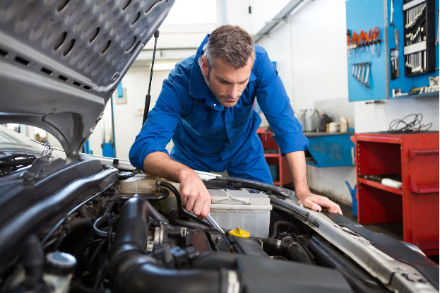
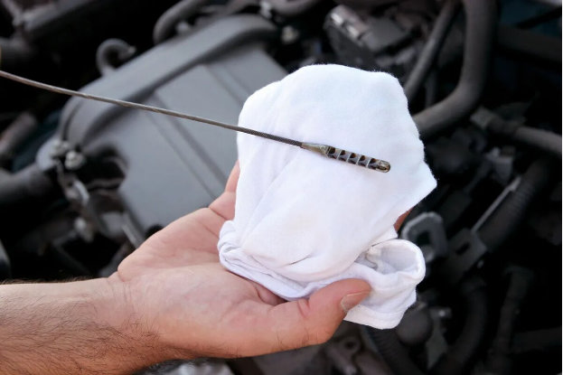

# Ремонт автомобилей как хобби:  удовольствие от работы с автомобилями

Обожаю свое хобби. В нынешнее время люди ремонтируют авто только лишь ради заработка денег,
но для меня — это нечто большее.  Мне действительно нравится крутить гайки.
Вот приезжает к тебе  знакомый и просит помочь ему, а ты: "Да без проблем!".
Пригоняет машину, начинаешь её делать, исправлять недочеты и не исправности.
Все делаешь, а потом — хозяин уезжает довольный с отремонтированным авто и при этом получаешь удовлетворение  и опыт.

Конечно, это так приятно, что живя в своем маленьком городке, катаясь по улицам,
видишь, что мимо тебя проезжает авто, которое ты уделал пару дней, пару недель,
назад и хозяин едет довольный и авто без нареканий работает.
Это действительно приятно. Не спорю, многим не нравится работать с машинами,
в масле, "мазуте" . А мне-дороже многих эмоций!
Тот звук  трещетки, то приятное ощущение свободно откручивающейся/закручивающейся гайки/болта,
то хорошие ощущение, когда ты отладил всю проводку в автомобиле и начали гореть все лампочки,
начали работать все датчики,  да и все работает в штатном режиме, вот оно.
Это не работа, а отдых, отвлечение от всего насущного!

Ремонт позволяет расширить знания о механике и электронике автомобилей,
научиться разбирать и собирать различные компоненты.

Занятие ремонтом автомобилей может принести массу положительных эмоций и удовлетворения.
Во-первых, вы узнаете больше о своем автомобиле, его устройстве и принципах работы,
что сделает вас более компетентным водителем и позволит легче решать проблемы в случае поломок.
Ведь, как говорят, чтобы научиться лечить автомобиль, нужно его сначала разобрать.
