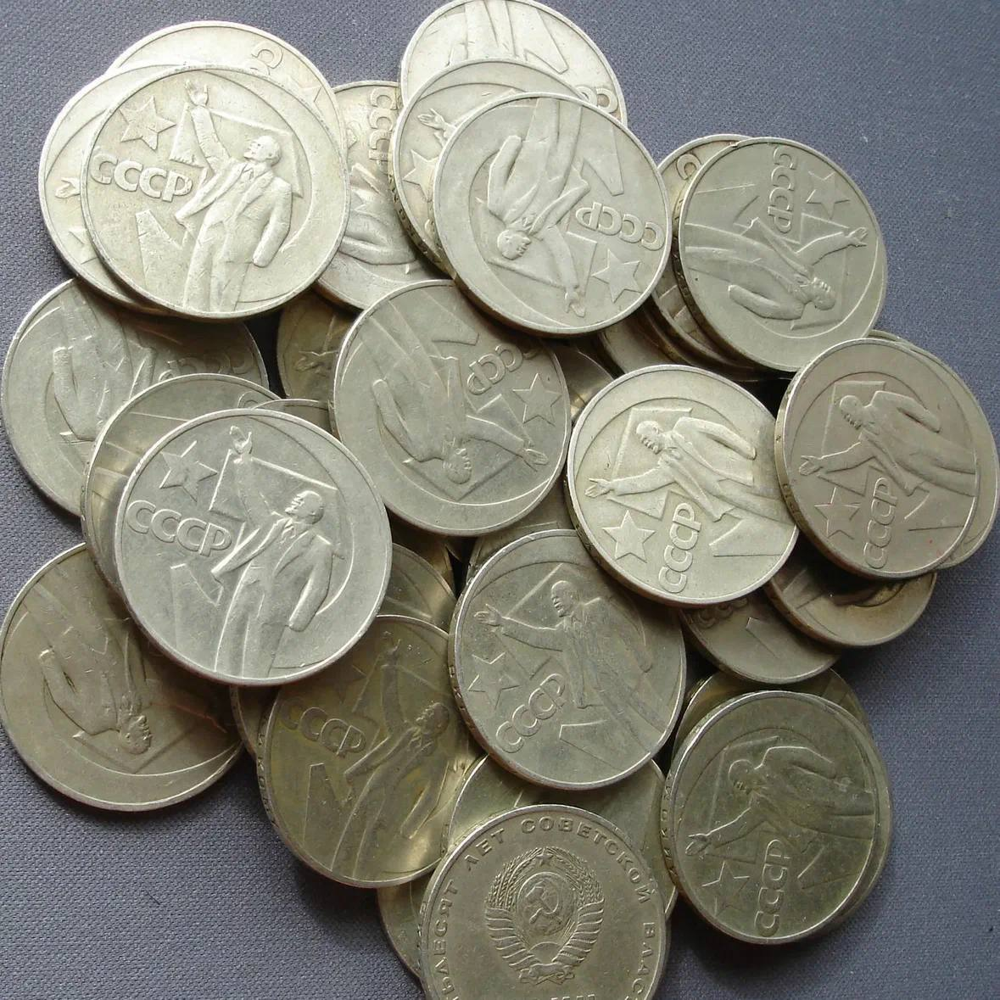
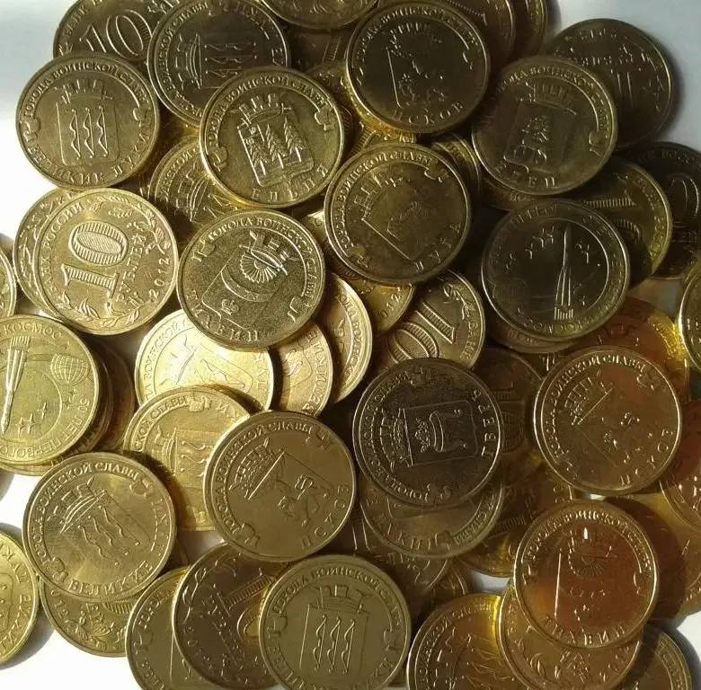

# Нумизматика

Нумизматика — это коллекционирование монет. Можно сказать, что это не просто собирание монет, а целая наука.

Увлекаться нумизматикой начал еще со школы, когда просто случайно в магазине на сдачу дали десяти рублевую монету Города Воиской Славы. С тех пор начал коллекционировать различные монеты. У каждой монеты есть своя история, есть год выпуска, узнал много фактов, почему у одних монет небольшой тираж, а у других — значительно больше. 

Со временем появилась небольшая коллекция монет, альбомы целые с монетами. Посмотрев различные сайты в интернете про монеты, увидел, что есть как редкие монеты, хоть и не много но есть, так же и обычные, имеющие малую ценность.
Но все же это очень увлекательное хобби.

С каждым годом всё больше монет оказываются в моей коллекции. Иногда в интернете попадаются объявления, об обмене монет.
Бывает, что назначаем встречу с человеком и обмениваемся монетами, у кого-то нет такой как у меня или наоборот.

Очень интересно наблюдать различные аукционы по продаже монет в интернете, когда люди даже не предполагают сколько стоит их монета, а ее ценность очень велика, из-за ее редкости и состояния.

Хочется сказать что нумизматика не является каким то сложным хобби или сложным увлечением, иногда просто интересно сесть посмотреть, глянуть в интернете про монеты что-то интересное. Может быть когда-то и у меня будет очень редкая монета, которая будет очень дорого стоить, хотя хочется сказать так, для каждого коллекционера каждая монета, которая даже и ничего не стоящая, очень важна и дорога, ибо человек внес свой труд и свое терпение чтобы ее заполучить.

