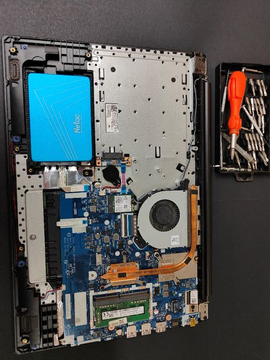
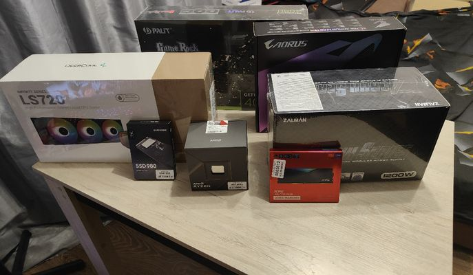

# С ПК на ТЫ

Все мальчишки с детства любят свои игрушки не только что бы поиграть, но и как предмет исследования, я не исключение с малых лет я любил все что можно разобрать и изучить. И вот в эпоху компьютеров я тоже становлюсь пользователем персонального компьютера, все начинается с малого простейшие операции работы с операционной системой, первые программы, а дальше игры. Кто-то на этом и заканчивает свою работу с ПК, но желание изучить устройство приводит кто тому что ты начинаешь проникаться полностью.

Все не вечно и тут выходит и строя твой HDD, ознакомившись c проблемой и изучив вопрос ты бежишь покупать новенький жесткий диск и вот ты уже пишешь диск с Windows 7, первые ошибки, нервы, но всё-таки получается. И вот через годы ты уже уверенный пользователь.

Время не стоит на месте и наступает новая эпоха мобильных ПК «ноутбуки» мое знакомство с ними было не очень гладким. Но как говорится от любви до ненависти один шаг, так и произошло. Главное в любом деле начать, первый был ноутбук друга: замена диска на SSD, оперативная память, и чистка системы охлаждения. И вот через время у тебя уже есть клиентская база и люди с хорошими отзывами о работе.

Так я случайно открыл для себя хобби которое к том уже приносит доход. Почти всем своим друзьям мы собрали их машины вместе. Вот такое для кого-то бездушное железо может быть источником дохода, но вдохновением и досугом.

