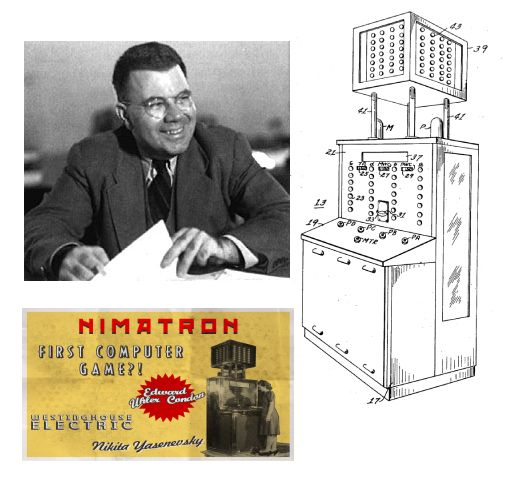
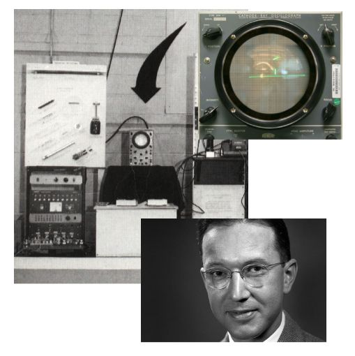
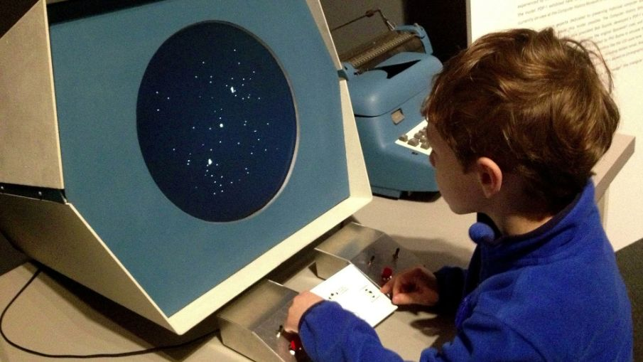

# Спорт в моей жизни

С ранних лет я увлекался единоборствами. С 5 лет я ходил на секцию по карате в младшую группу, затем в начальных классах после уроков занимался джиу-джитсу, однако данным видом спорта прозанимался недолго. С 4 по 9 класс не посещал никакие секции по единоборствам, занимался спортом самостоятельно: бегал по утрам, проводил различные силовые тренировки.

В 9 классе решил заняться боксом и стал ходить в зал бокса «Золотые перчатки». Изначально было трудно, однако я быстро адаптировался к тяжелым физическим нагрузкам, т.к. ранее сам занимался спортом и старался поддерживать форму. В данной секции обрел товарищей, с которыми совместно проводили время не только на тренировках. Прозанимался в данной секции полтора года, два раза выезжал в другие города на соревнования.

В студенческие годы, обучаясь в техникуме, решил попробовать себя в другом виде боевых искусств, который допускает более широкий спектр ударов, включая удары ногами, коленями, а также борьбу. Поэтому стал заниматься рукопашным боем в военно-патриотическом клубе «Боевая молодежь Донбасса». Тренируясь в этом клубе, я часто выступал на соревнованиях по таким видам спорта: рукопашный бой, боевое самбо, ММА. Занимал различные призовые места. Ниже фото с моим участиям в первом открытом чемпионате ДНР по ММА (красная экипировка).

</img>
</img>
</img>

Поступив после ДПТ в ДонНТУ, при распределении студентов на паре физической культуры на различные секции, решил записаться на секцию бокса. Позанимавшись боксом на парах физкультуры, мне очень понравилась методика проведения тренировок преподавателя – Наврос Виктора Васильевича, поэтому я решил записаться на секцию бокса к данному тренеру и заниматься после пар. Спустя полгода тренировок я принял участие в универсиаде по боксу за сборную нашего университета (фото ниже):

</img>
</img>

Почему я люблю единоборства?

Занятия единоборствами способствуют воспитанию силы воли, развитию дисциплины, уверенности в себе, а также дают способность постоять за себя и своих родных.