

<a href="index.htm">Назад в библиотеку</a>
 

# Оценка степени риска поражения человека электрическим током, при эксплуатации электрооборудования в сетях 0,66 кВ с изолированной нейтралью

<i>Студентка гр.ЭПГм-21 Спиридон А.В., руководитель д.т.н., профессор Ковалев А.П.</i>

<u>Актуальность проблемы, термины, определения, понятия</u>

Электробезопасность электрооборудования на промышленных предприятиях зависит, как от качества применяемых изоляционных материалов, надежности и чувствительности автоматических средств защиты, сопротивления общего и местного заземления, так и от организации его обслуживания.

По данным отраслевой статистики свыше 60% аварий на производстве происходит из-за ошибок обслуживающего и эксплуатирующего электрооборудование персонала [1].

По данным МакНИИ в угольной промышленности при эксплуатации подземного электрооборудования число таких аварий превышает 80%. Таким образом в настоящее время особое беспокойство в обеспечении безопасности на предприятии вызывает уровень эксплуатации и обслуживание электрооборудования.

К сожалению многие специалисты, которые работают в области обеспечения безопасности электрооборудования, не осознают несовершенство и односторонность сложившегося подхода к обеспечению электробезопасности, в результате чего не получает развитие такой важный его аспект, как организация эксплуатации его обслуживания [2].

Не ясен вопрос, как количественно оценить уровень организации и обслуживания электрооборудования. По всей вероятности, наряду с указанными причинами сыграла свою роль и осторожность в нормировании частоты (вероятности) появления аварий.

В сознании многих людей не укладывалась мысль о том, что абсолютно безопасная работа в принципе не возможна. Нормировать частоту появления аварий (да еще таких, как поражение людей электрическим током) считалось аморально. По существу специалисты в области безопасности отказались от количественной характеристики электробезопасности и возможности численно оценить различные технические решения, что позволило бы достигнуть новых, более высоких уровней обеспечения безопасных свойств техники и организации ее обслуживания. Однако такой подход к проблеме нормирования и оценки аварий по вероятности или интенсивности их появления меняется как только вероятные характеристики аварий начинают называть характеристиками риска [3].

В основу оценки электробезопасности электрооборудования может быть положено представление о поражении человека электрическим током, как о случайном совпадении в пространстве и времени ряда опасных состояний техники и человека. Состояние техники (в данном случае электрооборудование) будем называть безопасным в те периоды его эксплуатации, когда оно не находится под напряжением и не является источником поражения человека электрическим током и опасным – когда является. Тоже относится и к человеку. За безопасное поведение человека будем понимать такое, когда он не касается ни оболочки, ни тем более токоведущих частей электрооборудования , которое находится под напряжением, а опасное – когда он случайно соприкасается с корпусом электрооборудования или токоведущей жилой проводника без индивидуальных средств защиты.

Под опасным состоянием средств защиты (реле утечки, защитное заземление и т.д.) будем понимать их нерабочее состояние (отключены, загрублены, недостаточно высокое сопротивление цепи и т.д.).

Рассмотрим случай поражения человека электрическим током при его прикосновении без индивидуальных средств защиты к взрывобезопасной оболочки коммутационного аппарата.

<u>Постановка задачи.</u>

Поражение человека электрическим током при эксплуатации коммутационных аппаратов на участке угольной шахты происходит при совпадении в пространстве и времени следующих случайных событий. Произошло замыкание токоведущей жилы кабеля на корпус коммутационного аппарата. Произошел отказ в срабатывании реле утечки. Повреждено защитное заземление (оборваны цепи общего и местного заземления) взрывобезопасной оболочки коммутационного аппарата. Произошло касание человека к корпусу взрывобезопасной оболочки коммутационного аппарата без индивидуальных средств защиты.

Заданы следующие интенсивности появления событий 
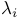 и интенсивность их существования — 
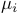, (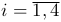).

Известны:
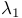 = 1/
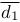;
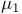 =
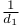,

,
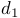
 — средний интервал времени между повреждением реле утечки (преднамеренное отключение , загрубление установки, выход из строя основных блоков и др.) и средняя длительность нахождения реле утечки в нерабочем состоянии;

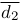,
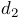
 — средний интервал времени между повреждениями защитного заземления корпуса коммутационного аппарата (обрыв проводников местного и общего заземления, сопротивление заземляющей сети выше нормы и т.д.);

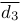,
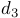
 — средний интервал времени между прикосновениями человека к металлическому корпусу коммутационного аппарата без индивидуальных средств защиты и средняя длительность контакта рук человека и металлического корпуса;

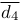,
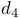
 — средний интервал времени между появлениями замыкания фазы проводника на землю в коммутационном аппарате и средняя длительность его существования.

Определить вероятность (интенсивность) поражения человека электрическим током при эксплуатации коммутационных аппаратов на участке угольной шахты.

<u>Решение поставленной задачи.</u>

В результате решения поставленной выше задачи была получена следующая формула (1) для определения частоты поражения человека электрическим током при случайном касании им корпуса электрооборудования без индивидуальных средств защиты.

где Н – интенсивность поражения человека электрическим током при эксплуатации электрооборудования на участке угольной шахты.

Формула (1) справедлива для случая когда: 

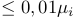;
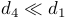;
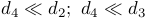.

В тех случаях если заданы: 
,
;
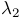,
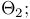
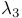, 
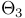, тогда:

Формула (1) позволяет оценить уровень электробезопасности на участке угольной шахты при эксплуатации электрооборудования и ответить на вопрос опасно или нет работать на нем. Определить какова степень опасности.

Литература

1. Легасов В.А. Проблема безопасного развития техносферы. - Коммунист, М, 1987. - №8. - С. 92-101.
2. Ковалев А.П. Оценка степени риска поражения человека электрическим током при эксплуатации оборудования в подземных выработках угольных шахт // Промышленная энергетика. – 1992. – №2. – С. 42-45.
3. Хенли Э. Д. Надежность технических систем и оценка риска / Э. Дж. Хенли, Х. Кумамото ; пер. с англ. В. С. Сыромятникова, Г. С. Деминой ; под общ. ред. В. С. Сыромятникова. - М. : Машиностроение, 1984. - 528 с
