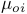
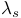

<a href="index.htm">Назад в библиотеку</a>
 

# Оценка надежности структурно-сложных восстанавливаемых систем, элементы которых могут находиться в трех несовместных состояниях

<i>Студент гр. ЭПГм-21 Арматов Б.Э., руководитель д.т.н., профессор Ковалев А.П.</i>

<u>Определения и понятия</u>.

Под структурно-сложной схемой замещения СЭС будем понимать такую, в состав которой входит хотя бы одна группа элементов соединенных в виде логической «звезды» или «треугольника» [1].

Элементы схемы замещения системы с тремя несовместными состояниями (работоспособное, отказ «обрыв цепи», отказ «короткое замыкание») можно выделить в таких системах как: электроснабжение, водоснабжение, газоснабжение и т.д. Элементы СЭС в неработоспособном состоянии: потоки энергии не прерываются («короткое замыкание») или потоки энергии не передаются («обрыв цепи»).

Под узлами схемы замещения будем понимать физические пункты, которые непосредственно связаны не менее чем с тремя направлениями передачи энергии [2].

<u>Постановка задачи</u>.

Пусть задана структурно-сложная (по определению) схема замещения системы, элементы которой могут находиться в трех несовместных состояниях: работоспособном, неработоспособном – отказ «обрыв цепи» и неработоспособном - отказ «короткое замыкание».

Потоки отказов и восстановлений элементов системы простейшие. Пропускная способность элементов не ограничена так же, как и способность сдерживать поток энергии независимо от количества короткозамкнутых элементов. После выхода из строя элемента системы замещения он обнаруживается и его работоспособность восстанавливается (ремонтируется, заменяется на новый) за конечный интервал времени.

Предполагается, что после обнаружения и восстановления вышедшего из строя элемента системы его характеристики надежности остаются такими же как они были и до его повреждения. Каждый элемент схемы замещения системы характеризуется следующими параметрами:

 — интенсивность аварийного отключения <em>i</em>-того элемента схемы замещения системы (отказ «обрыв цепи»);

 — интенсивность введения в работу <em>i</em>-того аварийного отключившегося элемента схемы замещения системы;

 — интенсивность появления скрытых отказов в <em>i</em>-том элементе схемы замещения системы (отказ «короткое замыкание»);

 — интенсивность введения в работу <em>i</em>-того элемента системы после выявления скрытых отказов, которые выявляются в результате диагностики.

Задан интервал времени между диагностическими проверками <em>i</em>-того элемента системы - 
.

Предполагается, что диагностические проверки элемента системы абсолютно надежны. Это означает, если существует скрытый отказ в <em>i</em>-том элементе системы, то он будет обнаружен в результате диагностики [3].

В схеме замещения системы выделен узел «Входа» 
 и «Выхода» 
 (
). Индексы «<em>O</em>» и «<em>S</em>» указывают на то, что учитываются повреждения элемента, которые приводят к отказам типа «обрыв цепи» либо к отказам типа «короткое замыкание».

Определить коэффициент готовности СЭС <em>Р=</em> (∞) , если в начальный момент времени все ее элементы находились в работоспособном состоянии.

<u>Решение поставленной задачи</u>

Для решения поставленной задачи сложную ( по определению) принципиальную схему замещения структурно-сложной СЭС заменим на две простые по структуре расчетные схемы, используя следующее правило:

в первой схеме замещения «минимальные сечения» учитываются отказы элементов — «обрыв цепи», а во второй — отказы «короткое замыкание».

Используя заданные параметры надежности элементов схемы: 
, 
; 
, 

 (формулы приведенные в [4]), находим эквивалентные интенсивности отказов и восстановлений для первой схемы «минимальных сечений» - 
, 

 и для второй - 
, 
.
Используя формулу приведенную в [4], находим коэффициент готовности СЭС:

Коэффициент готовности показывает какую долю времени СЭС находится в работоспособном состоянии.

Литература

1. Ковалев А.П. О расчетах надежности невосстанавливаемых структурно-сложных систем. Элементы которых могут находиться в трех несовместных состояниях /А.П. Ковалев, И.И. Москвина, А.А. Павлович // Промышленная энергетика. - 2018. №12. - С. 9-15.
2. Ковалев А.П. Применение логико-вероятностных методов для оценки надежности структурно-сложных систем / А.П. Ковалев, А.В. Спиваковский // Электричество. – 2000. № 9. – С. 66-70.
3. Козлов Ю.А. Справочник по расчету надежности аппаратуры радиоэлектроники и автоматики // Ю.А. Козлов, И.А. Ушаков - М.: Советское радио, 1975. – 471с.
4. Ковалев А.П. Оценка надежности электроснабжения узлов нагрузки сложной по структуре восстанавливаемой системы с учетом двух видов несовместных отказов электрооборудования./ Научный вестник НИИГД «Респиратор».- 2021.- С.108-117.
