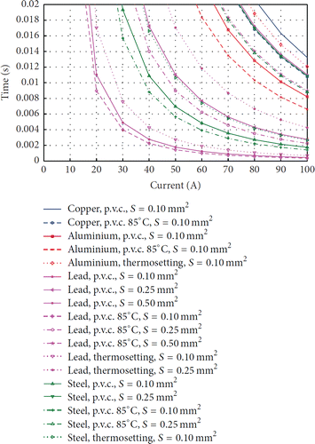

<a href="index.htm">Назад в библиотеку</a>
 

# Методы защиты от электрических пожаров и поражения электрическим током при проектировании умной розетки

<b>Автор:</b> Пищанская М.И. 
<b>Источник:</b> Innovations, Vol. 8 (2020), Issue 1, pg(s) 41-45

<i>Национальный исследовательский Томский политехнический университет, Томск, Россия</i>

E-mail: mip10@tpu.ru

Аннотация: <i>В научном обзоре рассмотрены проблемы и их современные схемотехнические решения, на которые
стоит обратить внимание при проектировании «умной» розетки, связанные с риском поражения
электрическим током и появления электрических пожаров в бытовой сети. Проанализирована
статистика причин электрических пожаров. Приведены примеры использования таких компонентов как
RFID-метка, аварийный прерыватель заземления GFCI, фильтра подавления СКИ, устройство защиты
при дуговом пробое AFCI на основе публикаций современных исследователей. Также представлены
результаты исследования, добавляющие важное требование к электромагнитному реле – время
отпускания и дребезга, высказана идея добавления датчика дыма внутри корпуса розетки. В заключении
проанализировано одно из схемотехнических решений для «умного сетевого фильтра».</i>

Ключевые слова: умная розетка, электробезопасность, сверхкороткие импульсы, RFID, GFCI, AFCI электрический удар, электрический пожар.

## Введение

«Умные» устройства с технологиями Интернета вещей (IoT) становятся обычным
явлением в каждом доме. IoT помогает решить проблемы эффективного расхода
энергоресурсов, позволяют предотвращать, вовремя реагировать на аварийные ситуации, тем
самым уменьшая финансовые затраты и обеспечивая безопасность человека (IoT Human
Security) [1].

Одна из основных угроз – поражение электрическим током, поэтому следует уделить
внимание технологическому развитию последнего элемента цепи электропитания – розетке.
Сегодня к «умным» розеткам добавлены различные функции, такие как беспроводное
управление, мониторинг электроэнергии, работа по расписанию и т.д., которые делают
розетку более «умной». Однако, по данным NFPA проблемы работы устройств с
электрическим током, связанные с безопасностью человека и его имуществом, остаются
наиважнейшими. В отчете NFPA за 2018 год указывается, что в США произошло 47700
бытовых электрических пожаров, в результате которых погибло 418 человек, 1570 - получили
ранения, прямой ущерб имуществу составил 1,4 млрд долларов [2]. Это означает, что
стандартные системы защиты не сработали или не успели сработать как в общей системе
подачи электричества в доме, так и в розетке.

Важны и другие статистические данные, указывающие на необходимость мониторинга
электроэнергии в реальном времени. Например, 13% пожаров вызванные необслуживаемым
оборудованием можно было бы предотвратить, заметив разницу между данными с умных
розеток и данными с общего счетчика в доме. Также одна четверть этих пожаров произошла
в период с полуночи до 8 часов утра, что стало причиной 60% смертей. Необслуживаемым
оборудованием может послужить, например, телевизор, кондиционер, зарядное устройство,
которые обычно переведены в режим ожидания [3], в котором потребляется. Таким образом,
программная защита и беспроводное управление способны не допустить пожары даже в
редко посещаемых местах дома, где и возникали пожары: в спальне (17% от общего
количества), на чердаке или на потолке (12%), в сборке стен или в скрытом пространстве
(9%).

Аналогичная ситуация возникает с ударами электричеством. По данным Фонда
электробезопасности в Северной Америке каждый день около 7 детей проходят лечение в
отделениях неотложной помощи больницы от поражения электрическим током или ожогов,
вызванных несанкционированным вмешательством в розетку, а пожары и ожоги являются
третьей по значимости причиной непреднамеренной смерти среди детей в возрасте до 14 лет.

Таким образом, целью данного научного обзора является поиск современных подходов к
решению проблем с помощью «умной» розетки связанных с
1. возгоранием по причине короткого замыкания (КЗ) и перепадов бытовой сети,
2. поражением электрическим током.

## 1. Электрические пожары

1.1. Ученые провели исследование [4], где измерили максимальное время до повреждения
менее 20 мс для различных материалов, изоляции и сечений (рисунок 1).

Исходя из графика на рисунке 1 в результате КЗ в медном кабеле с ПВХ-изоляцией и
площадью поперечного сечения 0,1 мм2 возникнет ток в 90 А и примерно через 17 мс
изоляция расплавится и может загореться. Следовательно, поскольку розетка будет
размещена после обычного домашнего MCB, она должна реагировать так же быстро. Для
токов низкой нагрузки (до 100 А) время, необходимое для переключения контактов обычно
колеблется от 20 мс до 50 мс; следовательно, будет существует риск, что MCB сработает уже
после возгорания. Следовательно, необходимо учитывать время для отключения питания,
поскольку для физического открытия цепи требуется аппаратное устройство, например, реле.
<i>Время отпускания реле</i> (release time) варьируется от десятков мкс до нескольких мс.
Необходимо учитывать, что время отпускания не включает время дребезга контактов
(bounce time).

Рисунок 1 - Максимальное время отпускания до повреждения менее 20 мс
для различных материалов, изоляции и сечений

Таким образом, авторы статьи утверждают, что реле должно быть выбрано не только,
чтобы соответствовать ограничениям по напряжению и току, но также чтобы максимально
сократить время отпускания и дребезга. Например, электромеханическое реле OJ-SH-
105LM,000 со временем срабатывания (operate time) 15 мс и временем отпускания 4 мс.

1.2. Проблема обычных перепадов напряжения электросети сегодня особенно актуальна,
поскольку в многоквартирных домах высок износ проводки (изоляции), не согласуется
подключение различных по
мощности потребителей, присутствует действие
электромагнитных излучений от разных антенн и модулей, что может создавать так
называемые «падения», «скачки» и помехи напряжения.

1.2.1. Для минимизации влияния помех используются <i>сетевые фильтры</i>, состоящие
из фильтрующей электроники и нескольких розеток. Например, используется <i>варистор</i> для
защиты от апериодических и импульсных помех. Однако, варисторы могут за несколько мкс
абсорбировать большое количество энергии, они не могут продолжительно находиться в
проводящем состоянии, поскольку начинают греться, что может закончиться возгоранием.
Для защиты от этого необходимы <i>термисторы</i>. Варистор со термистором защищен от
перегрева, что продлевает его срок службы и защищает устройство от возможного
возгорания.

1.2.2. По мнению авторов статьи [5] в настоящее время возрастает угроза воздействия
по сети электропитания <i>сверхкоротких импульсов</i> (СКИ). В работе утверждается, что традиционные защитные компоненты (LC-фильтры,
варисторы, TVS-диоды), а
следовательно, и защитные устройства на их основе (сетевые фильтры, источники
бесперебойного питания и др.) не обеспечивают защиту от СКИ, поскольку длительность их
воздействия крайне мала – от 0,2 нс до 12 нс с пиковым электрическим полем с
напряженностью 100 В/м. Действительно, если среднее время срабатывания варистора
(перехода в высокоомное состояние) для бытовой сети 10 нс, то образуется временное окно,
когда есть риски поражения бытовой техники и самой «умной» розетки. На данный момент
известны только промышленные устройства для защиты от СКИ, имеющие крупные
габариты и высокую стоимость. Ученые [6] в 2014 году предложили решение данной
проблемы посредством создания фильтра подавления СКИ на основе печатного модального
фильтра. Принцип его работы заключается в делении одного импульса на два (четыре, шесть,
восемь - в зависимости от требований) импульса, амплитуда каждого будет гораздо ниже, следовательно, каждый из них уже не сможет нанести серьезный урон.

1.2.3. Высокочастотные помехи, вызванные подключением мощных потребителей
(например, двигатель) устраняются с помощью катушек <i>индуктивности и конденсаторов</i>.

1.3. Необходимо предусматривать защиту от перегрева, вызванного плохим контактом или
неправильно подобранным напряжением нагрузки. Поэтому в сетевом фильтре требуется
дополнительная защита по линиям: <i>отдельный переключатель и предохранитель</i> для каждой.

1.4. Также необходимо предусмотреть вариант, когда непосредственно в корпусе розетки
или сетевого фильтра происходило задымление, как знак начальной стадии возгорания. Над
этим вопросом задумался изобретатель Майкл Дайоуб [7]. Он использовал <i>детектор дыма</i>,
встроенный в корпус сетевого фильтра из 4 розеток. Наличие дыма определялось путем
обнаружения рассеянного света от мелких частиц дыма или других аэрозолей. Если
фиксировалось наличие дыма, то сигнал поступал на управляющее реле и цепь размыкалась.

## 2. Поражение электрическим током

Наиболее распространенными мерами безопасности от поражения электрическим
током является 1) добавление <i>третьего штыря</i> (заземления), который снижает риск
поражения электрическим током и защищает оборудование от повреждения, 2) заключение в
<i>устойчивую к взлому розетку</i>, которая предотвращает вставку предметов, 3) розетки
<i>питания</i> (AFCI, прерыватели дуговых замыканий), которые снижают риск поражения
электрическим током путем прерывания питания при возникновении дуговых замыканий в
цепи, 4) <i>розетки GFCI</i> [8] (устройство защитного отключения), которые отключают
электроэнергию при обнаружении дисбаланса между исходящим и входящим током.

Авторы статьи [4] предлагают систему, которая предотвращает поражение
электрическим током по следующему принципу: если к розетке не подключено устройство,
электричество не подается. Во-первых, необходимо идентифицировать, когда прибор
подключен к розетке. Большинство механизмов идентификации полагаются на механические,
неавтоматизированные системы, например, нажатие кнопки. В статье предлагается
использовать <i>RFID</i>, где считыватель RFID встроен в розетку, а метки RFID прикреплены к
электрическому разъему устройства или к его шнуру. Следовательно, электричество подается
только в том случае, если к устройству прикреплена действующая метка RFID и, если его
разъем/шнур находится очень близко к «умной розетке» (несколько см).

## Заключение

Таким образом, при разработке «умных» розеток помимо различных функций
направленных на расширение функциональных возможностей, следует уделить особое
внимание обеспечению безопасности человека, применяя современные схемотехнические
решения. Так, авторам статьи в сборнике [9], которые предложили схему «умного сетевого
фильтра» на основе модуля ESP8266, следует обратить внимание на уязвимость
механической системы защиты с виде варистора и плавкого предохранителя от СКИ,
заменить электромагнитное реле на более «быстрое», добавить датчик дыма в корпус
устройства, а также провести исследование тепловых характеристик элементов при
различных нагрузках, что может подтвердить необходимость термодатчика внутри корпуса,
чтобы усилить скорость предотвращения возгорания внутри самого устройства.

## Список использованных источников

1. Sehgal V. K. et al. Smart human security framework using internet of things, cloud and fog computing //Intelligent distributed computing. – Springer, Cham, 2015. – С. 251-263.
2. Hall, J. R. Home electrical fires. Quincy, MA: National Fire Protection Association - 2013.
3. Chou J., Lee Y. L. Energy saving outlet having a sensor and method of use there of: пат. 7520783 США. – 2009.
4. Fernández-Caramés T. M. An intelligent power outlet system for the smart home of the Internet of Things //International Journal of Distributed Sensor Networks. – 2015. – Т. 11. – No. 11.
5. Genender, E., Garbe, H., Probabilistic Risk Analysis Technique of Intentional Electromagnetic Interference at System Level.IEEE Trans.on Electromagn.Compat,2014, С.200-207.
6. Gazizov, Alexander T., and Alexander M. Zabolotsky. "New approach to the power network protection against ultrawide band pulses." Dimensions 500.2500, 2014.
7. Dayoub M. Power strip with smoke detection auto-shutoff: пат. 7154402 США. – 2006.
8. King G. N. Modular GFCI receptacle: пат. 6309248 США. – 2001.
9. Пищанская М.И., Иванова В.С. Разработка «умного сетевого фильтра» для мониторинга и управления потребляемым электричеством // Наука. Технологии. Инновации: сборник научных трудов в 9 ч. Часть 4, - Новосибирск: НГТУ, 2019 - C. 68-71.