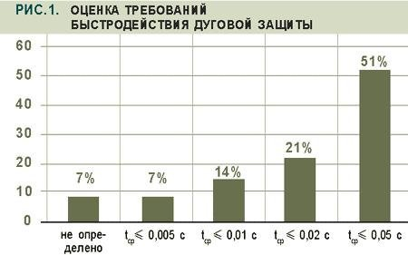
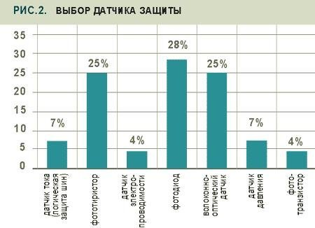
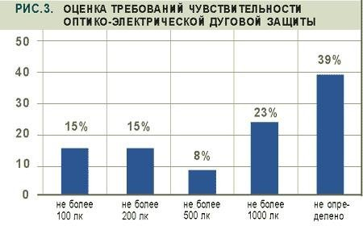
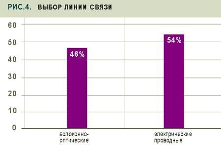
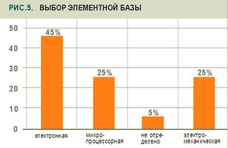
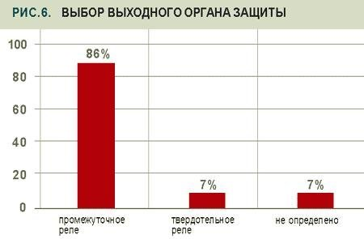

<a href="index.htm">Назад в библиотеку</a>
 

# Быстродействующие дуговые защиты КРУ. Современное состояние и пути совершенствования

<strong>Значительную опасность для комплектных распределительных устройств (КРУ) напряжением 6–10 кВ представляют внутренние короткие замыкания (КЗ), сопровождаемые электрической дугой (ЭД). Данная проблема усугубляется тем, что многие КРУ не оснащены полноценной быстродействующей защитой от дуговых КЗ или применяемая в них защита не отвечает современным требованиям. Это побудило РАО «ЕЭС России» издать ряд приказов о повышении надежности работы энергообъектов, оборудованных КРУ, предусматривающих их оснащение быстродействующими защитами от внутренних дуговых КЗ.</strong>

В настоящее время ряд отечественных и зарубежных разработчиков и производителей предлагают для электроэнергетических и промышленных предприятий технические решения защиты от дуговых КЗ, реализующие в основном контроль параметров тока и светового потока. Предлагаемая вниманию читателей статья основана на собственном опыте автора по разработке и внедрению оптико-электрических дуговых защит. Как считает Владимир Нагай, этот опыт позволяет высказать ряд предложений, носящих, возможно, дискуссионный характер. Приглашаем специалистов к обсуждению этой темы.

## Способы распознавания дуговых КЗ

Дуговое КЗ сопровождается как изменением параметров и характеристик электрической сети (ток, напряжение, сопротивление), так и существенным повышением температуры, давления, электропроводимости и теплового (светового) излучения внутри отсеков КРУ. Данные информационные признаки могут быть использованы в защите, которая должна отвечать следующим свойствам: высокое быстродействие, абсолютная селективность и высокая чувствительность. Основных способов распознавания дуговых КЗ два вида:
* Способы, основанные на контроле параметров и характеристик электрической цепи с дугой: спектрального состава тока или напряжения, модулей и аргументов фазных и симметричных составляющих токов и напряжений, уровней несимметрии токов или напряжений, сопротивлений или вольт-амперных характеристик короткозамкнутой цепи. Эти способы позволяют использовать традиционные для релейной защиты сигналы – токи и напряжения. Наряду с известными достоинствами в преобразовании и обработке токов и напряжений имеется и ряд недостатков, заключающихся в том, что данные признаки могут наблюдаться не только при внутренних дуговых КЗ, но и при внешних КЗ. Последнее затрудняет распознавание внутреннего повреждения, т.е. не позволяет выполнить защиту с абсолютной селективностью. Однако выполненные исследования, например [1], показывают возможность информационного совершенствования дуговых защит и, как следствие, повышение распознаваемости рассматриваемых режимов, о чем будет сказано отдельно.
* Способы, основанные на контроле параметров электрической дуги и сопутствующих ей явлений: температуры, давления, электрической проводимости окружающей среды (степени ионизации газов), излучения, оптических свойств среды, электромагнитного излучения. Они позволяют увеличить степень распознаваемости дуговых КЗ в КРУ. Влияние эксплуатационных режимов на функционирование защит, реализующих способы контроля этой группы, с учетом конструктивных особенностей КРУ минимально.

## Сравнение методов защиты от дуговых КЗ

Достаточно простым техническим решением для защиты от дуговых КЗ является применение максимальной токовой защиты (МТЗ), положительными качествами которой являются простота, высокая элементная надежность и низкая стоимость. Ограничивающими факторами применения МТЗ являются относительная селективность и недостаточно высокое быстродействие из-за необходимости согласования с защитами смежных элементов.

Требованию абсолютной селективности отвечают токовые дифференциальные защиты и «логические защиты шин» (ЛЗШ) секций (на основе разрешающей МТЗ ввода и блокирующих МТЗ отходящих присоединений), в зону действия которых входят сборные шины и выключатели. «Мертвой» зоной этих защит являются отсеки измерительных трансформаторов тока (ТТ) и кабельной разделки – одни из наиболее вероятных мест повреждения. ЛЗШ может отказать в начальный период КЗ при наличии подпитки от мощных электродвигателей, что может быть исключено путем контроля направления мощности на данных присоединениях. Появление высших гармонических составляющих в напряжениях из-за нелинейности вольтамперной характеристики дуги может являться дополнительным информационным признаком, так же как и наличие симметричных составляющих обратной и нулевой последовательности токов и напряжений из-за неравенства длин столбов дуги и касания заземленных металлоконструкций.

## Контроль параметров электрической дуги

Значительная часть энергии, подводимой к столбу электрической дуги, превращается в тепловую энергию. Для контроля температуры в ячейке могут быть использованы контактные и дистанционные методы, однако их применение ограничено из-за относительной сложности используемой аппаратуры и необходимости точного позиционирования датчика температуры по отношению к столбу дуги, положение которого заранее неизвестно.  Повышение давления, зависящего от энергии дугового КЗ, материала ошиновки, коэффициента заполнения отсека, длительности КЗ, также может являться одним из признаков рассматриваемого вида повреждения. Однако из-за негерметичности отсеков КРУ чувствительность защит, контролирующих приращение давления, также ограничена. Например, клапанные защиты устойчиво срабатывают только при токах более 3,5 кА и выше [2].

Контроль плотности заряженных частиц (электропроводности) возможен только при близких к столбу дуги расстояниях, а при удалении датчиков электропроводимости от столба дуги резко снижается чувствительность защиты. Мощность теплового излучения, в том числе и светового излучения, зависит от величины тока КЗ, на значение которого влияет сопротивление предвключенной системы и сопротивление столба дуги. Оценка чувствительности защит [3], использующих оптические датчики информации, показывает, что их чувствительность достаточна практически для всех типов КРУ, подключаемых к трансформаторам мощностью 2,5 МВА и выше.

## Современная техническая реализация защитных устройств

Для защиты КРУ в настоящее время применяются устройства, реагирующие:
* на повышение давления на фронте ударной волны в начальный момент дугового КЗ (клапанная дуговая защита [2]);
* на повышение степени ионизации газов в канале дугового столба (защита антенного типа с дугоулавливающим электродом, устанавливаемым в шинных отсеках [2]);
* на появление излучения от дугового столба (защита на фототиристорах, фоторезисторах, фототранзисторах и фотодиодах [4–12], с волоконно-оптическими датчиками (ВОД) [13–15]).

Сравнение способов построения дуговых защит КРУ показывает, что наиболее перспективным с позиции получения максимального быстродействия при абсолютной селективности и минимальном количестве информационных признаков является способ контроля освещенности (светового потока) внутри отсеков [1].

## Построение оптико-электрических дуговых защит

Оптико-электрические дуговые защиты по типу используемых датчиков можно разделить на две группы: с полупроводниковыми фотодатчиками и с ВОД. Тип датчика определяет не только алгоритмы обработки информации, но и исполнение защит, которые можно классифицировать как индивидуальные и централизованные.

Централизованные защиты, как правило, предназначены для защиты секции или группы ячеек и не обеспечивают селективного выявления зоны повреждения. Оптические датчики, например полупроводниковые фотоприборы, соединяются параллельно, а ВОД включается в виде петли.

Индивидуальное исполнение защиты позволяет выполнить воздействие на выключатель поврежденной ячейки, обеспечить селективность действия защиты и выявить поврежденную зону.

Для повышения селективности централизованные защиты могут быть выполнены по централизованно-индивидуальному принципу, когда каждый датчик имеет свою зону наблюдения и ему присваивается определенный номер («имя») [8,13,15]. При реализации индивидуальной защиты с помощью ВОД они выполняются в виде радиальных линий, соединяемых с центральным блоком обработки информации (ЦБОИ) [13,15]. При реализации датчиков на основе традиционных фотоприборов они также должны выполняться в виде радиальных линий или включаться параллельно, с передачей кодированной информации в центральный блок [8].

Система оперативного тока также существенным образом влияет на выполнение защиты. Эти особенности проявляются на подстанциях, где отсутствует оперативный постоянный ток, что вызывает необходимость питания устройств дуговой защиты от цепей переменного напряжения или переменного тока [7–9]. В первом случае это требует использования накопителей энергии, обеспечивающих действие защиты при снижении напряжения при КЗ. Однако при включении вводного выключателя на КЗ, когда отсутствовало напряжение на шинах, это может привести к отказу защиты. Поэтому более предпочтительно выполнение блоков питания подобных защит от комбинированного блока питания, подключенного к цепям переменного напряжения и цепям переменного тока (например, к цепям измерительных трансформаторов тока).

Для повышения надежности работы практически все защиты осуществляют контроль, кроме светового потока, еще, по крайней мере, одного признака, характеризующего дуговое КЗ, — тока или напряжения. На это же направлена адаптация измерительных органов дуговой защиты к режиму защищаемой электроустановки и наличие канала торможения, что особенно актуально для КРУ старых конструкций, размещаемых внутри зданий (закрытых распредустройств) и имеющих полуоткрытый тип.

При дуговом КЗ в смежной ячейке возможно освещение фотодатчиков защищаемой ячейки в результате многократных отражений светового потока. Ориентация тормозных датчиков в сторону смежной ячейки позволяет исключить неселективное действие защиты. Быстродействие рассматриваемых защит составляет единицы-десятки миллисекунд. При этом полное время отключения КРУ с учетом действия выключателя не должно превышать 0,1–0,15 с.

Индивидуальные устройства защиты представлены устройствами типа РДЗ, разработанными в ЮРГТУ, или типа УДЗ-1 фирмы «ЭЛОКС». При этом устройства РДЗ могут выполнять и функции централизованной защиты при подключении фотодатчиков параллельно друг другу.

Централизованные устройства представлены следующими типами защит: РДЗ-018 (ЮРГТУ), ОСДЗ («Энерготехника»), БССДЗ-01/02 («Промэлектроника»), ОВОД (ПРОЭЛ), REA-100 (ABB), ПД-01 (ALSTOM), ФВИП (НИИИТ). Указанные устройства отличаются как по типу используемого оптического датчика, линиям связи датчиков и измерительных органов, так и по элементной базе. В основном данные защиты предназначены для защиты одной или двух секций КРУ и воздействия на коммутационные аппараты питающих присоединений. Поэтому у них, как правило, отсутствует «выделение» поврежденной ячейки. Исключением являются защиты типов РДЗ-018, ОВОД, REA-100.

Первая защита реализована в виде локальных датчиков сбора информации, размещаемых в защищаемых ячейках и соединенных с ЦБОИ. Вторая защита реализует принцип радиальных ВОЛС, идущих от ЦБОИ в защищаемые ячейки. В защите типа REA 100 также предусмотрена возможность подключения радиальных ВОЛС, выполняющих еще и функции датчика.

## Пути совершенствования оптико-электрических дуговых защит

Для выбора путей дальнейшего совершенствования дуговых защит представляет интерес не только мнение научной общественности, разработчиков и производителей аппаратуры релейной защиты, но и специалистов, занятых в эксплуатации электроэнергетического оборудования. Учет их мнения во многих случаях является решающим, особенно в условиях рыночной экономики, когда выбор того или иного технического решения остается за потребителем данной продукции. Автором данной работы был выполнен опрос специалистов ряда энергетических систем РФ по проблемам построения дуговой защиты, результаты которого приведены ниже (рис.1–6).

Большинство специалистов считают приемлемым время срабатывания защиты, не превышающее 50 мс (51% опрошенных), и лишь 21% считают необходимым уменьшить время срабатывания до 20 мс. Пятая часть экспертов готова эксплуатировать дуговую защиту со временем срабатывания, не превышающим половины (14%) и четверти (7%) периода промышленной частоты. Таким образом, подавляющая часть специалистов отдает предпочтение защитам с умеренным быстродействием, что объясняется известными проблемами помехоустойчивости сверхбыстродействующих защит и проблемами поиска повреждений после отключения, когда порой трудно найти следы повреждения.

Наибольшее затруднение (39%) вызвал вопрос оценки чувствительности ОЭДЗ, что связано с недостаточной информированностью специалистов об уровнях освещенности, создаваемой электрической дугой в электроустановках напряжением 6–10 кВ. Другая часть специалистов считает приемлемой чувствительность в диапазоне 100–1000 лк, что связано с опытом эксплуатации фототиристорной дуговой защиты с порогом срабатывания 900–1000 лк и определенными проблемами ее проверки от ламп накаливания или от фотовспышки. Снижение нижней границы порога срабатывания позволяет упростить возможность проверки и наладки ОЭДЗ от указанных источников.

В качестве дополнительного контролируемого признака большинство специалистов (87%) отдают предпочтение контролю тока по сравнению с контролем напряжения (13%). Также подавляющее число специалистов (86%) отдают предпочтение контактному выходному органу, и лишь 7% опрошенных согласны на использование выходного органа типа твердотельного реле.

Наиболее широкий спектр мнений выявился по выбору типа датчика. Несмотря на то, что здесь обсуждаются вопросы построения оптико-электрической дуговой защиты, автор счел своим долгом включить ответы и по другим датчикам дуговой защиты. Четверть голосов набрали волоконно-оптические датчики и более половины (57%) голосов – традиционные датчики на основе фототиристора, фотодиода и фототранзистора. По 7% специалистов готовы эксплуатировать логическую защиту шин и защиту на основе датчиков давления. Только 4% опрошенных специалистов отдают предпочтение защите, контролирующей проводимость в шинном отсеке (защита антенного типа).

По следующему вопросу мнения специалистов разделились практически поровну: 46% отдают предпочтение ВОЛС и 54% – традиционным электрическим линиям связи.

Отмечены тенденции к готовности эксплуатации микропроцессорной элементной базы (25%). Однако такая же часть специалистов готова продолжать работать с электромеханической техникой. Лидирующее положение пока занимает микроэлектронная элементная база (45%).

Большинство специалистов (61%) выступают за отключение питающего присоединения (вводной выключатель или секционный выключатель) при повреждении в любой ячейке КРУ. Третья часть опрошенных предпочитает отключить выключатель поврежденного присоединения, несмотря на возможность усугубления аварии.

## Построение ОЭДЗ

Дуговая защита КРУ должна строиться с учетом его конструктивных особенностей и типов коммутационных аппаратов. Для этого необходимо выделить как особые элементы распредустройства, к которым относятся ячейки вводного выключателя, ячейка секционного выключателя, особые зоны (отсеки) ячеек КРУ: отсек шинного моста, отсеки высоковольтных выключателей, трансформатора напряжения и т.д. Такое деление КРУ на зоны позволит наиболее оптимально выполнять воздействия на коммутационные аппараты с минимизацией объемов повреждений. При КЗ в особых элементах требуется отключение секции без выдержки времени, а при КЗ в особых зонах, например, в отсеках измерительных трансформаторов тока, кабельной разделки и проходных изоляторов возможно отключение только поврежденной ячейки, например, при использовании вакуумных выключателей.

Горение дуги в ячейке вводного выключателя требует воздействия на отключение не только секционного выключателя, но и выключателя со стороны высшего напряжения силового трансформатора. Повреждение же секционного выключателя требует отключения вводных выключателей. С учетом вышеизложенного защита должна обеспечивать селективное выявление дуговых коротких замыканий в ячейках и их отсеках.

Существует также и другой подход в построении дуговой защиты КРУ, согласно которому любое КЗ в КРУ должно отключаться вводным выключателем, что приводит к «погашению» секции. Такой подход упрощает реализацию защиты и допускает объединение датчиков, например, позволяет выполнять оптико-электрический датчик единым, что имеет место при использовании ВОЛС, соединенной в «петлю». При реализации защиты по первому варианту возможно объединение ОЭДЗ и устройств, воздействующих на одни и те же выключатели.

## Разумный подход – в сочетании защит

Таким образом, отмечается тенденция готовности производителей КРУ и эксплуатирующих организаций к использованию оптико-электрических дуговых защит, обеспечивающих контроль тока и светового потока. Ранее специалисты более осторожно относились к применению подобных защит. Вместе с тем можно отметить, что возможности защит с контролем токов и напряжений не в полной мере использованы из-за ограниченного набора информационных признаков в защитах на электромеханической и микроэлектронной элементной базе.  Применение микропроцессорной техники снимает проблему сложности алгоритмов и объемов обрабатываемой информации, что позволяет вернуться к вопросам построения быстродействующих и селективных защит с традиционными датчиками информации (трансформаторами тока и напряжения).

При этом некоторые недостатки, отмеченные выше, могут быть превращены в достоинства, например, в сокращение времени их монтажа и наладки, т.к. в отличие от монтажа оптико-электрических защит не требуется отключение всей секции. Выполнение более совершенной защиты от замыканий на землю, обеспечивающей выявление повреждений не только на кабельных или воздушных линиях, но и внутри КРУ, позволит не допустить развития в междуфазные дуговые КЗ.

Предлагаемая концепция построения защит КРУ и отходящих от них линий может явиться предметом дополнительного обсуждения. Разумное сочетание ОЭДЗ и защит с контролем токов и напряжений позволит повысить надежность защит и обеспечить резервирование.

<strong>Владимир Нагай, д. т. н., профессор каф. «Электрические станции», зам. директора НИИ Энергетики Южно-Российского государственного технического университета, г. Новочеркасск</strong>

<strong>ЛИТЕРАТУРА</strong>
<ol> <li>Нагай В.И. Релейная защита ответвительных подстанций электрических сетей. – Энергоатомиздат, 2002. – 312 с.</li>
<li>Зотов А.Я. О дуговой защите шкафов КРУ(Н) 6–10 кВ на датчиках «Краб» и «Антенный» // Энергетик. – 1997. – № 3. – С. 17–18.</li>
<li>Нагай В.И., Сарры С.В. Определение чувствительности оптико-электрических защит от дуговых коротких замыканий в комплектных распределительных устройствах напряжением 6–10 кВ // Изв. вузов. Электромеханика. – 1999. – № 1. – С. 48–51.</li>
<li>Нагай В.И. Выбор и техническая реализация быстродействующих защит КРУ от дуговых коротких замыканий// Электро. – 2002.– № 1. – С. 35–39.</li>
<li>Середа Н.Н., Харитонов В.В. Применение фототиристоров для защиты сетей при дуговых коротких замыканиях // Материалы семинара «Новые комплектные электротехнические устройства». – М.: Московский Дом науч.-техн. пропаганды, 1990. – С. 53–57. </li>
<li>В.И. Нагай, С.В. Сарры, М.М. Котлов и др. Оптико-электрическая дуговая защита КРУН 6–10 кВ // Энергетик. – 2000. – № 8. – С. 38–39.</li>
<li>Нагай В.И. Сарры С.В., Войтенко А.С. Релейная защита КРУ с контролем светового потока // Промышленная энергетика. – 2001. – № 11. – С. 32–36. </li>
<li>Нагай В.И., Сарры С.В., Войтенко А.С. Быстродействующие релейные защиты КРУ от дуговых коротких замыканий с оптико-электрическими датчиками // Электрические станции. – 2002. – № 3. – С. 55–59.</li>
<li>Вайнштейн В.Л., Сурвилло Б.А. Фотореле защиты от дуговых КЗ // Энергетик. – 1989. – № 11. – С. 27–31.</li>
<li>10. Сухоручкин И.В., Бочаров Н.В. Реле защиты от дуговых замыканий // Электрические станции. – 1990. – № 5. – С. 89–91.</li>
<li>Коротков Л.В., Погодин Н.В. Быстродействующая оптическая система дуговой защиты ЗРУ 6–10 кВ // Релейная защита и автоматика энергосистем 2000: Тез. докл. XIV научно-технической конференции. – М.: ЦДУ ЕЭС России, 2000. – С. 48–49.</li>
<li>Крылов И.П. Устройство быстродействующей селективной световой дуговой защиты БССДЗ-01/02 // Сборник тез. докл. семинара-совещания начальников служб РЗА АО-энерго, начальников электролабораторий электрических станций, ведущих специалистов РЗА ОЭС Северного Кавказа, РАО «ЕЭС России», РП «Южэнерготехнадзор». – Пятигорск, 2001. – С. 112–114.</li>
<li>Калачев Ю.Н., Шевелев В.С. Устройство дуговой защиты для ячеек КРУ 6–10 кВ // Энергетик. – 2001. – № 1. – С. 25–26.</li>
<li>Демьянович М.В., Евреев А.И., Пименов А.В. и др. Новая дуговая защита для комплектных распределительных устройств // Энергетик. – 2001. – № 5 – С. 24.</li>
<li>Григорьев В.А., Милохин В.Е., Палей Э.Л. Волоконно-оптическая дуговая защита ячеек КРУ 6-10 кВ // Энергетик. – 2002. – № 2. – С. 23–24.</li>
</ol>
