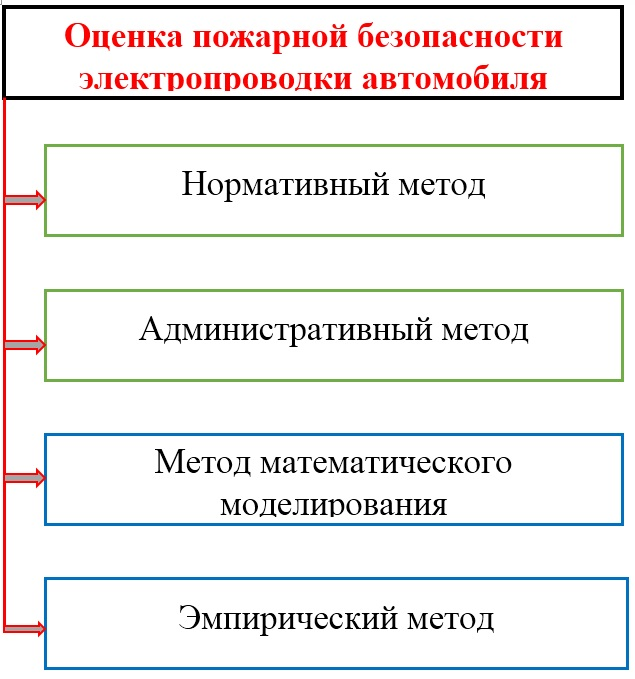

<a href="index.htm">Назад в библиотеку</a>
 

# Пожарная опасность большого переходного сопротивления в электрической сети

<b>Авторы:</b> Ароян К.С., Елизаров Л.В., Кондраков Е.П., Сардар А.А., Султан Б.А. 
<b>Источник:</b> Международный научный журнал «Синергия наук»

<i>ФГБОУ ВО Санкт-Петербургский университет государственной противопожарной службы МЧС
России, г. Санкт-Петербург</i>

Аннотация: <i>Современная электрическая сеть состоит из
множества элементов и имеет сложное строение. Для электрической сети характерны
следующие аварийные режимы работы: короткое замыкание, перегрузка и большое
переходное сопротивление. Обеспечение пожарной безопасности и профилактика
аварийных режимов в электрических сетях различных объектов являются актуальными
для России. В работе рассмотрены аварийные режимами работы в электрических сетях,
вызванные большим переходным сопротивлением.</i>

Ключевые слова: Пожарная опасность, большие переходные сопротивления,
электрическая сеть, аварийные пожароопасные режимы.

Термин «большие переходные сопротивления» появился при
исследовании протекания электрического тока с одной поверхности
проводника на другую, через площадки их соприкосновения. Большие
переходные сопротивления образуются из-за неплотного контакта
токопроводящих элементов электросети между собой, например, в местах подключения проводов к рубильникам, предохранителям, электродвигателям и другим аппаратам и приборам.

Причиной образования больших переходных сопротивлений может быть также некачественное выполнение монтажных работ, когда вместо горячей пайки, сварки или опрессовки электрических проводов, ограничиваются простой механической скруткой, подключая провода без специальных зажимов и наконечников. [1–2]. Так же возможно возникновение аварийных режимов, связанных с выделением тепловой электрической энергии, в местах контакта электропроводов, изготовленных из разных металлов (например из меди и алюминия). При нормальном функционировании электрических проводов переходные сопротивления незначительны и практически не отличаются от сопротивления других участков электрической цепи. Если в местах таких соединений контакт будет неплотный, сопротивление резко возрастает. При этом происходит локальный нагрев, который приводит к воспламенению горючих веществ (изоляции).

При наличии подвижных контактов может наблюдаться искрение. Наиболее часто термическое искрение возникает или создает дополнительную опасность в результате:

1. Точечной коррозии или горения контактов в местах электрического замыкания цепи;
2. Перегрева при плохих контактах контакт или перегрузке;
3. Механического износа и коррозии при длительной эксплуатации или плохой профилактики;
4. Отсутствия или недостаточной эффективности защитных устройств.

Характерными признакамиоканд образования больших такжепереходныхмогут сопротивлений являются:
- повышенный нагрев мест соединения проводов, токоведущих жил кабелей или их контактов;
- появление в местах соединений и подключений синевы на металле, хрупкость и растрескивание изоляции;
- расплавление припоя на зажимах и др.

При наличии больших переходных сопротивлений появляются специфический запах жженой резины и продуктов термического разложения изоляции, а также потрескивание.
Предохранители, даже правильно выбранные, не могут предупредить возгорание от действия больших переходных сопротивлений, ибо ток в электрической цепи не возрастает, а выделение большого количества тепла происходит в результате образования больших переходных сопротивлений.

От указанных электротехнических причин возникает большое  количество пожаров. Статистика показывает, что каждый третий пожар возникает при эксплуатации электрооборудования и бытовых электроприборов.

Меры, принимаемые по пожарной профилактике можно разделить, прежде всего на технические, организационные, режимные, строительно-планировочные и эксплуатационные.

На рисунке показаны методы повышения пожарной безопасности в электропроводке автомобилей [3, 4, 5]. Из проведенного анализа следует, что существующие административные и нормативные методы за последнее время практически не меняются. При этом использование административных методов сводятся к системе штрафов, контролю соблюдения сроков технического обслуживания и большому количеству приказов и другой документации. Эти методы исчерпали себя, а в некоторых случаях приводят к ухудшению обслуживания транспортных средств.

К техническим меоприятиям относится выполнение противопожарных норм и правил при эксплуатации автотранспорта, расчет времени эвакуации, анализ нарастания опасных факторов пожара, использования современных систем автоматического пожаротушения, применение пожаразащитных систем [1, 3, 6] и т.д.

Организационные мероприятия определяются в первую очередь правильной эксплуатацией автомобильного транспорта, регламентированное содержание ремонтных помещений и территорий, проверками соблюдения противопожарных правил и регулярным интруктажам водителей и обслуживающего персонала.

К ремонтным меоприятиям относятся всякого рода разрешающие и запрещающие приказы. Строительно-планировочные меры должны быть регламентированы на этапе строительства и ремонта и определяются огнестойкостью зданий и сооружений (использование материалов и конструкций: несгораемых, трудносгораемых) [4].

Рисунок - Методы повышения пожарной безопасности при эксплуатации автотранспортных средств.

На железнодорожном транспорте случаи загораний и пожаров от электротехнических причин наблюдается на тепловозах, в пассажирских вагонах и на других подвижных и неподвижных объектах. В частности, на тепловозах типа ТЭ-3 наиболее часто возникают пожары в результате:
короткого замыкания на корпус электропровода, проложенного к топливному насосу и подверженного наиболее сильному разрушительному воздействию на его изоляцию; неисправности реле напряжения главного генератора, приводящей к перегрузке проложенных  от него электрических кабелей; замыкания на массу плюсового провода (проложен от диода зарядки батареи
), приводящего к образованию искры с последующим возгоранием проводов в высоковольтной камере; перетирания изоляции кабеля в месте выхода из настильного листа в изгибе трубы и замыкания кабеля на корпус тепловоза;
нагрева кабеля из-за плохого контакта в месте крепления с последующим перегоранием изоляции и замыканием с силовыми кабелями; возникновения электрической дуги между губками контактора Д-3 в результате неплотного его подклинивания и др.

Характерный случай пожара наблюдался в одном из локомотивных депо в связи с замыканием силового кабеля АПВ в распределительной коробке вследствие протекания крыши и попадания воды на оголенную поверхность кабеля в месте разветвления [3, 7, 8].

При перевозке автомашин на платформах наблюдались случаи замыканий в  результате  оставления  включенным замка зажигания и возникновения горения дроссельной катушки из-за ее перегрева.

Весьма опасными являются электромагнитныек поля с частотами от 10 кГц и выше, которые создаются техническими устройствами. Источниками загорания здесь могут быть искровые разряды в местах соприкосновения и разъединения, а также разогрев деталей приемной схемы из- за напряжений и электротоков , генерированных в приемной схеме электромагнитным полем.

Примером является установленное накопление энергии высокочастотногое электромагнитного излучения в разветвленных металлических строительных конструкциях (мощные радио- и телевизионные станции, радиолокаторы и т. п.), которое может приводить к образованию искр, обладающих зажигательной способностью.

Величина переходного  сопротивления  контактов зависит  от  силы сжатия контактов и материала, из которого они изготовлены, геометрической формы и обработки их поверхности. На величину сопротивления влияют также  окисление контактных поверхностей  и  образование оксидных полупроводниковых пленок. Особенно интенсивное окисление происходит при температуре нагрева контактов выше 70—75 °С, а также в среде, агрессивно воздействующей на контакты (химически активная среда, повышенная влажность и т.д.). Влияние контактов на величину сопротивления объясняется тем, что электрическая проводимость полупроводниковых пленок по сравнению с металлами очень низкая. В благоприятных условиях она составляет миллионную часть проводимости чистого металла.

Для уменьшения величины переходных сопротивлении и снижения нагрева необходимо применять упругие контакты или специальные стальные пружины.

Основные способы соединения проводов: пайка, сварка, механическое под давлением (опрессование). Соединять провода пайкой и сваркой в помещениях со взрывоопасной средой запрещается. Жилы проводов и кабелей в местах соединения между собой и ответвлений должны иметь такую же изоляцию, как и на остальных участках. Контакты из меди, латуни и бронзы следует защищать от окисления лужением, используя тонкий слой олова или сплава олова и свинца. Лужение медных контактов особенно эффективно в наружных установках, в сырых или содержащих активные газы и пары помещениях, при температуре воздуха выше 60° С. Существенную роль может играть защитная смазка, предохраняющая контактную поверхность от быстрого окисления.

Из приведенного анализа следует, что наиболее перспективными методами для по?вышения пожарной безопасности электросети автотранспортных средств становятся: метод математического моделирования и эмпирический метод.

## Список литературы

1. Хернер А. Автомобильная электрика и электроника / Хернер А., Риль Х-Ю. // М.: ООО Изд-во «За рулём», 2013. 624 с.
2. Абдулалиев Ф.А., Моторыгин Ю.Д. Описание развития пожара с помощью перколяционной модели // Пожаровзрывобезопасность. 2011. № 8. 25 – 33.
3. Зернов, С.И. Пожар в автомобиле: как установить причину / Н.М. Булочников, С.И. Зернов, А.А. Становенко, Ю.П. Черничук – М.: ООО «НПО «ФЛОГИСТОН», 2006. – 224 с.
4. Федеральный закон от 27.06.2008 №123-ФЗ Технический регламент о требованиях по?жарной безопасности.
5. Моторыгин Ю.Д. Моделирование пожароопасных режимов в электросети автомобилей для принятия решения при проведении пожарно-технической экспертизы // Пожаровзрывобезопасность. 2016. Т. 25. № 9. С. 45-51.
6. Оценка эффективности принятия решений по повышению пожарной безопасности на открытых автостоянках / Ю.Д. Моторыгин, И.О. Литовченко, А.В. Максимов, А.К. Черных // Пожаровзрывобезопасность. 2017. Т. 26. № 1. С. 25-31.
7. Модель возникновения и развития аварийных режимов в электросети автомобиля, приводящих к возникновению пожара / Ю.Д. Моторыгин, Д.В. Косенко, Р.Ш. Бибарсов // Проблемы управления рисками в техносфере. 2015. № 4 (36). С. 82-85.
8. Тransportation management of facilities for rescue operations upon disaster mitigation / V.B. Vilkov, A.K. Chernykh, S.A. Nefed'Yev, Y.D. Motorygin, V.N. Gromov, V.I. Komashinskiy // International Journal of Civil Engineering and Technology. 2018. Т. 9. № 1. С. 676-687.