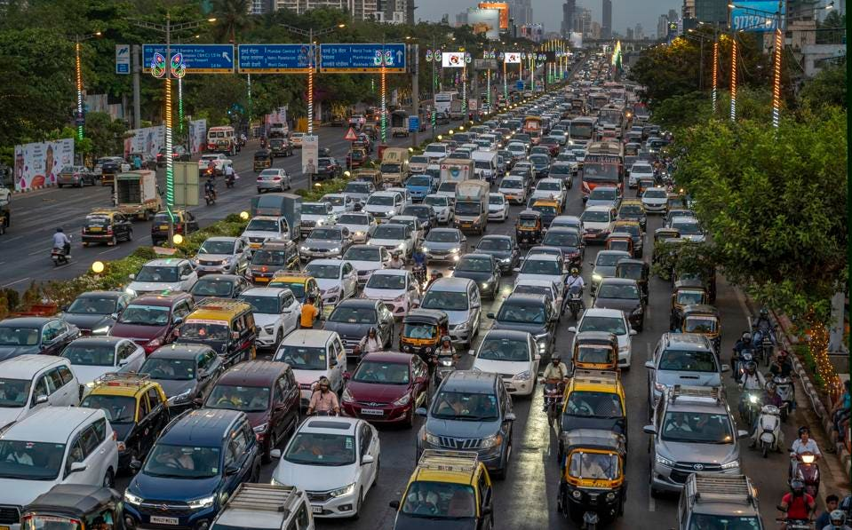
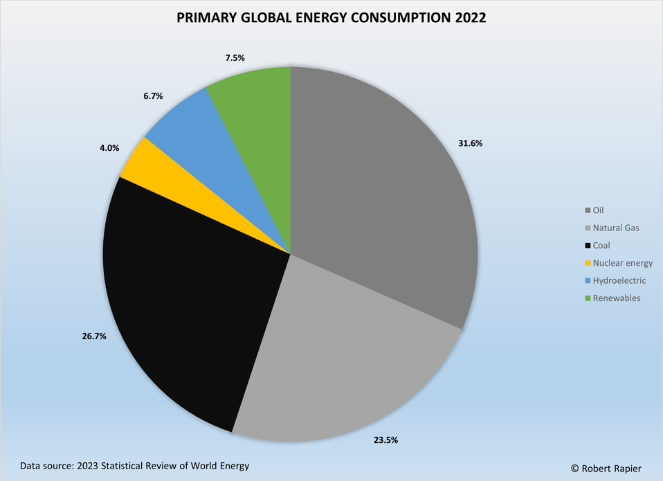

Глобальные энергетические тренды: выводы из статистического обзора
мировой энергетики за 2023 год

[**Роберт Рапье**](https://www.forbes.com/sites/rrapier/)

Старший контрибьютор

*Роберт Рапье — инженер-химик, работающий в энергетическом секторе.*

МУМБАИ, ИНДИЯ 19 МАЯ: Огромная пробка на Западном экспресс-шоссе вечером в Сантакрузе, ...

Как я указывал в [предыдущей
статье](https://www.forbes.com/sites/rrapier/2023/08/01/why-the-world-keeps-setting-global-carbon-emission-records/),
BP передала публикацию ежегодного Статистического обзора мировой
энергетики Энергетическому институту (EI). Статистический обзор играет
важную роль в предоставлении всеобъемлющих данных о мировой добыче и
потреблении нефти, газа и угля, а также о выбросах углекислого газа и
статистике возобновляемых источников энергии.

С полным отчетом и всеми данными можно ознакомиться по [этой
ссылке](https://www.energyinst.org/statistical-review/resources-and-data-downloads).
Сегодня я расскажу об основных моментах недавно опубликованного отчета
за 2023 год.

**Обзор**

Последний обзор показывает, что мир по-прежнему в значительной степени
зависит от ископаемого топлива для энергетических потребностей, даже
несмотря на то, что возобновляемые источники энергии, такие как
солнечная и ветровая, продолжают быстро расти.

В то время как возобновляемые источники энергии развивались рекордными
темпами, доля ископаемого топлива в общем потреблении первичной энергии
составила 82%. Спрос на природный газ и уголь практически не изменился,
а нефть восстановилась почти до допандемийного уровня. Для справки, этот
показатель снизился по сравнению с 87% в 2010 году. При таких темпах
снижения пройдет почти 200 лет, прежде чем потребление ископаемого
топлива достигнет нуля.

Потребление первичной мировой энергии в 2022 году (Роберт Рапье)

Мировой спрос на энергию вырос на 1,1% в 2022 году до нового рекорда, но
медленнее, чем рост на 5,5% в 2021 году. Это было связано с рядом
факторов, в том числе с войной в Украине, которая нарушила работу
энергетических рынков, и замедлением экономического роста в Китае.

Возобновляемые источники энергии продолжали активно развиваться, при
этом солнечная и ветровая энергия достигали 7,5% доли потребления
первичной энергии. Это почти на 1% больше, чем в предыдущем году.
Возобновляемая энергетика (без учета гидроэнергетики) выросла на 14% в
2022 году, что немного ниже темпов роста предыдущего года в 16%.

Мировой спрос на уголь в 2022 году вырос на 0,6%, достигнув самого
высокого уровня потребления угля с 2014 года. Рост в три раза превысил
средний темп роста за 10 лет, составлявший 0,2%. Рост спроса в
значительной степени был обусловлен Китаем (1%) и Индией (4%). Мировая
добыча угля увеличилась более чем на 7% по сравнению с 2021 годом,
достигнув рекордного уровня. На долю Китая, Индии и Индонезии пришлось
более 95% прироста мирового производства.

Спрос на нефть вырос на 3,1% в 2022 году, что также значительно
опережает средний показатель роста за 10 лет на 0,9%. Это было связано с
продолжающимся восстановлением экономики после Covid. Потребление
осталось на 0,7% ниже уровня 2019 года. Мировая добыча нефти увеличилась
на 3,8 млн баррелей в сутки (б/с) в 2022 году, при этом на долю ОПЕК+
пришлось более 60% прироста. Среди всех стран наибольший рост наблюдался
в Саудовской Аравии (1 182 000 баррелей в сутки) и США (1 091 000
баррелей в сутки).

Мировой спрос на природный газ в 2022 году снизился на 3%, опустившись
чуть ниже отметки в 4 трлн кубометров, впервые достигнутой в 2021 году.
Его доля в первичной энергетике в 2022 году незначительно снизилась до
24% (с 25% в 2021 году). Снижение было связано с рекордным уровнем цен в
Европе и Азии в 2022 году, который вырос почти в три раза в Европе и
удвоился на азиатском спотовом рынке СПГ. Цены на Henry Hub в США
выросли более чем на 50% и составили в среднем \$6,5/MMBtu в 2022 году,
что является самым высоким годовым уровнем с 2008 года.

Мировая выработка электроэнергии в 2022 году увеличилась на 2,3%, что
ниже темпов роста предыдущего года в 6,2%. Ветровая и солнечная энергия
достигли рекордного уровня в 12% производства электроэнергии, при этом
солнечная энергия зафиксировала 25%, а ветровая энергия — 13,5%.
Совокупная выработка энергии ветра и солнца в очередной раз превзошла
атомную энергию.

В 2022 году уголь оставался доминирующим топливом в мире для
производства электроэнергии, его доля составила около 35,4%, что немного
ниже 35,8% в 2021 году. Выработка электроэнергии на природном газе
оставалась стабильной в 2022 году с долей около 23%. Выработка
электроэнергии от атомной энергетики упала на 4,4%. Возобновляемые
источники энергии (за исключением гидроэнергетики) обеспечили 84%
чистого роста спроса на электроэнергию в 2022 году.

### Рекордно высокие выбросы углекислого газа

Между тем, выбросы углекислого газа от энергетики выросли на 0,9% до
нового максимума в 34,4 млрд метрических тонн, что указывает на
отсутствие прогресса в сокращении мирового производства углерода.
Выбросы еще дальше отошли от сокращений, предусмотренных Парижским
соглашением.

«Несмотря на дальнейший сильный рост ветровой и солнечной энергетики в
энергетическом секторе, общие глобальные выбросы парниковых газов,
связанные с энергетикой, снова увеличились», - сказала президент EI
Джульет Дэвенпорт. «Мы по-прежнему движемся в направлении,
противоположном тому, которого требует Парижское соглашение».

### Война в Украине привела к энергетическому кризису

Данные показывают глубокое влияние вторжения России в Украину на
энергетические рынки. Перебои с импортом энергоносителей в России
привели к резкому росту цен на природный газ и уголь до рекордно
высокого уровня в Европе и Азии. Мировой экспорт СПГ вырос, но не смог
компенсировать потерю поставок из России по трубопроводу в Европу. Цены
на нефть также подскочили, прежде чем снизиться.

Кризис заставил такие страны, как Германия, приостановить свои планы по
поэтапному отказу от угля, поскольку энергетическая безопасность стала
приоритетом над климатическими целями. Продолжающаяся зависимость Китая
и Индии от угля повысила спрос, несмотря на то, что Европа и Северная
Америка сократили потребление.

В 2022 году ветровая и солнечная энергия достигла рекордного прироста.
Тем не менее, это не повлияло на сокращение выбросов, поскольку
развивающиеся страны продолжают обращаться ко всем доступным источникам
энергии для стимулирования экономического роста.

Электромобили (EV) быстро распространяются, напрягая запасы ключевых
минералов, таких как литий и кобальт. Но мировые энергетические системы
все еще отстают в переходе от ископаемого топлива, вызывающего
потепление климата, говорится в выводах доклада. В Обзоре указано, что
для достижения нулевых выбросов к середине столетия необходим гораздо
больший прогресс.

В следующих нескольких статьях я углублюсь в статистику производства и
потребления по нескольким различным категориям энергии.

*Следите за мной
на [LinkedIn](https://www.linkedin.com/in/robert-rapier-10a7ab5/). Ознакомьтесь
с моим [сайтом](https://www2.investingdaily.com/glp-id-rapier/) или
некоторыми другими моими
работами [здесь](https://www.amazon.com/Power-Plays-Energy-Options-Peak/dp/1430240865/ref=sr_1_1?crid=2AZBSAJVXD5D7&keywords=robert+rapier+power+plays&qid=1687458033&sprefix=robert+rapier+power+plays%2Caps%2C134&sr=8-1).*
