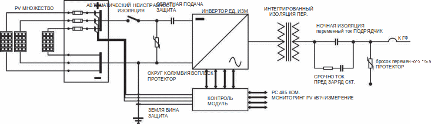
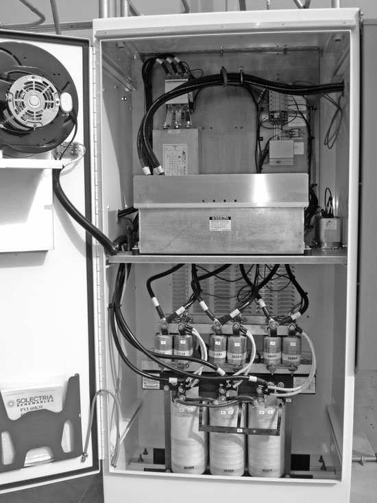
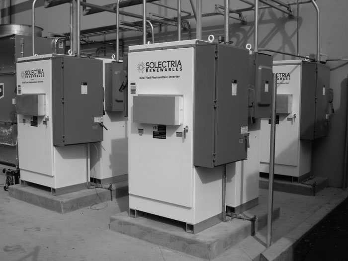

# Компоненты солнечной энергетической системы

ФЭ-модули (фотоэлектрические) представляют только базовый элемент солнечной энергетической системы. Они работают в сочетании с дополнительными компонентами, такими как аккумуляторы,инверторы и трансформаторы. Панели распределения энергии и измерительные системы делают процесс преобразования энергии целостным.

## Аккумуляторные батареи

Как упоминалось ранее, солнечные батареи — это устройства, которые просто преобразуют солнечную энергию в постоянное напряжение. Солнечные батареи не хранят энергию. Для хранения энергии при отсутствии дневного света, постоянное напряжение используется для заряда соответствующего комплекта батарей.

Резервная емкость аккумуляторов называется <i>автономией системы</i>. Она варьируется в соответствии с требованиями конкретных устройств. Батареи в системах, требующих некой автономии - критический компонент солнечной энергетической системы. Аккумуляторные блоки в ФЭ установках предназначены для работы при глубоком цикле разряда и, как правило, не требуют обслуживания.

Количество необходимого времени автономной работы зависит от конкретного приложения. Для сетевых нагрузок, таких как телекоммуникационные и удаленные станции телеметрии, может потребоваться 2 недели автономной работы, тогда как для жилого блока может потребоваться не более 12 часов. Аккумуляторы должны быть выбраны правильно, чтобы хранить достаточно энергии для ежедневного потребления. При расчете ампер-часов и емкости аккумулятора необходимо учитывать дополнительные факторы снижения номинальных характеристик, такие как облачность и отсутствие солнечного света.

В системах когенерации солнечной энергии при использовании аккумуляторных батарей для хранения электроэнергии, колебания мощности постоянного тока, создаваемые фотоэлектрическими системами, вызванные изменениями солнечного излучения, регулируются электронными устройствами, называемыми <i>регуляторами заряда</i>. Регуляторы заряда размещаются между выходом ФЭ и блоками аккумуляторов для регулирования величины электрического тока заряда, что защищает аккумуляторы от сверхзаряда.

## Инверторы

Как описано ранее, солнечные ФЭ панели генерируют постоянный ток, который может использоваться лишь ограниченным числом устройств. Большинство бытовых, коммерческих и промышленных устройств и приборов предназначены для работы с переменным током. Инверторы – это устройства, преобразующие постоянный ток в переменный. Хотя инверторы обычно разрабатываются для конкретных устройств, основные принципы преобразования остаются прежними. По сути, процесс инверсии состоит из следующего: в <i>процессе формирования волны</i> постоянный ток, характеризующийся непрерывным потенциалом между положительным и отрицательным узлами (смещением), по существу разбивается на равные сегменты, которые затем обрабатываются схемой, которая разделяет положительные и отрицательные значения части нарезанного шаблона, что приводит к шаблону формы волны, называемому <i>прямоугольной волной (меандром)</i>. На рис. 1 показана однолинейная схема инвертора.

Рис. 1 - Однолинейная ситема инвертора. Предоставлено SatCon, Канада

### Формирование волны или процесс фильтрации
Прямоугольная волна при математическом анализе (с помощью анализа рядов Фурье) состоит из комбинации очень большого числа синусоидальных (переменных) волновых структур, называемых <i>гармониками</i>. Каждая волновая гармоника имеет определенное количество циклов (паттернов подъема и падения в течение периода времени). Электронное устройство, называемое <i>дросселем</i> (магнитные катушки), фильтрует или пропускает гармоники частотой 60 Гц, которые составляют основу синусоидального тока. Твердотельные инверторы используют высокоэффективный метод преобразования, известный как <i>конструкция конверта</i>. Постоянный ток нарезается на мелкие участки, которые затем преобразуются в прогрессивно нарастающую (положительную) и спадающую (отрицательную) синусоидальную 60 Гц форму волны. Эта ступенчатая синусоидальная волна проходит через серию электронных фильтров, которые создают выходной ток с гладкой синусоидальной кривой.

### Системы релейной защиты
Как правило, большинство инверторов, используемых в ФЭ установках, построены из чувствительных полупроводниковых электронных устройств, которые очень чувствительны к внешним паразитным скачкам, коротким замыканиям нагрузки и перегрузкам по напряжению и току. Чтобы защитить оборудование от повреждений, инверторы включают в себя ряд электронных надстроек:
- Реле синхронизации
- Реле минимального напряжения
- Реле максимального тока
- Реле замыкания на землю или реле максимального тока
- Реле перенапряжения
- Реле максимальной частоты
- Реле пониженной частоты

Большинство инверторов, созданных для ФЭ установок, предназначены для одновременного включения нескольких блоков. Например, для поддержания нагрузки 60 кВт выходы трех инверторов мощностью 20 кВт могут быть соединены параллельно. В зависимости от требований энергосистемы инверторы могут производить однофазную или трехфазную мощность при любом требуемом напряжении или токовой нагрузке. Доступны стандартные выходы: однофазные 120 В переменного тока и трехфазные 120/208 и 277/480 В переменного тока. В некоторых случаях повышающие трансформаторы используются для преобразования выходного переменного тока 120/208 В инверторов в более высокое напряжение.

### Распределение входной и выходной мощности
Для защиты инверторов от паразитных скачков, возникающих в результате молнии или других подобных событий с высокой энергией, входы постоянного тока от ФЭ батарей защищены предохранителями, размещенными в распределительных коробках, расположенных в непосредственной близости от инверторов.
Кроме того, входные порты постоянного тока инвертора защищены различными типами полупроводниковых устройств, которые отсекают чрезмерно высокие пики напряжения, возникающие в результате грозовой активности.

Чтобы предотвратить повреждение, вызванное реверсированием напряжения, каждый положительный (+) выходной провод внутри фотоэлемента подключается к выпрямителю, однонаправленному элементу (с прямым смещением).
Выходная мощность переменного тока от инверторов подключается к нагрузкам с помощью электронных или магнитных выключателей. Они служат для защиты устройства от внешних перегрузок по току и коротких замыканий.

### Инверторы, подключенные к сети
Ранее я описал основные функции инверторов.
Здесь я рассмотрю их взаимосвязь с сетью, что требует глубокого понимания правил техники безопасности, установленных различными государственными органами. По сути, цель стандартов безопасности при проектировании инверторов, используемых в системах, подключенных к сети, независимо от того, используются ли они в ФЭ установках, ветряных турбинах, топливных элементах или любых других типах когенерационных систем, состоит в том, чтобы иметь единый набор руководящих принципов и стандартов для всей страны. Стандартные правила производства инверторов касаются таких вопросов, как рабочие характеристики и методы подключения к сети, и рекомендуются рядом национальных испытательных лабораторий и регулирующих органов.

### Стандарты Underwriters Laboratories
В целях обеспечения безопасности продукции представители отрасли в Соединенных Штатах совместно с Underwriters Laboratories (UL) разработали UL1741, стандарт для статических инверторов и контроллеров заряда для использования в независимых энергосистемах, который стал стандартом безопасности для инверторов, используемых в Соединенных Штатах. Стандарт UL1741 охватывает многие аспекты конструкции инверторов, включая корпуса, конфигурацию печатной платы, требования к межсетевому соединению, такие как величину постоянного тока, который инверторы могут подавать в сеть, общее гармоническое искажение (THD) выходного тока, реакцию инвертора на напряжение сети, пики и колебания, перезапуск и восстановление после ненормальных условий, а также реакцию на условия изоляции при отключении питания от сети.

Изолирование — это состояние, которое возникает, когда инвертор продолжает вырабатывать энергию во время отключения электроэнергии. В таких условиях мощность, вырабатываемая ФЭ системой, становится угрозой безопасности для работников коммунальных служб, которые могут непреднамеренно подвергнуться воздействию опасных электрических токов. Из-за этого инверторы должны включать схему управления, предотвращающую изолирование, чтобы отключить питание инвертора и отключить его от сети.

Защита от изолирования также предотвращает рассинхронизация фазы выходной мощности инвертора с сетью, когда автоматический защитный прерыватель повторно подключает инвертор к сети (что может привести к скачкам высокого напряжения, которые могут привести к повреждению преобразователя и вспомогательного оборудования). На рисунках 3.13 и 3.14 показана электроника инвертора Solectria Renewables и типичная установка.

Рис. 2 - Внутренний вид электроники инвертора. Фото
любезно предоставлено Solectria Renewables.

Рис. 3 - Внешний вид электроники инвертора. Фото
любезно предоставлено Solectria Renewables.

### Институт инженеров по электротехнике и электронике
Институт инженеров по электротехнике и радиоэлектронике (IEEE) предлагает клиентам и коммунальным службам предложения относительно контроля гармоник мощности и мерцания напряжения, которые часто возникают на коммунальных шинах, в своем руководстве IEEE 929 (не стандарт), Рекомендуемая практика для интерфейса коммунальных сетей. фотоэлектрических (ФЭ) систем. Чрезмерный гармонический поток мощности и колебания мощности от коммунальных шин могут повредить оборудование клиента. Поэтому ряд штатов, включая Калифорнию, Делавэр, Нью-Йорк и Огайо, специально требуют, чтобы инверторы были рассчитаны на работу в ненормальных условиях электроснабжения.

### Условия ограничения мощности
Максимальный размер системы когенерации ФЭ энергии зависит от ограничений, налагаемых различными государствами. По сути, большинство коммунальных предприятий обеспокоены крупными источниками электроэнергии, подключенными к частной сети, поскольку большинство распределительных систем рассчитаны на однонаправленный поток энергии. С другой стороны, добавление крупной когенерационной системы создает условия двунаправленного тока в сети, что в некоторых случаях может снизить надежность инженерной сети. Однако хорошо известно, что на практике небольшое количество когенерируемой энергии обычно не создает достаточно значительных помех в сети, чтобы вызывать беспокойство. Чтобы регулировать максимальный размер системы когенерации, в ряде штатов установлены различные ограничения и ограничения для систем, генерирующих мощность более 100 кВт.

## Разъединители и разъединительные трансформаторы на стороне потребителя

В некоторых штатах, таких как Калифорния, Делавэр, Флорида, Нью-Гемпшир, Огайо и Вирджиния, регулирующие органы требуют, чтобы видимые и доступные разъединители устанавливались снаружи для изоляции сети. Следует отметить, что некоторые штаты, включая Калифорнию, требуют, чтобы клиенты размыкали разъединители раз в 4 года, чтобы убедиться, что инверторы выполняют требуемую защиту от изолирования.

В других штатах, таких как Нью-Мексико и Нью-Йорк, трансформаторы, изолирующие сеть, необходимы для снижения шума, создаваемого частными потребителями, который может накладываться на сеть. Это требование, однако, не является регламентом, установленным UL или Федеральной комиссией по связи (FCC).

### Когенерационные мощности фотоэлектрической энергии
Чтобы защитить нормы работы коммунальных предприятий, ряд штатов ввели ограничение на максимальное количество энергии, которое может быть выработано фотоэлектрическими системами. Например, в Нью-Гемпшире максимальное значение ограничено до 0,05%, а в Колорадо — до 1% от месячного пикового спроса сети.

### Способность инвертора выдерживать скачки напряжения
В большинстве случаев распределение электроэнергии осуществляется через сеть воздушных линий, которые постоянно подвергаются климатическим воздействиям, таким как молнии, которые приводят к скачкам напряжения. Дополнительные скачки напряжения также могут быть вызваны коммутационными батареями конденсаторов, используемыми для коррекции коэффициента мощности, оборудованием преобразования мощности, а также во время сброса и переключения нагрузки. Возникающие в результате скачки напряжения, если их не ограничить, могут серьезно повредить инверторное оборудование, разрушив изоляцию проводников и электронные устройства.

Чтобы предотвратить ущерб, вызванный скачками напряжения в сети, IEEE разработала национальные рекомендации для производителей инверторов по обеспечению надлежащей защиты от перенапряжения.
Серия тестов, разработанных для проверки рекомендаций IEEE по устойчивости к перенапряжениям, проводится UL в рамках одобрения оборудования.

### Журнал тестирования и технического обслуживания фотоэлектрической системы
В некоторых штатах, в том числе в Калифорнии, Вермонте и Техасе, требуется проведение комплексных пуско-наладочных испытаний системных интеграторов фотоэлектрических систем, чтобы удостовериться, что система работает в соответствии с ожидаемыми условиями проектирования и производительности. Интересно отметить, что для фотоэлектрических систем, установленных в штате Техас, необходимо вести журнал всех выполненных работ по техническому обслуживанию.

### Примеры спецификации инвертора UL1741
Ниже приведен пример одобренного UL1741 инвертора производства SatCon, Канада. Дополнительный блок сумматора, который включает в себя набор специальных керамических предохранителей для защиты от перегрузки по току, подает накопленный постоянный ток на инвертор. На входе постоянного тока инвертор оснащен схемой автоматической изоляции тока неисправности, устройством защиты от перенапряжения постоянного тока и прерывателем защиты от обратного тока постоянного тока. В дополнение к предыдущему инвертор имеет специальную электронную схему, которая постоянно отслеживает замыкания на землю и обеспечивает мгновенную локализацию неисправности. При преобразовании постоянного тока в переменный внутренняя электроника инвертора обеспечивает точную синхронизацию напряжения и частоты с сетью.

Встроенный в инвертор изолирующий трансформатор обеспечивает полную шумоизоляцию и фильтрацию выходной мощности переменного тока. Контактор переменного тока ночной изоляции отключает инвертор ночью или в условиях сильной облачности. Выход инвертора также включает в себя изолятор перенапряжения переменного тока и ручной автоматический выключатель, который может отключать оборудование от сети.

Микропроцессорная система управления в инверторе включает в себя, в дополнение к построению огибающей формы сигнала и алгоритмам фильтрации, ряд подмножеств программ, которые выполняют защиту от изолирования, управление напряжением и частотой.

В качестве дополнительной функции преобразователь также может обеспечивать передачу данных посредством интерфейса RS 485. Интерфейс RS 485 может передавать рабочие параметры оборудования и измеренные ФЭ параметры, такие как выходная ФЭ мощность, напряжение, ток и суммарные данные измерений в киловатт-часах для удаленного мониторинга и отображения.
