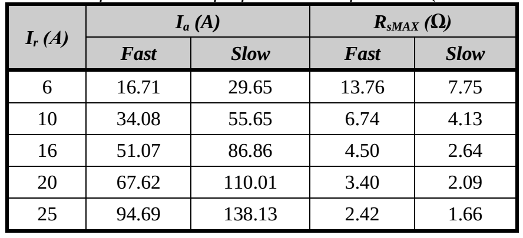

# Новый метод обнаружения плохих электрических контактов в низковольтных электроустановках, характеризующихся системой защиты TN – полевая проверка в жилых зданиях

<i>Nedzad Hadziefendic, Jovan Trifunovic, Nemanja Kostic, Marko Davidovic, Miomir Kostic</i>

<i>Школа электротехники Белградского университета, Белград, Сербия</i>

E-mail: nedzad@etf.bg.ac.rs, jovan.trifunovic@etf.bg.ac.rs, nmkostic@etf.bg.ac.rs, mdavidovic@etf.bg.ac.rs, kostic@etf.bg.ac.rs

Аннотация: Разработанный
ранее новый метод обнаружения плохих
электрических контактов в низковольтных
электроустановках, характеризующихся
системой защиты TN, прошел полевую проверку измерениями,
выполненными в
жилых домах. Метод был разработан путем
установления зависимости между
измеренными сопротивлениями контура
короткого замыкания фазы на землю и
фазы на нейтраль и степенью износа
контакта, т. е. увеличением его
электрического сопротивления. Корреляция
была установлена путем анализа данных,
полученных из большого количества
документов, связанных с периодическими
проверками качества низковольтных
электроустановок в производственных
и административных объектах (выданных
Лабораторией испытаний низковольтных
электроустановок и молниезащиты в
Школе электротехники в Белграде), а
также данными, полученными в результате
большого количества экспериментов, в
которых анализировалось влияние плохих
электрических контактов на возникновение
«горячих» точек в низковольтных
электроустановках. В этих опытах
учитывалось влияние неполного перекрытия
поверхности медного проводника и
контактной поверхности на выводе
электрического компонента (уменьшение
контактной поверхности), уменьшение
силы давления между контактными
поверхностями медного проводника и
винта клеммы электрического компонента
(уменьшение крутящего момента), а также
повышенный оксидный слой в месте
электрического контакта (старый и/или
коррозионно-поврежденный контакт) на
электрические и тепловые характеристики
электрических контактов.

Ключевые слова: ПЛОХОЙ ЭЛЕКТРИЧЕСКИЙ КОНТАКТ,
МОМЕНТ ЗАТЯЖКИ КОНТАКТА, ГОРЯЧАЯ ТОЧКА,
ОГНЕОПАСНОСТЬ, СОПРОТИВЛЕНИЕ КОНТАКТА,
ПЕРИОДИЧЕСКАЯ ПРОВЕРКА НИЗКОГО НАПРЯЖЕНИЯ
ЭЛЕКТРИЧЕСКОЙ УСТАНОВКИ

## 1. Введение

Отказы в электроустановках представляют собой
серьезную проблему пожарной безопасности,
которую необходимо активно учитывать
во многих областях человеческой
деятельности [1–3]. Частыми видами таких
отказов являются накальные соединения
и последовательная дуга, которые обычно
возникают из-за перегрева некачественных
электрических соединений, характеризующихся
высоким электрическим сопротивлением
[4]. Как и во многих других областях
техники [5, 6], существует постоянная
потребность в инновациях при разработке
более эффективных методов и устройств
в области электроустановок с точки
зрения пожарной безопасности. В недавних
исследованиях усилия исследователей
были направлены на разработку новых
методик и алгоритмов обнаружения
возникновения последовательной дуги
в электрических цепях [7–10], а также
совершенствование методов измерения
импеданса контура КЗ в сетях низкого
напряжения TN [11]. В статье описан новый
метод, разработанный для обнаружения
плохих электрических контактов в
низковольтных электроустановках,
характеризующихся системой защиты TN.

Плохой электрический контакт — отказ в
низковольтных электроустановках,
который не может быть обнаружен ни
процедурами периодической проверки
качества низковольтных электроустановок,
определенными в национальных и
международных нормах и стандартах, ни
любыми обычными защитными устройствами
[12–14]. В то же время он может легко и
внезапно вызвать горячую точку или
последовательную электрическую дугу,
которые являются наиболее частыми
причинами пожаров, вызванных авариями
в низковольтных электроустановках.

В электроустановке плохой электрический
контакт можно рассматривать как
характеризующийся [15]:

- неполным перекрытием поверхности медного
проводника и контактной поверхности
на выводе электрического компонента
(уменьшение контактной поверхности),
- уменьшением силы давления между
контактными поверхностями медного
проводника и винта клеммы электрического
компонента (уменьшение крутящего
момента), или
- повышенным оксидным слоем в месте
электрического контакта (старый и/или
поврежденный коррозией контакт).

Эффекты уменьшения контактной поверхности,
уменьшения крутящего момента и увеличения
оксидного слоя в точке электрического контакта
на электрическое и тепловое поведение
плохого контакта были экспериментально
и теоретически исследованы в [16], [17] и
[4] соответственно. На основании большого
количества экспериментов, а также
данных, полученных из большого количества
документов, связанных с периодическими
проверками качества низковольтных
электроустановок на промышленных и
административных объектах (выданных
Лабораторией испытаний низковольтных
электроустановок и молниезащиты в
Электротехнической школе в Белграде)
был разработан и представлен в [4] и [15]
новый метод обнаружения плохих
электрических контактов в низковольтных
электроустановках, характеризующихся
системой защиты TN.

## 2. Разработка нового метода выявления бедных электрические контакты в низковольтных электроустановках, характеризующихся системой защиты ТН

### 2.1 Основная идея разработки нового метода для обнаружения плохих электрических контактов

Действующая стандартная процедура проверки качества
низковольтных электроустановок [18]
основана на сравнении измеренного
сопротивления фазы к земле с предельным
значением, обеспечивающим достаточно
быстрое срабатывание соответствующего
защитного устройства (для предотвращения
поражение электрическим током) [19].
Поскольку предельные значения высоки,
все электрические цепи, в которых
измеренное сопротивление фазы
относительно земли ниже предельного
значения (<i>RsMAX</i>) заявлены как исправные,
хотя некоторые из них могут содержать
плохой контакт.

Идея состояла в том, чтобы разработать
процедуру обнаружения плохих контактов
в розетках, основанную на измерении
сопротивлений короткого замыкания как
фазы на землю, так и фазы на нейтраль
при периодической проверке низковольтных
электроустановок. Обнаружение заметного
увеличения импеданса контура замыкания
на землю и/или контура короткого замыкания
фазы на нейтраль указывает на наличие
по крайней мере одного плохого контакта
в наблюдаемой электрической цепи.

Согласно [20], обычно применяемая (традиционная)
измерительная аппаратура для поверок
низковольтных электроустановок позволяет
измерять оба этих импеданса. Схематическое
представление измерений контура
замыкания на землю (L-PE) и измерения
импеданса контура короткого замыкания
(LN) между фазой и нейтралью с использованием
обычного измерительного устройства
приведены на рис. 1 и 2 соответственно.

Сопротивление
фазы к земле (<i>RSL-PE</i>) в системе TN состоит
из сопротивления вторичной обмотки
силового трансформатора, сопротивления
фазного провода между силовым
трансформатором и местом проведения
испытаний и сопротивления заземляющего
проводника оборудования между местом
испытания и силовым трансформатором.
Сопротивление петли короткого замыкания
фазы на нейтраль (<i>RSL-N</i>) в системе TN
состоит из сопротивления вторичной
обмотки силового трансформатора,
сопротивления фазного проводника между
силовым трансформатором и местом
проведения испытаний и сопротивления
нейтрального проводника между местом
испытания и силовым трансформатором.

</img>

Рис. 1 Схематическое представление измерения
<i>RSL-PE</i> используя обычное измерительное
оборудование (<i>Re</i> представляет собой
внутреннее электрическое сопротивление
измерительного оборудования).

</img>

Рис. 2 Схематическое представление измерения
<i>RSL-N</i> с помощью обычного измерительного
оборудования.

## 2.2 Данные, полученные из большого количества документов связанные с периодическими проверками качества низковольтных электроустановок

Как сообщается в [4], были проанализированы результаты периодических
проверок низковольтных электроустановок,
выполненных Лабораторией в общественных
и коммерческих зданиях общей площадью
более 150 000 м2.
Измеренный <i>RSL-PE</i> значения для 11 159 розеток
были подвергнуты статистическому
анализу, и их статистическое распределение
представлено на рис. 3, на котором показано
количество розеток, для которых <i>RSL-PE</i>
сопротивления принадлежали каждому из
диапазонов 0–0,1 Ом, 0,1–0,2 Ом,…, 1,1–1,2 Ом
и 1,2–1,3 Ом. Количество емкостей, для
которых <i>RSL-PE</i> сопротивление выше 1,3 Ом
(1,5 % от их общего числа) на рис. 3 не
показаны, так как их сопротивления
разбросаны в диапазоне 1,31–7,68 Ом.

</img>

Рис. 3  Количество розеток, для которых <i>RSL-PE</i>
принадлежат каждому из диапазонов
шириной 0,1 Ом. [4]

В [4] было отмечено, что большинство
измеренных <i>RSL-PE</i> сопротивлений находились
в диапазоне 0,3–1 Ом, подчеркивая, что
значения ниже 0,3 Ом были измерены в
случаях, когда трансформаторная
подстанция ВН/НН располагалась внутри
здания или вблизи него, а также для
электрических цепей на нижних этажах
здания, а значения выше 1 Ом были измерены
для электрических цепей на верхних
этажах, т.&nbsp;к. <i>RSL-PE</i> увеличивается с
расстоянием между электрической цепью
и трансформаторной станцией.  В [4] также
сообщалось, что на 82 розетках <i>RSL-PE</i>
сопротивления выше соответствующих <i>RsMAX</i> значения
были измерены (в этих розетках <i>RSL-PE</i>
сопротивления варьировались от 1,79 Ом
до 7,68 Ом). Эти схемы были признаны
непригодными к использованию, так как
не были соблюдены условия предотвращения
поражения электрическим током. Кроме
того, помимо 11 159 розеток, для которых
<i>RSL-PE</i> значений, в 84 розетках было обнаружено
обрыв заземляющего проводника
оборудования, которые также были признаны
непригодными для использования. После
подтяжки всех электрических контактов
в этих 166 розетках (или после замены
розеток), а также подтяжки всех
электрических контактов в питающих
распределительных щитах, <i>RSL-PE</i> сопротивления
были измерены повторно, и во всех случаях
их значения были не только ниже <i>RsMAX</i>,
но и ниже 1,3 Ом.

Однако, как сообщается в [4], в дополнение к 166
розеткам с неисправностями, обнаруженными
по стандартной процедуре, было еще 84
розетки, где <i>RSL-PE</i> сопротивления были
ниже <i>RsMAX</i>, но достаточно высокий,
чтобы указать на наличие хотя бы одного
плохого контакта (в тех розетках <i>RSL-PE</i>
сопротивления варьировались от 1,3 Ом
до 4,38 Ом). В соответствии со стандартной
процедурой, хотя электрические цепи,
содержащие эти розетки, представляют
собой потенциальную причину пожара,
они должны быть признаны исправными.
Тем не менее, пользователи объектов
были проинструктированы о проведении
необходимого ремонта, и после подтяжки
всех электрических контактов во всех
этих случаях <i>RSL-PE</i> сопротивление было
ниже 1,3 Ом. Помимо дополнительных 84
розеток, плохие контакты были также
обнаружены в розетках, где <i>RSL-PE</i> был ниже
1,3 Ом, но более чем на 0,5 Ом выше, чем
<i>RSL-PE</i> сопротивления, измеренные на
окружающих розетках.

### 2.3 Данные, полученные с помощью большого количества экспериментов

Как упоминалось ранее, влияние уменьшения
контактной поверхности, уменьшения
крутящего момента и увеличения оксидного
слоя в точке электрического контакта
на электрические и тепловые характеристики
плохого контакта экспериментально и
теоретически исследовалось в [16], [16].
17] и [4] соответственно.

Основной идеей всех проведенных экспериментов
было создание различных типов контактов,
встречающихся в низковольтных
электроустановках, установление типовых
токов (в проведенных опытах они составляли
от 2 А до 25 А) в цепях, содержащих созданные
контактов и наблюдать за изменяющимися
во времени значения электрического
сопротивления, температуры, рассеиваемой
мощности и напряжения создаваемых
контактов. Были созданы различные типы
контактов с использованием различных
комбинаций материалов (медь–медь,
медь–латунь и медь–нержавеющая сталь),
одножильных и многожильных проводов
различного сечения (1,5 мм2, 2,5 мм2и 4 мм2),
различные проценты площади перекрытия
электродов, образующих контакт (100 %, 50
% и 15 %), и различные регулируемые крутящие
моменты на винтовых зажимах другого
провода в розетках и вилках (1 Н·м (очень
хороший контакт), 0,2 Н·м (плохой контакт)
или 0,1 Н·м (очень плохой контакт)). Кроме
того, в экспериментах использовались
контакты с различными типами увеличенного
оксидного слоя в месте электрического
контакта. Эксперименты проводились на
розетке, бывшей в эксплуатации много лет
(30 лет в анализируемом случае), а также
на новых розетках, электрические контакты
которых перед экспериментами преднамеренно
подвергались коррозии. Экспериментальная
установка и используемое измерительное
оборудование показаны на рис. 4.

</img>

Рис. 4 Экспериментальная установка (1 –
испытуемая розетка, 2 – токоизмерительные
клещи FLUKE 323, 3 – цифровой мультиметр
PeakTech 3360, 4 – пластиковый распределительный
щит, 5 – тестер установки FLUKE 1653B, 6 –
датчик термопары типа К (хромель/алюмель),
7 – термометр инфракрасный Cole-Parmer, 8 –
коробка сопротивлений 230 В, 60 А, 9 – аппарат,
обеспечивающий регулировку площади
перекрытия электродов, 10 – динамометрическая
механическая отвертка Wiha TorqueVario-S26462, и
11 – динамометрическая цифровая отвертка
TSD- 50).

Анализируя результаты проведенных экспериментов,
сделан вывод, что медь – нержавеющая
сталь представляет собой критическую
комбинацию материалов, при которой
контакт наиболее быстро достигает
максимально допустимой температуры
при одинаковых условиях (одинаковая
нагрузка, сечение проводника и степень
износа контакта). В пересчете на такое
же процентное уменьшение поверхности
перекрытия) [16]. Кроме того, сделан вывод,
что плохие электрические контакты,
образующиеся во встроенных электроустановках
зданий (где распространена медная жила
полного сечения), более неблагоприятны
для возникновения «горячей» точки по
сравнению с плохими электрическими
контактами. развиты в силовых кабелях
электрических нагрузок (где обычно
используется многопроволочная медная
жила) [17]. В работе [17] показано, что плохие
контакты с электрическим сопротивлением
от 80 мОм до 250 мОм представляют угрозу
безопасности при больших токах в цепи
(ток 16 А, ограниченный применяемым
защитным устройством, как правило,
является максимальным). номинальный
ток в электрических цепях, установленных
в жилых, хозяйственных и общественных
зданиях, подключенных к сети с номинальным
напряжением 230 В). С учетом всех данных,
полученных в результате периодических
проверок качества низковольтных
электрических установках, а также все
данные, полученные в результате
экспериментов, в [4] сделан вывод, что
предел для <i>RSL-PE</i> сопротивление (указывающее
на наличие хотя бы одного плохого
контакта в электрической цепи) (<i>Rlim</i>)
должен быть на 0,5 Ом выше максимального
<i>RSL-PE</i> сопротивления,
измеренного на окружающих розетках при
периодической проверке низковольтных
электроустановок.

## Новый метод обнаружения плохой электрической контакты в низковольтных электроустановках

Измерения
<i>RSL-PE</i> и <i>RSL-N</i>, с последующим сравнением их
значений с <i>Rlim</i> и анализ, основанный на
таблицах 1–3, представляют собой новый
метод обнаружения плохих контактов в
низковольтных электроустановках,
разработанный и представленный в [4] и
[15].  В таблицах 1 и 2 приведены максимальные
сопротивления фазы относительно земли,
обеспечивающие эффективное срабатывание
устройства защиты при отказе в системе
TN (<i>RsMAX</i>), определяемые для наиболее
часто применяемых плавких вставок (как
быстродействующих, так и медленных) и
автоматических выключателей (МВР) типов
В и С (с номинальными токами (<i>Iа</i>) 6–25 А)
соответственно. Во всех случаях значение
<i>RsMAX</i> был получен путем деления значения
номинального напряжения сети (230 В) на
соответствующее значение <i>Iа</i>(минимальный
ток, при котором срабатывает устройство
защиты в течение 0,4 с (условие приведено
в [19])). Для каждой из рассматриваемых
плавких вставок значение <i>Iа</i> была взята
из соответствующей характеристики
перегрева плавкой вставки [21]. Согласно
[22], минимальные токи МСВ (<i>Iа</i>), на которые
плавкие вставки реагируют в течение
0,1 с (и, следовательно, в течение 0,4 с),
составляют 5<i>Iа</i> и 10<i>Iа</i> для типов В и С
соответственно.  В Таблице 3 приведены
рекомендации по потенциальному
местонахождению плохих контактов и
возможных опасностей возгорания во
всех ситуациях, которые могут возникнуть
на практике. Его следует применять при
измерении <i>RSL-PE</i> сопротивление ниже, чем
<i>RsMAX</i> (в противном случае соответствующую
цепь следует признать небезопасной).

Поэтому, измеряя <i>RSL-PE</i> и
<i>RSL-N</i> значений в каждой
цепи с последующим сравнением их значений
с <i>Rlim</i> и анализа по таблицам 1–3 можно
определить, есть ли в цепи плохой контакт.

Таблица
1: Значения <i>Ia</i> и <i>RsMAX</i> для быстрых и
медленных плавких вставок (<i>Ir</i> = 6–25 А) [4]

</img>

Таблица
2: Значения <i>Ia</i> и <i>RsMAX</i> для автоматических
выключателей типов В и С (<i>Ir</i> = 6–25 А) [4]

</img>

<table width=700px cellpadding="2" cellspacing="0" style="margin: auto; text-align: center; vertical-align: center">
	<caption>Таблица
3: Анализ сопротивления контура в случаях,
когда измеренное <i>RSL-PE</i> сопротивление
ниже максимального значения сопротивления
фазы относительно земли (<i>RsMAX</i>), что
обеспечивает эффективное срабатывание
устройства защиты [4]</caption>
	<col width="15%"/>
	<col width="15%"/>
	<col width="15%"/>
	<col width="15%"/>
	<col />
	<tr valign="top">
		<td rowspan="2" style="border-top: 1px solid #000; border-bottom: 1px solid #000; border-left: 1px solid #000">
		</td>
		<td style="border-top: 1px solid #000; border-bottom: 1px solid #000; border-left: 1px solid #000">
			<i>RSL-PE</i>&lt;<i>Rlim</i>
		</td>
		<td style="border-top: 1px solid #000; border-bottom: 1px solid #000; border-left: 1px solid #000">
			<i>RSL-PE</i>&gt; <i>Rlim</i>
		</td>
		<td style="border-top: 1px solid #000; border-bottom: 1px solid #000; border-left: 1px solid #000">
			<i>RSL-PE</i>&lt;<i>Rlim</i>
		</td>
		<td style="border: 1px solid #000">
			<i>RSL-PE</i>&gt; <i>Rlim</i>
		</td>
	</tr>
	<tr valign="top">
		<td style="border-bottom: 1px solid #000; border-left: 1px solid #000">
			<i>RSL-N</i>&lt;<i>Rlim</i>
		</td>
		<td style="border-bottom: 1px solid #000; border-left: 1px solid #000">
			<i>RSL-N</i>&lt;<i>Rlim</i>
		</td>
		<td style="border-bottom: 1px solid #000; border-left: 1px solid #000">
			<i>RSL-N</i>&gt; <i>Rlim</i>
		</td>
		<td style="border-bottom: 1px solid #000; border-left: 1px solid #000; border-right: 1px solid #000">
			<i>RSL-N</i>&gt; <i>Rlim</i>
		</td>
	</tr>
	<tr valign="top">
		<td style="border-bottom: 1px solid #000; border-left: 1px solid #000">
			Расположение плохая электрика контакт
		</td>
		<td style="border-bottom: 1px solid #000; border-left: 1px solid #000">

			Электрическая цепь скорее всего не плохой электрический контакт

		</td>
		<td style="border-bottom: 1px solid #000; border-left: 1px solid #000">

			Плохой электрический контакт на оборудовании заземлитель

		</td>
		<td style="border-bottom: 1px solid #000; border-left: 1px solid #000">

			Плохой электрический контакт на нейтрали проводник

		</td>
		<td style="border-bottom: 1px solid #000; border-left: 1px solid #000; border-right: 1px solid #000">
			-плохой электрический контакт на фазном проводе, или 
			- плохой электрический контакт на двух проводниках (возможны все три комбинации), или 
			- плохие электрические контакты на всех трех проводниках (наихудший случай)
		</td>
	</tr>
	<tr valign="top">
		<td style="border-bottom: 1px solid #000; border-left: 1px solid #000">
			Опасность пожара (последствия неисправность)
		</td>
		<td style="border-bottom: 1px solid #000; border-left: 1px solid #000">
			Вероятно, не существуют
		</td>
		<td style="border-bottom: 1px solid #000; border-left: 1px solid #000">
			Нет (в случае отказа устройство защиты отвечает в пределах безопасного интервала)
		</td>
		<td style="border-bottom: 1px solid #000; border-left: 1px solid #000">
			Возможно, из-за перегрева на нейтральном проводе
		</td>
		<td style="border-bottom: 1px solid #000; border-left: 1px solid #000; border-right: 1px solid #000">
			Возможно, из-за перегрева на фазном
			и/или нулевом проводе (в случае
			неисправности устройство защиты
			срабатывает в пределах безопасного
			интервала)
		</td>
	</tr>
</table>

<table width=900px cellpadding="2" cellspacing="0"  style="margin: auto; text-align: center; vertical-align: center">
	<caption>Таблица
4: Результаты измерений, полученных при
проверках качества низковольтных
электроустановок в квартирах жилых
домов разного возраста (10–60 лет) по
новой методике. *Примечание: значения
измеренного сопротивлениядо
послевмешательство электрика и устранение
неисправности.</caption>
	<col width="7%*"/>
	<col width="7%*"/>
	<col />
	<col width="7%*"/>
	<col width="7%*"/>
	<col width="7%*"/>
	<col width="7%*"/>
	<col width="7%*"/>
	<col width="7%*"/>
	<col width="7%*"/>
	<col width="7%*"/>
	<col width="7%*"/>
	<col width="7%*"/>
	<tr valign="top">
		<td rowspan="2" style="border-top: 1px solid #000; border-bottom: 1px solid #000; border-left: 1px solid #000">
			Количество плоский
		</td>
		<td rowspan="2" style="border-top: 1px solid #000; border-bottom: 1px solid #000; border-left: 1px solid #000">
			Возраст здания (годы)
		</td>
		<td rowspan="2" style="border-top: 1px solid #000; border-bottom: 1px solid #000; border-left: 1px solid #000">
			Измерение
		</td>
		<td colspan="10" style="border: 1px solid #000">
			№ розетки
		</td>
	</tr>
	<tr valign="top">
		<td style="border-bottom: 1px solid #000; border-left: 1px solid #000">
			1
		</td>
		<td style="border-bottom: 1px solid #000; border-left: 1px solid #000">
			2
		</td>
		<td style="border-bottom: 1px solid #000; border-left: 1px solid #000">
			3
		</td>
		<td style="border-bottom: 1px solid #000; border-left: 1px solid #000">
			4
		</td>
		<td style="border-bottom: 1px solid #000; border-left: 1px solid #000">
			5
		</td>
		<td style="border-bottom: 1px solid #000; border-left: 1px solid #000">
			6
		</td>
		<td style="border-bottom: 1px solid #000; border-left: 1px solid #000">
			7
		</td>
		<td style="border-bottom: 1px solid #000; border-left: 1px solid #000">
			8
		</td>
		<td style="border-bottom: 1px solid #000; border-left: 1px solid #000">
			9
		</td>
		<td style="border-bottom: 1px solid #000; border-left: 1px solid #000; border-right: 1px solid #000">
			10
		</td>
	</tr>
	<tr valign="top">
		<td rowspan="2" style="border-bottom: 1px solid #000; border-left: 1px solid #000">
			1
		</td>
		<td rowspan="2" style="border-bottom: 1px solid #000; border-left: 1px solid #000">
			10
		</td>
		<td style="border-bottom: 1px solid #000; border-left: 1px solid #000">
			<i>RSL-PE</i>(Ом)
		</td>
		<td style="border-bottom: 1px solid #000; border-left: 1px solid #000">
			0,47
		</td>
		<td style="border-bottom: 1px solid #000; border-left: 1px solid #000">
			0,46
		</td>
		<td style="border-bottom: 1px solid #000; border-left: 1px solid #000">
			0,48
		</td>
		<td style="border-bottom: 1px solid #000; border-left: 1px solid #000">
			0,47
		</td>
		<td style="border-bottom: 1px solid #000; border-left: 1px solid #000">
			0,48
		</td>
		<td style="border-bottom: 1px solid #000; border-left: 1px solid #000">
			0,49
		</td>
		<td style="border-bottom: 1px solid #000; border-left: 1px solid #000">
			0,50
		</td>
		<td style="border-bottom: 1px solid #000; border-left: 1px solid #000">
			0,49
		</td>
		<td style="border-bottom: 1px solid #000; border-left: 1px solid #000">
			0,48
		</td>
		<td style="border-bottom: 1px solid #000; border-left: 1px solid #000; border-right: 1px solid #000">
			0,48
		</td>
	</tr>
	<tr valign="top">
		<td style="border-bottom: 1px solid #000; border-left: 1px solid #000">
			<i>RSL-N</i>(Ом)
		</td>
		<td style="border-bottom: 1px solid #000; border-left: 1px solid #000">
			0,45
		</td>
		<td style="border-bottom: 1px solid #000; border-left: 1px solid #000">
			0,45
		</td>
		<td style="border-bottom: 1px solid #000; border-left: 1px solid #000">
			0,47
		</td>
		<td style="border-bottom: 1px solid #000; border-left: 1px solid #000">
			0,46
		</td>
		<td style="border-bottom: 1px solid #000; border-left: 1px solid #000">
			0,46
		</td>
		<td style="border-bottom: 1px solid #000; border-left: 1px solid #000">
			0,47
		</td>
		<td style="border-bottom: 1px solid #000; border-left: 1px solid #000">
			0,48
		</td>
		<td style="border-bottom: 1px solid #000; border-left: 1px solid #000">
			0,47
		</td>
		<td style="border-bottom: 1px solid #000; border-left: 1px solid #000">
			0,46
		</td>
		<td style="border-bottom: 1px solid #000; border-left: 1px solid #000; border-right: 1px solid #000">
			0,46
		</td>
	</tr>
	<tr valign="top">
		<td rowspan="2" style="border-bottom: 1px solid #000; border-left: 1px solid #000">
			2
		</td>
		<td rowspan="2" style="border-bottom: 1px solid #000; border-left: 1px solid #000">
			10
		</td>
		<td style="border-bottom: 1px solid #000; border-left: 1px solid #000">
			<i>RSL-PE</i>(Ом)
		</td>
		<td style="border-bottom: 1px solid #000; border-left: 1px solid #000">
			0,49
		</td>
		<td style="border-bottom: 1px solid #000; border-left: 1px solid #000">
			0,46
		</td>
		<td style="border-bottom: 1px solid #000; border-left: 1px solid #000">
			1. 48
		</td>
		<td style="border-bottom: 1px solid #000; border-left: 1px solid #000">
			1,23!/0,49*
		</td>
		<td style="border-bottom: 1px solid #000; border-left: 1px solid #000">
			0,48
		</td>
		<td style="border-bottom: 1px solid #000; border-left: 1px solid #000">
			0,49
		</td>
		<td style="border-bottom: 1px solid #000; border-left: 1px solid #000">
			0,48
		</td>
		<td style="border-bottom: 1px solid #000; border-left: 1px solid #000">
			0,49
		</td>
		<td style="border-bottom: 1px solid #000; border-left: 1px solid #000">
			0,51
		</td>
		<td style="border-bottom: 1px solid #000; border-left: 1px solid #000; border-right: 1px solid #000">
			0,50
		</td>
	</tr>
	<tr valign="top">
		<td style="border-bottom: 1px solid #000; border-left: 1px solid #000">
			<i>RSL-N</i>(Ом)
		</td>
		<td style="border-bottom: 1px solid #000; border-left: 1px solid #000">
			0,49
		</td>
		<td style="border-bottom: 1px solid #000; border-left: 1px solid #000">
			0,47
		</td>
		<td style="border-bottom: 1px solid #000; border-left: 1px solid #000">
			0,48
		</td>
		<td style="border-bottom: 1px solid #000; border-left: 1px solid #000">
			0,47
		</td>
		<td style="border-bottom: 1px solid #000; border-left: 1px solid #000">
			0,47
		</td>
		<td style="border-bottom: 1px solid #000; border-left: 1px solid #000">
			0,48
		</td>
		<td style="border-bottom: 1px solid #000; border-left: 1px solid #000">
			0,47
		</td>
		<td style="border-bottom: 1px solid #000; border-left: 1px solid #000">
			0,48
		</td>
		<td style="border-bottom: 1px solid #000; border-left: 1px solid #000">
			0,47
		</td>
		<td style="border-bottom: 1px solid #000; border-left: 1px solid #000; border-right: 1px solid #000">
			0,48
		</td>
	</tr>
	<tr valign="top">
		<td rowspan="2" style="border-bottom: 1px solid #000; border-left: 1px solid #000">
			3
		</td>
		<td rowspan="2" style="border-bottom: 1px solid #000; border-left: 1px solid #000">
			20
		</td>
		<td style="border-bottom: 1px solid #000; border-left: 1px solid #000">
			<i>RSL-PE</i>( Ом)
		</td>
		<td style="border-bottom: 1px solid #000; border-left: 1px solid #000">
			0,34
		</td>
		<td style="border-bottom: 1px solid #000; border-left: 1px solid #000">
			0,35
		</td>
		<td style="border-bottom: 1px solid #000; border-left: 1px solid #000">
			0,36
		</td>
		<td style="border-bottom: 1px solid #000; border-left: 1px solid #000">
			0,36
		</td>
		<td style="border-bottom: 1px solid #000; border-left: 1px solid #000">
			0,38
		</td>
		<td style="border-bottom: 1px solid #000; border-left: 1px solid #000">
			0,35
		</td>
		<td style="border-bottom: 1px solid #000; border-left: 1px solid #000">
			0,37
		</td>
		<td style="border-bottom: 1px solid #000; border-left: 1px solid #000">
			0,39
		</td>
		<td style="border-bottom: 1px solid #000; border-left: 1px solid #000">
			0,38
		</td>
		<td style="border-bottom: 1px solid #000; border-left: 1px solid #000; border-right: 1px solid #000">
			0,36
		</td>
	</tr>
	<tr valign="top">
		<td style="border-bottom: 1px solid #000; border-left: 1px solid #000">
			<i>RSL-N</i>(Ом)
		</td>
		<td style="border-bottom: 1px solid #000; border-left: 1px solid #000">
			0,33
		</td>
		<td style="border-bottom: 1px solid #000; border-left: 1px solid #000">
			0,32
		</td>
		<td style="border-bottom: 1px solid #000; border-left: 1px solid #000">
			0,33
		</td>
		<td style="border-bottom: 1px solid #000; border-left: 1px solid #000">
			0,35
		</td>
		<td style="border-bottom: 1px solid #000; border-left: 1px solid #000">
			0,34
		</td>
		<td style="border-bottom: 1px solid #000; border-left: 1px solid #000">
			0,34
		</td>
		<td style="border-bottom: 1px solid #000; border-left: 1px solid #000">
			0,33
		</td>
		<td style="border-bottom: 1px solid #000; border-left: 1px solid #000">
			0,34
		</td>
		<td style="border-bottom: 1px solid #000; border-left: 1px solid #000">
			0,35
		</td>
		<td style="border-bottom: 1px solid #000; border-left: 1px solid #000; border-right: 1px solid #000">
			0,35
		</td>
	</tr>
	<tr valign="top">
		<td rowspan="2" style="border-bottom: 1px solid #000; border-left: 1px solid #000">
			4
		</td>
		<td rowspan="2" style="border-bottom: 1px solid #000; border-left: 1px solid #000">
			20
		</td>
		<td style="border-bottom: 1px solid #000; border-left: 1px solid #000">
			<i>RSL-PE</i>(Ом)
		</td>
		<td style="border-bottom: 1px solid #000; border-left: 1px solid #000">
			0,44
		</td>
		<td style="border-bottom: 1px solid #000; border-left: 1px solid #000">
			2. 43
		</td>
		<td style="border-bottom: 1px solid #000; border-left: 1px solid #000">
			0,44
		</td>
		<td style="border-bottom: 1px solid #000; border-left: 1px solid #000">
			0,44
		</td>
		<td style="border-bottom: 1px solid #000; border-left: 1px solid #000">
			0,43
		</td>
		<td style="border-bottom: 1px solid #000; border-left: 1px solid #000">
			1,34!/0,43*
		</td>
		<td style="border-bottom: 1px solid #000; border-left: 1px solid #000">
			0,42
		</td>
		<td style="border-bottom: 1px solid #000; border-left: 1px solid #000">
			0,44
		</td>
		<td style="border-bottom: 1px solid #000; border-left: 1px solid #000">
			0,46
		</td>
		<td style="border-bottom: 1px solid #000; border-left: 1px solid #000; border-right: 1px solid #000">
			0,45
		</td>
	</tr>
	<tr valign="top">
		<td style="border-bottom: 1px solid #000; border-left: 1px solid #000">
			<i>RSL-N</i>(Ом)
		</td>
		<td style="border-bottom: 1px solid #000; border-left: 1px solid #000">
			0,44
		</td>
		<td style="border-bottom: 1px solid #000; border-left: 1px solid #000">
			0,42
		</td>
		<td style="border-bottom: 1px solid #000; border-left: 1px solid #000">
			0,43
		</td>
		<td style="border-bottom: 1px solid #000; border-left: 1px solid #000">
			0,44
		</td>
		<td style="border-bottom: 1px solid #000; border-left: 1px solid #000">
			0,42
		</td>
		<td style="border-bottom: 1px solid #000; border-left: 1px solid #000">
			1,33!/0,44*
		</td>
		<td style="border-bottom: 1px solid #000; border-left: 1px solid #000">
			0,41
		</td>
		<td style="border-bottom: 1px solid #000; border-left: 1px solid #000">
			0,43
		</td>
		<td style="border-bottom: 1px solid #000; border-left: 1px solid #000">
			0,45
		</td>
		<td style="border-bottom: 1px solid #000; border-left: 1px solid #000; border-right: 1px solid #000">
			0,44
		</td>
	</tr>
	<tr valign="top">
		<td rowspan="2" style="border-bottom: 1px solid #000; border-left: 1px solid #000">
			5
		</td>
		<td rowspan="2" style="border-bottom: 1px solid #000; border-left: 1px solid #000">
			45
		</td>
		<td style="border-bottom: 1px solid #000; border-left: 1px solid #000">
			<i>RSL-PE</i>(Ом)
		</td>
		<td style="border-bottom: 1px solid #000; border-left: 1px solid #000">
			1,28!/0,60*
		</td>
		<td style="border-bottom: 1px solid #000; border-left: 1px solid #000">
			0,65
		</td>
		<td style="border-bottom: 1px solid #000; border-left: 1px solid #000">
			0,64
		</td>
		<td style="border-bottom: 1px solid #000; border-left: 1px solid #000">
			0,61
		</td>
		<td style="border-bottom: 1px solid #000; border-left: 1px solid #000">
			0,60
		</td>
		<td style="border-bottom: 1px solid #000; border-left: 1px solid #000">
			0,61
		</td>
		<td style="border-bottom: 1px solid #000; border-left: 1px solid #000">
			0,60
		</td>
		<td style="border-bottom: 1px solid #000; border-left: 1px solid #000">
			0,60
		</td>
		<td style="border-bottom: 1px solid #000; border-left: 1px solid #000">
			0,59
		</td>
		<td style="border-bottom: 1px solid #000; border-left: 1px solid #000; border-right: 1px solid #000">
			0,58
		</td>
	</tr>
	<tr valign="top">
		<td style="border-bottom: 1px solid #000; border-left: 1px solid #000">
			<i>RSL-N</i>(Ом)
		</td>
		<td style="border-bottom: 1px solid #000; border-left: 1px solid #000">
			0,58
		</td>
		<td style="border-bottom: 1px solid #000; border-left: 1px solid #000">
			0,59
		</td>
		<td style="border-bottom: 1px solid #000; border-left: 1px solid #000">
			0,63
		</td>
		<td style="border-bottom: 1px solid #000; border-left: 1px solid #000">
			0,59
		</td>
		<td style="border-bottom: 1px solid #000; border-left: 1px solid #000">
			0,60
		</td>
		<td style="border-bottom: 1px solid #000; border-left: 1px solid #000">
			0,58
		</td>
		<td style="border-bottom: 1px solid #000; border-left: 1px solid #000">
			0,57
		</td>
		<td style="border-bottom: 1px solid #000; border-left: 1px solid #000">
			0,58
		</td>
		<td style="border-bottom: 1px solid #000; border-left: 1px solid #000">
			0,58
		</td>
		<td style="border-bottom: 1px solid #000; border-left: 1px solid #000; border-right: 1px solid #000">
			0,55
		</td>
	</tr>
	<tr valign="top">
		<td rowspan="2" style="border-bottom: 1px solid #000; border-left: 1px solid #000">
			6
		</td>
		<td rowspan="2" style="border-bottom: 1px solid #000; border-left: 1px solid #000">
			45
		</td>
		<td style="border-bottom: 1px solid #000; border-left: 1px solid #000">
			<i>RSL-PE</i>(Ом)
		</td>
		<td style="border-bottom: 1px solid #000; border-left: 1px solid #000">
			0,50
		</td>
		<td style="border-bottom: 1px solid #000; border-left: 1px solid #000">
			0,48
		</td>
		<td style="border-bottom: 1px solid #000; border-left: 1px solid #000">
			0,47
		</td>
		<td style="border-bottom: 1px solid #000; border-left: 1px solid #000">
			0,49
		</td>
		<td style="border-bottom: 1px solid #000; border-left: 1px solid #000">
			0,48
		</td>
		<td style="border-bottom: 1px solid #000; border-left: 1px solid #000">
			0,47
		</td>
		<td style="border-bottom: 1px solid #000; border-left: 1px solid #000">
			0,50
		</td>
		<td style="border-bottom: 1px solid #000; border-left: 1px solid #000">
			0,47
		</td>
		<td style="border-bottom: 1px solid #000; border-left: 1px solid #000">
			0,48
		</td>
		<td style="border-bottom: 1px solid #000; border-left: 1px solid #000; border-right: 1px solid #000">
			0,50
		</td>
	</tr>
	<tr valign="top">
		<td style="border-bottom: 1px solid #000; border-left: 1px solid #000">
			<i>RSL-N</i>(Ом)
		</td>
		<td style="border-bottom: 1px solid #000; border-left: 1px solid #000">
			0,48
		</td>
		<td style="border-bottom: 1px solid #000; border-left: 1px solid #000">
			0,46
		</td>
		<td style="border-bottom: 1px solid #000; border-left: 1px solid #000">
			0,46
		</td>
		<td style="border-bottom: 1px solid #000; border-left: 1px solid #000">
			0,48
		</td>
		<td style="border-bottom: 1px solid #000; border-left: 1px solid #000">
			0,45
		</td>
		<td style="border-bottom: 1px solid #000; border-left: 1px solid #000">
			0,44
		</td>
		<td style="border-bottom: 1px solid #000; border-left: 1px solid #000">
			0,49
		</td>
		<td style="border-bottom: 1px solid #000; border-left: 1px solid #000">
			1,41/0,45*
		</td>
		<td style="border-bottom: 1px solid #000; border-left: 1px solid #000">
			0,44
		</td>
		<td style="border-bottom: 1px solid #000; border-left: 1px solid #000; border-right: 1px solid #000">
			0,49
		</td>
	</tr>
</table>

## Результаты и обсуждение

Для апробации описанного нового метода
выявления плохих контактов в низковольтных
электроустановках он был применен к
проверке качества низковольтных
электроустановок в 6 квартирах старых
(10–60 лет) жилых домов. Все они
характеризовались системой защиты TN.
В каждой из квартир осмотрено по 10
емкостей (<i>RSL-PE</i> и <i>RSL-N</i> значения были измерены для каждого из них). Результаты
измерений приведены в табл. 4.

Отметим, что все исследованные электрические
цепи были защищены либо инерционными
плавкими вставками с номинальным током
16 А (<i>RsMAX</i> = 4,50 Ом) или
автоматическими выключателями типа B
с тем же номинальным током (<i>RsMAX</i> знак
равно 2,87 Ом). Все измерено <i>RSL-PE</i> и <i>RSL-N</i>
значения для 60 проверенных емкостей
были ниже, чем <i>RsMAX</i> и, следовательно,
в соответствии со стандартной процедурой
электрические цепи, содержащие эти
розетки, были бы признаны исправными.
Однако сравнение измеренных <i>RSL-PE</i> и
<i>RSL-N</i> с <i>Rlim</i>(сопротивление на 0,5 Ом выше
максимального <i>RSL-PE</i>(<i>RSL-N</i>) сопротивление,
измеренное на окружающих розетках)
показало, что в 4 розетках были плохие
электрические контакты, представляющие
потенциальную причину возгорания. При
применении нового метода были обнаружены
плохие электрические контакты на
заземляющих проводниках оборудования
в розетках № 4 в квартире № 2 и № 1 в
квартире № 5, на нулевом проводе в розетке
№ 8 в квартире № 5. 6 и на фазном проводе
в розетке № 6 в квартире № 4. После того,
как электрик заменил эти 4 розетки на
новые, <i>RSL-PE</i> и <i>RSL-N</i> были повторно измерены
в этих электрических цепях, чтобы
проверить, соответствуют ли их новые
значения условиям безопасной защиты
от поражения электрическим током в
случае неисправности. Повторно измеренные
значения показали, что во всех 4 случаях
дефекты, вызвавшие плохой электрический
контакт, были устранены вмешательством
электрика, а также что замена этих 4
розеток на новые была оправдана.

## Вывод

Разработан новый метод обнаружения плохих контактов
в низковольтных электроустановках,
характеризующихся системой защиты TN,
основанный на измерении обоих сопротивлений <i>RSL-PE</i> и <i>RSL-N</i> и их сравнении с <i>Rlim</i>(сопротивление на
0,5 Ом выше максимальногор <i>SL-PE</i>(<i>RSL-N</i>)
представлено сопротивление, измеренное
на окружающих розетках). Новый метод
был применен для проверки качества
низковольтных электроустановок в 6
квартирах старых (10–60 лет) жилых домов,
представлены и проанализированы
результаты измерений. По стандартной
процедуре все 60 проверенных электрических
цепей были бы признаны исправными.
Однако применение представленного
метода показало, что в 4-х розетках были
плохие электрические контакты, что и
являлось потенциальной причиной
возгорания. После вмешательства
электрика дефекты, приводившие к плохим
электрическим контактам, были успешно
устранены.

Применение нового метода при проверке состояния
электрических контактов позволит
значительно снизить вероятность
возникновения опасных горячих точек.
Это решило бы проблему невозможности
обнаружения горячих точек с помощью
инфракрасной термографии в случаях
отсутствия визуального контакта. Однако
следует подчеркнуть, что применение
новой процедуры ограничено системой
TN, которая является наиболее часто
применяемой системой защиты.
