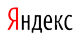

# Отчет об информационном поиске

Представленный отчет позволяет оценить информационную ситуацию по теме магистерской работы.
Он является основным документальным подтверждением глубины и полноты информационного поиска,
а также служит для фиксации текущей ситуации в исследуемой области.

Поиск выполнен с использованием трех поисковых систем (Google, Яндекс, Bing).
Результаты сведены в таблицу. Всего произведено {{ site.data.search.num }} запросов, имеющих отношение к магистерской работе.
Из них три запроса соответствует названию магистерской работы на трех языках,
три запроса с ФИО руководителя, а также девять запросов с ключевыми понятиями по теме магистерской работы.

Ниже приведены две таблицы с отчетами о поиске, которые разделяет временной промежуток в два месяца,
а также ряд диаграмм, которые позволяют сравнить основные изменения, произошедшие за этот период.

<h2 class="cntr">Отчет о поиске за {{ site.data.search.date }} г.</h2>

<table class="search">

<!------------- ЗАГОЛОВОК  ---------------->
<tr>
<td class="c1" style="font-weight: bold; text-align: center;"> Строка поиска</td>
<td class="cn"></td>
<td class="cn"></td>
<td class="cn"></td>
</tr>


<!------------- РУССКИЙ ЯЗЫК  ---------------->
<tr>
<td class="cspan" colspan="4"> 
На русском языке



<tr class="result">
<td class="c1">{{ result.text }}</td>
<td class="cn"><a target="_blank" href="{{ result.google_url }}">{{ result.google_total_results }}</a></td>
<td class="cn"><a target="_blank" href="{{ result.yandex_url }}">{{ result.yandex_total_results }}</a></td>
<td class="cn"><a target="_blank" href="{{ result.bing_url }}">{{ result.bing_total_results }}</a></td>
</tr>




<!------------- УКРАИНСКИЙ ЯЗЫК  ---------------->
<tr>
<td class="cspan" colspan="4"> 
На украинском языке



<tr class="result">
<td class="c1">{{ result.text }}</td>
<td class="cn"><a target="_blank" href="{{ result.google_url }}">{{ result.google_total_results }}</a></td>
<td class="cn"><a target="_blank" href="{{ result.yandex_url }}">{{ result.yandex_total_results }}</a></td>
<td class="cn"><a target="_blank" href="{{ result.bing_url }}">{{ result.bing_total_results }}</a></td>
</tr>




<!------------- АНГЛИЙСКИЙ ЯЗЫК  ---------------->
<tr>
<td class="cspan" colspan="4"> 
На английском языке



<tr class="result">
<td class="c1">{{ result.text }}</td>
<td class="cn"><a target="_blank" href="{{ result.google_url }}">{{ result.google_total_results }}</a></td>
<td class="cn"><a target="_blank" href="{{ result.yandex_url }}">{{ result.yandex_total_results }}</a></td>
<td class="cn"><a target="_blank" href="{{ result.bing_url }}">{{ result.bing_total_results }}</a></td>
</tr>



</table>

